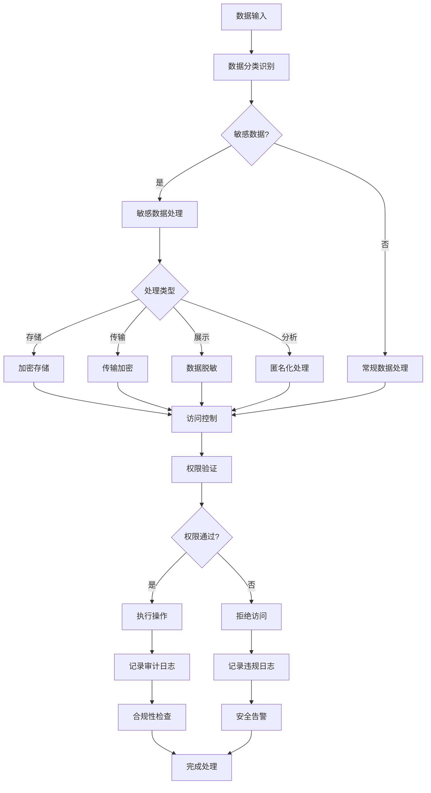
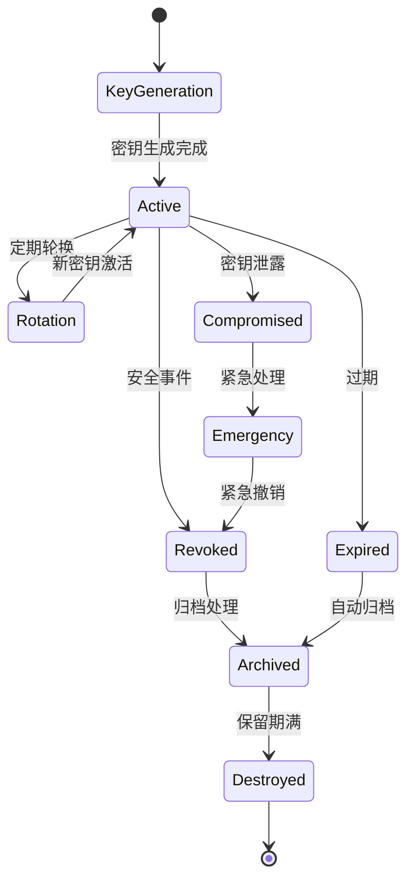
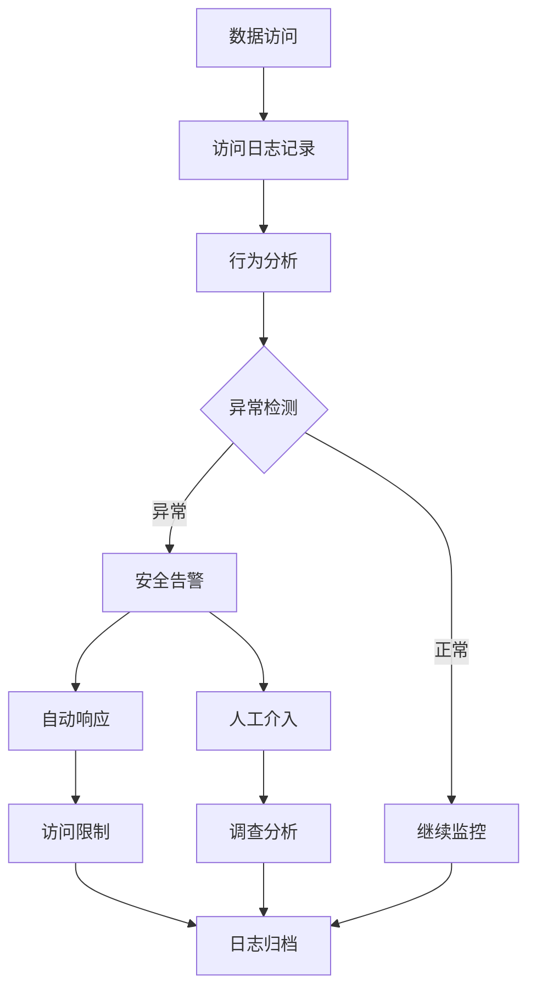

## 6. 安全与合规设计

### 6.1 数据安全保护

#### 6.1.1 敏感数据分类

| 数据分类 | 敏感级别 | 保护措施             | 访问控制     |
| -------- | -------- | -------------------- | ------------ |
| 个人隐私 | 高敏感   | 强加密、匿名化、脱敏 | 最小权限原则 |
| 商业机密 | 中敏感   | 加密存储、访问审计   | 角色权限控制 |
| 业务数据 | 低敏感   | 访问控制、备份保护   | 部门权限控制 |
| 公开数据 | 无敏感   | 基础安全保护         | 开放访问     |

##### 数据安全架构设计

```mermaid
classDiagram
    class DataSecurityManager {
        +IDataClassifier Classifier
        +IEncryptionService EncryptionService
        +IAccessController AccessController
        +IAuditLogger AuditLogger
        +SecurityPolicy ApplySecurityPolicy(object data, SecurityContext context)
        +EncryptionResult EncryptSensitiveData(object data)
        +bool ValidateAccess(AccessRequest request)
        +void LogSecurityEvent(SecurityEvent securityEvent)
    }
    
    class DataClassifier {
        +Dictionary~Type,DataClassification~ Classifications
        +List~IClassificationRule~ Rules
        +IMLClassifier MLClassifier
        +DataClassification ClassifyData(object data)
        +void RegisterClassification(Type type, DataClassification classification)
        +bool IsPersonalData(object data)
        +SensitivityLevel GetSensitivityLevel(object data)
        +List~string~ GetDataCategories(object data)
    }
    
    class EncryptionService {
        +Dictionary~EncryptionType,IEncryptor~ Encryptors
        +IKeyManager KeyManager
        +EncryptionConfig Config
        +EncryptionResult Encrypt(byte[] data, EncryptionType type)
        +byte[] Decrypt(EncryptionResult encryptedData)
        +string GenerateHash(string input, HashType hashType)
        +bool VerifyHash(string input, string hash, HashType hashType)
        +EncryptionKey GenerateKey(KeyType keyType)
        +void RotateKeys()
    }
    
    class PersonalDataProtector {
        +IAnonymizer Anonymizer
        +IPseudonymizer Pseudonymizer
        +IDataMasker DataMasker
        +PrivacyConfig Config
        +AnonymizationResult AnonymizeData(object personalData)
        +PseudonymizationResult PseudonymizeData(object personalData)
        +MaskingResult MaskSensitiveFields(object data)
        +bool CanProcessPersonalData(string userId, ProcessingPurpose purpose)
        +ConsentRecord GetUserConsent(string userId)
    }
    
    class AccessController {
        +IRoleManager RoleManager
        +IPermissionManager PermissionManager
        +IPolicyEngine PolicyEngine
        +bool CheckAccess(Principal principal, Resource resource, Operation operation)
        +List~Permission~ GetUserPermissions(string userId)
        +bool HasRole(string userId, string roleName)
        +AccessDecision EvaluatePolicy(AccessRequest request)
        +void GrantPermission(string userId, Permission permission)
        +void RevokePermission(string userId, Permission permission)
    }
    
    class SecurityAuditLogger {
        +ILogStorage LogStorage
        +IAlertManager AlertManager
        +AuditConfig Config
        +void LogAccess(AccessEvent accessEvent)
        +void LogDataOperation(DataOperationEvent operationEvent)
        +void LogSecurityViolation(SecurityViolationEvent violationEvent)
        +List~AuditEvent~ QueryAuditLog(AuditQuery query)
        +SecurityReport GenerateSecurityReport(ReportPeriod period)
        +void TriggerSecurityAlert(SecurityAlert alert)
    }
    
    class ComplianceManager {
        +Dictionary~string,IComplianceRule~ Rules
        +IComplianceReporter Reporter
        +ComplianceConfig Config
        +ComplianceResult CheckCompliance(object data, ComplianceContext context)
        +void RegisterComplianceRule(IComplianceRule rule)
        +ComplianceReport GenerateComplianceReport()
        +bool IsGDPRCompliant(object personalData)
        +bool IsCCPACompliant(object personalData)
        +void HandleDataSubjectRequest(DataSubjectRequest request)
    }
    
    class ThreatDetector {
        +List~IThreatDetectionRule~ DetectionRules
        +IMLThreatModel ThreatModel
        +IThreatIntelligence ThreatIntelligence
        +ThreatDetectionResult AnalyzeThreat(SecurityEvent securityEvent)
        +void UpdateThreatModel(ThreatModelUpdate update)
        +ThreatReport GetThreatReport()
        +void BlockSuspiciousActivity(ThreatContext context)
        +List~ThreatIndicator~ GetThreatIndicators()
    }
    
    DataSecurityManager --> DataClassifier
    DataSecurityManager --> EncryptionService
    DataSecurityManager --> PersonalDataProtector
    DataSecurityManager --> AccessController
    DataSecurityManager --> SecurityAuditLogger
    DataSecurityManager --> ComplianceManager
    DataSecurityManager --> ThreatDetector
```

##### 数据保护处理流程

**数据安全保护策略**：

- **分级保护**：根据数据敏感级别实施不同强度的保护措施
- **端到端加密**：从数据采集到存储和传输的全链路加密保护
- **零信任架构**：假设网络内外都不可信，对所有访问进行验证
- **动态脱敏**：根据用户角色和访问场景动态调整数据脱敏程度

#### 6.1.2 数据保护技术

| 保护技术 | 应用场景             | 安全强度 | 性能影响 |
| -------- | -------------------- | -------- | -------- |
| AES加密  | 敏感数据存储         | 高强度   | 低影响   |
| RSA加密  | 密钥交换、数字签名   | 高强度   | 中等影响 |
| 哈希算法 | 密码存储、数据完整性 | 不可逆   | 低影响   |
| 数字签名 | 数据完整性、身份认证 | 高强度   | 中等影响 |

##### 加密技术实现架构

```mermaid
classDiagram
    class CryptographyManager {
        +ISymmetricEncryption SymmetricEncryption
        +IAsymmetricEncryption AsymmetricEncryption
        +IHashingService HashingService
        +IDigitalSignature DigitalSignature
        +IKeyDerivation KeyDerivation
        +EncryptionResult Encrypt(byte[] data, EncryptionAlgorithm algorithm)
        +byte[] Decrypt(EncryptionResult encryptedData)
        +HashResult ComputeHash(byte[] data, HashAlgorithm algorithm)
        +SignatureResult Sign(byte[] data, PrivateKey privateKey)
        +bool VerifySignature(byte[] data, SignatureResult signature, PublicKey publicKey)
    }
    
    class AESEncryption {
        +AESConfig Config
        +byte[] Encrypt(byte[] plaintext, byte[] key, byte[] iv)
        +byte[] Decrypt(byte[] ciphertext, byte[] key, byte[] iv)
        +byte[] GenerateKey(int keySize)
        +byte[] GenerateIV()
        +bool ValidateKey(byte[] key)
        +EncryptionMetrics GetPerformanceMetrics()
    }
    
    class RSAEncryption {
        +RSAConfig Config
        +RSAKeyPair GenerateKeyPair(int keySize)
        +byte[] Encrypt(byte[] plaintext, PublicKey publicKey)
        +byte[] Decrypt(byte[] ciphertext, PrivateKey privateKey)
        +byte[] Sign(byte[] data, PrivateKey privateKey)
        +bool Verify(byte[] data, byte[] signature, PublicKey publicKey)
        +bool ValidateKeyPair(RSAKeyPair keyPair)
    }
    
    class SecureHashingService {
        +Dictionary~HashAlgorithm,IHasher~ Hashers
        +SaltGenerator SaltGenerator
        +HashResult ComputeHash(byte[] data, HashAlgorithm algorithm)
        +HashResult ComputeSaltedHash(byte[] data, byte[] salt, HashAlgorithm algorithm)
        +bool VerifyHash(byte[] data, HashResult expectedHash)
        +byte[] GenerateSalt(int length)
        +HashStrengthAssessment AssessHashStrength(HashAlgorithm algorithm)
    }
    
    class KeyManager {
        +IKeyStorage KeyStorage
        +IKeyRotationScheduler RotationScheduler
        +KeyLifecycleManager LifecycleManager
        +EncryptionKey GenerateKey(KeyType keyType, int keySize)
        +EncryptionKey GetKey(string keyId)
        +void RotateKey(string keyId)
        +void RevokeKey(string keyId)
        +List~EncryptionKey~ GetActiveKeys()
        +KeyUsageStatistics GetKeyUsage(string keyId)
        +void ScheduleKeyRotation(string keyId, TimeSpan interval)
    }
    
    class SecureKeyStorage {
        +IHardwareSecurityModule HSM
        +IKeyVault KeyVault
        +KeyStorageConfig Config
        +void StoreKey(string keyId, EncryptionKey key)
        +EncryptionKey RetrieveKey(string keyId)
        +void DeleteKey(string keyId)
        +bool KeyExists(string keyId)
        +List~string~ ListKeys()
        +KeyBackupResult BackupKeys()
        +void RestoreKeys(KeyBackupResult backup)
    }
    
    class DigitalSignatureService {
        +SignatureAlgorithm Algorithm
        +ITimestampAuthority TimestampAuthority
        +SignatureResult CreateSignature(byte[] data, PrivateKey privateKey)
        +bool VerifySignature(byte[] data, SignatureResult signature, PublicKey publicKey)
        +TimestampedSignature CreateTimestampedSignature(byte[] data, PrivateKey privateKey)
        +bool VerifyTimestampedSignature(byte[] data, TimestampedSignature signature)
        +CertificateChain BuildCertificateChain(X509Certificate certificate)
        +bool ValidateCertificateChain(CertificateChain chain)
    }
    
    class DataIntegrityVerifier {
        +IChecksumCalculator ChecksumCalculator
        +IMerkleTreeBuilder MerkleTreeBuilder
        +IntegrityResult VerifyDataIntegrity(byte[] data, IntegrityProof proof)
        +IntegrityProof GenerateIntegrityProof(byte[] data)
        +bool DetectTampering(byte[] data, IntegrityProof originalProof)
        +MerkleTree BuildMerkleTree(List~byte[]~ dataBlocks)
        +bool VerifyMerkleProof(byte[] data, MerkleProof proof, byte[] rootHash)
    }
    
    CryptographyManager --> AESEncryption
    CryptographyManager --> RSAEncryption
    CryptographyManager --> SecureHashingService
    CryptographyManager --> KeyManager
    CryptographyManager --> DigitalSignatureService
    CryptographyManager --> DataIntegrityVerifier
    KeyManager --> SecureKeyStorage
```

##### 密钥管理生命周期

**加密保护实施策略**：

- **分层加密**：数据传输层、应用层、存储层的多重加密保护
- **密钥分离**：密钥与数据分离存储，提高安全性
- **定期轮换**：定期更换加密密钥，降低密钥泄露风险
- **硬件安全**：使用HSM等硬件安全模块保护关键密钥

### 6.2 合规性设计

#### 6.2.1 数据合规要求

| 合规标准   | 适用范围     | 关键要求             | 实现方式              |
| ---------- | ------------ | -------------------- | --------------------- |
| GDPR       | 欧盟用户数据 | 数据保护、用户权利   | 隐私设计、数据最小化  |
| CCPA       | 加州用户数据 | 透明度、选择权       | 隐私通知、退出机制    |
| 网络安全法 | 中国境内数据 | 数据本地化、安全保护 | 境内存储、安全评估    |
| 行业标准   | 广告行业     | 透明度、反作弊       | IAB标准、行业最佳实践 |

#### 6.2.2 审计与监控

### 6.3 反作弊数据设计

#### 6.3.1 作弊检测数据

| 检测维度 | 数据类型     | 检测指标     | 阈值设定     |
| -------- | ------------ | ------------ | ------------ |
| 流量质量 | 访问行为数据 | 异常访问模式 | 基于历史数据 |
| 设备信息 | 设备指纹数据 | 设备唯一性   | 统计学阈值   |
| 用户行为 | 行为序列数据 | 行为异常度   | 机器学习模型 |
| 网络环境 | 网络特征数据 | IP异常度     | 黑名单+算法  |

#### 6.3.2 风控决策数据

| 风控要素 | 数据来源     | 权重分配 | 决策逻辑     |
| -------- | ------------ | -------- | ------------ |
| 历史记录 | 用户行为历史 | 40%      | 信誉评分模型 |
| 实时行为 | 当前访问行为 | 30%      | 异常检测算法 |
| 设备特征 | 设备指纹信息 | 20%      | 设备风险评估 |
| 环境因素 | 网络环境信息 | 10%      | 环境风险分析 |
