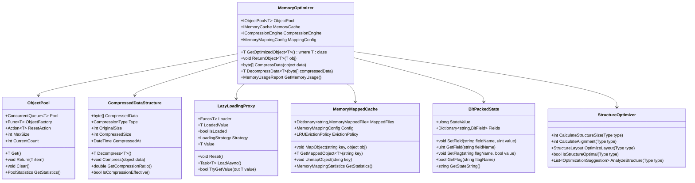
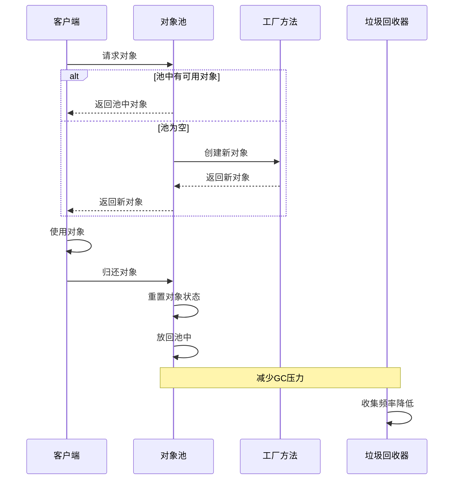
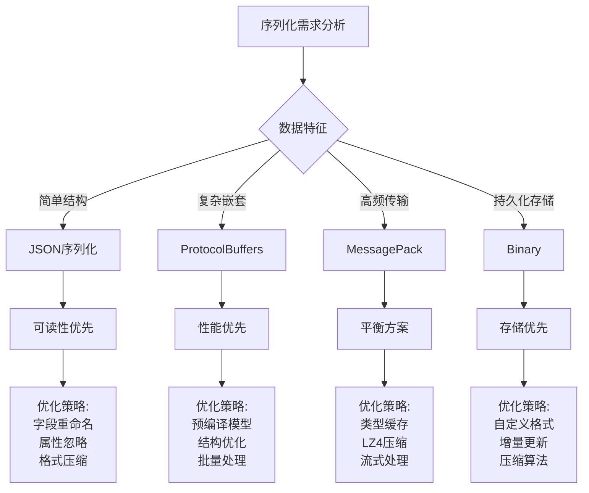
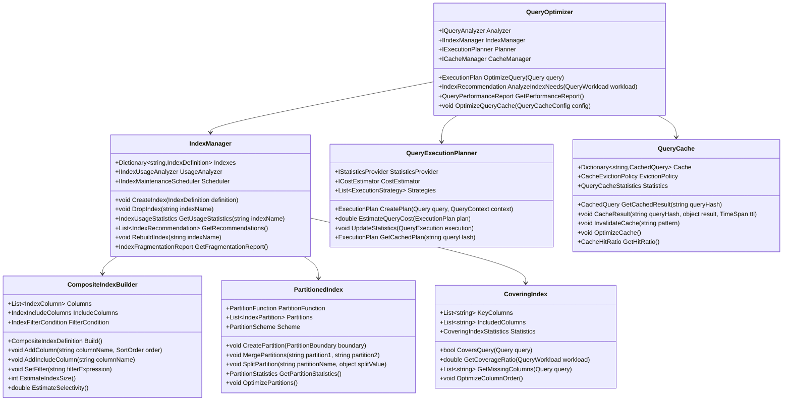
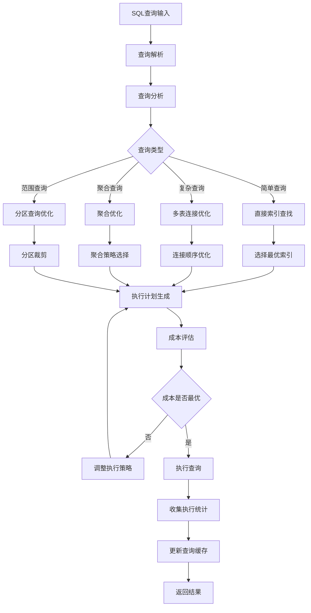
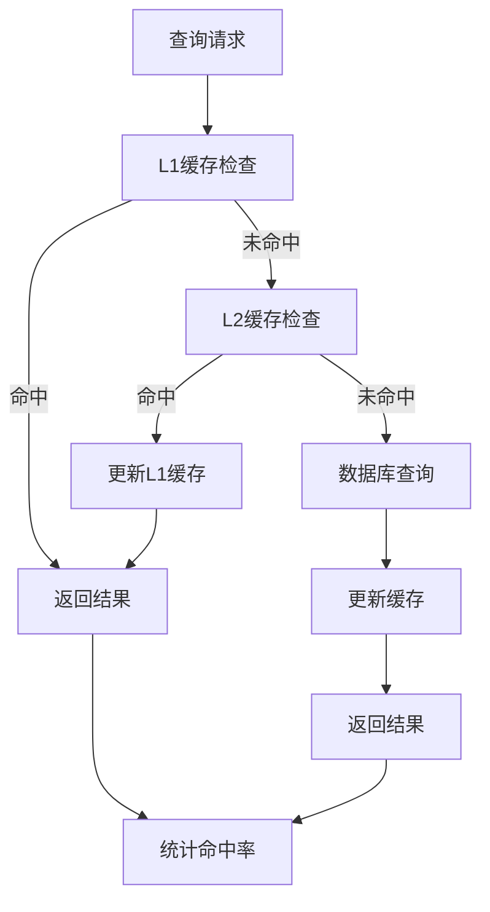
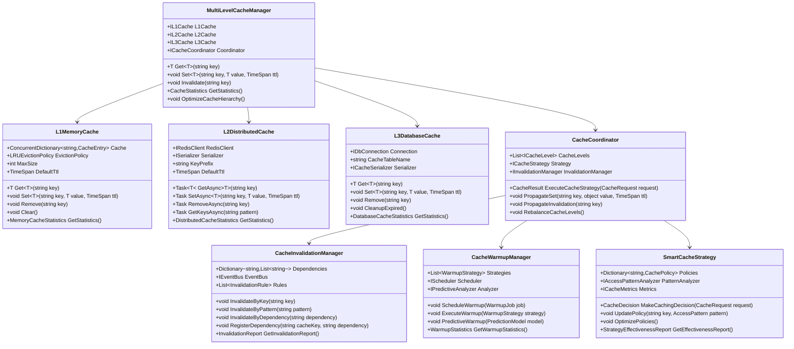
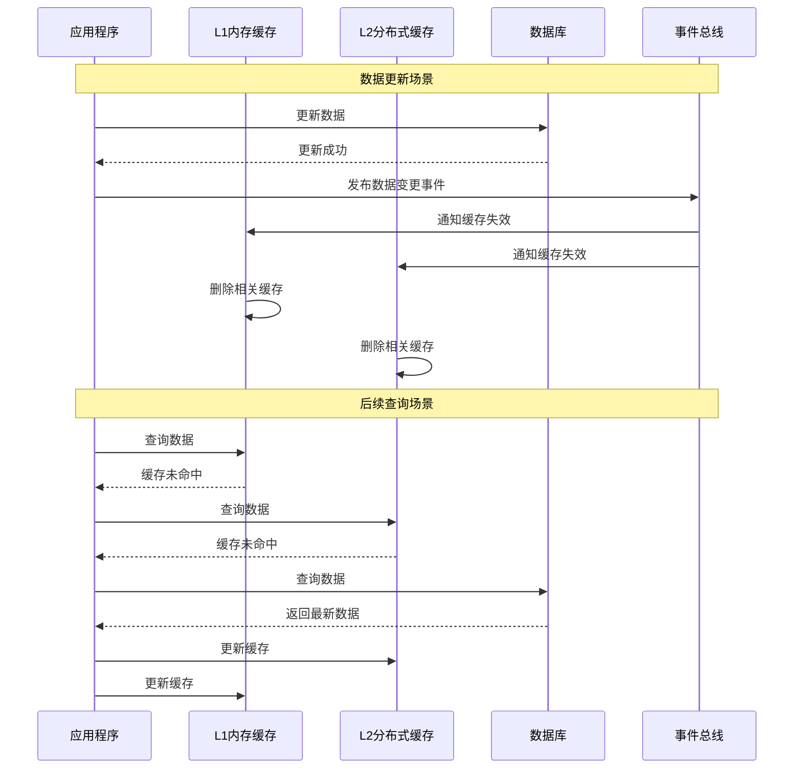

## 5. 性能优化设计

### 5.1 数据结构优化

#### 5.1.1 内存优化策略

| 优化维度 | 优化技术     | 应用场景         | 性能提升 |
| -------- | ------------ | ---------------- | -------- |
| 对象池化 | 对象重用     | 高频创建对象     | 50-200%  |
| 字段压缩 | 位运算、枚举 | 状态字段         | 30-70%   |
| 延迟加载 | 懒加载模式   | 大对象、关联数据 | 20-50%   |
| 内存对齐 | 结构体优化   | 密集计算         | 10-30%   |

##### 内存优化架构设计

##### 对象池化实现模式

**内存优化策略实施**：

- **对象池化**：为高频创建的对象（如BidRequest、BidResponse）实现对象池
- **字段压缩**：使用位运算压缩状态字段，减少内存占用
- **延迟加载**：对大对象和关联数据实现懒加载，按需加载
- **内存对齐**：优化结构体布局，提高缓存命中率和访问效率

#### 5.1.2 序列化优化

| 序列化方式       | 适用场景 | 性能特点           | 优化策略             |
| ---------------- | -------- | ------------------ | -------------------- |
| JSON             | API通信  | 通用性好、可读性强 | 字段优化、压缩       |
| Protocol Buffers | 内部通信 | 高性能、跨语言     | 结构优化、版本管理   |
| MessagePack      | 缓存存储 | 紧凑格式、高效率   | 类型优化、批量处理   |
| Binary           | 持久化   | 空间效率高         | 自定义格式、压缩算法 |

##### 序列化性能优化架构

```mermaid
classDiagram
    class SerializationManager {
        +Dictionary~Type,ISerializer~ Serializers
        +SerializationConfig Config
        +ICompressionProvider Compression
        +ISerializer GetOptimalSerializer(Type type, SerializationContext context)
        +byte[] SerializeOptimal(object obj, SerializationHint hint)
        +T DeserializeOptimal~T~(byte[] data, DeserializationHint hint)
        +SerializationBenchmark RunBenchmark(object testData)
    }
    
    class JsonOptimizedSerializer {
        +JsonSerializerOptions Options
        +Dictionary~Type,JsonConverter~ CustomConverters
        +bool UseCompression
        +string Serialize(object obj)
        +T Deserialize~T~(string json)
        +byte[] SerializeToUtf8Bytes(object obj)
        +T DeserializeFromUtf8Bytes~T~(byte[] utf8Json)
    }
    
    class ProtobufSerializer {
        +RuntimeTypeModel TypeModel
        +Dictionary~Type,MetaType~ TypeCache
        +bool UseCompression
        +byte[] Serialize(object obj)
        +T Deserialize~T~(byte[] data)
        +void PrecompileModel()
        +int GetSerializedSize(object obj)
    }
    
    class MessagePackSerializer {
        +MessagePackSerializerOptions Options
        +IFormatterResolver Resolver
        +bool LZ4Compression
        +byte[] Serialize(object obj)
        +T Deserialize~T~(byte[] data)
        +void SerializeToStream(Stream stream, object obj)
        +T DeserializeFromStream~T~(Stream stream)
    }
    
    class BinarySerializer {
        +BinarySerializationFormat Format
        +ITypeResolver TypeResolver
        +bool UseCustomCompression
        +byte[] Serialize(object obj)
        +T Deserialize~T~(byte[] data)
        +void WriteToBuffer(Span~byte~ buffer, object obj)
        +T ReadFromBuffer~T~(ReadOnlySpan~byte~ buffer)
    }
    
    class SerializationBenchmark {
        +Dictionary~string,BenchmarkResult~ Results
        +List~object~ TestObjects
        +int IterationCount
        +BenchmarkResult RunSerializationTest(ISerializer serializer, object testObj)
        +BenchmarkResult RunDeserializationTest(ISerializer serializer, byte[] data)
        +ComparisonReport GenerateComparisonReport()
        +SerializerRecommendation GetRecommendation(SerializationRequirement requirement)
    }
    
    class CompressionEngine {
        +Dictionary~CompressionType,ICompressor~ Compressors
        +CompressionConfig Config
        +byte[] Compress(byte[] data, CompressionType type)
        +byte[] Decompress(byte[] compressedData, CompressionType type)
        +CompressionResult AnalyzeCompression(byte[] data)
        +CompressionType GetOptimalCompression(byte[] data)
    }
    
    SerializationManager --> JsonOptimizedSerializer
    SerializationManager --> ProtobufSerializer
    SerializationManager --> MessagePackSerializer
    SerializationManager --> BinarySerializer
    SerializationManager --> SerializationBenchmark
    SerializationManager --> CompressionEngine
```

##### 序列化性能对比分析

**序列化优化实施策略**：

- **智能选择**：根据数据特征和使用场景自动选择最优序列化方式
- **预编译优化**：对ProtocolBuffers等支持预编译的格式进行模型预编译
- **压缩集成**：在序列化层面集成压缩算法，进一步减少数据大小
- **缓存策略**：缓存序列化元数据和类型信息，减少反射开销

### 5.2 查询优化设计

#### 5.2.1 索引策略

| 索引类型   | 适用场景   | 设计原则         | 维护成本 |
| ---------- | ---------- | ---------------- | -------- |
| 聚集索引   | 主键查询   | 唯一性、有序性   | 低       |
| 非聚集索引 | 条件查询   | 选择性、覆盖性   | 中       |
| 复合索引   | 多条件查询 | 顺序性、包含性   | 高       |
| 部分索引   | 条件过滤   | 选择性、空间效率 | 中       |

##### 查询优化架构设计

##### 查询执行计划优化流程

**索引优化策略**：

- **智能索引建议**：基于查询模式分析，自动推荐最优索引策略
- **动态索引管理**：根据查询负载动态调整索引配置
- **分区索引优化**：对大表实施分区索引，提高查询性能
- **覆盖索引设计**：创建覆盖查询的索引，减少数据页访问

#### 5.2.2 缓存策略

##### 多级缓存架构设计

##### 缓存一致性保证机制

**缓存优化策略实施**：

- **智能缓存预热**：基于访问模式预测，提前加载热点数据
- **分级失效策略**：根据数据重要性和更新频次，设置不同的失效策略
- **缓存压缩存储**：对大对象进行压缩存储，提高缓存容量利用率
- **读写分离缓存**：对读多写少的数据实施专门的缓存策略

### 5.3 扩展性设计

#### 5.3.1 水平扩展能力

| 扩展维度 | 分片策略     | 路由算法   | 数据迁移     |
| -------- | ------------ | ---------- | ------------ |
| 用户维度 | 用户ID哈希   | 一致性哈希 | 渐进式迁移   |
| 时间维度 | 时间范围分片 | 时间路由   | 按时间归档   |
| 业务维度 | 业务模块分离 | 业务路由   | 模块独立部署 |
| 地理维度 | 地理位置分片 | 就近路由   | 地域数据同步 |

#### 5.3.2 弹性伸缩机制

| 伸缩触发器 | 监控指标         | 伸缩策略   | 响应时间   |
| ---------- | ---------------- | ---------- | ---------- |
| CPU负载    | CPU使用率 > 80%  | 自动扩容   | 2-5分钟    |
| 内存使用   | 内存使用率 > 85% | 自动扩容   | 2-5分钟    |
| 请求量     | QPS > 阈值       | 预测性扩容 | 1-3分钟    |
| 响应时间   | 延迟 > SLA       | 紧急扩容   | 30秒-2分钟 |
