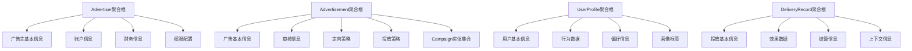
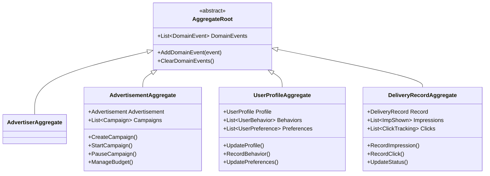
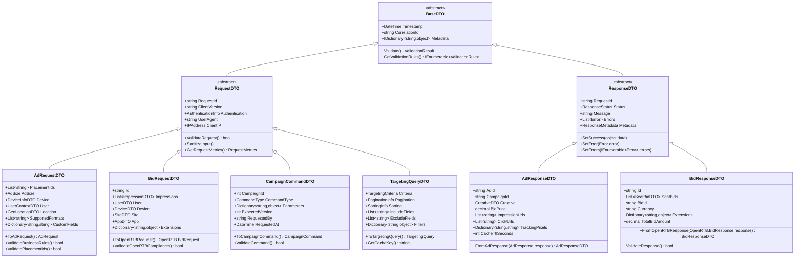

## 2. 数据模型分层设计

### 2.1 领域模型层

#### 2.1.1 核心实体设计

| 实体名称           | 业务职责       | 关键属性                                       | 生命周期管理            | 项目位置    |
| ------------------ | -------------- | ---------------------------------------------- | ----------------------- | ----------- |
| Advertisement      | 广告信息管理   | 基本信息、审核状态、创意内容                   | 创建→审核→投放→归档     | Core.Domain |
| Campaign           | 广告活动管理   | 预算控制、时间管理、定向配置                   | 计划→执行→结束→分析     | Core.Domain |
| Advertiser         | 广告主管理     | 基本信息、资质认证、账户状态                   | 注册→认证→激活→管理     | Core.Domain |
| MediaResource      | 媒体资源管理   | 媒体信息、广告位配置、流量属性                 | 接入→配置→监控→优化     | Core.Domain |
| DeliveryRecord     | 投放记录管理   | 投放历史、效果数据、结算信息                   | 记录→统计→分析→结算     | Core.Domain |
| AdCandidate        | 广告候选管理   | 活动引用、竞价信息、匹配结果、广告位关联       | 召回→过滤→排序→投放     | Core.Domain |
| AdContext          | 广告上下文管理 | 用户信息、设备信息、按广告位分组的候选集合     | 请求创建→使用→销毁      | Core.Domain |
| AdRequest          | 广告请求管理   | 批量广告位标识、用户信息、设备环境、请求元数据 | 接收→验证→转换→处理     | Core.Domain |
| UserProfile        | 用户画像管理   | 用户标签、兴趣偏好、行为数据                   | 创建→更新→丰富→应用     | Core.Domain |
| OverallMatchResult | 匹配结果管理   | 匹配分数、详细结果、执行信息                   | 计算生成→缓存→使用→清理 | Core.Domain |
| TargetingConfig    | 定向配置管理   | 规则实例、动态参数、活动关联                   | 创建→调整→计算→完成     | Core.Domain |
| TargetingPolicy    | 定向策略模板   | 预配置规则集、复用模板、版本                   | 创建→发布→复用→维护     | Core.Domain |

##### 核心实体类图设计

```mermaid
classDiagram
    class EntityBase {
        <<abstract>>
        +int Id
        +DateTime CreatedAt
        +DateTime UpdatedAt
        +string CreatedBy
        +string UpdatedBy
        +bool IsDeleted
        +ValidateEntity() bool
        +GetHashCode() int
        +Equals(object) bool
    }
    
    class AggregateRoot {
        <<abstract>>
        +List~IDomainEvent~ DomainEvents
        +AddDomainEvent(IDomainEvent)
        +ClearDomainEvents()
        +GetUncommittedEvents() IDomainEvent[]
    }
    
    class Advertisement {
        +string Title
        +string Description
        +AdType Type
        +AdStatus Status
        +int AdvertiserId
        +AuditInfo AuditInfo
        +List~Creative~ Creatives
        +List~Campaign~ Campaigns
        +SubmitForReview()
        +Approve(string reviewerComment)
        +Reject(string reason)
        +Activate()
        +Pause()
        +Archive()
        +AddCampaign(Campaign campaign)
        +GetActiveCampaigns() List~Campaign~
    }
    
    class Campaign {
        +string Name
        +string Description
        +CampaignStatus Status
        +int AdvertisementId
        +TargetingConfig TargetingConfig
        +DeliveryPolicy DeliveryPolicy
        +BudgetInfo Budget
        +DateTime StartDate
        +DateTime EndDate
        +BiddingStrategy BiddingStrategy
        +List~DeliveryRecord~ DeliveryRecords
        +Start()
        +Pause()
        +Resume()
        +Stop()
        +UpdateBudget(BudgetInfo budget)
        +UpdateTargeting(TargetingConfig config)
        +CreateTargetingFromPolicy(TargetingPolicy policy) TargetingConfig
        +CheckBudgetAvailability() bool
        +GetDailySpend() decimal
    }
    
    class Advertiser {
        +string CompanyName
        +string ContactName
        +string Email
        +string Phone
        +AdvertiserStatus Status
        +DateTime RegisteredAt
        +QualificationInfo Qualification
        +BillingInfo Billing
        +List~Advertisement~ Advertisements
        +Register(RegistrationInfo info)
        +SubmitQualification(QualificationInfo info)
        +Activate()
        +Suspend(string reason)
        +UpdateBilling(BillingInfo billing)
    }
    
    class MediaResource {
        +string Name
        +MediaType Type
        +string Url
        +MediaStatus Status
        +int PublisherId
        +AdSlotConfiguration SlotConfig
        +TrafficProfile TrafficProfile
        +List~AdPlacement~ Placements
        +Configure(AdSlotConfiguration config)
        +UpdateTrafficProfile(TrafficProfile profile)
        +Enable()
        +Disable()
        +GetAvailableInventory() int
    }
    
    class DeliveryRecord {
        +string RequestId
        +int CampaignId
        +int MediaResourceId
        +DeliveryStatus Status
        +DateTime DeliveredAt
        +decimal Cost
        +PerformanceMetrics Metrics
        +UserContext UserContext
        +DeliveryContext Context
        +RecordImpression()
        +RecordClick()
        +RecordConversion()
        +CalculateCost() decimal
        +GenerateReport() DeliveryReport
    }
    
    class AdCandidate {
        +string Id
        +string CampaignId
        +string PlacementId
        +Campaign Campaign
        +decimal BidPrice
        +OverallMatchResult MatchResult
        +Dictionary~string,object~ RequestContext
        +DateTime CreatedAt
        +CandidateStatus Status
        +UpdateBidPrice(decimal newPrice)
        +SetMatchResult(OverallMatchResult result)
        +IsEligibleForPlacement(PlacementInfo placement) bool
        +GetTargetingConfig() TargetingConfig
        +GetAdvertisement() Advertisement
        +GetPerformanceMetrics() PerformanceMetrics
        +Clone() AdCandidate
        +AssignToPlacement(string placementId)
    }
    
    class AdContext {
        +string RequestId
        +string UserId
        +DateTime RequestTime
        +Dictionary~string,List~AdCandidate~~ CandidatesByPlacement
        +TargetingContext TargetingContext
        +Dictionary~string,object~ EnvironmentInfo
        +GetUserSegments() List~string~
        +GetTimeSlot() TimeSlot
        +GetRequestMetadata() RequestMetadata
        +GetTargetingContext() TargetingContext
        +GetCandidatesForPlacement(string placementId) List~AdCandidate~
        +AddCandidateToPlacement(string placementId, AdCandidate candidate)
        +GetAllPlacements() List~string~
    }
    
    class AdRequest {
        +string RequestId
        +List~string~ PlacementIds
        +DateTime RequestTime
        +UserInfo UserInfo
        +DeviceInfo DeviceInfo
        +LocationInfo LocationInfo
        +RequestMetadata Metadata
        +string Version
        +ValidateRequest() ValidationResult
        +GenerateAdContext(TargetingContext targetingContext) AdContext
        +GetPlacementCount() int
        +ContainsPlacement(string placementId) bool
    }
    
    class UserProfile {
        +string UserId
        +string SegmentId
        +Dictionary~string,object~ Demographics
        +Dictionary~string,object~ Interests
        +Dictionary~string,object~ Behaviors
        +List~string~ Tags
        +DateTime LastUpdateTime
        +string DataSource
        +ProfileStatus Status
        +GetUserSegments() List~string~
        +HasTag(string tag) bool
        +GetInterestScore(string category) decimal
        +GetBehaviorPattern(string pattern) object
        +IsTargetAudience(TargetingConfig config) bool
        +UpdateProfile(Dictionary~string,object~ data)
        +MergeProfile(UserProfile other)
    }
    
    class OverallMatchResult {
        +string ResultId
        +string AdCandidateId
        +string AdContextId
        +decimal OverallScore
        +bool IsOverallMatch
        +List~MatchResult~ IndividualResults
        +Dictionary~string,decimal~ WeightedScores
        +TimeSpan TotalExecutionTime
        +string ReasonCode
        +DateTime CalculatedAt
        +MatchConfidence Confidence
        +GetMatchDetails() MatchDetails
        +GetRecommendations() List~OptimizationRecommendation~
        +IsValid() bool
        +GetDebugInfo() MatchDebugInfo
    }
    
    class TargetingConfig {
        +string ConfigId
        +string CampaignId
        +string SourcePolicyId
        +Dictionary~string,ITargetingCriteria~ Criteria
        +Dictionary~string,object~ DynamicParameters
        +decimal Weight
        +bool IsEnabled
        +DateTime CreatedAt
        +DateTime UpdatedAt
        +string CreatedFrom
        +CreateFromPolicy(TargetingPolicy policy, string campaignId) TargetingConfig
        +CreateFromScratch(string campaignId) TargetingConfig
        +AddCriteria(ITargetingCriteria criteria)
        +UpdateCriteria(string criteriaType, ITargetingCriteria criteria)
        +GetCriteria~T~(string criteriaType) T
        +HasCriteria(string criteriaType) bool
        +ApplyDynamicOptimization(OptimizationContext context)
        +ValidateConfig() ValidationResult
        +Clone() TargetingConfig
    }
    
    class TargetingPolicy {
        +string PolicyId
        +string Name
        +string Description
        +int Version
        +string CreatedBy
        +DateTime CreatedAt
        +PolicyStatus Status
        +Dictionary~string,ITargetingCriteria~ CriteriaTemplates
        +string Category
        +bool IsPublic
        +List~string~ Tags
        +CreateConfig(string campaignId) TargetingConfig
        +Validate() ValidationResult
        +Clone(string newName) TargetingPolicy
        +GetCriteriaTemplate~T~(string criteriaType) T
        +AddCriteriaTemplate(string type, ITargetingCriteria criteria)
        +Publish()
        +Archive()
        +GetUsageStatistics() PolicyUsageStats
    }
    
    class MatchResult {
        +string CriteriaType
        +string CriteriaId
        +bool IsMatch
        +decimal MatchScore
        +string MatchReason
        +string NotMatchReason
        +Dictionary~string,object~ MatchDetails
        +TimeSpan ExecutionTime
        +int Priority
        +decimal Weight
        +DateTime CalculatedAt
        +bool IsRequired
        +GetWeightedScore() decimal
        +GetExecutionMetrics() ExecutionMetrics
        +HasDetail(string key) bool
        +GetDetail~T~(string key) T
        +IsValidResult() bool
        +GetDebugInfo() MatchDebugInfo
    }
    
    class MatchConfidence {
        +decimal ConfidenceScore
        +int SampleSize
        +decimal StandardDeviation
        +decimal ConfidenceInterval
        +ConfidenceLevel Level
        +string CalculationMethod
        +Dictionary~string,decimal~ StatisticalMetrics
        +DateTime LastUpdated
        +bool IsReliable
        +GetConfidenceLevel() ConfidenceLevel
        +UpdateStatistics(List~decimal~ newSamples)
        +GetStatisticalSummary() StatisticalSummary
        +IsAboveThreshold(decimal threshold) bool
        +GetReliabilityRating() ReliabilityRating
    }
    
    EntityBase <|-- Advertisement
    EntityBase <|-- Campaign
    EntityBase <|-- Advertiser
    EntityBase <|-- MediaResource
    EntityBase <|-- AdCandidate
    EntityBase <|-- AdContext
    EntityBase <|-- AdRequest
    EntityBase <|-- UserProfile
    EntityBase <|-- OverallMatchResult
    EntityBase <|-- TargetingConfig
    EntityBase <|-- TargetingPolicy
    ValueObject <|-- MatchResult
    ValueObject <|-- MatchConfidence
    AggregateRoot <|-- Advertisement
    AggregateRoot <|-- Campaign
    AggregateRoot <|-- DeliveryRecord

    Advertisement "1" o-- "0..*" Campaign : contains
    Advertiser "1" o-- "0..*" Advertisement : owns
    Campaign "1" o-- "0..*" DeliveryRecord : generates
    Campaign "1" o-- "1" TargetingConfig : has
    MediaResource "1" o-- "0..*" DeliveryRecord : hosts
    AdCandidate "1" o-- "1" Campaign : references
    AdContext "1" o-- "0..*" AdCandidate : contains
    AdRequest "1" --> "1" AdContext : generates
    Advertisement "0..*"o-- DeliveryPolicy : uses
    Advertisement "0..*"o-- AuditInfo : has
    TargetingConfig "0..1" o-- "1" TargetingPolicy : created_from
    AdCandidate "1" o-- "0..1" OverallMatchResult : has
    OverallMatchResult "1" o-- "0..*" MatchResult : contains
    OverallMatchResult "1" o-- "1" MatchConfidence : has
    AdContext "1" o-- "1" TargetingContext : contains
```



##### 实体关系设计说明

**继承关系设计**：

- `EntityBase`：提供所有实体的基础属性和行为，包括标识、时间戳、软删除等通用功能
- `AggregateRoot`：在EntityBase基础上增加领域事件管理能力，确保数据一致性和业务规则执行

**聚合边界定义**：

- **Advertisement聚合**：以Advertisement为聚合根，包含定向策略、投放策略、审核信息等
- **Campaign聚合**：以Campaign为聚合根，管理预算、时间控制、投放记录等
- **DeliveryRecord聚合**：以DeliveryRecord为聚合根，封装投放上下文和性能数据

**关联关系说明**：

- Advertisement与Campaign：一对多组合关系，广告可以有多个投放活动
- Advertiser与Advertisement：一对多聚合关系，广告主拥有多个广告
- Campaign与DeliveryRecord：一对多组合关系，活动产生多条投放记录
- Campaign与TargetingConfig：一对一组合关系，每个活动有独立的定向配置
- AdCandidate与Campaign：多对一关联关系，候选广告关联到具体活动
- OverallMatchResult与MatchResult：一对多组合关系，总体匹配结果包含多个单项匹配结果
- OverallMatchResult与MatchConfidence：一对一组合关系，每个匹配结果有对应的置信度评估
- MediaResource与DeliveryRecord：一对多关联关系，媒体资源承载多次投放

#### 2.1.2 值对象设计

| 值对象名称         | 设计目的           | 组成要素                           | 不变性保证 | 项目位置    |
| ------------------ | ------------------ | ---------------------------------- | ---------- | ----------- |
| TargetingContext   | 封装定向上下文     | 上下文标识、上下文集合、时间戳     | 原子性操作 | Core.Domain |
| ITargetingCriteria | 定向条件抽象       | 条件类型、规则配置、权重和启用状态 | 接口契约   | Core.Domain |
| ITargetingContext  | 定向上下文抽象     | 上下文类型、属性集合、访问方法     | 接口契约   | Core.Domain |
| DeliveryPolicy     | 封装投放策略       | 投放模式、出价策略、频次控制       | 原子性操作 | Core.Domain |
| AuditInfo          | 封装审核信息       | 审核状态、反馈信息、修正建议       | 状态一致性 | Core.Domain |
| GeoLocationContext | 封装地理位置上下文 | 地理信息、坐标信息、区域属性       | 空间一致性 | Core.Domain |
| BudgetInfo         | 封装预算信息       | 总预算、日预算、已消费预算         | 财务一致性 | Core.Domain |
| CreativeInfo       | 封装创意信息       | 创意类型、素材内容、展示属性       | 内容一致性 | Core.Domain |
| BiddingInfo        | 封装竞价信息       | 竞价价格、竞价策略、预算控制       | 价格一致性 | Core.Domain |
| QualityScore       | 封装质量评分       | 评分算法、质量指标、权重配置       | 评分一致性 | Core.Domain |
| MatchResult        | 封装单项匹配结果   | 条件类型、匹配状态、评分和详情     | 计算一致性 | Core.Domain |
| MatchConfidence    | 封装匹配置信度     | 置信分数、样本数量、统计指标       | 统计一致性 | Core.Domain |

##### 值对象类图设计


##### 值对象设计说明

**不变性设计**：

- 所有值对象一旦创建后内部状态不可改变，确保线程安全和状态一致性
- 通过构造函数进行完整初始化验证，避免创建无效对象
- 提供工厂方法和建造者模式支持复杂对象的构建

**相等性语义**：

- 基于值内容的相等性比较，而非引用比较
- 重写GetHashCode确保相等的对象具有相同的哈希码
- 支持操作符重载，提供自然的比较语法

**组合模式应用**：

- TargetingPolicy通过组合多个子定向策略实现复杂定向逻辑
- 支持策略的组合、交集、并集等操作
- 每个子策略独立验证和匹配，提高代码可维护性

#### 2.1.3 聚合根设计



##### 聚合设计详细图

```mermaid
classDiagram
    class IAggregateRoot {
        <<interface>>
        +List~IDomainEvent~ DomainEvents
        +AddDomainEvent(IDomainEvent event)
        +ClearDomainEvents()
        +GetUncommittedEvents() IReadOnlyList~IDomainEvent~
    }
    
    class AdvertiserAggregate {
        +Advertiser Root
        +AccountInfo Account
        +FinancialInfo Financial
        +List~Permission~ Permissions
        +List~Contract~ Contracts
        +CreditInfo Credit
        +CreateAdvertisement(AdInfo info) Advertisement
        +UpdateAccount(AccountInfo account)
        +ManageFinancial(FinancialOperation operation)
        +GrantPermission(Permission permission)
        +RevokePermission(Permission permission)
        +UpdateCreditLimit(decimal limit)
        +FreezeAccount(string reason)
        +UnfreezeAccount()
        +CheckAccountStatus() AccountStatus
        +CalculateBalance() decimal
    }
    
    class AdvertisementAggregate {
        +Advertisement Root
        +List~Creative~ Creatives
        +List~Campaign~ Campaigns
        +TargetingPolicy TargetingPolicy
        +DeliveryPolicy DeliveryPolicy
        +AuditInfo AuditInfo
        +CreateCampaign(CampaignInfo info) Campaign
        +AddCreative(Creative creative)
        +UpdateTargeting(TargetingPolicy policy)
        +SubmitForReview()
        +ProcessReviewResult(ReviewResult result)
        +CheckBusinessRules() ValidationResult
        +StartCampaign(int campaignId)
        +PauseCampaign(int campaignId)
        +UpdateCampaignBudget(int campaignId, BudgetInfo budget)
    }
    
    class UserProfileAggregate {
        +UserProfile Root
        +List~UserBehavior~ Behaviors
        +List~UserPreference~ Preferences
        +DemographicInfo Demographics
        +List~string~ InterestTags
        +List~string~ SegmentIds
        +UpdateProfile(ProfileUpdateInfo info)
        +RecordBehavior(UserBehavior behavior)
        +UpdatePreferences(List~UserPreference~ preferences)
        +AddInterestTag(string tag)
        +AssignToSegment(string segmentId)
        +CalculateProfile() UserProfileSummary
        +GetRecommendations() List~ContentRecommendation~
    }
    
    class DeliveryRecordAggregate {
        +DeliveryRecord Root
        +UserContext UserContext
        +DeviceContext DeviceContext
        +MediaContext MediaContext
        +BiddingContext BiddingContext
        +PerformanceMetrics Metrics
        +RecordImpression(ImpressionInfo info)
        +RecordClick(ClickInfo info)
        +RecordConversion(ConversionInfo info)
        +UpdateMetrics(MetricsUpdate update)
        +CalculateCost() decimal
    }
    
    class DomainEvent {
        <<abstract>>
        +Guid EventId
        +DateTime OccurredOn
        +string EventType
        +int AggregateVersion
        +object EventData
    }
    
    class AdCreatedEvent {
        +int AdvertisementId
        +int AdvertiserId
        +string AdTitle
        +AdType AdType
    }
    
    class CampaignStartedEvent {
        +int CampaignId
        +int AdvertisementId
        +decimal Budget
        +DateTime StartDate
        +DateTime EndDate
    }
    
    class DeliveryCompletedEvent {
        +string RequestId
        +int CampaignId
        +decimal Cost
        +PerformanceMetrics Metrics
        +DateTime DeliveredAt
    }
    
    class BudgetExhaustedEvent {
        +int CampaignId
        +decimal BudgetLimit
        +decimal SpentAmount
        +DateTime ExhaustedAt
    }
    
    IAggregateRoot <|.. AdvertiserAggregate
    IAggregateRoot <|.. AdvertisementAggregate
    IAggregateRoot <|.. UserProfileAggregate
    IAggregateRoot <|.. DeliveryRecordAggregate
    
    DomainEvent <|-- AdvertiserCreatedEvent
    DomainEvent <|-- AdvertiserAccountFrozenEvent
    DomainEvent <|-- AdCreatedEvent
    DomainEvent <|-- CampaignStartedEvent
    DomainEvent <|-- DeliveryCompletedEvent
    DomainEvent <|-- BudgetExhaustedEvent
    DomainEvent <|-- UserProfileUpdatedEvent
    
    AdvertiserAggregate --> AdvertiserCreatedEvent : publishes
    AdvertiserAggregate --> AdvertiserAccountFrozenEvent : publishes
    AdvertisementAggregate --> AdCreatedEvent : publishes
    AdvertisementAggregate --> CampaignStartedEvent : publishes
    AdvertisementAggregate --> BudgetExhaustedEvent : publishes
    UserProfileAggregate --> UserProfileUpdatedEvent : publishes
    DeliveryRecordAggregate --> DeliveryCompletedEvent : publishes
```



##### 聚合根重新设计评估

根据业务分析，需要重新评估哪些实体应该设计为聚合根：

**1. Advertiser聚合根设计建议**：

- **业务独立性**：广告主是独立的业务实体，有自己的账户管理、权限控制、财务结算等业务逻辑
- **数据一致性**：广告主账户信息（余额、信用额度、结算状态）需要维护自身的一致性边界
- **生命周期管理**：广告主的创建、更新、冻结、删除是独立的业务流程
- **设计建议**：Advertiser应该设计为独立的聚合根

**2. Campaign聚合根设计质疑**：

- **问题分析**：如果Advertisement是聚合根，而一个Advertisement包含多个Campaign，那么Campaign是否还需要单独作为聚合根？
- **设计冲突**：存在聚合根嵌套的问题，违反了DDD的聚合设计原则
- **建议方案**：Campaign应该作为Advertisement聚合内的实体，而非独立的聚合根

**3. UserProfile聚合根设计建议**：

- **独立性分析**：用户画像是独立的业务概念，不依赖于其他聚合
- **业务价值**：用户画像有自己的生命周期和业务规则
- **设计建议**：UserProfile应该设计为独立的聚合根

**重新修订的聚合根设计**：



**聚合边界重新定义**：

1. **Advertiser聚合**（新增聚合根）
   - 聚合根：Advertiser
   - 聚合内实体：AccountInfo, FinancialInfo, Permission, Contract
   - 业务一致性：广告主账户状态、财务数据、权限配置的一致性

2. **Advertisement聚合**（包含Campaign作为聚合内实体）
   - 聚合根：Advertisement
   - 聚合内实体：Campaign, CreativeAsset, TargetingConfig
   - 业务一致性：广告投放策略和活动管理的一致性

3. **UserProfile聚合**（独立聚合根）
   - 聚合根：UserProfile
   - 聚合内实体：UserBehavior, UserPreference, DemographicInfo
   - 业务一致性：用户画像数据的完整性和一致性

4. **DeliveryRecord聚合**（保持独立）
   - 聚合根：DeliveryRecord
   - 聚合内实体：ImpressionTracking, ClickTracking
   - 业务一致性：投放监测数据的准确性

**设计原则说明**：
- 聚合根是唯一能被外部直接引用的对象
- 聚合内的实体只能通过聚合根进行访问和修改
- 每个聚合根管理自己边界内的业务一致性
- 跨聚合的操作通过领域事件实现最终一致性

### 2.2 数据传输层

#### 2.2.1 API传输对象

| DTO类型     | 用途说明     | 数据特点               | 优化策略           |
| ----------- | ------------ | ---------------------- | ------------------ |
| RequestDTO  | 接收外部请求 | 完整性验证、格式标准化 | 参数校验、类型转换 |
| ResponseDTO | 返回处理结果 | 结构化输出、错误信息   | 数据压缩、字段筛选 |
| CommandDTO  | 执行业务操作 | 操作参数、验证规则     | 幂等性、事务边界   |
| QueryDTO    | 查询数据请求 | 查询条件、分页参数     | 索引优化、缓存策略 |

##### API传输对象架构图



##### 数据传输对象设计模式

**职责分离模式**：

- **RequestDTO**：专注于输入数据验证、格式化和安全检查
- **ResponseDTO**：专注于输出数据格式化、压缩和错误处理
- **CommandDTO**：专注于命令参数封装和业务规则验证
- **QueryDTO**：专注于查询条件构建和缓存优化

**数据映射策略**：

- 提供双向映射方法（To/From），实现DTO与领域对象间的转换
- 支持部分映射和字段筛选，减少网络传输开销
- 集成AutoMapper等工具，简化映射代码维护

**验证和安全机制**：

- 多层次验证：格式验证、业务规则验证、安全检查
- 输入净化：防止XSS、SQL注入等安全威胁
- 版本兼容：支持API版本演进和向后兼容

#### 2.2.2 服务间通信对象

| 通信场景 | 对象设计       | 数据量级 | 性能要求   |
| -------- | -------------- | -------- | ---------- |
| 实时竞价 | 轻量级竞价对象 | KB级别   | 毫秒级响应 |
| 数据同步 | 批量同步对象   | MB级别   | 分钟级处理 |
| 事件通知 | 事件消息对象   | 字节级别 | 秒级传递   |
| 状态查询 | 状态查询对象   | KB级别   | 秒级响应   |

##### 服务间通信对象设计


##### 通信模式和序列化策略

**消息模式设计**：

- **事件模式**：用于状态变更通知，支持事件溯源和重放
- **命令模式**：用于跨服务操作调用，支持幂等性和重试
- **查询模式**：用于数据查询请求，支持缓存和读写分离
- **同步模式**：用于批量数据同步，支持断点续传和增量更新

**序列化性能优化**：

- **Protocol Buffers**：用于高频通信场景，提供最佳性能
- **MessagePack**：用于中等频率场景，兼顾性能和可读性
- **JSON**：用于调试和跨语言兼容场景
- **Avro**：用于大数据批处理场景，支持模式演进

**可靠性保证机制**：

- 消息去重：基于MessageId实现幂等性处理
- 消息重试：指数退避策略，支持死信队列
- 消息路由：基于内容和优先级的智能路由
- 消息监控：全链路跟踪和性能监控

### 2.3 基础设施层

#### 2.3.1 数据持久化对象

| 存储类型   | 对象设计     | 映射策略           | 性能优化           |
| ---------- | ------------ | ------------------ | ------------------ |
| 关系数据库 | 实体映射对象 | ORM映射、外键关联  | 索引优化、查询缓存 |
| 文档数据库 | 文档对象     | JSON映射、嵌套结构 | 分片策略、索引设计 |
| 时序数据库 | 时序对象     | 时间序列、标签索引 | 压缩存储、聚合查询 |
| 图数据库   | 图对象       | 节点关系、属性图   | 图算法、路径优化   |

##### 数据持久化对象架构图


##### 存储策略和映射设计

**多存储策略**：

- **关系数据库（SQL Server）**：核心业务数据，支持ACID事务和复杂查询
- **文档数据库（MongoDB）**：半结构化数据，支持灵活模式和水平扩展
- **时序数据库（InfluxDB）**：监控和指标数据，支持高频写入和时间查询
- **图数据库（Neo4j）**：关系数据分析，支持复杂关系查询和推荐算法

**ORM映射优化**：

- Entity Framework Core配置：延迟加载、查询分离、批量操作
- 索引策略：聚集索引、非聚集索引、复合索引、部分索引
- 分区表设计：按时间分区、按业务分区、水平分片
- 缓存集成：一级缓存、二级缓存、分布式缓存

**数据迁移和版本管理**：

- Code First迁移：自动生成迁移脚本，支持回滚操作
- 数据版本控制：向前兼容，平滑升级
- 测试数据管理：种子数据、测试环境数据隔离

#### 2.3.2 缓存对象设计

| 缓存类型     | 设计特点           | 数据结构   | 过期策略 |
| ------------ | ------------------ | ---------- | -------- |
| 热点数据缓存 | 高频访问、快速响应 | 扁平化结构 | LRU淘汰  |
| 计算结果缓存 | 复杂计算、中间结果 | 嵌套结构   | TTL过期  |
| 会话状态缓存 | 用户会话、状态管理 | 键值对结构 | 滑动过期 |
| 配置信息缓存 | 系统配置、业务规则 | 层次结构   | 版本控制 |

##### 缓存对象架构设计


##### 缓存策略和一致性设计

**缓存层级策略**：

- **L1缓存（内存）**：最热数据，毫秒级访问，进程内缓存
- **L2缓存（Redis）**：热数据，单位数毫秒访问，分布式缓存
- **L3缓存（数据库查询缓存）**：温数据，数十毫秒访问，查询结果缓存

**缓存一致性模式**：


**过期和淘汰策略**：

- **TTL过期**：基于绝对时间的过期策略，适用于有明确时效性的数据
- **LRU淘汰**：最近最少使用淘汰，适用于内存有限的热点数据缓存
- **滑动过期**：基于访问时间的延期策略，适用于会话和状态数据
- **版本控制**：基于数据版本的失效策略，适用于配置和规则数据

**并发控制和性能优化**：

- 读写锁：支持多读单写，提高并发性能
- 分片策略：按业务维度分片，避免热点竞争
- 预加载：预测性加载热点数据，减少缓存穿透
- 压缩存储：数据压缩减少内存占用，提高缓存容量

### 2.4 共享枚举类型定义

#### 2.4.1 广告引擎相关枚举

以下枚举类型定义在`Lorn.ADSP.Core.Shared`项目中，为广告引擎和领域模型提供共享的类型定义：

| 枚举名称       | 定义目的     | 取值范围                                                    | 项目位置    |
| -------------- | ------------ | ----------------------------------------------------------- | ----------- |
| AdType         | 广告类型分类 | Banner, Video, Native, Audio                                | Core.Shared |
| StrategyType   | 策略类型分类 | Recall, Filter, Ranking, Bid                                | Core.Shared |
| DeliveryMode   | 投放模式枚举 | RTB, PMP, Direct, Programmatic                              | Core.Shared |
| AdStatus       | 广告状态枚举 | Draft, Pending, Approved, Rejected, Active, Paused          | Core.Shared |
| CampaignStatus | 活动状态枚举 | Draft, Scheduled, Running, Paused, Completed, Cancelled     | Core.Shared |
| AuditStatus    | 审核状态枚举 | Pending, InReview, Approved, Rejected, RequiresModification | Core.Shared |

#### 2.4.2 枚举设计规范

```csharp
// 示例：AdType枚举定义
namespace Lorn.ADSP.Core.Shared.Enums
{
    /// <summary>
    /// 广告类型枚举
    /// </summary>
    public enum AdType
    {
        /// <summary>
        /// 横幅广告
        /// </summary>
        Banner = 1,
        
        /// <summary>
        /// 视频广告
        /// </summary>
        Video = 2,
        
        /// <summary>
        /// 原生广告
        /// </summary>
        Native = 3,
        
        /// <summary>
        /// 音频广告
        /// </summary>
        Audio = 4
    }
}
```

**枚举设计原则**：

- 使用有意义的数值，避免使用0作为有效枚举值
- 提供完整的XML文档注释
- 支持位标志操作（如需要）
- 考虑向后兼容性和扩展性

##### 广告引擎特定实体设计说明

**AdCandidate (广告候选实体)**：
- **业务职责**：表示在广告投放流程中的候选广告，是广告召回、过滤、排序阶段的核心处理对象
- **关键属性**：
  - 广告基础信息：AdId, AdType, CampaignId, CreativeId
  - 竞价信息：BidPrice, BiddingInfo
  - 质量评估：QualityScore
  - 定向配置：TargetingConfig
  - 创意内容：CreativeInfo
  - 上下文信息：Context字典，存储动态计算的匹配信息
- **生命周期**：召回→过滤→排序→投放，每个阶段都可能修改候选对象的属性
- **设计考量**：
  - 支持动态属性扩展，适应不同策略的需求
  - 包含计算方法，如相关性评分、合规性检查等
  - 作为策略间数据传递的标准载体

**AdContext (广告上下文实体)**：
- **业务职责**：封装广告请求的完整上下文信息，为广告投放决策提供环境数据
- **关键属性**：
  - 请求标识：RequestId, RequestTime
  - 用户信息：UserId, UserProfile
  - 设备环境：DeviceType, DeviceInfo, UserAgent
  - 地理位置：GeoLocation
  - 广告位信息：PlacementId
  - 环境信息：EnvironmentInfo，包含时间、竞争情况等
- **生命周期**：请求创建→策略使用→销毁，在整个请求处理过程中保持不变
- **设计考量**：
  - 只读性设计，避免在处理过程中被意外修改
  - 提供便捷的查询方法，如用户分段、地理位置判断等
  - 支持元数据扩展，适应不同业务场景的需求

**UserProfile (用户画像实体)**：
- **业务职责**：管理用户的画像数据和行为特征，为广告定向投放提供用户属性信息
- **关键属性**：
  - 用户标识：UserId, SegmentId
  - 人口统计学信息：Demographics（年龄、性别、收入等）
  - 兴趣偏好：Interests（兴趣类别和权重）
  - 行为数据：Behaviors（浏览、点击、购买等行为模式）
  - 标签系统：Tags（用户标签列表）
  - 更新信息：LastUpdateTime, DataSource
  - 状态管理：Status（激活、暂停、删除等状态）
- **生命周期**：创建→更新→丰富→应用，由DMP系统持续维护和更新
- **设计考量**：
  - 实体特性：具有唯一标识(UserId)和可变性，支持DMP系统的持续更新
  - 数据整合：支持多数据源的画像数据合并和更新
  - 隐私保护：遵循数据保护法规，支持数据脱敏和访问控制
  - 性能优化：提供快速的标签查询和兴趣匹配方法
  - 定向支持：为广告定向策略提供丰富的用户属性判断能力

**OverallMatchResult (匹配结果实体)**：

- **业务职责**：存储AdCandidate对TargetingContext的定向匹配计算结果，由定向策略计算器生成
- **关键属性**：
  - 匹配评估：OverallScore, IsOverallMatch, Confidence
  - 详细结果：IndividualResults（各个定向条件的匹配结果）
  - 权重评分：WeightedScores（加权后的分数分布）
  - 执行信息：TotalExecutionTime, CalculatedAt
  - 调试信息：ReasonCode（匹配或不匹配的原因）
- **生命周期**：计算生成→缓存存储→结果使用→过期清理
- **设计考量**：
  - 只读性设计：一旦生成不可修改，确保计算结果的可靠性
  - 提供详细的调试和分析信息，支持广告投放效果优化
  - 支持批量处理和缓存机制，提高计算效率

**TargetingConfig (定向配置实体)**：

- **业务职责**：TargetingPolicy在AdCandidate中的运行时配置实例，支持动态优化和个性化调整
- **关键属性**：
  - 配置来源：PolicyId, CreatedFrom（来源于哪个TargetingPolicy）
  - 定向规则：Criteria（从TargetingPolicy复制的规则集合）
  - 动态参数：DynamicParameters（可能的运行时调整参数）
  - 配置管理：Weight, IsEnabled, 创建和更新时间
- **生命周期**：从Policy创建→动态调整→匹配计算→候选处理完成
- **设计考量**：
  - 支持从TargetingPolicy创建实例，同时允许局部调整
  - 提供动态优化接口，支持实时策略调整
  - 保持与原始Policy的关联，便于追溯和审计

**MatchResult (单项匹配结果值对象)**：

- **业务职责**：表示单个定向条件对用户上下文的匹配计算结果，是OverallMatchResult中IndividualResults集合的元素类型
- **关键属性**：
  - 条件标识：CriteriaType（定向条件类型，如"geo"、"demographic"等）, CriteriaId（具体条件实例标识）
  - 匹配结果：IsMatch（是否匹配）, MatchScore（匹配度分数0-1）
  - 结果详情：MatchReason（匹配原因）, NotMatchReason（不匹配原因）, MatchDetails（详细匹配信息字典）
  - 执行信息：ExecutionTime（单个条件计算耗时）, CalculatedAt（计算时间戳）
  - 权重配置：Priority（优先级）, Weight（权重）, IsRequired（是否为必选条件）
- **生命周期**：条件计算→结果封装→汇总使用→清理销毁
- **设计考量**：
  - 值对象特性：不可变性设计，基于内容相等性比较
  - 详细化设计：提供丰富的调试和分析信息，支持定向策略优化
  - 标准化格式：统一的结果格式便于不同类型定向条件的聚合计算
  - 性能考量：包含执行时间等性能指标，支持定向策略性能优化

**MatchConfidence (匹配置信度值对象)**：

- **业务职责**：表示OverallMatchResult计算结果的统计置信度，提供匹配结果可靠性的量化评估
- **关键属性**：
  - 置信评估：ConfidenceScore（置信度分数0-1）, Level（置信度等级枚举）
  - 统计基础：SampleSize（样本数量）, StandardDeviation（标准差）, ConfidenceInterval（置信区间）
  - 计算方法：CalculationMethod（置信度计算方法描述）, StatisticalMetrics（详细统计指标）
  - 时效信息：LastUpdated（最后更新时间）, IsReliable（是否可靠标识）
- **生命周期**：统计计算→置信度评估→可靠性判断→决策支持
- **设计考量**：
  - 值对象特性：不可变性设计，基于统计计算结果的值相等性
  - 统计科学性：基于统计学原理计算置信度，提供科学的可靠性评估
  - 动态更新：支持基于新样本数据更新置信度统计信息
  - 决策支持：为广告投放决策提供风险评估和可靠性指导
  - 多维度评估：通过多个统计指标综合评估结果可靠性

### 2.4.3 匹配结果相关枚举类型

为支持匹配结果的标准化处理，在`Lorn.ADSP.Core.Shared.Enums`中定义以下枚举：

```csharp
/// <summary>
/// 置信度等级枚举
/// </summary>
public enum ConfidenceLevel
{
    /// <summary>
    /// 极低置信度（0-0.2）
    /// </summary>
    VeryLow = 1,
    
    /// <summary>
    /// 低置信度（0.2-0.4）
    /// </summary>
    Low = 2,
    
    /// <summary>
    /// 中等置信度（0.4-0.6）
    /// </summary>
    Medium = 3,
    
    /// <summary>
    /// 高置信度（0.6-0.8）
    /// </summary>
    High = 4,
    
    /// <summary>
    /// 极高置信度（0.8-1.0）
    /// </summary>
    VeryHigh = 5
}

/// <summary>
/// 可靠性评级枚举
/// </summary>
public enum ReliabilityRating
{
    /// <summary>
    /// 不可靠
    /// </summary>
    Unreliable = 1,
    
    /// <summary>
    /// 有限可靠
    /// </summary>
    LimitedReliability = 2,
    
    /// <summary>
    /// 基本可靠
    /// </summary>
    BasicReliability = 3,
    
    /// <summary>
    /// 高度可靠
    /// </summary>
    HighReliability = 4,
    
    /// <summary>
    /// 完全可靠
    /// </summary>
    FullReliability = 5
}
```
