# 数据访问层技术设计

## 1. 概述

数据访问层(Data Access Layer, DAL)是广告投放引擎系统中负责数据持久化的核心组件。本设计采用仓储模式(Repository Pattern)和工作单元模式(Unit of Work Pattern)，结合Entity Framework Core实现数据库抽象化，支持多种数据库提供程序的运行时切换。

### 1.1 设计目标

- **数据库抽象化**：通过接口抽象实现数据库无关的业务逻辑
- **多数据库支持**：支持SQL Server、MySQL、PostgreSQL、SQLite等多种数据库
- **高性能访问**：优化查询性能、支持异步操作、实现连接池管理
- **事务一致性**：确保跨多个聚合的数据操作原子性
- **可测试性**：支持内存数据库和Mock对象进行单元测试
- **可扩展性**：支持读写分离、分库分表等高级特性

### 1.2 技术选型

| 技术组件     | 选择方案                     | 版本要求 | 用途说明           |
| ------------ | ---------------------------- | -------- | ------------------ |
| ORM框架      | Entity Framework Core        | 8.0+     | 主要数据访问框架   |
| 数据库连接池 | Microsoft.Data.SqlClient     | 5.0+     | SQL Server连接管理 |
| 查询优化     | EF Core Query Extensions     | -        | 复杂查询优化       |
| 缓存集成     | Microsoft.Extensions.Caching | 8.0+     | 查询结果缓存       |
| 监控日志     | Microsoft.Extensions.Logging | 8.0+     | 数据访问日志       |

## 2. 架构设计

### 2.1 整体架构图

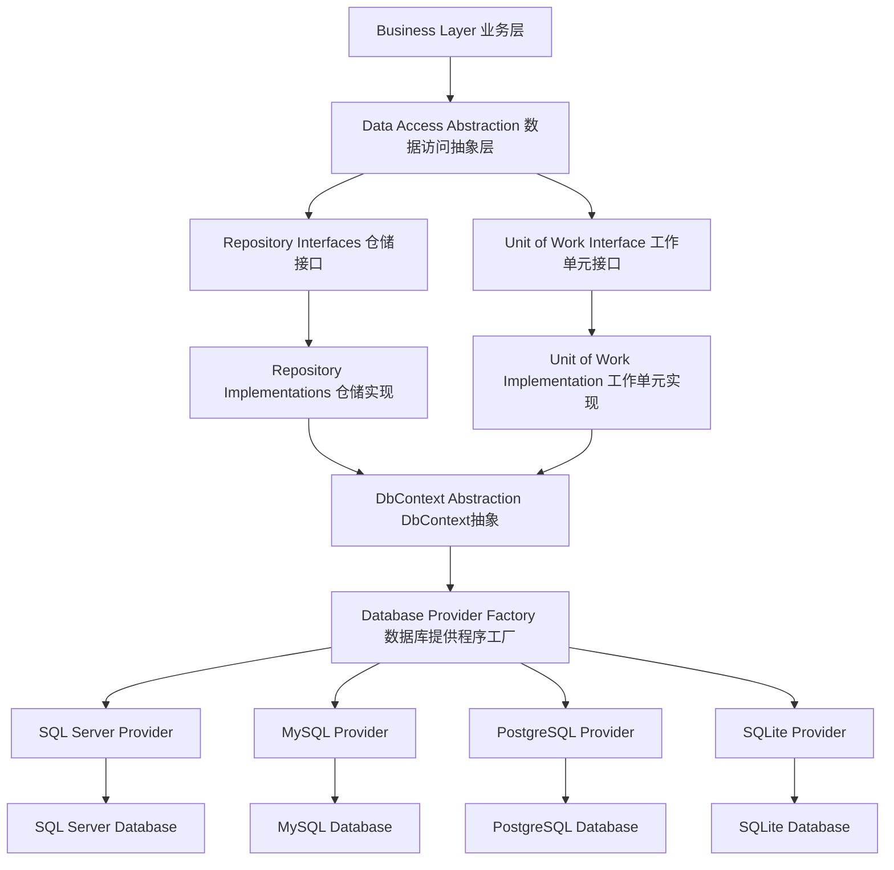

### 2.2 分层设计

#### 2.2.1 接口抽象层

位置：`Core/Lorn.ADSP.Core.Domain/Repositories/`

**职责**：

- 定义仓储接口规范
- 定义工作单元接口
- 定义查询规格接口
- 提供数据访问抽象

#### 2.2.2 实现层

位置：`Infrastructure/Lorn.ADSP.Infrastructure.Data/`

**职责**：

- 实现具体的仓储类
- 实现工作单元模式
- 配置Entity Framework Core
- 提供数据库迁移支持

#### 2.2.3 提供程序层

位置：`Infrastructure/Lorn.ADSP.Infrastructure.Data.Providers/`

**职责**：

- 实现各数据库提供程序
- 配置特定数据库连接
- 优化数据库特定功能
- 处理数据库差异性

## 3. 核心接口设计

### 3.1 仓储接口设计

```mermaid
classDiagram
    class IRepository~T~ {
        <<interface>>
        +Task~T~ GetByIdAsync(int id, CancellationToken cancellationToken)
        +Task~IEnumerable~T~~ GetAllAsync(CancellationToken cancellationToken)
        +Task~IEnumerable~T~~ FindAsync(ISpecification~T~ spec, CancellationToken cancellationToken)
        +Task~T~ FindOneAsync(ISpecification~T~ spec, CancellationToken cancellationToken)
        +Task~PagedResult~T~~ GetPagedAsync(int pageIndex, int pageSize, ISpecification~T~ spec, CancellationToken cancellationToken)
        +Task AddAsync(T entity, CancellationToken cancellationToken)
        +Task AddRangeAsync(IEnumerable~T~ entities, CancellationToken cancellationToken)
        +void Update(T entity)
        +void UpdateRange(IEnumerable~T~ entities)
        +void Remove(T entity)
        +void RemoveRange(IEnumerable~T~ entities)
        +Task~bool~ ExistsAsync(int id, CancellationToken cancellationToken)
        +Task~int~ CountAsync(ISpecification~T~ spec, CancellationToken cancellationToken)
    }
    
    class IReadOnlyRepository~T~ {
        <<interface>>
        +Task~T~ GetByIdAsync(int id, CancellationToken cancellationToken)
        +Task~IEnumerable~T~~ GetAllAsync(CancellationToken cancellationToken)
        +Task~IEnumerable~T~~ FindAsync(ISpecification~T~ spec, CancellationToken cancellationToken)
        +Task~T~ FindOneAsync(ISpecification~T~ spec, CancellationToken cancellationToken)
        +Task~PagedResult~T~~ GetPagedAsync(int pageIndex, int pageSize, ISpecification~T~ spec, CancellationToken cancellationToken)
        +Task~bool~ ExistsAsync(int id, CancellationToken cancellationToken)
        +Task~int~ CountAsync(ISpecification~T~ spec, CancellationToken cancellationToken)
    }
    
    class IAdvertisementRepository {
        <<interface>>
        +Task~IEnumerable~Advertisement~~ GetByAdvertiserIdAsync(int advertiserId, CancellationToken cancellationToken)
        +Task~IEnumerable~Advertisement~~ GetActiveAdvertisementsAsync(CancellationToken cancellationToken)
        +Task~IEnumerable~Advertisement~~ GetByStatusAsync(AdStatus status, CancellationToken cancellationToken)
        +Task~Advertisement~ GetWithCampaignsAsync(int id, CancellationToken cancellationToken)
        +Task~Advertisement~ GetWithCreativesAsync(int id, CancellationToken cancellationToken)
        +Task~bool~ HasActiveCampaignsAsync(int advertisementId, CancellationToken cancellationToken)
        +Task~IEnumerable~Advertisement~~ GetMatchingAdvertisementsAsync(TargetingCriteria criteria, CancellationToken cancellationToken)
    }
    
    class ICampaignRepository {
        <<interface>>
        +Task~IEnumerable~Campaign~~ GetByAdvertisementIdAsync(int advertisementId, CancellationToken cancellationToken)
        +Task~IEnumerable~Campaign~~ GetActiveCampaignsAsync(CancellationToken cancellationToken)
        +Task~IEnumerable~Campaign~~ GetByStatusAsync(CampaignStatus status, CancellationToken cancellationToken)
        +Task~Campaign~ GetWithDeliveryRecordsAsync(int id, CancellationToken cancellationToken)
        +Task~decimal~ GetTotalSpentAsync(int campaignId, CancellationToken cancellationToken)
        +Task~decimal~ GetDailySpentAsync(int campaignId, DateTime date, CancellationToken cancellationToken)
        +Task~IEnumerable~Campaign~~ GetBudgetExceededCampaignsAsync(CancellationToken cancellationToken)
        +Task~bool~ UpdateBudgetAsync(int campaignId, decimal spentAmount, CancellationToken cancellationToken)
    }
    
    class IDeliveryRecordRepository {
        <<interface>>
        +Task~IEnumerable~DeliveryRecord~~ GetByCampaignIdAsync(int campaignId, CancellationToken cancellationToken)
        +Task~IEnumerable~DeliveryRecord~~ GetByDateRangeAsync(DateTime startDate, DateTime endDate, CancellationToken cancellationToken)
        +Task~IEnumerable~DeliveryRecord~~ GetByMediaResourceIdAsync(int mediaResourceId, CancellationToken cancellationToken)
        +Task~DeliveryStatistics~ GetStatisticsAsync(int campaignId, DateTime startDate, DateTime endDate, CancellationToken cancellationToken)
        +Task~IEnumerable~DeliveryRecord~~ GetTopPerformingRecordsAsync(int count, CancellationToken cancellationToken)
        +Task BulkInsertAsync(IEnumerable~DeliveryRecord~ records, CancellationToken cancellationToken)
        +Task~decimal~ CalculateTotalCostAsync(int campaignId, DateTime date, CancellationToken cancellationToken)
    }
    
    IReadOnlyRepository~T~ <|-- IRepository~T~
    IRepository~Advertisement~ <|-- IAdvertisementRepository
    IRepository~Campaign~ <|-- ICampaignRepository
    IRepository~DeliveryRecord~ <|-- IDeliveryRecordRepository
```

**接口设计说明**：

1. **泛型基础接口**：`IRepository<T>`和`IReadOnlyRepository<T>`提供通用的CRUD操作
2. **特定业务接口**：继承基础接口，添加业务特定的查询方法
3. **异步优先**：所有数据库操作都采用异步模式，提高系统吞吐量
4. **规格模式**：通过`ISpecification<T>`实现复杂查询条件的组合和重用
5. **分页支持**：内置分页查询支持，优化大数据集的处理性能

### 3.2 工作单元接口设计

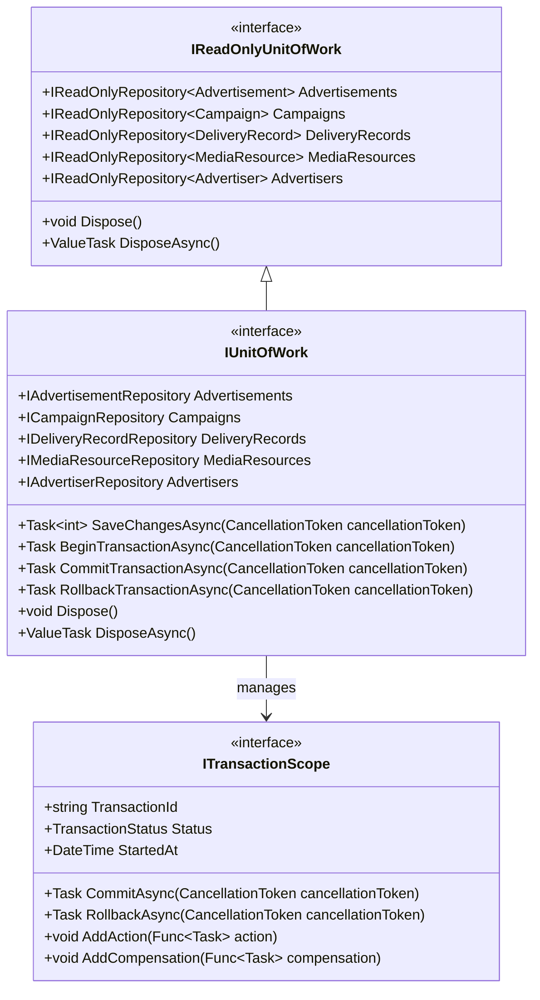

**工作单元设计原则**：

1. **事务边界管理**：确保跨多个仓储的操作在同一事务中执行
2. **资源管理**：自动管理数据库连接和事务的生命周期
3. **读写分离**：提供只读工作单元，优化查询性能
4. **延迟提交**：支持批量操作的延迟提交，提高性能

### 3.3 规格模式接口设计

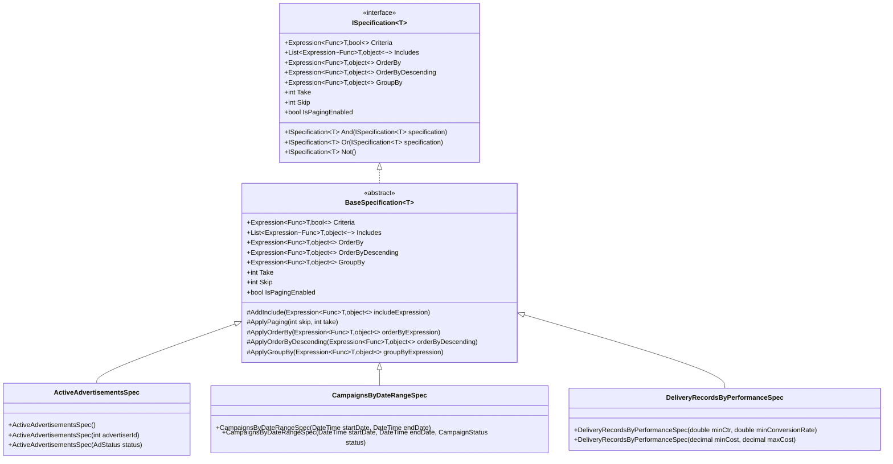

**规格模式优势**：

1. **查询复用**：常用查询条件可以封装为规格对象重复使用
2. **动态组合**：支持规格对象的And、Or、Not组合操作
3. **类型安全**：编译时检查查询条件的正确性
4. **测试友好**：规格对象易于进行单元测试

## 4. 数据库提供程序设计

### 4.1 提供程序工厂设计

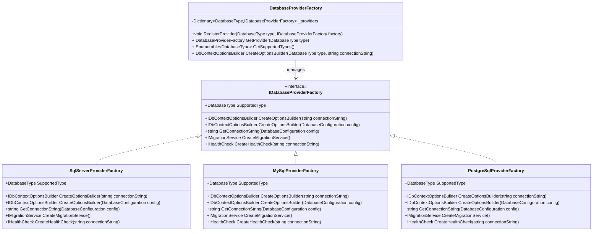

**工厂模式优势**：

1. **运行时切换**：根据配置动态选择数据库提供程序
2. **插件式扩展**：新增数据库支持无需修改现有代码
3. **统一接口**：不同数据库提供程序提供一致的创建接口
4. **配置集中化**：数据库相关配置统一管理

### 4.2 数据库配置设计

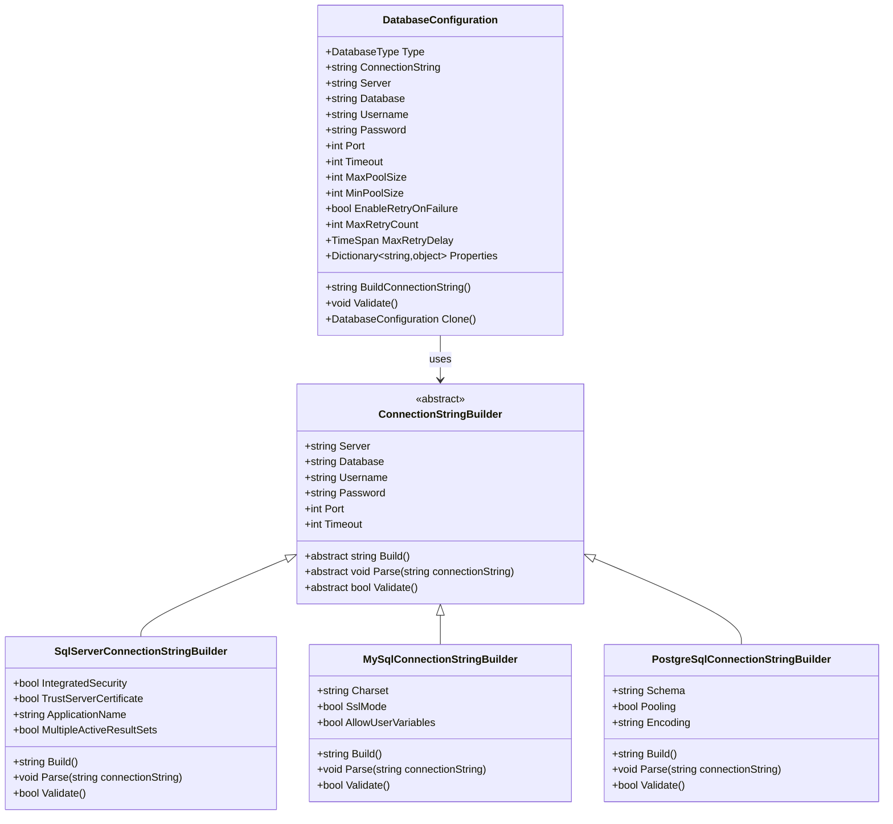

## 5. DbContext设计

### 5.1 抽象DbContext设计

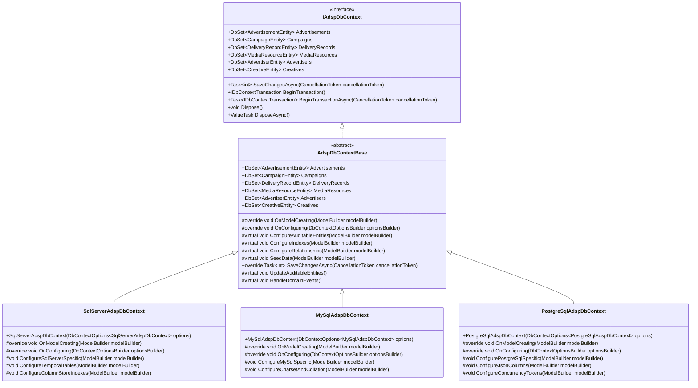

**DbContext设计特点**：

1. **分层抽象**：基类提供通用功能，具体实现处理数据库特定配置
2. **配置集中化**：在OnModelCreating中统一配置实体映射和关系
3. **审计支持**：自动处理创建时间、更新时间等审计字段
4. **领域事件**：集成领域事件处理机制
5. **性能优化**：针对不同数据库进行特定优化

### 5.2 实体配置设计

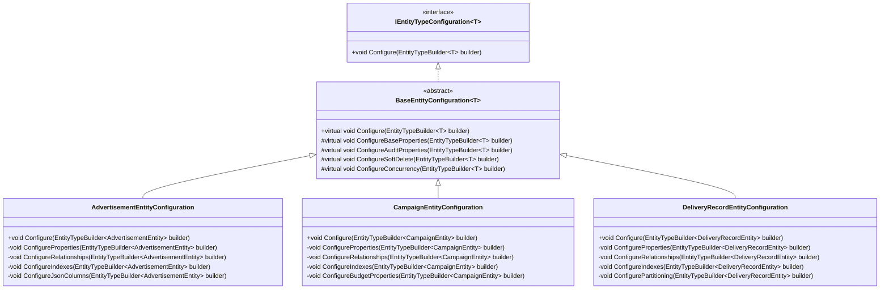

## 6. 仓储实现设计

### 6.1 基础仓储实现

项目位置：`Infrastructure/Lorn.ADSP.Infrastructure.Data/Repositories/`

**实现要求**：

1. **通用仓储类**：`Repository<T>`实现`IRepository<T>`接口
   - 封装常用的CRUD操作
   - 支持规格模式查询
   - 实现分页和排序
   - 提供异步操作支持

2. **只读仓储类**：`ReadOnlyRepository<T>`实现`IReadOnlyRepository<T>`接口
   - 优化查询性能
   - 支持查询缓存
   - 禁用变更跟踪
   - 支持读写分离

3. **特定业务仓储**：继承基础仓储，实现业务特定接口
   - `AdvertisementRepository`：实现广告相关查询
   - `CampaignRepository`：实现活动相关查询和预算管理
   - `DeliveryRecordRepository`：实现投放记录查询和统计

**关键实现点**：

- 使用`IQueryable<T>`构建动态查询
- 通过`Include()`预加载相关实体
- 实现批量操作优化性能
- 支持原生SQL查询处理复杂场景
- 集成查询缓存减少数据库访问

### 6.2 工作单元实现

项目位置：`Infrastructure/Lorn.ADSP.Infrastructure.Data/UnitOfWork/`

**实现要求**：

1. **UnitOfWork类**：实现`IUnitOfWork`接口
   - 管理多个仓储实例
   - 控制事务生命周期
   - 实现延迟提交模式
   - 处理并发冲突

2. **ReadOnlyUnitOfWork类**：实现`IReadOnlyUnitOfWork`接口
   - 提供只读仓储访问
   - 优化查询性能
   - 支持查询缓存
   - 禁用变更跟踪

3. **事务管理**：
   - 支持分布式事务
   - 实现事务补偿机制
   - 提供事务监控和日志
   - 处理死锁和超时

## 7. 性能优化策略

### 7.1 查询优化

| 优化策略   | 实现方式                        | 性能提升 | 适用场景     |
| ---------- | ------------------------------- | -------- | ------------ |
| 查询缓存   | IMemoryCache, IDistributedCache | 90%+     | 热点数据查询 |
| 预编译查询 | EF Core Compiled Queries        | 20-30%   | 重复查询     |
| 分页优化   | Skip/Take优化, Cursor分页       | 50-80%   | 大数据集分页 |
| 索引优化   | 复合索引, 覆盖索引              | 70-90%   | 复杂查询条件 |
| 批量操作   | EF Core Bulk Extensions         | 500%+    | 大量数据操作 |

### 7.2 连接管理

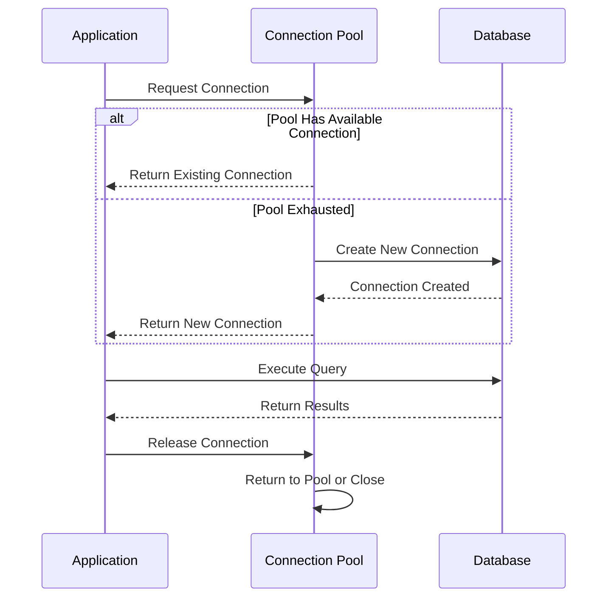

**连接池配置要点**：

- **最小连接数**：根据并发需求设置，避免频繁创建销毁
- **最大连接数**：防止连接泄漏，设置合理上限
- **连接超时**：设置合理的连接和命令超时时间
- **连接验证**：定期验证连接有效性，自动重连

### 7.3 缓存策略

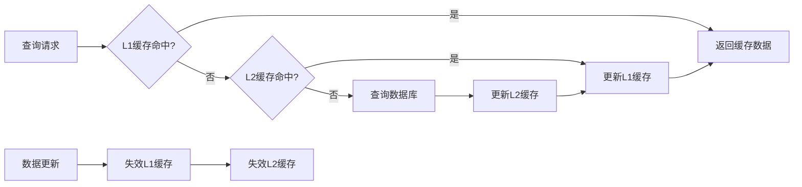

**缓存层级设计**：

- **L1缓存（内存）**：进程内缓存，毫秒级访问
- **L2缓存（Redis）**：分布式缓存，单位数毫秒访问
- **缓存策略**：LRU淘汰、TTL过期、标签失效

## 8. 错误处理和重试机制

### 8.1 错误分类和处理

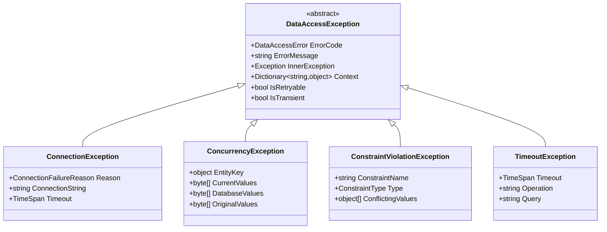

### 8.2 重试策略

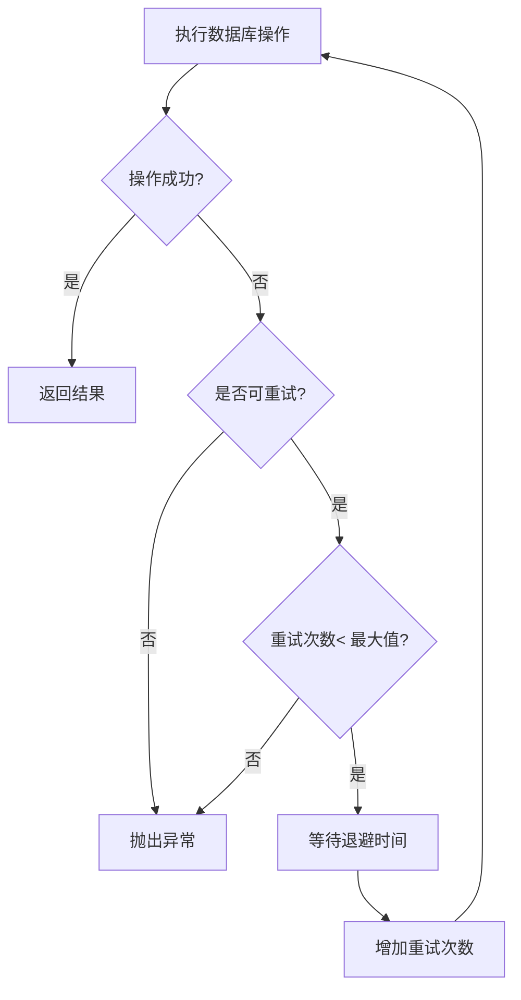

**重试配置参数**：

- **最大重试次数**：防止无限重试
- **退避策略**：指数退避、线性退避、固定间隔
- **重试条件**：网络错误、超时、临时故障
- **熔断机制**：连续失败后暂停重试

## 9. 监控和诊断

### 9.1 性能监控

| 监控指标     | 监控目的   | 告警阈值 | 处理措施             |
| ------------ | ---------- | -------- | -------------------- |
| 查询响应时间 | 性能监控   | >1000ms  | 查询优化、索引调整   |
| 连接池使用率 | 资源监控   | >80%     | 增加连接数、优化查询 |
| 死锁次数     | 稳定性监控 | >0       | 事务优化、锁顺序调整 |
| 缓存命中率   | 效率监控   | <70%     | 缓存策略调整         |
| 错误率       | 质量监控   | >1%      | 错误分析、代码修复   |

### 9.2 日志记录

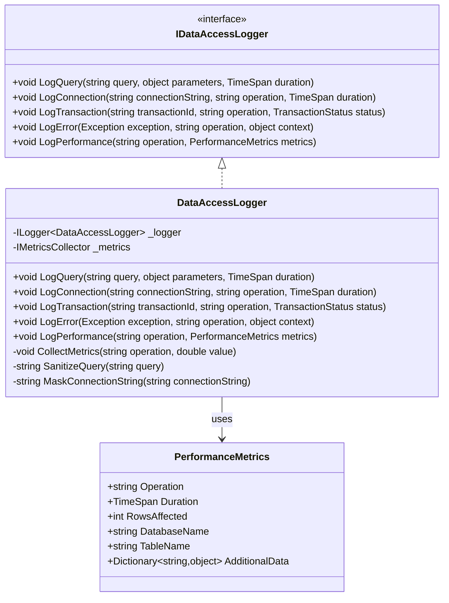

## 10. 依赖注入配置

### 10.1 服务注册设计

项目位置：`Infrastructure/Lorn.ADSP.Infrastructure.Data/Extensions/ServiceCollectionExtensions.cs`

**注册方法要求**：

```csharp
public static IServiceCollection AddDataAccess(
    this IServiceCollection services, 
    DatabaseConfiguration configuration)
{
    // 注册数据库提供程序工厂
    services.AddSingleton<DatabaseProviderFactory>();
    
    // 根据配置注册对应的DbContext
    switch (configuration.Type)
    {
        case DatabaseType.SqlServer:
            services.AddDbContext<IAdspDbContext, SqlServerAdspDbContext>();
            break;
        case DatabaseType.MySQL:
            services.AddDbContext<IAdspDbContext, MySqlAdspDbContext>();
            break;
        case DatabaseType.PostgreSQL:
            services.AddDbContext<IAdspDbContext, PostgreSqlAdspDbContext>();
            break;
    }
    
    // 注册仓储和工作单元
    services.AddScoped(typeof(IRepository<>), typeof(Repository<>));
    services.AddScoped(typeof(IReadOnlyRepository<>), typeof(ReadOnlyRepository<>));
    services.AddScoped<IUnitOfWork, UnitOfWork>();
    services.AddScoped<IReadOnlyUnitOfWork, ReadOnlyUnitOfWork>();
    
    // 注册特定业务仓储
    services.AddScoped<IAdvertisementRepository, AdvertisementRepository>();
    services.AddScoped<ICampaignRepository, CampaignRepository>();
    services.AddScoped<IDeliveryRecordRepository, DeliveryRecordRepository>();
    
    return services;
}
```

### 10.2 配置文件设计

```json
{
  "Database": {
    "Type": "SqlServer",
    "ConnectionString": "Server=localhost;Database=AdspDb;Integrated Security=true;",
    "CommandTimeout": 30,
    "MaxRetryCount": 3,
    "MaxRetryDelay": "00:00:30",
    "EnableRetryOnFailure": true,
    "EnableSensitiveDataLogging": false,
    "EnableDetailedErrors": false,
    "ConnectionPool": {
      "MaxPoolSize": 100,
      "MinPoolSize": 5,
      "ConnectionTimeout": 30
    },
    "Performance": {
      "EnableQueryCache": true,
      "QueryCacheSize": 1000,
      "EnableBatchOperations": true,
      "BatchSize": 1000
    },
    "Monitoring": {
      "EnablePerformanceCounters": true,
      "SlowQueryThreshold": "00:00:01",
      "EnableQueryLogging": true
    }
  },
  "ReadOnlyDatabase": {
    "Type": "SqlServer",
    "ConnectionString": "Server=readonly-server;Database=AdspDb;Integrated Security=true;",
    "EnableQueryCache": true,
    "CacheExpiration": "00:05:00"
  }
}
```

## 11. 测试策略

### 11.1 单元测试

**测试范围**：

- 仓储接口实现
- 规格模式查询逻辑
- 工作单元事务管理
- 数据映射转换

**测试工具**：

- **xUnit**：测试框架
- **Moq**：Mock对象框架
- **Entity Framework InMemory**：内存数据库
- **FluentAssertions**：断言库

### 11.2 集成测试

**测试范围**：

- 数据库连接和配置
- 复杂查询性能
- 事务一致性
- 并发处理

**测试环境**：

- Docker容器化数据库
- 测试数据种子
- 性能基准测试
- 负载测试

## 12. 部署和运维

### 12.1 数据库迁移

**迁移策略**：

- **开发环境**：自动迁移，Code First模式
- **测试环境**：脚本迁移，版本控制
- **生产环境**：手动迁移，备份回滚

**迁移工具**：

- EF Core Migrations
- DbUp脚本管理
- Flyway版本控制

### 12.2 监控和告警

**监控维度**：

- 数据库性能指标
- 连接池状态
- 查询执行计划
- 错误率和响应时间

**告警机制**：

- 邮件通知
- 短信告警
- 钉钉/企业微信通知
- 自动化处理

---

以上设计文档详细描述了广告投放引擎数据访问层的技术架构和实现方案。通过仓储模式和工作单元模式的抽象设计，实现了数据库无关的业务逻辑，支持多种数据库提供程序的运行时切换，并提供了完整的性能优化、错误处理和监控方案。
