# 数据访问层技术设计

## 设计概述

广告投放平台数据访问层采用透明化数据访问架构，为上层业务提供统一的数据访问接口，完全屏蔽缓存和数据库的实现细节。该架构基于缓存优先的访问策略，通过智能缓存管理、多云数据库支持和配置驱动的存储选择，实现高性能、高可用的数据访问服务。系统支持SQL Server、MySQL、PostgreSQL、PolarDB等多种关系型数据库，以及Redis、MongoDB、InfluxDB等NoSQL数据库，确保在不同云平台间的无缝迁移和扩展。

### 设计目标

**完全透明的数据访问**：
- 上层业务无需感知数据来源是缓存还是数据库
- 通过统一的数据访问抽象接口提供服务
- 缓存管理、数据库访问、云平台适配等复杂性完全封装
- 支持热切换数据源而不影响业务流程

**缓存优先的访问策略**：
- 所有数据访问请求优先查询缓存层
- 缓存未命中时自动访问数据库并更新缓存
- 智能缓存失效和数据一致性保障
- 支持多级缓存和分布式缓存协调

**配置驱动的存储选择**：
- 通过配置文件动态选择具体的数据库实现
- 支持运行时切换云平台和数据库类型
- 提供环境隔离和多租户支持
- 实现蓝绿部署和灾难恢复策略

### 系统架构总览

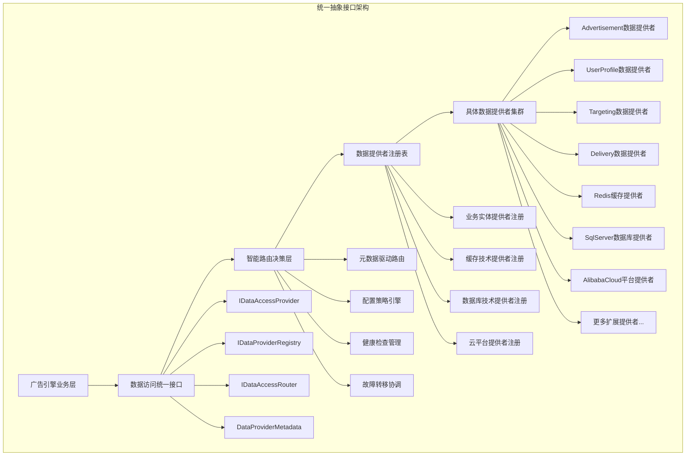

## 架构设计原则

### 核心设计原则

- **统一接口原则**：所有数据访问组件都实现统一的`IDataAccessProvider`接口
- **元数据驱动原则**：通过元数据标识业务实体、技术类型、平台信息，实现智能路由
- **配置驱动架构**：数据源选择、路由策略、提供者注册完全由配置控制
- **依赖注入管理**：通过注册表模式和依赖注入实现松耦合和可扩展性
- **高可用设计**：内置故障转移、负载均衡、健康检查等可用性保障
- **透明性保障**：上层业务完全无感知底层数据存储和路由决策的实现细节

### 技术架构约束

- **抽象接口优先**：所有数据访问通过统一的`IDataAccessProvider`接口
- **元数据标准化**：统一的元数据模型确保组件的可发现性和可管理性
- **注册表模式**：所有提供者通过注册表统一管理和查询
- **路由决策集中**：通过专门的路由器实现智能的提供者选择
- **配置驱动实现**：通过配置文件控制所有提供者的注册、路由和行为
- **异步访问模式**：所有数据操作采用异步模式，提高系统吞吐量

## 数据访问抽象接口设计

### 接口设计概述

基于广告引擎抽象层设计文档的要求，数据访问抽象接口采用统一的顶层抽象设计，通过元数据驱动和依赖注入机制实现高度可扩展和可配置的架构。所有具体实现都继承统一的顶层接口，通过元数据标识其业务领域、技术类型和平台信息。

#### 统一数据访问抽象接口架构

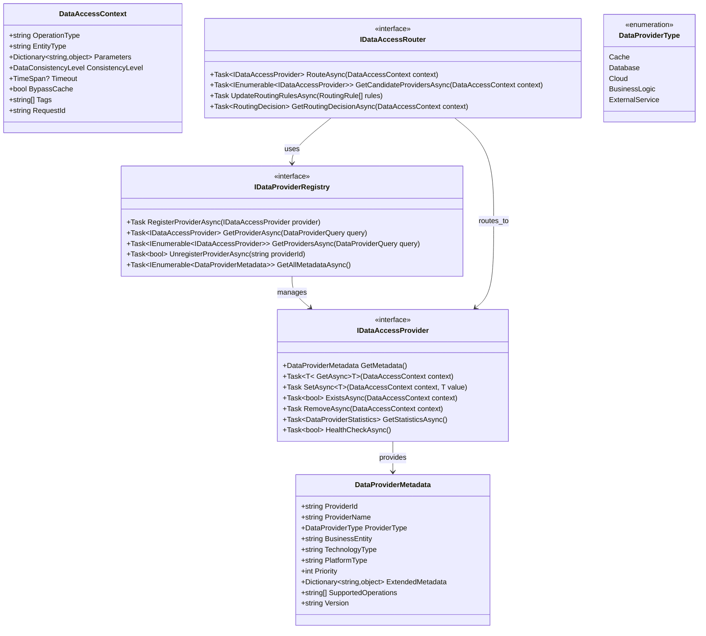

#### 具体实现类设计架构

基于统一的顶层抽象接口，所有具体实现都通过元数据标识其特性，支持依赖注入和动态路由：

```mermaid
classDiagram
    class AdvertisementDataProvider {
        +DataProviderMetadata GetMetadata()
        +string BusinessEntity = "Advertisement"
        +DataProviderType ProviderType = "BusinessLogic"
        +Task~T~ GetAsync~T~(DataAccessContext context)
    }
    
    class UserProfileDataProvider {
        +DataProviderMetadata GetMetadata()
        +string BusinessEntity = "UserProfile"
        +DataProviderType ProviderType = "BusinessLogic"
        +Task~T~ GetAsync~T~(DataAccessContext context)
    }
    
    class TargetingDataProvider {
        +DataProviderMetadata GetMetadata()
        +string BusinessEntity = "Targeting"
        +DataProviderType ProviderType = "BusinessLogic"
        +Task~T~ GetAsync~T~(DataAccessContext context)
    }
    
    class DeliveryDataProvider {
        +DataProviderMetadata GetMetadata()
        +string BusinessEntity = "Delivery"
        +DataProviderType = "BusinessLogic"
        +Task~T~ GetAsync~T~(DataAccessContext context)
    }
    
    class RedisCacheProvider {
        +DataProviderMetadata GetMetadata()
        +string TechnologyType = "Redis"
        +DataProviderType ProviderType = "Cache"
        +Task~T~ GetAsync~T~(DataAccessContext context)
    }
    
    class MemoryCacheProvider {
        +DataProviderMetadata GetMetadata()
        +string TechnologyType = "Memory"
        +DataProviderType ProviderType = "Cache"
        +Task~T~ GetAsync~T~(DataAccessContext context)
    }
    
    class SqlServerDataProvider {
        +DataProviderMetadata GetMetadata()
        +string TechnologyType = "SqlServer"
        +DataProviderType ProviderType = "Database"
        +Task~T~ GetAsync~T~(DataAccessContext context)
    }
    
    class MySqlDataProvider {
        +DataProviderMetadata GetMetadata()
        +string TechnologyType = "MySQL"
        +DataProviderType ProviderType = "Database"
        +Task~T~ GetAsync~T~(DataAccessContext context)
    }
    
    class AlibabaCloudProvider {
        +DataProviderMetadata GetMetadata()
        +string PlatformType = "AlibabaCloud"
        +DataProviderType ProviderType = "Cloud"
        +Task~T~ GetAsync~T~(DataAccessContext context)
    }
    
    class AzureCloudProvider {
        +DataProviderMetadata GetMetadata()
        +string PlatformType = "Azure"
        +DataProviderType ProviderType = "Cloud"
        +Task~T~ GetAsync~T~(DataAccessContext context)
    }
    
    IDataAccessProvider <|.. AdvertisementDataProvider
    IDataAccessProvider <|.. UserProfileDataProvider
    IDataAccessProvider <|.. TargetingDataProvider
    IDataAccessProvider <|.. DeliveryDataProvider
    IDataAccessProvider <|.. RedisCacheProvider
    IDataAccessProvider <|.. MemoryCacheProvider
    IDataAccessProvider <|.. SqlServerDataProvider
    IDataAccessProvider <|.. MySqlDataProvider
    IDataAccessProvider <|.. AlibabaCloudProvider
    IDataAccessProvider <|.. AzureCloudProvider
```

#### 依赖注入和注册机制设计

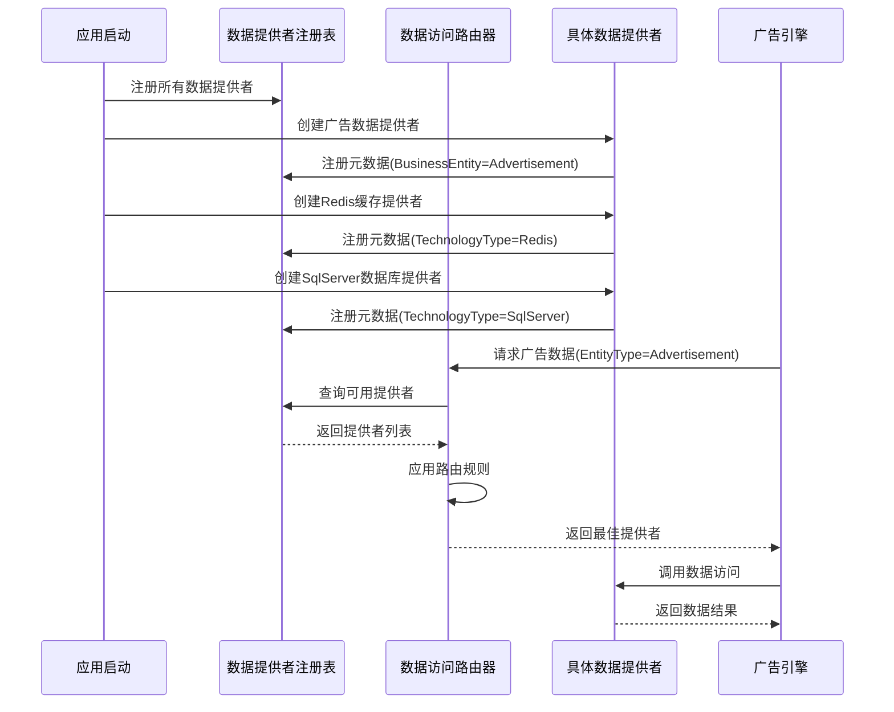

### 元数据驱动的路由决策设计

#### 数据提供者元数据体系

**元数据分类设计**：

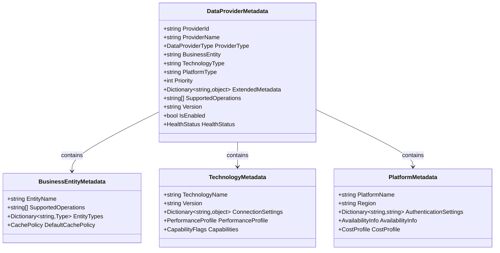

**元数据示例**：

```text
广告数据提供者元数据：
├── ProviderId: "AdvertisementDataProvider_v1.0"
├── ProviderName: "广告数据业务提供者"
├── ProviderType: BusinessLogic
├── BusinessEntity: "Advertisement"
├── SupportedOperations: ["GetCandidates", "GetDetails", "GetCampaigns"]
├── Priority: 100
└── ExtendedMetadata:
    ├── CacheEnabled: true
    ├── TransactionSupport: true
    └── BatchOperationSupport: true

Redis缓存提供者元数据：
├── ProviderId: "RedisCacheProvider_v2.1"
├── ProviderName: "Redis分布式缓存"
├── ProviderType: Cache
├── TechnologyType: "Redis"
├── SupportedOperations: ["Get", "Set", "Remove", "Exists", "Pattern"]
├── Priority: 90
└── ExtendedMetadata:
    ├── ClusterMode: true
    ├── MaxExpiration: "24:00:00"
    └── CompressionEnabled: true

SqlServer数据库提供者元数据：
├── ProviderId: "SqlServerProvider_v1.5"
├── ProviderName: "SQL Server数据库"
├── ProviderType: Database
├── TechnologyType: "SqlServer"
├── SupportedOperations: ["Select", "Insert", "Update", "Delete", "Transaction"]
├── Priority: 80
└── ExtendedMetadata:
    ├── ReadWriteSeparation: true
    ├── ConnectionPoolSize: 100
    └── CommandTimeout: "00:00:30"

阿里云平台提供者元数据：
├── ProviderId: "AlibabaCloudProvider_v3.0"
├── ProviderName: "阿里云平台服务"
├── ProviderType: Cloud
├── PlatformType: "AlibabaCloud"
├── SupportedOperations: ["RDS", "PolarDB", "Redis", "OSS"]
├── Priority: 70
└── ExtendedMetadata:
    ├── Region: "cn-hangzhou"
    ├── AvailabilityZones: ["cn-hangzhou-a", "cn-hangzhou-b"]
    └── AutoScaling: true
```

#### 智能路由决策引擎

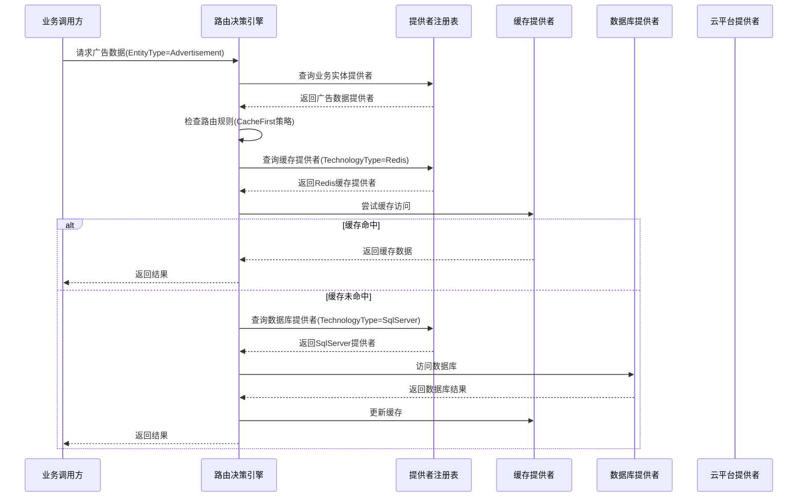

#### 配置驱动的路由规则设计

**路由规则配置架构**：

```text
数据访问路由配置文件结构
├── ProviderRegistration              # 提供者注册配置
│   ├── BusinessLogicProviders
│   │   ├── Advertisement:
│   │   │   ├── ProviderId: "AdvertisementDataProvider_v1.0"
│   │   │   ├── Assembly: "Lorn.ADSP.BusinessData.Advertisement"
│   │   │   ├── Type: "AdvertisementDataProvider"
│   │   │   └── Configuration: {...}
│   │   ├── UserProfile:
│   │   │   ├── ProviderId: "UserProfileDataProvider_v1.0"
│   │   │   └── ...
│   │   └── ...
│   ├── CacheProviders
│   │   ├── Redis:
│   │   │   ├── ProviderId: "RedisCacheProvider_v2.1"
│   │   │   ├── Assembly: "Lorn.ADSP.Infrastructure.Cache.Redis"
│   │   │   ├── ConnectionString: "${REDIS_CONNECTION}"
│   │   │   └── Configuration: {...}
│   │   ├── Memory:
│   │   │   ├── ProviderId: "MemoryCacheProvider_v1.0"
│   │   │   └── ...
│   │   └── ...
│   ├── DatabaseProviders
│   │   ├── SqlServer:
│   │   │   ├── ProviderId: "SqlServerProvider_v1.5"
│   │   │   ├── Assembly: "Lorn.ADSP.Infrastructure.Data.SqlServer"
│   │   │   ├── ConnectionString: "${SQLSERVER_CONNECTION}"
│   │   │   └── Configuration: {...}
│   │   └── ...
│   └── CloudProviders
│       ├── AlibabaCloud:
│       │   ├── ProviderId: "AlibabaCloudProvider_v3.0"
│       │   ├── Assembly: "Lorn.ADSP.Infrastructure.Cloud.AlibabaCloud"
│       │   └── Configuration: {...}
│       └── ...
├── RoutingStrategies                 # 路由策略配置
│   ├── Default: "CacheFirstThenDatabase"
│   ├── EntitySpecific:
│   │   ├── Advertisement: "CacheFirstThenDatabase"
│   │   ├── UserProfile: "CacheOnly"
│   │   ├── Targeting: "DatabaseFirstThenCache"
│   │   └── Delivery: "DatabaseOnly"
│   ├── OperationSpecific:
│   │   ├── Read: "CacheFirstThenDatabase"
│   │   ├── Write: "DatabaseThenCache"
│   │   ├── Transaction: "DatabaseOnly"
│   │   └── Batch: "DatabaseOnly"
│   └── ConditionalRouting:
│       ├── HighTrafficHours: "CacheOnly"
│       ├── MaintenanceMode: "DatabaseOnly"
│       └── EmergencyMode: "LocalCacheOnly"
├── ProviderSelection                 # 提供者选择配置
│   ├── Cache:
│   │   ├── PreferredOrder: ["Redis", "Memory"]
│   │   ├── FailoverStrategy: "NextAvailable"
│   │   └── HealthCheckInterval: "00:01:00"
│   ├── Database:
│   │   ├── PreferredOrder: ["SqlServer", "MySQL", "PostgreSQL"]
│   │   ├── ReadWriteSeparation: true
│   │   ├── LoadBalancing: "RoundRobin"
│   │   └── FailoverStrategy: "AutomaticFailover"
│   └── Cloud:
│       ├── PreferredOrder: ["AlibabaCloud", "Azure", "AWS"]
│       ├── RegionAwareness: true
│       └── CostOptimization: true
└── PerformanceThresholds             # 性能阈值配置
    ├── CacheTimeout: "00:00:05"
    ├── DatabaseTimeout: "00:00:30"
    ├── CloudTimeout: "00:01:00"
    ├── MaxRetryAttempts: 3
    ├── CircuitBreakerThreshold: 10
    └── HealthCheckFailureThreshold: 5
```

**路由决策算法**：

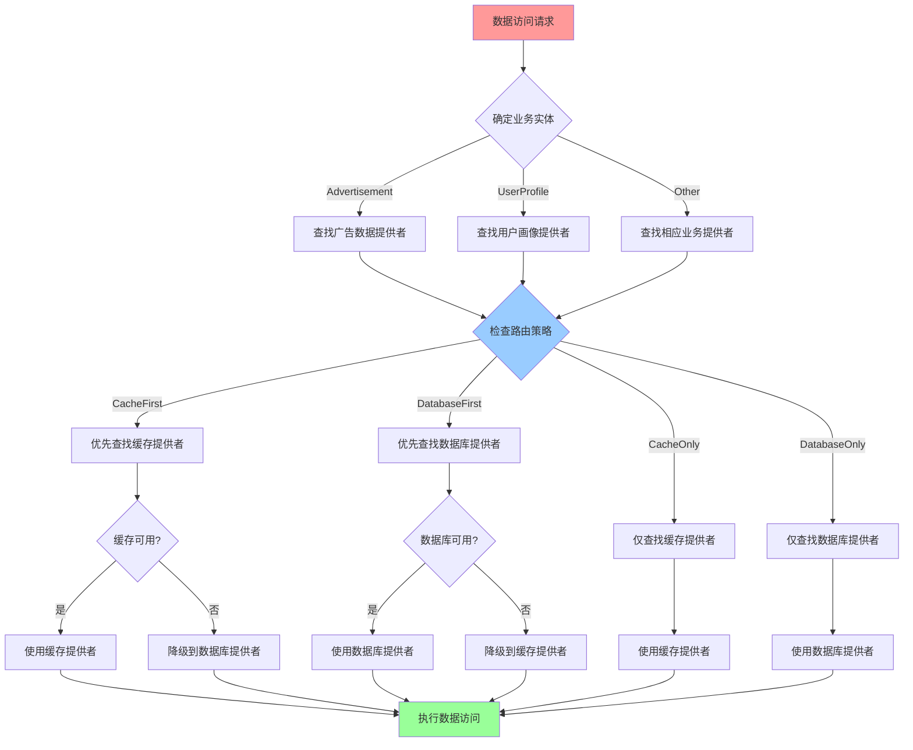

## 多云数据库支持架构

### 底层数据库适配设计

基于透明化数据访问的要求，底层数据库适配层完全对上层隐藏，通过配置驱动选择具体的数据库实现：

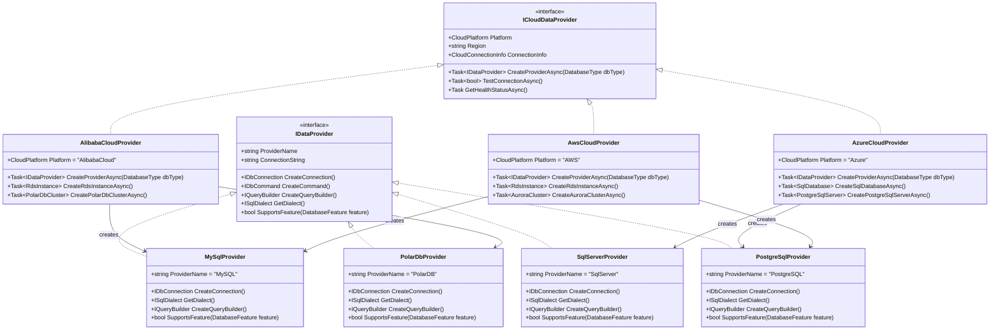

### 云平台配置和连接管理

**多云架构独立性设计**：
- 云平台抽象接口（`Lorn.ADSP.Infrastructure.Cloud.Abstractions`）作为独立项目，定义统一的云服务接口
- 每个云平台实现独立项目，避免单一部署包含多云代码：
  - `Lorn.ADSP.Infrastructure.Cloud.AlibabaCloud` - 阿里云独立实现
  - `Lorn.ADSP.Infrastructure.Cloud.Azure` - Azure云独立实现
  - `Lorn.ADSP.Infrastructure.Cloud.AWS` - AWS云独立实现
- 通过NuGet包管理和依赖注入实现运行时云平台选择
- 每个部署环境只包含当前所需的云平台实现，减少依赖和部署包大小

**配置设计指导**：
- 支持多云配置文件管理，包含连接字符串、认证信息、区域设置等
- 提供连接池管理和故障转移机制
- 实现云平台特定的监控和日志集成
- 通过配置文件指定当前部署使用的云平台类型

**连接字符串管理**：
- 支持Azure Key Vault、AWS Secrets Manager、阿里云KMS等密钥管理服务
- 提供连接字符串的加密存储和动态解密
- 支持不同环境（开发、测试、生产）的配置隔离
- 实现连接字符串的版本管理和回滚机制

**部署策略优势**：
- **减少依赖复杂性**：每个部署环境只包含必要的云平台实现
- **提高安全性**：避免在同一部署中暴露多个云平台的认证信息
- **优化性能**：减少不必要的依赖加载，提高应用启动性能
- **简化运维**：每个云平台的配置和监控独立管理，便于故障排查

## 基础设施层实现设计

### 仓储模式实现架构

仓储模式作为底层实现机制，为统一的`IDataAccessProvider`接口提供具体的数据持久化能力。仓储层作为基础设施层的一部分，通过元数据标识为特定的数据库技术提供数据访问服务。

#### 仓储层与统一抽象接口的关系

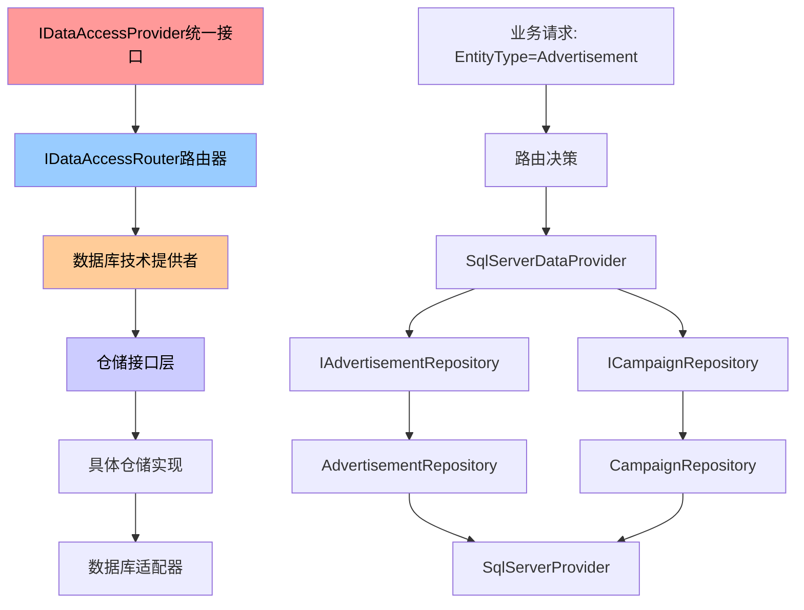

**设计原则**：

- **服务导向**：仓储层完全服务于数据库技术提供者，不直接暴露给业务层
- **技术绑定**：每个数据库技术提供者内部使用对应的仓储实现
- **接口隔离**：仓储接口按业务领域划分，由数据库提供者统一协调
- **元数据驱动**：数据库提供者通过元数据标识支持的技术类型和业务实体

### 基础仓储接口设计


### 接口设计说明

**仓储层在统一架构中的定位**：

- **内部服务接口**：仓储接口仅供数据库技术提供者内部使用，不直接暴露给业务层
- **技术绑定实现**：每个数据库技术提供者（SqlServer、MySQL等）内部使用对应的仓储实现
- **业务无感知**：业务层通过统一的`IDataAccessProvider`接口访问，无需了解底层仓储实现
- **元数据协调**：数据库提供者通过元数据声明支持的业务实体和操作类型

**泛型基础接口**：

- `IReadOnlyRepository<T>`：提供只读数据访问操作，支持查询、分页、聚合等
- `IRepository<T>`：继承只读接口，增加增删改操作和批量处理能力
- 支持规格模式进行复杂查询条件的组合和重用
- 内置分页支持，优化大数据集的处理性能

**业务特定接口**：

- 继承基础泛型接口，添加业务领域特定的查询方法
- 根据数据模型分层设计中的实体关系，提供关联查询方法
- 支持复杂的业务查询，如预算计算、统计分析、匹配查询等
- 提供批量操作优化，如批量插入投放记录、批量更新预算状态

**异步设计**：

- 所有数据库操作都采用异步模式，提高系统吞吐量
- 支持CancellationToken，提供操作取消和超时控制
- 异步批量操作，减少数据库连接时间和网络开销

## 统一事务管理接口设计

### 事务管理在统一架构中的定位

事务管理作为数据库技术提供者的核心内部机制，通过统一的抽象接口为业务层提供透明的事务控制能力。业务层通过`IDataAccessProvider`接口的事务方法进行操作，由数据库提供者内部协调具体的事务实现：

```mermaid
classDiagram
    %% 统一事务抽象接口
    class ITransactionManager {
        <<interface>>
        +TransactionMetadata Metadata
        +Task~ITransactionScope~ BeginTransactionAsync(TransactionOptions options, CancellationToken cancellationToken)
        +Task~ITransactionScope~ BeginDistributedTransactionAsync(DistributedTransactionOptions options, CancellationToken cancellationToken)
        +Task~T~ ExecuteInTransactionAsync~T~(Func~ITransactionScope, CancellationToken, Task~T~~ operation, TransactionOptions options, CancellationToken cancellationToken)
        +Task~bool~ SupportsTransactionType(TransactionType type)
        +Task~TransactionCapabilities~ GetCapabilitiesAsync(CancellationToken cancellationToken)
    }
    
    class ITransactionScope {
        <<interface>>
        +string TransactionId
        +TransactionType Type
        +IsolationLevel IsolationLevel
        +TransactionStatus Status
        +DateTime StartedAt
        +TimeSpan Duration
        +Task CommitAsync(CancellationToken cancellationToken)
        +Task RollbackAsync(CancellationToken cancellationToken)
        +Task~ITransactionScope~ CreateSavepointAsync(string name, CancellationToken cancellationToken)
        +Task RollbackToSavepointAsync(string name, CancellationToken cancellationToken)
        +void RegisterCompensation(Func~CancellationToken, Task~ compensation)
        +Task~TransactionStatistics~ GetStatisticsAsync()
        +ValueTask DisposeAsync()
    }
    
    class IDistributedTransactionScope {
        <<interface>>
        +string GlobalTransactionId
        +IReadOnlyList~ITransactionScope~ LocalScopes
        +Task~ITransactionScope~ CreateLocalScopeAsync(string scopeName, TransactionOptions options, CancellationToken cancellationToken)
        +Task CommitAllAsync(CancellationToken cancellationToken)
        +Task RollbackAllAsync(CancellationToken cancellationToken)
        +Task~bool~ PreparePhaseAsync(CancellationToken cancellationToken)
        +Task~DistributedTransactionResult~ GetResultAsync()
    }
    
    class ITransactionCoordinator {
        <<interface>>
        +Task~IDistributedTransactionScope~ CreateDistributedTransactionAsync(DistributedTransactionOptions options, CancellationToken cancellationToken)
        +Task~bool~ RegisterParticipantAsync(ITransactionManager participant, CancellationToken cancellationToken)
        +Task~CoordinationResult~ CoordinateCommitAsync(string globalTransactionId, CancellationToken cancellationToken)
        +Task~CoordinationResult~ CoordinateRollbackAsync(string globalTransactionId, CancellationToken cancellationToken)
        +Task~IEnumerable~TransactionManager~~ GetActiveParticipantsAsync(CancellationToken cancellationToken)
    }
    
    %% 元数据和配置
    class TransactionMetadata {
        +TransactionTechnology Technology
        +SupportedIsolationLevels SupportedIsolationLevels
        +bool SupportsDistributed
        +bool SupportsNested
        +bool SupportsSavepoints
        +TimeSpan MaxTransactionDuration
        +int MaxConcurrentTransactions
        +Dictionary~string,object~ ExtendedProperties
    }
    
    class TransactionOptions {
        +IsolationLevel IsolationLevel
        +TimeSpan Timeout
        +bool EnableAutoRetry
        +int MaxRetryAttempts
        +TransactionPriority Priority
        +Dictionary~string,object~ CustomProperties
    }
    
    %% 具体实现层（数据库技术提供者内部）
    class SqlServerTransactionManager {
        +TransactionMetadata Metadata
        -IConnectionManager connectionManager
        -ITransactionLogger logger
        +Task~ITransactionScope~ BeginTransactionAsync(TransactionOptions options, CancellationToken cancellationToken)
        +Task~bool~ SupportsTransactionType(TransactionType type)
    }
    
    class MySqlTransactionManager {
        +TransactionMetadata Metadata
        -IConnectionManager connectionManager
        -ITransactionLogger logger
        +Task~ITransactionScope~ BeginTransactionAsync(TransactionOptions options, CancellationToken cancellationToken)
        +Task~bool~ SupportsTransactionType(TransactionType type)
    }
    
    class RedisTransactionManager {
        +TransactionMetadata Metadata
        -IRedisConnectionManager connectionManager
        -ITransactionLogger logger
        +Task~ITransactionScope~ BeginTransactionAsync(TransactionOptions options, CancellationToken cancellationToken)
        +Task~bool~ SupportsTransactionType(TransactionType type)
    }
    
    %% 关系定义
    ITransactionManager <|-- SqlServerTransactionManager
    ITransactionManager <|-- MySqlTransactionManager
    ITransactionManager <|-- RedisTransactionManager
    ITransactionScope <|-- IDistributedTransactionScope
    ITransactionManager --> TransactionMetadata : contains
    ITransactionManager --> ITransactionScope : creates
    ITransactionCoordinator --> IDistributedTransactionScope : manages
    ITransactionCoordinator --> ITransactionManager : coordinates
    SqlServerTransactionManager --> TransactionOptions : uses
    MySqlTransactionManager --> TransactionOptions : uses
```

### 统一事务管理设计原则

**元数据驱动的事务选择**：

- **事务能力声明**：每个数据库技术提供者通过`TransactionMetadata`声明其事务能力
- **自动能力匹配**：系统根据业务需求自动选择具备相应事务能力的提供者
- **透明技术切换**：业务层无需关心底层使用的具体事务技术
- **扩展性保证**：新增事务技术只需实现统一接口并声明元数据

**统一抽象接口设计**：

- **技术无关性**：`ITransactionManager`接口抽象了所有事务管理操作，不依赖具体技术
- **能力查询机制**：提供运行时查询事务能力的标准方法
- **配置驱动选择**：通过配置系统控制事务管理器的选择和路由
- **内部实现隔离**：具体的事务实现细节完全封装在数据库提供者内部

**事务边界统一管理**：

- **声明式事务控制**：通过统一接口提供声明式的事务边界管理
- **自动资源管理**：事务范围自动管理连接、锁等资源的生命周期
- **嵌套事务支持**：通过保存点机制支持安全的嵌套事务操作
- **补偿机制集成**：内置补偿操作注册，支持复杂业务场景的事务回滚

### 事务类型和能力支持

**本地事务支持**：

```csharp
// 业务层使用示例（通过统一接口）
public async Task<bool> CreateAdvertisementWithCampaignAsync(
    Advertisement advertisement, 
    Campaign campaign)
{
    var provider = await _dataAccessRouter.RouteAsync(new DataAccessContext
    {
        BusinessEntity = BusinessEntity.Advertisement,
        OperationType = OperationType.Create,
        RequiredCapabilities = new[] { "LocalTransaction" }
    });
    
    return await provider.ExecuteInTransactionAsync(async (scope, cancellationToken) =>
    {
        var savedAd = await provider.SaveAsync(advertisement, cancellationToken);
        campaign.AdvertisementId = savedAd.Id;
        var savedCampaign = await provider.SaveAsync(campaign, cancellationToken);
        
        return savedAd != null && savedCampaign != null;
    }, new TransactionOptions
    {
        IsolationLevel = IsolationLevel.ReadCommitted,
        Timeout = TimeSpan.FromSeconds(30)
    });
}
```

**分布式事务支持**：

```csharp
// 跨多个数据提供者的分布式事务
public async Task<bool> CreateCompleteAdvertisementSetupAsync(
    Advertisement advertisement,
    UserProfile targetProfile,
    DeliveryConfiguration deliveryConfig)
{
    var coordinator = _serviceProvider.GetRequiredService<ITransactionCoordinator>();
    
    using var distributedTx = await coordinator.CreateDistributedTransactionAsync(
        new DistributedTransactionOptions
        {
            GlobalTimeout = TimeSpan.FromMinutes(5),
            ConsistencyLevel = ConsistencyLevel.StrongConsistency
        });
    
    try
    {
        // 广告数据操作（可能在SQL Server）
        var adProvider = await _dataAccessRouter.RouteAsync(new DataAccessContext
        {
            BusinessEntity = BusinessEntity.Advertisement,
            RequiredCapabilities = new[] { "DistributedTransaction" }
        });
        
        var adScope = await distributedTx.CreateLocalScopeAsync("Advertisement", 
            new TransactionOptions { IsolationLevel = IsolationLevel.Serializable });
        var savedAd = await adProvider.SaveAsync(advertisement);
        
        // 用户画像操作（可能在MongoDB）
        var profileProvider = await _dataAccessRouter.RouteAsync(new DataAccessContext
        {
            BusinessEntity = BusinessEntity.UserProfile,
            RequiredCapabilities = new[] { "DistributedTransaction" }
        });
        
        var profileScope = await distributedTx.CreateLocalScopeAsync("UserProfile",
            new TransactionOptions { IsolationLevel = IsolationLevel.ReadCommitted });
        var savedProfile = await profileProvider.SaveAsync(targetProfile);
        
        // 投放配置操作（可能在Redis）
        var deliveryProvider = await _dataAccessRouter.RouteAsync(new DataAccessContext
        {
            BusinessEntity = BusinessEntity.Delivery,
            RequiredCapabilities = new[] { "DistributedTransaction" }
        });
        
        var deliveryScope = await distributedTx.CreateLocalScopeAsync("Delivery",
            new TransactionOptions { IsolationLevel = IsolationLevel.ReadUncommitted });
        var savedConfig = await deliveryProvider.SaveAsync(deliveryConfig);
        
        // 两阶段提交
        if (await distributedTx.PreparePhaseAsync())
        {
            await distributedTx.CommitAllAsync();
            return true;
        }
        else
        {
            await distributedTx.RollbackAllAsync();
            return false;
        }
    }
    catch
    {
        await distributedTx.RollbackAllAsync();
        throw;
    }
}
```

**事务能力元数据示例**：

```csharp
// SQL Server事务管理器的元数据声明
public class SqlServerTransactionManager : ITransactionManager
{
    public TransactionMetadata Metadata => new TransactionMetadata
    {
        Technology = TransactionTechnology.RelationalDatabase,
        SupportedIsolationLevels = IsolationLevel.ReadUncommitted | 
                                 IsolationLevel.ReadCommitted | 
                                 IsolationLevel.RepeatableRead | 
                                 IsolationLevel.Serializable,
        SupportsDistributed = true,
        SupportsNested = true,
        SupportsSavepoints = true,
        MaxTransactionDuration = TimeSpan.FromMinutes(30),
        MaxConcurrentTransactions = 1000,
        ExtendedProperties = new Dictionary<string, object>
        {
            ["SupportsDeadlockDetection"] = true,
            ["SupportsTransactionLog"] = true,
            ["SupportsOnlineIndexing"] = true
        }
    };
    
    // 实现具体的事务管理逻辑...
}

// Redis事务管理器的元数据声明
public class RedisTransactionManager : ITransactionManager
{
    public TransactionMetadata Metadata => new TransactionMetadata
    {
        Technology = TransactionTechnology.KeyValueStore,
        SupportedIsolationLevels = IsolationLevel.ReadCommitted, // Redis特性
        SupportsDistributed = true,
        SupportsNested = false, // Redis限制
        SupportsSavepoints = false, // Redis限制
        MaxTransactionDuration = TimeSpan.FromSeconds(60),
        MaxConcurrentTransactions = 10000,
        ExtendedProperties = new Dictionary<string, object>
        {
            ["SupportsMultiExec"] = true,
            ["SupportsOptimisticLocking"] = true,
            ["SupportsLuaScripts"] = true
        }
    };
    
    // 实现具体的事务管理逻辑...
}
```
- 提供事务协调器和参与者的标准接口
- 实现分布式事务的监控和恢复机制

**并发控制策略**：

- 乐观并发控制：基于版本号或时间戳
- 悲观并发控制：基于行锁或表锁
- 读写分离：查询操作路由到只读副本
- 连接池管理：优化数据库连接的使用效率

## 规格模式设计

### 规格模式在统一架构中的定位

规格模式作为数据库技术提供者的内部查询构建工具，为复杂查询条件的组合和重用提供标准化支持。业务层通过统一的`IDataAccessProvider`接口传递查询参数，由数据库提供者内部使用规格模式构建具体的查询：

```mermaid
classDiagram
    class ISpecification~T~ {
        <<interface>>
        +Expression~Func~T,bool~~ Criteria
        +List~Expression~Func~T,object~~~ Includes
        +List~string~ IncludeStrings
        +Expression~Func~T,object~~ OrderBy
        +Expression~Func~T,object~~ OrderByDescending
        +Expression~Func~T,object~~ GroupBy
        +int Take
        +int Skip
        +bool IsPagingEnabled
        +bool IsSatisfiedBy(T entity)
        +ISpecification~T~ And(ISpecification~T~ specification)
        +ISpecification~T~ Or(ISpecification~T~ specification)
        +ISpecification~T~ Not()
    }
    
    class BaseSpecification~T~ {
        <<abstract>>
        +Expression~Func~T,bool~~ Criteria
        +List~Expression~Func~T,object~~~ Includes
        +List~string~ IncludeStrings
        +Expression~Func~T,object~~ OrderBy
        +Expression~Func~T,object~~ OrderByDescending
        +int Take
        +int Skip
        +bool IsPagingEnabled
        #AddInclude(Expression~Func~T,object~~ includeExpression)
        #AddInclude(string includeString)
        #ApplyPaging(int skip, int take)
        #ApplyOrderBy(Expression~Func~T,object~~ orderByExpression)
        #ApplyOrderByDescending(Expression~Func~T,object~~ orderByDescendingExpression)
    }
    
    class AdvertisementSpecifications {
        +ActiveAdvertisements() ISpecification~Advertisement~
        +ByStatus(AdStatus status) ISpecification~Advertisement~
        +ByAdvertiserId(int advertiserId) ISpecification~Advertisement~
        +WithActiveCampaigns() ISpecification~Advertisement~
        +ByTargetingCriteria(TargetingCriteria criteria) ISpecification~Advertisement~
        +PendingReview() ISpecification~Advertisement~
        +ByCreatedDateRange(DateTime from, DateTime to) ISpecification~Advertisement~
        +WithKeywords(List~string~ keywords) ISpecification~Advertisement~
    }
    
    class CampaignSpecifications {
        +ActiveCampaigns() ISpecification~Campaign~
        +ByStatus(CampaignStatus status) ISpecification~Campaign~
        +ByAdvertisementId(int advertisementId) ISpecification~Campaign~
        +BudgetExceeded() ISpecification~Campaign~
        +EndingSoon(TimeSpan timeSpan) ISpecification~Campaign~
        +ByDateRange(DateTime startDate, DateTime endDate) ISpecification~Campaign~
        +WithRemainingBudget(decimal minAmount) ISpecification~Campaign~
        +ByBiddingStrategy(BiddingStrategy strategy) ISpecification~Campaign~
    }
    
    class DeliveryRecordSpecifications {
        +ByCampaignId(int campaignId) ISpecification~DeliveryRecord~
        +ByDateRange(DateTime startDate, DateTime endDate) ISpecification~DeliveryRecord~
        +ByMediaResourceId(int mediaResourceId) ISpecification~DeliveryRecord~
        +ByUserId(string userId) ISpecification~DeliveryRecord~
        +SuccessfulDeliveries() ISpecification~DeliveryRecord~
        +HighPerformance(decimal minCtr, decimal minConversionRate) ISpecification~DeliveryRecord~
        +ByCostRange(decimal minCost, decimal maxCost) ISpecification~DeliveryRecord~
        +ByGeoLocation(GeoLocation location, double radiusKm) ISpecification~DeliveryRecord~
    }
    
    class UserProfileSpecifications {
        +ByUserId(string userId) ISpecification~UserProfile~
        +BySegmentId(string segmentId) ISpecification~UserProfile~
        +ByInterests(List~string~ interests) ISpecification~UserProfile~
        +ByBehaviors(List~string~ behaviors) ISpecification~UserProfile~
        +ByDemographics(Dictionary~string,object~ demographics) ISpecification~UserProfile~
        +ActiveProfiles() ISpecification~UserProfile~
        +UpdatedSince(DateTime since) ISpecification~UserProfile~
        +ByTags(List~string~ tags) ISpecification~UserProfile~
    }
    
    class TargetingSpecifications {
        +ByConfigId(string configId) ISpecification~TargetingConfig~
        +ByCampaignId(string campaignId) ISpecification~TargetingConfig~
        +BySourcePolicyId(string policyId) ISpecification~TargetingConfig~
        +ActiveConfigs() ISpecification~TargetingConfig~
        +EnabledCriteria() ISpecification~TargetingConfig~
        +ByWeight(decimal minWeight) ISpecification~TargetingConfig~
        +PublicPolicies() ISpecification~TargetingPolicy~
        +ByCategory(string category) ISpecification~TargetingPolicy~
        +ByTags(List~string~ tags) ISpecification~TargetingPolicy~
    }
    
    ISpecification~T~ <|.. BaseSpecification~T~
    BaseSpecification~Advertisement~ <|-- AdvertisementSpecifications
    BaseSpecification~Campaign~ <|-- CampaignSpecifications
    BaseSpecification~DeliveryRecord~ <|-- DeliveryRecordSpecifications
    BaseSpecification~UserProfile~ <|-- UserProfileSpecifications
    BaseSpecification~TargetingConfig~ <|-- TargetingSpecifications
    BaseSpecification~TargetingPolicy~ <|-- TargetingSpecifications
```

### 规格模式应用场景

**查询条件组合**：

- **内部查询工具**：规格模式为数据库提供者内部构建查询条件
- **逻辑组合操作**：支持And、Or、Not等逻辑组合操作
- **类型安全构建**：提供类型安全的表达式构建
- **动态查询支持**：支持动态查询条件的构建和组合
- **查询重用机制**：实现查询条件的重用和维护

**复杂业务查询**：

- **广告匹配查询**：根据用户画像和定向条件筛选广告
- **预算控制查询**：查找预算即将耗尽或已超支的活动
- **性能分析查询**：根据效果指标筛选高性能投放记录
- **用户分群查询**：根据多维度条件筛选目标用户群体

**分页和排序**：

- **内置分页支持**：优化大数据集的查询性能
- **多字段排序**：支持多字段排序和自定义排序逻辑
- **性能优化**：提供排序缓存和索引优化建议
- **分页模式**：支持游标分页和偏移分页两种模式

## 数据访问实现架构

### 项目组织结构

基于统一抽象接口的设计原则，数据访问层的项目组织如下：

```text
05.Infrastructure/
├── Lorn.ADSP.Infrastructure.Data.Abstractions/     # 统一数据访问抽象层
│   ├── Interfaces/                                 # 统一抽象接口
│   │   ├── IDataAccessProvider.cs                  # 统一数据访问接口
│   │   ├── IDataProviderRegistry.cs                # 提供者注册表接口
│   │   ├── IDataAccessRouter.cs                    # 数据访问路由接口
│   │   └── Internal/                               # 内部实现接口
│   │       ├── IRepository.cs                      # 仓储接口（内部使用）
│   │       ├── IUnitOfWork.cs                      # 工作单元接口（内部使用）
│   │       └── ISpecification.cs                   # 规格模式接口（内部使用）
│   ├── Models/                                     # 数据模型
│   │   ├── DataProviderMetadata.cs                 # 提供者元数据
│   │   ├── DataAccessContext.cs                    # 数据访问上下文
│   │   └── RoutingDecision.cs                      # 路由决策结果
│   └── Enums/                                      # 枚举定义
│       ├── DataProviderType.cs                     # 提供者类型
│       └── ConsistencyLevel.cs                     # 一致性级别
├── Lorn.ADSP.BusinessData.Advertisement/           # 广告业务数据提供者
│   ├── AdvertisementDataProvider.cs                # 广告数据提供者实现
│   └── Internal/                                   # 内部仓储实现
│       ├── IAdvertisementRepository.cs
│       └── AdvertisementRepository.cs
├── Lorn.ADSP.BusinessData.UserProfile/             # 用户画像业务数据提供者
├── Lorn.ADSP.BusinessData.Targeting/               # 定向业务数据提供者
├── Lorn.ADSP.BusinessData.Delivery/                # 投放业务数据提供者
│   │   └── IDataProvider.cs
│   ├── Models/                                     # 数据传输模型
│   │   ├── PagedResult.cs
│   │   ├── ConnectionInfo.cs
│   │   └── QueryOptions.cs
│   ├── Specifications/                             # 规格模式基类
│   │   ├── BaseSpecification.cs
│   │   └── SpecificationExtensions.cs
│   └── Enums/                                      # 数据访问相关枚举
│       ├── DatabaseType.cs
│       ├── CloudPlatform.cs
│       └── TransactionStatus.cs
│
├── Lorn.ADSP.Infrastructure.Data.SqlServer/        # SQL Server实现
│   ├── Repositories/                               # SQL Server仓储实现
│   │   ├── SqlServerRepository.cs
│   │   ├── AdvertisementRepository.cs
│   │   ├── CampaignRepository.cs
│   │   └── ...
│   ├── UnitOfWork/                                 # SQL Server工作单元
│   │   └── SqlServerUnitOfWork.cs
│   ├── DbContext/                                  # EF Core上下文
│   │   ├── AdPlatformDbContext.cs
│   │   └── ReadOnlyDbContext.cs
│   ├── Configurations/                             # 实体配置
│   │   ├── AdvertisementConfiguration.cs
│   │   ├── CampaignConfiguration.cs
│   │   └── ...
│   ├── Migrations/                                 # 数据库迁移
│   │   ├── Initial/                                # 初始迁移
│   │   ├── Scripts/                                # 迁移脚本
│   │   └── Seed/                                   # 种子数据
│   └── Initialization/                             # 数据库初始化
│       ├── DatabaseInitializer.cs
│       ├── SchemaValidator.cs
│       └── DataSeeder.cs
│
├── Lorn.ADSP.Infrastructure.Data.MySQL/            # MySQL实现
│   ├── Repositories/                               # MySQL仓储实现
│   ├── UnitOfWork/                                 # MySQL工作单元
│   ├── DbContext/                                  # MySQL上下文
│   ├── Configurations/                             # 实体配置
│   ├── Migrations/                                 # 数据库迁移
│   │   ├── Initial/                                # 初始迁移
│   │   ├── Scripts/                                # 迁移脚本
│   │   └── Seed/                                   # 种子数据
│   └── Initialization/                             # 数据库初始化
│       ├── DatabaseInitializer.cs
│       ├── SchemaValidator.cs
│       └── DataSeeder.cs
│
├── Lorn.ADSP.Infrastructure.Data.PostgreSQL/       # PostgreSQL实现
│   ├── Repositories/                               # PostgreSQL仓储实现
│   ├── UnitOfWork/                                 # PostgreSQL工作单元
│   ├── DbContext/                                  # PostgreSQL上下文
│   ├── Configurations/                             # 实体配置
│   ├── Migrations/                                 # 数据库迁移
│   │   ├── Initial/                                # 初始迁移
│   │   ├── Scripts/                                # 迁移脚本
│   │   └── Seed/                                   # 种子数据
│   └── Initialization/                             # 数据库初始化
│       ├── DatabaseInitializer.cs
│       ├── SchemaValidator.cs
│       └── DataSeeder.cs
│
├── Lorn.ADSP.Infrastructure.Data.PolarDB/          # PolarDB实现
│   ├── Repositories/                               # PolarDB仓储实现
│   ├── UnitOfWork/                                 # PolarDB工作单元
│   ├── DbContext/                                  # PolarDB上下文
│   ├── Configurations/                             # 实体配置
│   ├── Migrations/                                 # 数据库迁移
│   │   ├── Initial/                                # 初始迁移
│   │   ├── Scripts/                                # 迁移脚本
│   │   └── Seed/                                   # 种子数据
│   └── Initialization/                             # 数据库初始化
│       ├── DatabaseInitializer.cs
│       ├── SchemaValidator.cs
│       └── DataSeeder.cs
│
├── Lorn.ADSP.Infrastructure.Cloud.Abstractions/    # 云服务抽象接口（独立项目）
│   ├── Interfaces/                                 # 云平台抽象接口
│   │   ├── ICloudDataProvider.cs
│   │   ├── ICloudConnectionFactory.cs
│   │   ├── ICloudHealthChecker.cs
│   │   └── ICloudDatabaseInitializer.cs
│   ├── Models/                                     # 云服务数据模型
│   │   ├── CloudConnectionInfo.cs
│   │   ├── DatabaseInstanceInfo.cs
│   │   └── HealthCheckResult.cs
│   └── Enums/                                      # 云平台相关枚举
│       ├── CloudPlatform.cs
│       ├── DatabaseEngineType.cs
│       └── InstanceStatus.cs
│
├── Lorn.ADSP.Infrastructure.Cloud.AlibabaCloud/    # 阿里云实现（独立项目）
│   ├── Providers/                                  # 阿里云数据库提供程序
│   │   ├── AlibabaCloudProvider.cs
│   │   ├── RdsDataProvider.cs
│   │   └── PolarDbDataProvider.cs
│   ├── Services/                                   # 阿里云特定服务
│   │   ├── RdsManagementService.cs
│   │   ├── PolarDbManagementService.cs
│   │   └── OssStorageService.cs
│   ├── Configuration/                              # 阿里云配置管理
│   │   ├── AlibabaCloudConfiguration.cs
│   │   └── DatabaseConfiguration.cs
│   └── Initialization/                             # 阿里云数据库初始化
│       ├── AlibabaCloudDatabaseInitializer.cs
│       └── RdsSchemaDeployer.cs
│
├── Lorn.ADSP.Infrastructure.Cloud.Azure/           # Azure云实现（独立项目）
│   ├── Providers/                                  # Azure数据库提供程序
│   │   ├── AzureCloudProvider.cs
│   │   ├── SqlDatabaseProvider.cs
│   │   └── PostgreSqlProvider.cs
│   ├── Services/                                   # Azure特定服务
│   │   ├── SqlDatabaseManagementService.cs
│   │   ├── PostgreSqlManagementService.cs
│   │   └── BlobStorageService.cs
│   ├── Configuration/                              # Azure配置管理
│   │   ├── AzureConfiguration.cs
│   │   └── DatabaseConfiguration.cs
│   └── Initialization/                             # Azure数据库初始化
│       ├── AzureDatabaseInitializer.cs
│       └── SqlDatabaseSchemaDeployer.cs
│
└── Lorn.ADSP.Infrastructure.Cloud.AWS/             # AWS云实现（独立项目）
    ├── Providers/                                  # AWS数据库提供程序
    │   ├── AwsCloudProvider.cs
    │   ├── RdsDataProvider.cs
    │   └── AuroraDataProvider.cs
    ├── Services/                                   # AWS特定服务
    │   ├── RdsManagementService.cs
    │   ├── AuroraManagementService.cs
    │   └── S3StorageService.cs
    ├── Configuration/                              # AWS配置管理
    │   ├── AwsConfiguration.cs
    │   └── DatabaseConfiguration.cs
    └── Initialization/                             # AWS数据库初始化
        ├── AwsDatabaseInitializer.cs
        └── RdsSchemaDeployer.cs
```

### 依赖注入配置设计

**服务注册架构**：
- 在`Lorn.ADSP.Infrastructure.Data.Abstractions`项目中提供扩展方法
- 支持根据配置动态选择数据库提供程序
- 实现仓储和工作单元的自动注册
- 提供健康检查和监控集成

**配置管理设计**：
- 支持多环境配置文件（开发、测试、生产）
- 提供连接字符串的加密和安全管理
- 支持配置热更新和动态切换数据库
- 实现配置验证和错误处理机制

**实现指导原则**：
- 程序员在相应的实现项目中创建具体的仓储类
- 继承基础仓储类并实现业务特定接口
- 使用Entity Framework Core或Dapper等ORM工具
- 遵循异步编程模式和错误处理规范
- 实现单元测试和集成测试覆盖

## 性能优化和监控

### 查询性能优化策略

**索引设计和优化**：
- 基于查询模式设计覆盖索引和复合索引
- 支持分区表和表分片的索引策略
- 提供索引使用情况监控和优化建议
- 实现索引维护和重建的自动化管理

**查询优化技术**：
- 使用查询计划缓存和参数化查询
- 实现查询结果缓存和智能失效策略
- 支持读写分离和查询路由优化
- 提供慢查询检测和性能分析工具

**批量操作优化**：
- 使用批量插入、更新、删除操作
- 实现分批处理和并行执行策略
- 支持数据导入导出的性能优化
- 提供大数据量操作的进度监控

### 监控和诊断机制

**性能监控体系**：
- 数据库连接池使用情况监控
- 查询执行时间和频率统计
- 事务持续时间和成功率监控
- 数据库资源使用情况跟踪

**健康检查机制**：
- 数据库连接可用性检查
- 主从复制延迟监控
- 磁盘空间和性能指标检查
- 云服务健康状态监控

**故障诊断工具**：
- 慢查询日志分析和优化建议
- 死锁检测和解决方案推荐
- 数据一致性检查和修复工具
- 备份恢复验证和测试机制

这种数据访问层设计为广告投放平台提供了强大的数据访问能力，确保系统在不同云平台和数据库环境下的高性能、高可用和高扩展性。

## 数据库初始化和升级机制

### 数据库生命周期管理

数据库结构的管理是系统部署和维护的关键环节，需要支持首次部署时的初始化以及后续的结构升级。

#### 生命周期阶段设计

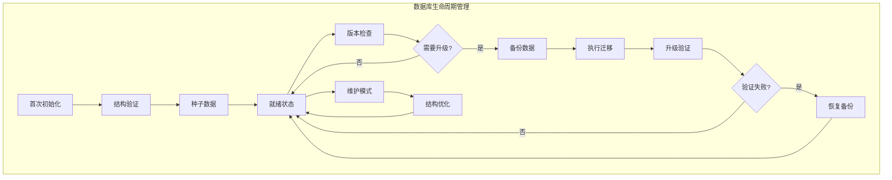

### 数据库初始化设计

#### 初始化接口架构

```mermaid
classDiagram
    class IDatabaseInitializer {
        <<interface>>
        +Task~InitializationResult~ InitializeAsync(InitializationOptions options, CancellationToken cancellationToken)
        +Task~bool~ IsDatabaseInitializedAsync(CancellationToken cancellationToken)
        +Task~DatabaseVersion~ GetCurrentVersionAsync(CancellationToken cancellationToken)
        +Task~HealthCheckResult~ CheckDatabaseHealthAsync(CancellationToken cancellationToken)
    }
    
    class ISchemaValidator {
        <<interface>>
        +Task~ValidationResult~ ValidateSchemaAsync(CancellationToken cancellationToken)
        +Task~IEnumerable~SchemaIssue~~ DetectSchemaIssuesAsync(CancellationToken cancellationToken)
        +Task~bool~ IsSchemaCompatibleAsync(DatabaseVersion targetVersion, CancellationToken cancellationToken)
    }
    
    class IDataSeeder {
        <<interface>>
        +Task~SeedResult~ SeedInitialDataAsync(SeedOptions options, CancellationToken cancellationToken)
        +Task~bool~ HasSeedDataAsync(string seedCategory, CancellationToken cancellationToken)
        +Task~SeedResult~ SeedDevelopmentDataAsync(CancellationToken cancellationToken)
        +Task~SeedResult~ SeedProductionDataAsync(CancellationToken cancellationToken)
    }
    
    class IMigrationManager {
        <<interface>>
        +Task~IEnumerable~Migration~~ GetPendingMigrationsAsync(CancellationToken cancellationToken)
        +Task~MigrationResult~ ExecuteMigrationAsync(Migration migration, CancellationToken cancellationToken)
        +Task~MigrationResult~ ExecuteMigrationsAsync(IEnumerable~Migration~ migrations, CancellationToken cancellationToken)
        +Task~bool~ RollbackMigrationAsync(string migrationId, CancellationToken cancellationToken)
        +Task~IEnumerable~Migration~~ GetMigrationHistoryAsync(CancellationToken cancellationToken)
    }
    
    class DatabaseInitializer {
        -IDatabaseProvider _provider
        -ISchemaValidator _validator
        -IDataSeeder _seeder
        -IMigrationManager _migrationManager
        -ILogger _logger
        +Task~InitializationResult~ InitializeAsync(InitializationOptions options, CancellationToken cancellationToken)
        +Task~bool~ IsDatabaseInitializedAsync(CancellationToken cancellationToken)
        +Task~DatabaseVersion~ GetCurrentVersionAsync(CancellationToken cancellationToken)
    }
    
    class CloudDatabaseInitializer {
        -ICloudDataProvider _cloudProvider
        -IDatabaseInitializer _baseInitializer
        +Task~InitializationResult~ InitializeCloudDatabaseAsync(CloudInitializationOptions options, CancellationToken cancellationToken)
        +Task~DatabaseInstanceInfo~ CreateDatabaseInstanceAsync(CloudInstanceOptions options, CancellationToken cancellationToken)
        +Task~bool~ ConfigureCloudSecurityAsync(SecurityOptions options, CancellationToken cancellationToken)
    }
    
    IDatabaseInitializer <|.. DatabaseInitializer
    DatabaseInitializer <|-- CloudDatabaseInitializer
    DatabaseInitializer --> ISchemaValidator
    DatabaseInitializer --> IDataSeeder
    DatabaseInitializer --> IMigrationManager
```

#### 初始化流程设计

**首次部署初始化流程**：

1. **环境检查阶段**
   - 验证数据库连接可用性
   - 检查数据库权限和配置
   - 验证云平台资源可用性
   - 检查依赖服务状态

2. **数据库创建阶段**
   - 创建数据库实例（如需要）
   - 设置数据库参数和配置
   - 配置安全策略和访问控制
   - 建立监控和日志记录

3. **结构初始化阶段**
   - 执行基础表结构创建
   - 创建索引和约束
   - 设置分区策略
   - 配置数据库特定功能

4. **数据初始化阶段**
   - 加载基础配置数据
   - 创建系统用户和角色
   - 初始化业务字典数据
   - 设置默认规则和策略

5. **验证和确认阶段**
   - 验证表结构正确性
   - 检查数据完整性
   - 测试基本功能可用性
   - 记录初始化状态

### 数据库升级机制设计

#### 迁移策略架构

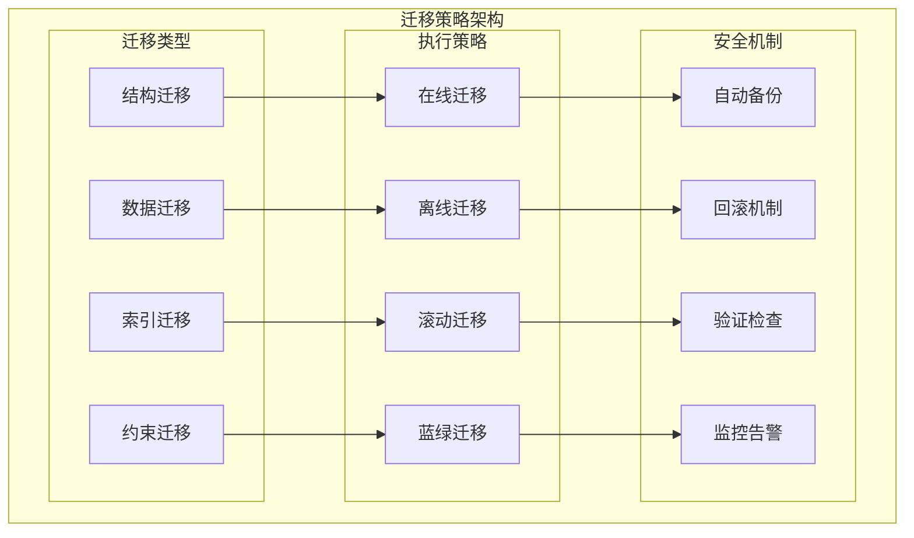

#### 版本管理设计

**版本号规范**：
- 使用语义化版本号：`主版本.次版本.修订版本.构建号`
- 主版本：不兼容的结构变更
- 次版本：向下兼容的功能新增
- 修订版本：向下兼容的问题修复
- 构建号：自动生成的唯一标识

**迁移脚本管理**：
```text
Migrations/
├── v1.0.0/                                        # 初始版本
│   ├── 001_CreateInitialTables.sql                # 创建基础表
│   ├── 002_CreateIndexes.sql                      # 创建索引
│   ├── 003_InsertSeedData.sql                     # 插入种子数据
│   └── Migration.json                             # 迁移元数据
├── v1.1.0/                                        # 功能版本
│   ├── 001_AddUserProfileTable.sql                # 新增用户画像表
│   ├── 002_UpdateCampaignTable.sql                # 更新活动表结构
│   ├── 003_MigrateExistingData.sql                # 迁移现有数据
│   └── Migration.json                             # 迁移元数据
├── v1.1.1/                                        # 修复版本
│   ├── 001_FixIndexConstraint.sql                 # 修复索引约束
│   ├── 002_UpdateDataTypes.sql                    # 更新数据类型
│   └── Migration.json                             # 迁移元数据
└── Scripts/                                       # 通用脚本
    ├── PreMigration/                               # 迁移前脚本
    ├── PostMigration/                              # 迁移后脚本
    └── Rollback/                                   # 回滚脚本
```

#### 自动化升级流程

**升级检测机制**：
- 应用启动时自动检查数据库版本
- 对比应用版本与数据库版本
- 识别需要执行的迁移脚本
- 评估迁移风险和影响范围

**升级执行策略**：

1. **安全性优先策略**
   - 执行迁移前自动备份
   - 验证迁移脚本语法正确性
   - 在测试数据库上预先验证
   - 支持迁移过程的事务控制

2. **可用性保障策略**
   - 支持在线迁移和离线迁移
   - 提供维护模式和只读模式
   - 实现分步骤迁移和断点续传
   - 监控迁移过程和性能影响

3. **一致性确保策略**
   - 跨节点的迁移同步机制
   - 主从数据库的一致性检查
   - 分布式环境下的协调机制
   - 迁移完成后的数据验证

### 云平台特定实现

#### 阿里云实现特点

**RDS自动迁移**：
- 集成阿里云RDS的迁移工具
- 支持RDS实例的自动创建和配置
- 利用RDS的备份和恢复功能
- 集成云监控和告警机制

**PolarDB集群管理**：
- 支持PolarDB集群的动态扩展
- 利用PolarDB的读写分离特性
- 集成PolarDB的全局一致性保证
- 支持PolarDB的快照和恢复

#### Azure实现特点

**SQL Database弹性**：
- 利用Azure SQL Database的弹性特性
- 支持自动缩放和性能调优
- 集成Azure的安全和合规功能
- 利用Azure的灾难恢复能力

**托管实例集成**：
- 支持Azure SQL托管实例的高级功能
- 集成Azure Active Directory认证
- 利用Azure的网络安全功能
- 支持跨区域的数据同步

#### AWS实现特点

**RDS多引擎支持**：
- 支持AWS RDS的多种数据库引擎
- 利用RDS的自动备份和恢复
- 集成RDS Performance Insights
- 支持RDS的读副本和故障转移

**Aurora集群优化**：
- 利用Aurora的全球数据库功能
- 支持Aurora的自动故障转移
- 集成Aurora的性能监控
- 利用Aurora的服务器less自动缩放

这种数据库初始化和升级机制确保了广告投放平台在整个生命周期中数据库结构的稳定演进，支持系统的持续部署和版本升级需求，同时保障数据的安全性和一致性。

## 数据库初始化和升级机制

### 数据库生命周期管理

数据库结构的管理是系统部署和维护的关键环节，需要支持首次部署时的初始化以及后续的结构升级。

#### 生命周期阶段设计


### 数据库初始化设计

#### 初始化接口架构


#### 初始化流程设计

**首次部署初始化流程**：

1. **环境检查阶段**
   - 验证数据库连接可用性
   - 检查数据库权限和配置
   - 验证云平台资源可用性
   - 检查依赖服务状态

2. **数据库创建阶段**
   - 创建数据库实例（如需要）
   - 设置数据库参数和配置
   - 配置安全策略和访问控制
   - 建立监控和日志记录

3. **结构初始化阶段**
   - 执行基础表结构创建
   - 创建索引和约束
   - 设置分区策略
   - 配置数据库特定功能

4. **数据初始化阶段**
   - 加载基础配置数据
   - 创建系统用户和角色
   - 初始化业务字典数据
   - 设置默认规则和策略

5. **验证和确认阶段**
   - 验证表结构正确性
   - 检查数据完整性
   - 测试基本功能可用性
   - 记录初始化状态

### 数据库升级机制设计

#### 迁移策略架构


#### 版本管理设计

**版本号规范**：
- 使用语义化版本号：`主版本.次版本.修订版本.构建号`
- 主版本：不兼容的结构变更
- 次版本：向下兼容的功能新增
- 修订版本：向下兼容的问题修复
- 构建号：自动生成的唯一标识

**迁移脚本管理**：
```text
Migrations/
├── v1.0.0/                                        # 初始版本
│   ├── 001_CreateInitialTables.sql                # 创建基础表
│   ├── 002_CreateIndexes.sql                      # 创建索引
│   ├── 003_InsertSeedData.sql                     # 插入种子数据
│   └── Migration.json                             # 迁移元数据
├── v1.1.0/                                        # 功能版本
│   ├── 001_AddUserProfileTable.sql                # 新增用户画像表
│   ├── 002_UpdateCampaignTable.sql                # 更新活动表结构
│   ├── 003_MigrateExistingData.sql                # 迁移现有数据
│   └── Migration.json                             # 迁移元数据
├── v1.1.1/                                        # 修复版本
│   ├── 001_FixIndexConstraint.sql                 # 修复索引约束
│   ├── 002_UpdateDataTypes.sql                    # 更新数据类型
│   └── Migration.json                             # 迁移元数据
└── Scripts/                                       # 通用脚本
    ├── PreMigration/                               # 迁移前脚本
    ├── PostMigration/                              # 迁移后脚本
    └── Rollback/                                   # 回滚脚本
```

#### 自动化升级流程

**升级检测机制**：
- 应用启动时自动检查数据库版本
- 对比应用版本与数据库版本
- 识别需要执行的迁移脚本
- 评估迁移风险和影响范围

**升级执行策略**：

1. **安全性优先策略**
   - 执行迁移前自动备份
   - 验证迁移脚本语法正确性
   - 在测试数据库上预先验证
   - 支持迁移过程的事务控制

2. **可用性保障策略**
   - 支持在线迁移和离线迁移
   - 提供维护模式和只读模式
   - 实现分步骤迁移和断点续传
   - 监控迁移过程和性能影响

3. **一致性确保策略**
   - 跨节点的迁移同步机制
   - 主从数据库的一致性检查
   - 分布式环境下的协调机制
   - 迁移完成后的数据验证

### 云平台特定实现

#### 阿里云实现特点

**RDS自动迁移**：
- 集成阿里云RDS的迁移工具
- 支持RDS实例的自动创建和配置
- 利用RDS的备份和恢复功能
- 集成云监控和告警机制

**PolarDB集群管理**：
- 支持PolarDB集群的动态扩展
- 利用PolarDB的读写分离特性
- 集成PolarDB的全局一致性保证
- 支持PolarDB的快照和恢复

#### Azure实现特点

**SQL Database弹性**：
- 利用Azure SQL Database的弹性特性
- 支持自动缩放和性能调优
- 集成Azure的安全和合规功能
- 利用Azure的灾难恢复能力

**托管实例集成**：
- 支持Azure SQL托管实例的高级功能
- 集成Azure Active Directory认证
- 利用Azure的网络安全功能
- 支持跨区域的数据同步

#### AWS实现特点

**RDS多引擎支持**：
- 支持AWS RDS的多种数据库引擎
- 利用RDS的自动备份和恢复
- 集成RDS Performance Insights
- 支持RDS的读副本和故障转移

**Aurora集群优化**：
- 利用Aurora的全球数据库功能
- 支持Aurora的自动故障转移
- 集成Aurora的性能监控
- 利用Aurora的服务器less自动缩放

这种数据库初始化和升级机制确保了广告投放平台在整个生命周期中数据库结构的稳定演进，支持系统的持续部署和版本升级需求，同时保障数据的安全性和一致性。

## 数据一致性和事务管理

#### 统一抽象接口下的事务协调

基于统一的`IDataAccessProvider`接口，事务管理也需要通过元数据和路由机制实现：

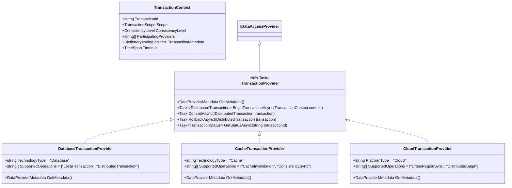

**事务提供者元数据配置**：

```text
事务管理配置
├── TransactionProviders
│   ├── DatabaseTransaction:
│   │   ├── ProviderId: "DatabaseTransactionProvider_v1.0"
│   │   ├── TechnologyType: "Database"
│   │   ├── SupportedScopes: ["Local", "Distributed"]
│   │   ├── IsolationLevels: ["ReadCommitted", "Snapshot"]
│   │   └── MaxTimeout: "00:05:00"
│   ├── CacheTransaction:
│   │   ├── ProviderId: "CacheTransactionProvider_v1.0" 
│   │   ├── TechnologyType: "Cache"
│   │   ├── SupportedOperations: ["Invalidation", "ConsistencyCheck"]
│   │   └── ConsistencyModel: "Eventual"
│   └── CloudTransaction:
│       ├── ProviderId: "CloudTransactionProvider_v1.0"
│       ├── PlatformType: "Multi"
│       ├── SupportedPatterns: ["Saga", "TwoPhaseCommit"]
│       └── CrossRegionSupport: true
├── TransactionPolicies
│   ├── BusinessEntity:
│   │   ├── Advertisement: "LocalDatabase"
│   │   ├── UserProfile: "EventualConsistency"
│   │   ├── Targeting: "StrongConsistency"
│   │   └── Delivery: "DistributedTransaction"
│   ├── OperationType:
│   │   ├── Read: "NoTransaction"
│   │   ├── Write: "LocalTransaction"
│   │   ├── Batch: "DistributedTransaction"
│   │   └── Critical: "StrongConsistency"
│   └── ConsistencyLevels:
│       ├── Strong: ["Database", "Cache"]
│       ├── Eventual: ["Cache"]
│       ├── Session: ["Database"]
│       └── Bounded: ["Cache", "Database"]
└── FailureHandling
    ├── RetryPolicy:
    │   ├── MaxAttempts: 3
    │   ├── BackoffStrategy: "Exponential"
    │   └── RetryableErrors: [...]
    ├── CompensationActions:
    │   ├── CacheRollback: true
    │   ├── EventPublishing: true
    │   └── AuditLogging: true
    └── CircuitBreaker:
        ├── FailureThreshold: 10
        ├── RecoveryTimeout: "00:01:00"
        └── HalfOpenRetryCount: 3
```

#### 分布式数据一致性策略

**一致性级别与提供者映射**：

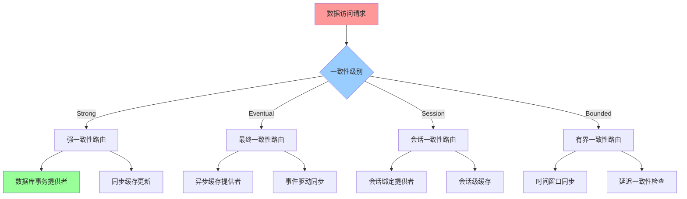

这种基于统一抽象接口的事务管理设计确保了：

**元数据驱动的事务选择**：
- 根据业务实体、操作类型、一致性要求选择合适的事务提供者
- 支持多种事务模式（本地事务、分布式事务、补偿事务）
- 实现跨缓存、数据库、云平台的事务协调

**配置驱动的一致性策略**：
- 业务实体级别的一致性要求配置
- 操作类型级别的事务策略配置
- 动态调整一致性级别和性能权衡

**智能故障恢复机制**：
- 自动重试和指数退避策略
- 补偿动作和事务回滚机制
- 熔断器和故障隔离保护