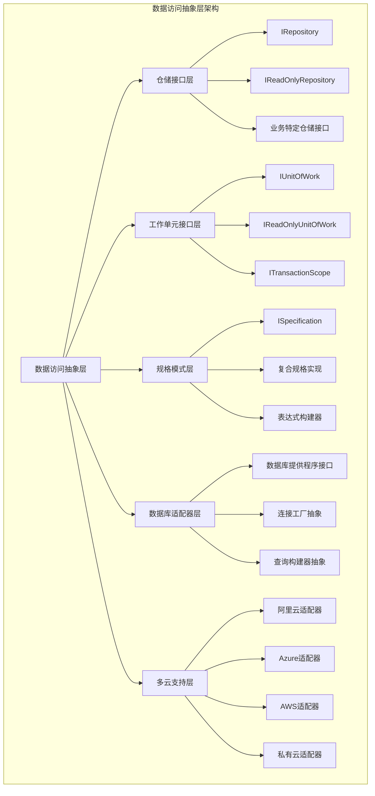
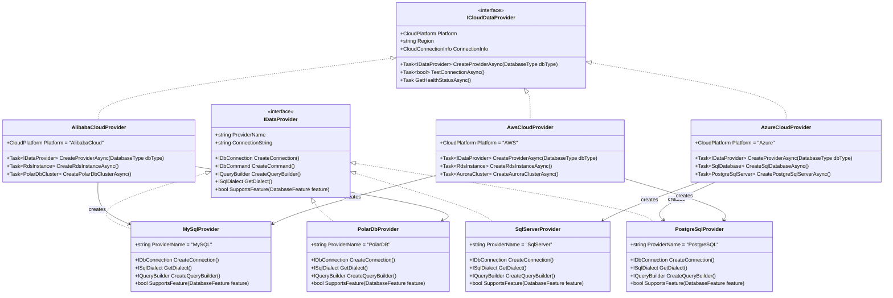
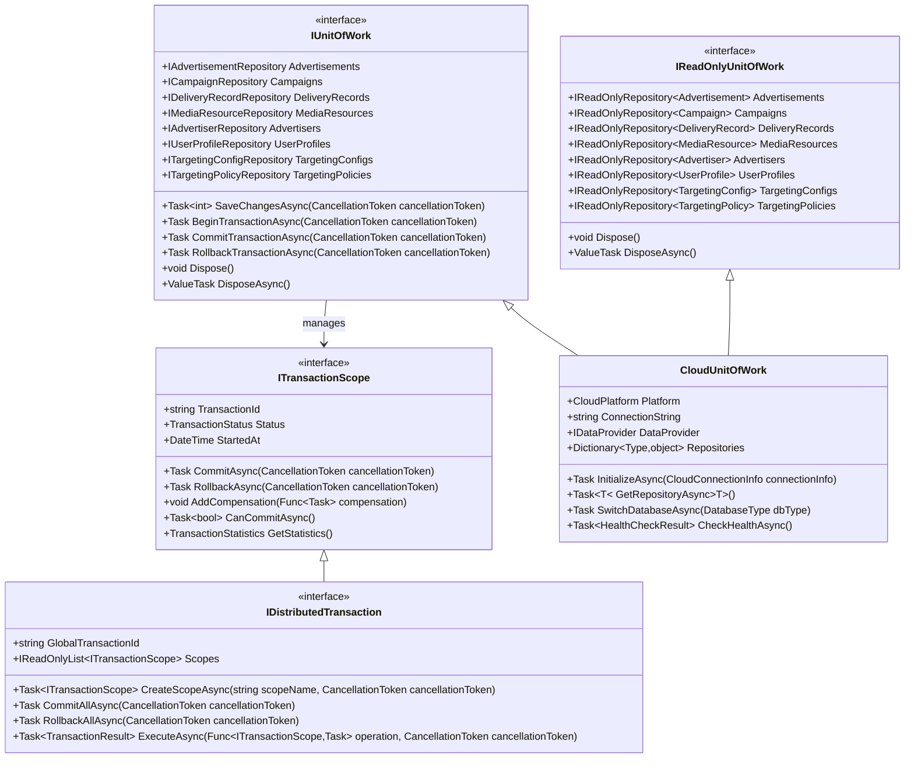
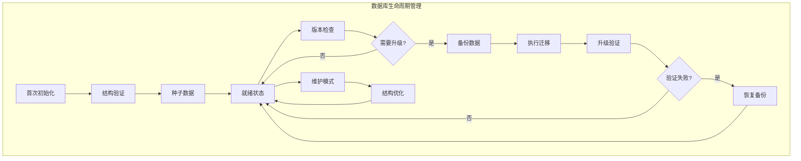
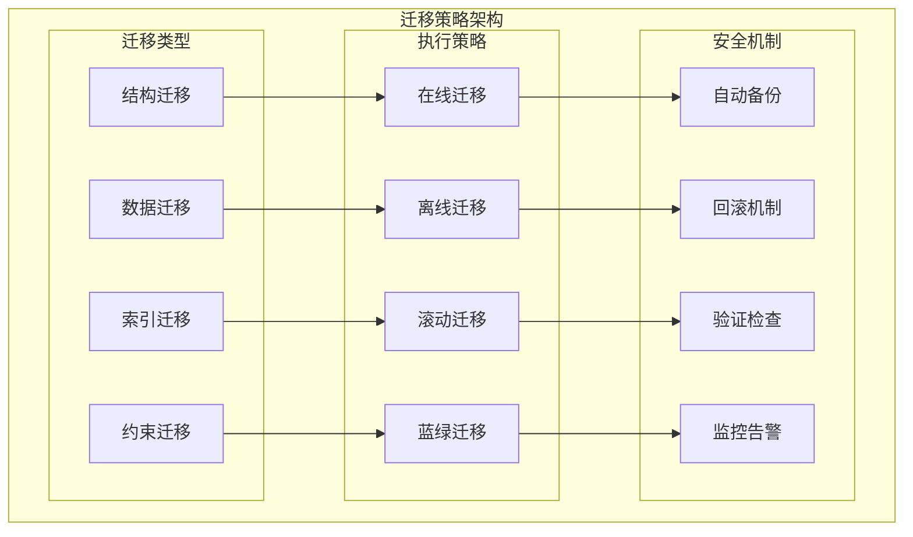

# 数据访问层技术设计

## 设计概述

广告投放平台数据访问层采用多云支持和数据库无关的架构设计，通过仓储模式(Repository Pattern)和工作单元模式(Unit of Work Pattern)实现数据访问的抽象化。该设计支持SQL Server、MySQL、PostgreSQL、PolarDB等多种关系型数据库，以及Redis、MongoDB、InfluxDB等NoSQL数据库，确保系统在不同云平台间的无缝迁移和扩展。

### 系统架构总览



## 架构设计原则

### 核心设计原则
- **数据库无关性**：通过抽象层实现数据库厂商解耦，支持运行时切换
- **多云平台支持**：统一的数据访问接口，适配不同云平台的数据库服务
- **读写分离**：明确区分读写操作，支持读写分离和查询优化
- **事务一致性**：确保业务操作的ACID特性和分布式事务支持
- **性能优化**：内置缓存、批量操作、连接池等性能优化机制
- **安全防护**：参数化查询、访问控制、审计日志等安全保障

### 技术架构约束
- 仓储模式：所有数据访问通过仓储接口，避免直接数据库访问
- 工作单元模式：确保事务边界和数据一致性
- 规格模式：复杂查询条件的可重用和可组合
- 依赖注入：通过DI容器管理数据访问组件的生命周期
- 异步优先：所有数据库操作采用异步模式，提高系统吞吐量

## 多云数据库支持架构

### 数据库提供程序设计

基于系统整体技术架构要求，支持多种数据库和多云平台部署：



### 云平台配置和连接管理

**多云架构独立性设计**：
- 云平台抽象接口（`Lorn.ADSP.Infrastructure.Cloud.Abstractions`）作为独立项目，定义统一的云服务接口
- 每个云平台实现独立项目，避免单一部署包含多云代码：
  - `Lorn.ADSP.Infrastructure.Cloud.AlibabaCloud` - 阿里云独立实现
  - `Lorn.ADSP.Infrastructure.Cloud.Azure` - Azure云独立实现
  - `Lorn.ADSP.Infrastructure.Cloud.AWS` - AWS云独立实现
- 通过NuGet包管理和依赖注入实现运行时云平台选择
- 每个部署环境只包含当前所需的云平台实现，减少依赖和部署包大小

**配置设计指导**：
- 支持多云配置文件管理，包含连接字符串、认证信息、区域设置等
- 提供连接池管理和故障转移机制
- 实现云平台特定的监控和日志集成
- 通过配置文件指定当前部署使用的云平台类型

**连接字符串管理**：
- 支持Azure Key Vault、AWS Secrets Manager、阿里云KMS等密钥管理服务
- 提供连接字符串的加密存储和动态解密
- 支持不同环境（开发、测试、生产）的配置隔离
- 实现连接字符串的版本管理和回滚机制

**部署策略优势**：
- **减少依赖复杂性**：每个部署环境只包含必要的云平台实现
- **提高安全性**：避免在同一部署中暴露多个云平台的认证信息
- **优化性能**：减少不必要的依赖加载，提高应用启动性能
- **简化运维**：每个云平台的配置和监控独立管理，便于故障排查

## 仓储接口设计

### 基础仓储接口架构

基于数据模型分层设计中定义的实体，设计相应的仓储接口：

```mermaid
classDiagram
    class IReadOnlyRepository~T~ {
        <<interface>>
        +Task~T~ GetByIdAsync(object id, CancellationToken cancellationToken)
        +Task~IEnumerable~T~~ GetAllAsync(CancellationToken cancellationToken)
        +Task~IEnumerable~T~~ FindAsync(ISpecification~T~ specification, CancellationToken cancellationToken)
        +Task~PagedResult~T~~ GetPagedAsync(ISpecification~T~ specification, int pageIndex, int pageSize, CancellationToken cancellationToken)
        +Task~int~ CountAsync(ISpecification~T~ specification, CancellationToken cancellationToken)
        +Task~bool~ ExistsAsync(ISpecification~T~ specification, CancellationToken cancellationToken)
        +Task~TResult~ AggregateAsync~TResult~(IAggregateSpecification~T,TResult~ specification, CancellationToken cancellationToken)
    }
    
    class IRepository~T~ {
        <<interface>>
        +Task~T~ AddAsync(T entity, CancellationToken cancellationToken)
        +Task~IEnumerable~T~~ AddRangeAsync(IEnumerable~T~ entities, CancellationToken cancellationToken)
        +Task UpdateAsync(T entity, CancellationToken cancellationToken)
        +Task UpdateRangeAsync(IEnumerable~T~ entities, CancellationToken cancellationToken)
        +Task DeleteAsync(T entity, CancellationToken cancellationToken)
        +Task DeleteRangeAsync(IEnumerable~T~ entities, CancellationToken cancellationToken)
        +Task~int~ DeleteAsync(ISpecification~T~ specification, CancellationToken cancellationToken)
        +Task~int~ BulkUpdateAsync(ISpecification~T~ specification, object updateValues, CancellationToken cancellationToken)
    }
    
    class IAdvertisementRepository {
        <<interface>>
        +Task~IEnumerable~Advertisement~~ GetActiveAdvertisementsAsync(CancellationToken cancellationToken)
        +Task~IEnumerable~Advertisement~~ GetByStatusAsync(AdStatus status, CancellationToken cancellationToken)
        +Task~Advertisement~ GetWithCampaignsAsync(int id, CancellationToken cancellationToken)
        +Task~Advertisement~ GetWithCreativesAsync(int id, CancellationToken cancellationToken)
        +Task~bool~ HasActiveCampaignsAsync(int advertisementId, CancellationToken cancellationToken)
        +Task~IEnumerable~Advertisement~~ GetMatchingAdvertisementsAsync(TargetingCriteria criteria, CancellationToken cancellationToken)
        +Task~IEnumerable~Advertisement~~ GetByAdvertiserIdAsync(int advertiserId, CancellationToken cancellationToken)
        +Task~Advertisement~ GetWithAuditHistoryAsync(int id, CancellationToken cancellationToken)
    }
    
    class ICampaignRepository {
        <<interface>>
        +Task~IEnumerable~Campaign~~ GetByAdvertisementIdAsync(int advertisementId, CancellationToken cancellationToken)
        +Task~IEnumerable~Campaign~~ GetActiveCampaignsAsync(CancellationToken cancellationToken)
        +Task~IEnumerable~Campaign~~ GetByStatusAsync(CampaignStatus status, CancellationToken cancellationToken)
        +Task~Campaign~ GetWithDeliveryRecordsAsync(int id, CancellationToken cancellationToken)
        +Task~decimal~ GetTotalSpentAsync(int campaignId, CancellationToken cancellationToken)
        +Task~decimal~ GetDailySpentAsync(int campaignId, DateTime date, CancellationToken cancellationToken)
        +Task~IEnumerable~Campaign~~ GetBudgetExceededCampaignsAsync(CancellationToken cancellationToken)
        +Task~bool~ UpdateBudgetAsync(int campaignId, decimal spentAmount, CancellationToken cancellationToken)
        +Task~IEnumerable~Campaign~~ GetByTargetingConfigAsync(TargetingConfig config, CancellationToken cancellationToken)
    }
    
    class IDeliveryRecordRepository {
        <<interface>>
        +Task~IEnumerable~DeliveryRecord~~ GetByCampaignIdAsync(int campaignId, CancellationToken cancellationToken)
        +Task~IEnumerable~DeliveryRecord~~ GetByDateRangeAsync(DateTime startDate, DateTime endDate, CancellationToken cancellationToken)
        +Task~IEnumerable~DeliveryRecord~~ GetByMediaResourceIdAsync(int mediaResourceId, CancellationToken cancellationToken)
        +Task~DeliveryStatistics~ GetStatisticsAsync(int campaignId, DateTime startDate, DateTime endDate, CancellationToken cancellationToken)
        +Task~IEnumerable~DeliveryRecord~~ GetTopPerformingRecordsAsync(int count, CancellationToken cancellationToken)
        +Task BulkInsertAsync(IEnumerable~DeliveryRecord~ records, CancellationToken cancellationToken)
        +Task~decimal~ CalculateTotalCostAsync(int campaignId, DateTime date, CancellationToken cancellationToken)
        +Task~IEnumerable~DeliveryRecord~~ GetByUserIdAsync(string userId, DateTime fromDate, CancellationToken cancellationToken)
    }
    
    class IAdvertiserRepository {
        <<interface>>
        +Task~IEnumerable~Advertiser~~ GetByStatusAsync(AdvertiserStatus status, CancellationToken cancellationToken)
        +Task~Advertiser~ GetWithAdvertisementsAsync(int id, CancellationToken cancellationToken)
        +Task~IEnumerable~Advertiser~~ GetByRegistrationDateAsync(DateTime fromDate, DateTime toDate, CancellationToken cancellationToken)
        +Task~bool~ EmailExistsAsync(string email, CancellationToken cancellationToken)
        +Task~Advertiser~ GetByEmailAsync(string email, CancellationToken cancellationToken)
        +Task~IEnumerable~Advertiser~~ SearchByCompanyNameAsync(string companyName, CancellationToken cancellationToken)
    }
    
    class IMediaResourceRepository {
        <<interface>>
        +Task~IEnumerable~MediaResource~~ GetByTypeAsync(MediaType type, CancellationToken cancellationToken)
        +Task~IEnumerable~MediaResource~~ GetByPublisherIdAsync(int publisherId, CancellationToken cancellationToken)
        +Task~IEnumerable~MediaResource~~ GetAvailableInventoryAsync(DateTime fromDate, DateTime toDate, CancellationToken cancellationToken)
        +Task~MediaResource~ GetWithTrafficProfileAsync(int id, CancellationToken cancellationToken)
        +Task~IEnumerable~MediaResource~~ GetByAdSlotConfigurationAsync(AdSlotConfiguration config, CancellationToken cancellationToken)
        +Task~int~ GetInventoryCountAsync(int mediaResourceId, DateTime date, CancellationToken cancellationToken)
    }
    
    class IUserProfileRepository {
        <<interface>>
        +Task~UserProfile~ GetByUserIdAsync(string userId, CancellationToken cancellationToken)
        +Task~IEnumerable~UserProfile~~ GetBySegmentIdAsync(string segmentId, CancellationToken cancellationToken)
        +Task~IEnumerable~UserProfile~~ GetByInterestsAsync(List~string~ interests, CancellationToken cancellationToken)
        +Task~IEnumerable~UserProfile~~ GetByBehaviorsAsync(List~string~ behaviors, CancellationToken cancellationToken)
        +Task~bool~ HasUserProfileAsync(string userId, CancellationToken cancellationToken)
        +Task UpdateInterestsAsync(string userId, List~string~ interests, CancellationToken cancellationToken)
        +Task MergeProfilesAsync(string primaryUserId, string secondaryUserId, CancellationToken cancellationToken)
        +Task~IEnumerable~UserProfile~~ GetTargetAudienceAsync(TargetingConfig config, CancellationToken cancellationToken)
    }
    
    class ITargetingConfigRepository {
        <<interface>>
        +Task~TargetingConfig~ GetByCampaignIdAsync(string campaignId, CancellationToken cancellationToken)
        +Task~IEnumerable~TargetingConfig~~ GetBySourcePolicyIdAsync(string policyId, CancellationToken cancellationToken)
        +Task~TargetingConfig~ GetWithCriteriaAsync(string configId, CancellationToken cancellationToken)
        +Task~bool~ HasConfigAsync(string campaignId, CancellationToken cancellationToken)
        +Task UpdateCriteriaAsync(string configId, Dictionary~string,ITargetingCriteria~ criteria, CancellationToken cancellationToken)
        +Task~IEnumerable~TargetingConfig~~ GetActiveConfigsAsync(CancellationToken cancellationToken)
    }
    
    class ITargetingPolicyRepository {
        <<interface>>
        +Task~IEnumerable~TargetingPolicy~~ GetPublicPoliciesAsync(CancellationToken cancellationToken)
        +Task~IEnumerable~TargetingPolicy~~ GetByCategoryAsync(string category, CancellationToken cancellationToken)
        +Task~IEnumerable~TargetingPolicy~~ GetByCreatedByAsync(string createdBy, CancellationToken cancellationToken)
        +Task~TargetingPolicy~ GetWithUsageStatsAsync(string policyId, CancellationToken cancellationToken)
        +Task~IEnumerable~TargetingPolicy~~ SearchByTagsAsync(List~string~ tags, CancellationToken cancellationToken)
        +Task~bool~ IsPolicyInUseAsync(string policyId, CancellationToken cancellationToken)
        +Task~PolicyUsageStats~ GetUsageStatisticsAsync(string policyId, CancellationToken cancellationToken)
    }
    
    IReadOnlyRepository~T~ <|-- IRepository~T~
    IRepository~Advertisement~ <|-- IAdvertisementRepository
    IRepository~Campaign~ <|-- ICampaignRepository
    IRepository~DeliveryRecord~ <|-- IDeliveryRecordRepository
    IRepository~Advertiser~ <|-- IAdvertiserRepository
    IRepository~MediaResource~ <|-- IMediaResourceRepository
    IRepository~UserProfile~ <|-- IUserProfileRepository
    IRepository~TargetingConfig~ <|-- ITargetingConfigRepository
    IRepository~TargetingPolicy~ <|-- ITargetingPolicyRepository
```



### 接口设计说明

**泛型基础接口**：
- `IReadOnlyRepository<T>`：提供只读数据访问操作，支持查询、分页、聚合等
- `IRepository<T>`：继承只读接口，增加增删改操作和批量处理能力
- 支持规格模式进行复杂查询条件的组合和重用
- 内置分页支持，优化大数据集的处理性能

**业务特定接口**：
- 继承基础泛型接口，添加业务领域特定的查询方法
- 根据数据模型分层设计中的实体关系，提供关联查询方法
- 支持复杂的业务查询，如预算计算、统计分析、匹配查询等
- 提供批量操作优化，如批量插入投放记录、批量更新预算状态

**异步设计**：
- 所有数据库操作都采用异步模式，提高系统吞吐量
- 支持CancellationToken，提供操作取消和超时控制
- 异步批量操作，减少数据库连接时间和网络开销

## 工作单元接口设计

### 工作单元架构设计



### 事务管理和一致性设计

**事务边界管理**：
- 支持本地事务和分布式事务的统一接口
- 提供事务嵌套和保存点机制
- 实现事务超时和死锁检测
- 支持事务的补偿操作和回滚策略

**分布式事务支持**：
- 基于Saga模式实现最终一致性
- 支持两阶段提交（2PC）的分布式事务
- 提供事务协调器和参与者的标准接口
- 实现分布式事务的监控和恢复机制

**并发控制策略**：
- 乐观并发控制：基于版本号或时间戳
- 悲观并发控制：基于行锁或表锁
- 读写分离：查询操作路由到只读副本
- 连接池管理：优化数据库连接的使用效率

## 规格模式设计

### 规格接口和实现架构


### 规格模式应用场景

**查询条件组合**：
- 支持And、Or、Not等逻辑组合操作
- 提供类型安全的表达式构建
- 支持动态查询条件的构建和组合
- 实现查询条件的重用和维护

**复杂业务查询**：
- 广告匹配查询：根据用户画像和定向条件筛选广告
- 预算控制查询：查找预算即将耗尽或已超支的活动
- 性能分析查询：根据效果指标筛选高性能投放记录
- 用户分群查询：根据多维度条件筛选目标用户群体

**分页和排序**：
- 内置分页支持，优化大数据集的查询性能
- 支持多字段排序和自定义排序逻辑
- 提供排序缓存和索引优化建议
- 支持游标分页和偏移分页两种模式

## 数据访问实现架构

### 项目组织结构

基于系统整体技术架构，数据访问层的项目组织如下：

```text
05.Infrastructure/
├── Lorn.ADSP.Infrastructure.Data.Abstractions/     # 数据访问抽象层
│   ├── Interfaces/                                 # 仓储和工作单元接口
│   │   ├── IRepository.cs
│   │   ├── IUnitOfWork.cs
│   │   ├── ISpecification.cs
│   │   └── IDataProvider.cs
│   ├── Models/                                     # 数据传输模型
│   │   ├── PagedResult.cs
│   │   ├── ConnectionInfo.cs
│   │   └── QueryOptions.cs
│   ├── Specifications/                             # 规格模式基类
│   │   ├── BaseSpecification.cs
│   │   └── SpecificationExtensions.cs
│   └── Enums/                                      # 数据访问相关枚举
│       ├── DatabaseType.cs
│       ├── CloudPlatform.cs
│       └── TransactionStatus.cs
│
├── Lorn.ADSP.Infrastructure.Data.SqlServer/        # SQL Server实现
│   ├── Repositories/                               # SQL Server仓储实现
│   │   ├── SqlServerRepository.cs
│   │   ├── AdvertisementRepository.cs
│   │   ├── CampaignRepository.cs
│   │   └── ...
│   ├── UnitOfWork/                                 # SQL Server工作单元
│   │   └── SqlServerUnitOfWork.cs
│   ├── DbContext/                                  # EF Core上下文
│   │   ├── AdPlatformDbContext.cs
│   │   └── ReadOnlyDbContext.cs
│   ├── Configurations/                             # 实体配置
│   │   ├── AdvertisementConfiguration.cs
│   │   ├── CampaignConfiguration.cs
│   │   └── ...
│   ├── Migrations/                                 # 数据库迁移
│   │   ├── Initial/                                # 初始迁移
│   │   ├── Scripts/                                # 迁移脚本
│   │   └── Seed/                                   # 种子数据
│   └── Initialization/                             # 数据库初始化
│       ├── DatabaseInitializer.cs
│       ├── SchemaValidator.cs
│       └── DataSeeder.cs
│
├── Lorn.ADSP.Infrastructure.Data.MySQL/            # MySQL实现
│   ├── Repositories/                               # MySQL仓储实现
│   ├── UnitOfWork/                                 # MySQL工作单元
│   ├── DbContext/                                  # MySQL上下文
│   ├── Configurations/                             # 实体配置
│   ├── Migrations/                                 # 数据库迁移
│   │   ├── Initial/                                # 初始迁移
│   │   ├── Scripts/                                # 迁移脚本
│   │   └── Seed/                                   # 种子数据
│   └── Initialization/                             # 数据库初始化
│       ├── DatabaseInitializer.cs
│       ├── SchemaValidator.cs
│       └── DataSeeder.cs
│
├── Lorn.ADSP.Infrastructure.Data.PostgreSQL/       # PostgreSQL实现
│   ├── Repositories/                               # PostgreSQL仓储实现
│   ├── UnitOfWork/                                 # PostgreSQL工作单元
│   ├── DbContext/                                  # PostgreSQL上下文
│   ├── Configurations/                             # 实体配置
│   ├── Migrations/                                 # 数据库迁移
│   │   ├── Initial/                                # 初始迁移
│   │   ├── Scripts/                                # 迁移脚本
│   │   └── Seed/                                   # 种子数据
│   └── Initialization/                             # 数据库初始化
│       ├── DatabaseInitializer.cs
│       ├── SchemaValidator.cs
│       └── DataSeeder.cs
│
├── Lorn.ADSP.Infrastructure.Data.PolarDB/          # PolarDB实现
│   ├── Repositories/                               # PolarDB仓储实现
│   ├── UnitOfWork/                                 # PolarDB工作单元
│   ├── DbContext/                                  # PolarDB上下文
│   ├── Configurations/                             # 实体配置
│   ├── Migrations/                                 # 数据库迁移
│   │   ├── Initial/                                # 初始迁移
│   │   ├── Scripts/                                # 迁移脚本
│   │   └── Seed/                                   # 种子数据
│   └── Initialization/                             # 数据库初始化
│       ├── DatabaseInitializer.cs
│       ├── SchemaValidator.cs
│       └── DataSeeder.cs
│
├── Lorn.ADSP.Infrastructure.Cloud.Abstractions/    # 云服务抽象接口（独立项目）
│   ├── Interfaces/                                 # 云平台抽象接口
│   │   ├── ICloudDataProvider.cs
│   │   ├── ICloudConnectionFactory.cs
│   │   ├── ICloudHealthChecker.cs
│   │   └── ICloudDatabaseInitializer.cs
│   ├── Models/                                     # 云服务数据模型
│   │   ├── CloudConnectionInfo.cs
│   │   ├── DatabaseInstanceInfo.cs
│   │   └── HealthCheckResult.cs
│   └── Enums/                                      # 云平台相关枚举
│       ├── CloudPlatform.cs
│       ├── DatabaseEngineType.cs
│       └── InstanceStatus.cs
│
├── Lorn.ADSP.Infrastructure.Cloud.AlibabaCloud/    # 阿里云实现（独立项目）
│   ├── Providers/                                  # 阿里云数据库提供程序
│   │   ├── AlibabaCloudProvider.cs
│   │   ├── RdsDataProvider.cs
│   │   └── PolarDbDataProvider.cs
│   ├── Services/                                   # 阿里云特定服务
│   │   ├── RdsManagementService.cs
│   │   ├── PolarDbManagementService.cs
│   │   └── OssStorageService.cs
│   ├── Configuration/                              # 阿里云配置管理
│   │   ├── AlibabaCloudConfiguration.cs
│   │   └── DatabaseConfiguration.cs
│   └── Initialization/                             # 阿里云数据库初始化
│       ├── AlibabaCloudDatabaseInitializer.cs
│       └── RdsSchemaDeployer.cs
│
├── Lorn.ADSP.Infrastructure.Cloud.Azure/           # Azure云实现（独立项目）
│   ├── Providers/                                  # Azure数据库提供程序
│   │   ├── AzureCloudProvider.cs
│   │   ├── SqlDatabaseProvider.cs
│   │   └── PostgreSqlProvider.cs
│   ├── Services/                                   # Azure特定服务
│   │   ├── SqlDatabaseManagementService.cs
│   │   ├── PostgreSqlManagementService.cs
│   │   └── BlobStorageService.cs
│   ├── Configuration/                              # Azure配置管理
│   │   ├── AzureConfiguration.cs
│   │   └── DatabaseConfiguration.cs
│   └── Initialization/                             # Azure数据库初始化
│       ├── AzureDatabaseInitializer.cs
│       └── SqlDatabaseSchemaDeployer.cs
│
└── Lorn.ADSP.Infrastructure.Cloud.AWS/             # AWS云实现（独立项目）
    ├── Providers/                                  # AWS数据库提供程序
    │   ├── AwsCloudProvider.cs
    │   ├── RdsDataProvider.cs
    │   └── AuroraDataProvider.cs
    ├── Services/                                   # AWS特定服务
    │   ├── RdsManagementService.cs
    │   ├── AuroraManagementService.cs
    │   └── S3StorageService.cs
    ├── Configuration/                              # AWS配置管理
    │   ├── AwsConfiguration.cs
    │   └── DatabaseConfiguration.cs
    └── Initialization/                             # AWS数据库初始化
        ├── AwsDatabaseInitializer.cs
        └── RdsSchemaDeployer.cs
```

### 依赖注入配置设计

**服务注册架构**：
- 在`Lorn.ADSP.Infrastructure.Data.Abstractions`项目中提供扩展方法
- 支持根据配置动态选择数据库提供程序
- 实现仓储和工作单元的自动注册
- 提供健康检查和监控集成

**配置管理设计**：
- 支持多环境配置文件（开发、测试、生产）
- 提供连接字符串的加密和安全管理
- 支持配置热更新和动态切换数据库
- 实现配置验证和错误处理机制

**实现指导原则**：
- 程序员在相应的实现项目中创建具体的仓储类
- 继承基础仓储类并实现业务特定接口
- 使用Entity Framework Core或Dapper等ORM工具
- 遵循异步编程模式和错误处理规范
- 实现单元测试和集成测试覆盖

## 性能优化和监控

### 查询性能优化策略

**索引设计和优化**：
- 基于查询模式设计覆盖索引和复合索引
- 支持分区表和表分片的索引策略
- 提供索引使用情况监控和优化建议
- 实现索引维护和重建的自动化管理

**查询优化技术**：
- 使用查询计划缓存和参数化查询
- 实现查询结果缓存和智能失效策略
- 支持读写分离和查询路由优化
- 提供慢查询检测和性能分析工具

**批量操作优化**：
- 使用批量插入、更新、删除操作
- 实现分批处理和并行执行策略
- 支持数据导入导出的性能优化
- 提供大数据量操作的进度监控

### 监控和诊断机制

**性能监控体系**：
- 数据库连接池使用情况监控
- 查询执行时间和频率统计
- 事务持续时间和成功率监控
- 数据库资源使用情况跟踪

**健康检查机制**：
- 数据库连接可用性检查
- 主从复制延迟监控
- 磁盘空间和性能指标检查
- 云服务健康状态监控

**故障诊断工具**：
- 慢查询日志分析和优化建议
- 死锁检测和解决方案推荐
- 数据一致性检查和修复工具
- 备份恢复验证和测试机制

这种数据访问层设计为广告投放平台提供了强大的数据访问能力，确保系统在不同云平台和数据库环境下的高性能、高可用和高扩展性。

## 数据库初始化和升级机制

### 数据库生命周期管理

数据库结构的管理是系统部署和维护的关键环节，需要支持首次部署时的初始化以及后续的结构升级。

#### 生命周期阶段设计



### 数据库初始化设计

#### 初始化接口架构


#### 初始化流程设计

**首次部署初始化流程**：

1. **环境检查阶段**
   - 验证数据库连接可用性
   - 检查数据库权限和配置
   - 验证云平台资源可用性
   - 检查依赖服务状态

2. **数据库创建阶段**
   - 创建数据库实例（如需要）
   - 设置数据库参数和配置
   - 配置安全策略和访问控制
   - 建立监控和日志记录

3. **结构初始化阶段**
   - 执行基础表结构创建
   - 创建索引和约束
   - 设置分区策略
   - 配置数据库特定功能

4. **数据初始化阶段**
   - 加载基础配置数据
   - 创建系统用户和角色
   - 初始化业务字典数据
   - 设置默认规则和策略

5. **验证和确认阶段**
   - 验证表结构正确性
   - 检查数据完整性
   - 测试基本功能可用性
   - 记录初始化状态

### 数据库升级机制设计

#### 迁移策略架构



#### 版本管理设计

**版本号规范**：
- 使用语义化版本号：`主版本.次版本.修订版本.构建号`
- 主版本：不兼容的结构变更
- 次版本：向下兼容的功能新增
- 修订版本：向下兼容的问题修复
- 构建号：自动生成的唯一标识

**迁移脚本管理**：
```text
Migrations/
├── v1.0.0/                                        # 初始版本
│   ├── 001_CreateInitialTables.sql                # 创建基础表
│   ├── 002_CreateIndexes.sql                      # 创建索引
│   ├── 003_InsertSeedData.sql                     # 插入种子数据
│   └── Migration.json                             # 迁移元数据
├── v1.1.0/                                        # 功能版本
│   ├── 001_AddUserProfileTable.sql                # 新增用户画像表
│   ├── 002_UpdateCampaignTable.sql                # 更新活动表结构
│   ├── 003_MigrateExistingData.sql                # 迁移现有数据
│   └── Migration.json                             # 迁移元数据
├── v1.1.1/                                        # 修复版本
│   ├── 001_FixIndexConstraint.sql                 # 修复索引约束
│   ├── 002_UpdateDataTypes.sql                    # 更新数据类型
│   └── Migration.json                             # 迁移元数据
└── Scripts/                                       # 通用脚本
    ├── PreMigration/                               # 迁移前脚本
    ├── PostMigration/                              # 迁移后脚本
    └── Rollback/                                   # 回滚脚本
```

#### 自动化升级流程

**升级检测机制**：
- 应用启动时自动检查数据库版本
- 对比应用版本与数据库版本
- 识别需要执行的迁移脚本
- 评估迁移风险和影响范围

**升级执行策略**：

1. **安全性优先策略**
   - 执行迁移前自动备份
   - 验证迁移脚本语法正确性
   - 在测试数据库上预先验证
   - 支持迁移过程的事务控制

2. **可用性保障策略**
   - 支持在线迁移和离线迁移
   - 提供维护模式和只读模式
   - 实现分步骤迁移和断点续传
   - 监控迁移过程和性能影响

3. **一致性确保策略**
   - 跨节点的迁移同步机制
   - 主从数据库的一致性检查
   - 分布式环境下的协调机制
   - 迁移完成后的数据验证

### 云平台特定实现

#### 阿里云实现特点

**RDS自动迁移**：
- 集成阿里云RDS的迁移工具
- 支持RDS实例的自动创建和配置
- 利用RDS的备份和恢复功能
- 集成云监控和告警机制

**PolarDB集群管理**：
- 支持PolarDB集群的动态扩展
- 利用PolarDB的读写分离特性
- 集成PolarDB的全局一致性保证
- 支持PolarDB的快照和恢复

#### Azure实现特点

**SQL Database弹性**：
- 利用Azure SQL Database的弹性特性
- 支持自动缩放和性能调优
- 集成Azure的安全和合规功能
- 利用Azure的灾难恢复能力

**托管实例集成**：
- 支持Azure SQL托管实例的高级功能
- 集成Azure Active Directory认证
- 利用Azure的网络安全功能
- 支持跨区域的数据同步

#### AWS实现特点

**RDS多引擎支持**：
- 支持AWS RDS的多种数据库引擎
- 利用RDS的自动备份和恢复
- 集成RDS Performance Insights
- 支持RDS的读副本和故障转移

**Aurora原生优化**：
- 利用Aurora的云原生架构
- 支持Aurora的无服务器模式
- 集成Aurora的全局数据库
- 利用Aurora的机器学习功能

### 监控和运维支持

#### 初始化和升级监控

**关键指标监控**：
- 迁移执行时间和进度
- 数据库性能指标变化
- 错误率和失败统计
- 资源使用情况监控

**告警机制设计**：
- 迁移失败自动告警
- 性能指标异常告警
- 数据一致性问题告警
- 备份和恢复状态告警

**运维工具集成**：
- 提供迁移状态的可视化界面
- 支持迁移计划的管理和调度
- 集成日志聚合和分析工具
- 提供故障诊断和分析报告

这种数据库初始化和升级机制确保了广告投放平台在整个生命周期中数据库结构的稳定演进，支持系统的持续部署和版本升级需求，同时保障数据的安全性和一致性。