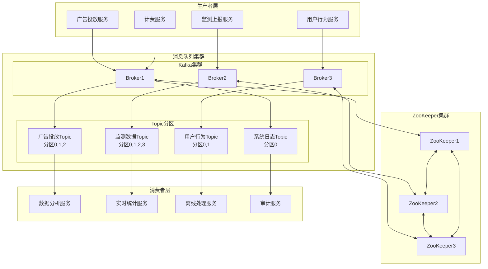
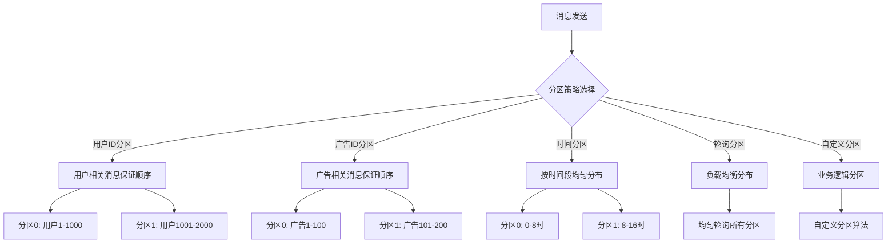
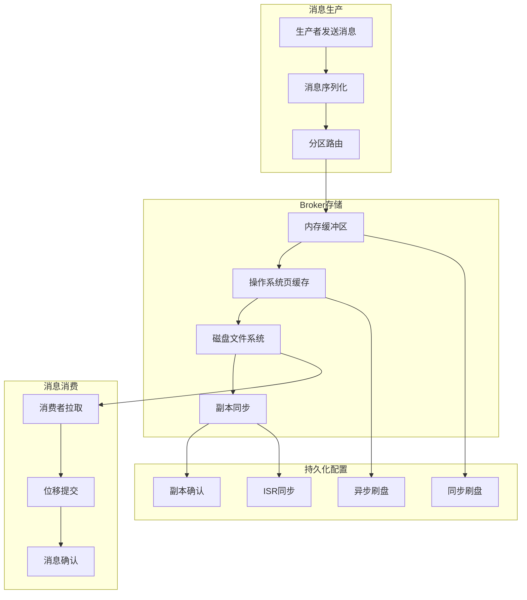
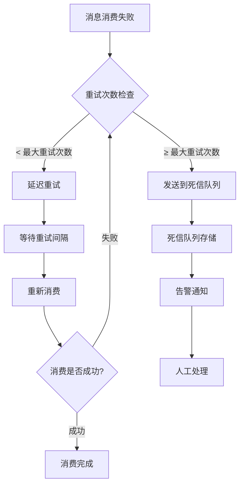
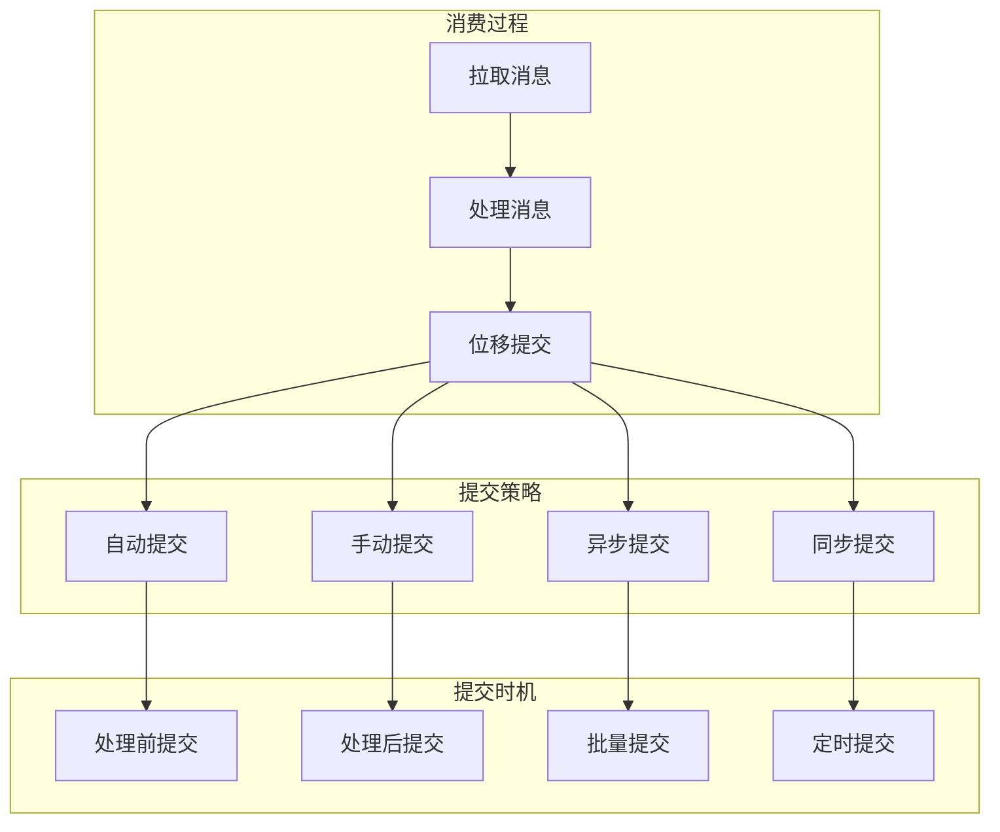
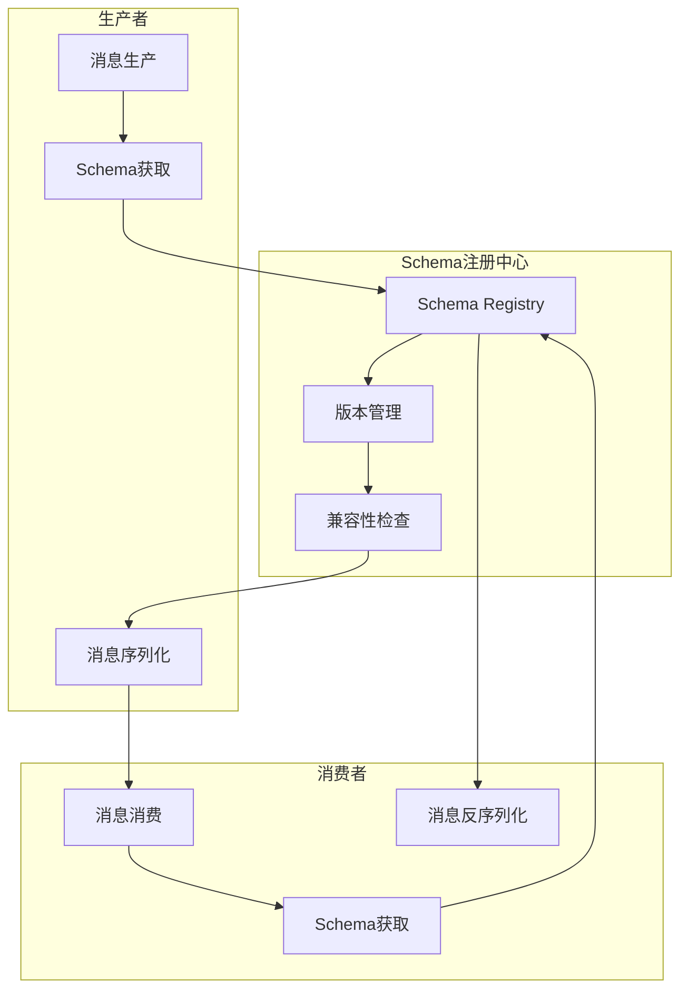
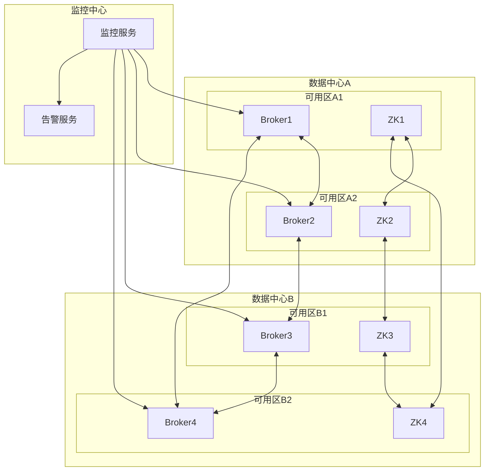
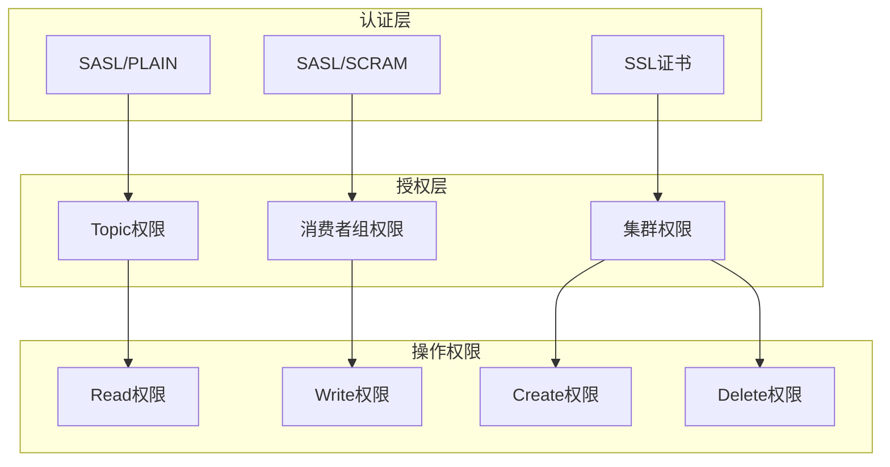
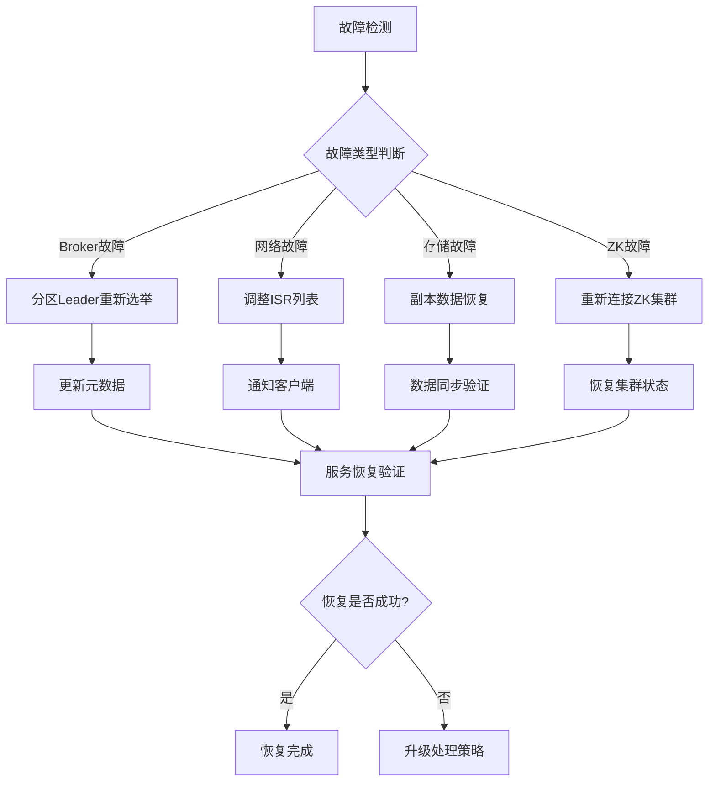

# 广告投放引擎消息队列设计

## 1. 设计概述

### 1.1 设计目标

构建高可靠、高性能的消息队列系统，支持广告投放引擎的异步处理、系统解耦、流量削峰和数据同步需求，确保消息的可靠传递和系统的高可用性。

### 1.2 设计原则

- **高可靠性**: 确保消息不丢失、不重复、顺序正确
- **高性能**: 支持高并发、低延迟的消息处理
- **可扩展性**: 支持水平扩展和弹性伸缩
- **解耦性**: 实现生产者和消费者的完全解耦
- **容错性**: 具备故障自动恢复和容灾能力
- **监控性**: 提供完整的消息监控和追踪能力

### 1.3 性能目标

#### 消息队列性能指标
| 指标类别 | 指标名称     | 目标值     | 当前基线 | 测量方法   | 监控频率 |
| -------- | ------------ | ---------- | -------- | ---------- | -------- |
| 吞吐量   | 消息生产速率 | > 100万/秒 | 50万/秒  | 消息计数   | 实时     |
| 吞吐量   | 消息消费速率 | > 100万/秒 | 50万/秒  | 消息计数   | 实时     |
| 延迟     | 端到端延迟   | < 10ms     | 30ms     | 时间戳对比 | 实时     |
| 可靠性   | 消息丢失率   | < 0.001%   | 0.01%    | 消息追踪   | 5分钟    |
| 可用性   | 服务可用率   | > 99.9%    | 99.5%    | 健康检查   | 1分钟    |

## 2. 消息队列架构设计

### 2.1 整体架构设计



### 2.2 Topic和分区设计

#### Topic规划策略
| Topic名称      | 业务用途     | 分区数 | 副本数 | 保留时间 | 压缩策略 |
| -------------- | ------------ | ------ | ------ | -------- | -------- |
| ad-delivery    | 广告投放事件 | 12     | 3      | 7天      | LZ4      |
| ad-monitoring  | 监测数据     | 24     | 3      | 30天     | Snappy   |
| user-behavior  | 用户行为     | 6      | 2      | 3天      | LZ4      |
| system-logs    | 系统日志     | 3      | 2      | 7天      | Gzip     |
| billing-events | 计费事件     | 6      | 3      | 90天     | 无压缩   |

#### 分区策略设计


## 3. 消息可靠性设计

### 3.1 消息传递保证

#### 可靠性等级设计
| 可靠性等级    | 实现机制     | 性能损耗 | 数据一致性 | 适用场景 |
| ------------- | ------------ | -------- | ---------- | -------- |
| At Most Once  | 最多一次投递 | 无       | 可能丢失   | 日志收集 |
| At Least Once | 至少一次投递 | 低       | 可能重复   | 监测数据 |
| Exactly Once  | 精确一次投递 | 高       | 强一致性   | 计费数据 |

### 3.2 消息持久化策略

#### 消息存储机制


### 3.3 消息重试和死信处理

#### 重试机制设计
- **指数退避**: 重试间隔指数增长
- **最大重试次数**: 防止无限重试
- **重试队列**: 专门的重试消息队列
- **死信队列**: 最终失败消息的存储

#### 死信队列处理流程


## 4. 消息消费设计

### 4.1 消费者组设计

#### 消费者组配置
| 消费者组        | 消费Topic      | 消费模式 | 并发度 | 处理逻辑 |
| --------------- | -------------- | -------- | ------ | -------- |
| analytics-group | ad-delivery    | 批量消费 | 12     | 数据分析 |
| realtime-group  | ad-monitoring  | 实时消费 | 24     | 实时统计 |
| audit-group     | billing-events | 顺序消费 | 6      | 审计处理 |
| backup-group    | system-logs    | 批量消费 | 3      | 备份存储 |

### 4.2 消费位移管理

#### 位移提交策略


### 4.3 消费并发控制

#### 并发消费模式
- **单线程消费**: 保证消息顺序，性能较低
- **多线程消费**: 提高吞吐量，可能乱序
- **分区并发**: 分区内顺序，分区间并发
- **异步消费**: 非阻塞消费，最高性能

#### 流量控制机制
- **背压控制**: 消费者处理能力反馈
- **限流控制**: 控制消费速率
- **熔断机制**: 异常情况下的保护
- **降级策略**: 过载时的处理策略

## 5. 消息队列监控

### 5.1 监控指标体系

#### 核心监控指标

```mermaid
graph TB
    subgraph "生产者指标"
        A[消息生产速率]
        B[生产者错误率]
        C[消息大小分布]
        D[生产延迟]
    end
    
    subgraph "Broker指标"
        E[磁盘使用率]
        F[网络I/O]
        G[副本同步延迟]
        H[分区Leader分布]
    end
    
    subgraph "消费者指标"
        I[消息消费速率]
        J[消费者Lag]
        K[消费错误率]
        L[处理延迟]
    end
    
    subgraph "集群指标"
        M[集群健康度]
        N[控制器状态]
        O[ZooKeeper连接]
        P[分区均衡度]
    end
    
    A --> Q[综合性能评估]
    B --> Q
    C --> Q
    D --> Q
    E --> Q
    F --> Q
    G --> Q
    H --> Q
    I --> Q
    J --> Q
    K --> Q
    L --> Q
    M --> Q
    N --> Q
    O --> Q
    P --> Q
    
    class A,B,C,D producer
    class E,F,G,H broker
    class I,J,K,L consumer
    class M,N,O,P cluster
```


### 5.2 告警策略设计

#### 告警规则配置
| 告警类型       | 告警条件     | 告警级别 | 处理方式       | 通知渠道  |
| -------------- | ------------ | -------- | -------------- | --------- |
| 消费延迟过高   | Lag > 10万条 | Critical | 立即处理       | 电话+短信 |
| 磁盘使用率高   | 使用率 > 85% | Major    | 扩容或清理     | 短信+邮件 |
| 生产者错误率高 | 错误率 > 5%  | Major    | 检查网络和配置 | 邮件+钉钉 |
| 副本同步延迟   | 延迟 > 1秒   | Minor    | 检查网络状况   | 邮件      |

### 5.3 性能分析工具

#### 监控工具选择
- **Kafka Manager**: 集群管理和监控
- **Prometheus + Grafana**: 指标监控和可视化
- **Kafka Exporter**: 指标导出工具
- **JMX Metrics**: JVM和Kafka内部指标

## 6. 消息序列化设计

### 6.1 序列化协议选择

#### 序列化方案对比
| 序列化方式       | 性能 | 体积 | 可读性 | 版本兼容性 | 适用场景   |
| ---------------- | ---- | ---- | ------ | ---------- | ---------- |
| JSON             | 中等 | 大   | 高     | 好         | 开发调试   |
| Avro             | 高   | 小   | 低     | 极好       | 大数据场景 |
| Protocol Buffers | 高   | 小   | 低     | 好         | 高性能场景 |
| MessagePack      | 高   | 中等 | 中等   | 中等       | 通用场景   |

### 6.2 Schema管理

#### Schema版本控制


### 6.3 消息格式标准

#### 统一消息格式
```json
{
  "header": {
    "messageId": "唯一消息ID",
    "timestamp": "消息时间戳",
    "source": "消息来源服务",
    "version": "消息格式版本",
    "traceId": "链路追踪ID"
  },
  "payload": {
    "eventType": "事件类型",
    "data": "业务数据",
    "metadata": "元数据信息"
  }
}
```

## 7. 集群部署与配置

### 7.1 Kafka集群配置

#### 核心配置参数
| 配置项                      | 推荐值     | 说明         | 影响        |
| --------------------------- | ---------- | ------------ | ----------- |
| num.network.threads         | 8          | 网络线程数   | 网络I/O性能 |
| num.io.threads              | 16         | I/O线程数    | 磁盘I/O性能 |
| socket.send.buffer.bytes    | 102400     | 发送缓冲区   | 网络吞吐量  |
| socket.receive.buffer.bytes | 102400     | 接收缓冲区   | 网络吞吐量  |
| log.retention.hours         | 168        | 日志保留时间 | 存储空间    |
| log.segment.bytes           | 1073741824 | 段文件大小   | I/O效率     |

### 7.2 高可用部署

#### 多数据中心部署


### 7.3 容量规划

#### 容量评估模型
- **消息吞吐量**: 每秒处理消息数量
- **消息大小**: 平均消息大小和峰值大小
- **保留时间**: 消息在队列中的保留时间
- **副本因子**: 数据副本数量
- **压缩比例**: 消息压缩后的大小比例

#### 硬件资源配置
| 组件         | CPU  | 内存 | 磁盘      | 网络   | 数量 |
| ------------ | ---- | ---- | --------- | ------ | ---- |
| Kafka Broker | 16核 | 32GB | 2TB SSD   | 10Gbps | 6台  |
| ZooKeeper    | 4核  | 8GB  | 100GB SSD | 1Gbps  | 5台  |
| 监控服务     | 8核  | 16GB | 500GB SSD | 1Gbps  | 2台  |

## 8. 消息安全设计

### 8.1 认证和授权

#### 安全机制配置
- **SASL认证**: 客户端身份认证
- **ACL权限控制**: 细粒度的访问权限控制
- **SSL/TLS加密**: 数据传输加密
- **审计日志**: 操作行为审计追踪

#### 权限管理策略


### 8.2 数据加密

#### 加密策略设计
- **传输加密**: TLS 1.3协议加密
- **存储加密**: 磁盘文件加密
- **消息加密**: 业务敏感数据加密
- **密钥管理**: 密钥轮换和安全存储

## 9. 故障处理和恢复

### 9.1 故障检测机制

#### 故障类型和处理
| 故障类型      | 检测方式 | 影响范围 | 恢复策略     | RTO目标 |
| ------------- | -------- | -------- | ------------ | ------- |
| Broker宕机    | 心跳检测 | 单节点   | 分区重新分配 | 2分钟   |
| 网络分区      | 连接超时 | 部分节点 | ISR调整      | 5分钟   |
| 磁盘故障      | I/O错误  | 单节点   | 副本切换     | 3分钟   |
| ZooKeeper故障 | 会话超时 | 集群管理 | 重新选举     | 1分钟   |

### 9.2 自动恢复机制

#### 恢复流程设计


## 10. 性能优化策略

### 10.1 生产者优化

#### 生产者配置优化
- **批处理**: 批量发送消息提高吞吐量
- **压缩**: 消息压缩减少网络传输
- **异步发送**: 非阻塞发送提高性能
- **连接复用**: 复用连接减少开销

#### 关键参数调优
| 参数名称         | 推荐值   | 说明           | 性能影响         |
| ---------------- | -------- | -------------- | ---------------- |
| batch.size       | 65536    | 批处理大小     | 吞吐量提升       |
| linger.ms        | 50       | 批处理等待时间 | 延迟vs吞吐量平衡 |
| buffer.memory    | 67108864 | 发送缓冲区     | 内存使用vs性能   |
| compression.type | lz4      | 压缩算法       | CPU vs 网络      |

### 10.2 消费者优化

#### 消费者性能调优
- **批量拉取**: 增大拉取批次大小
- **并行处理**: 多线程并行消费
- **预取机制**: 预先拉取消息减少等待
- **位移管理**: 优化位移提交策略

#### 消费者配置优化
- **fetch.min.bytes**: 批量拉取最小字节数
- **fetch.max.wait.ms**: 拉取等待时间
- **max.poll.records**: 单次拉取最大记录数
- **enable.auto.commit**: 自动提交位移开关

### 10.3 集群性能优化

#### 系统级优化
- **文件系统**: 选择适合的文件系统
- **内存映射**: 充分利用页缓存
- **网络优化**: TCP参数调优
- **JVM调优**: 垃圾回收器优化

#### 运维优化策略
- **分区均衡**: 定期重新分配分区
- **副本分布**: 优化副本在集群中的分布
- **日志清理**: 定期清理过期日志
- **监控告警**: 完善的性能监控体系
