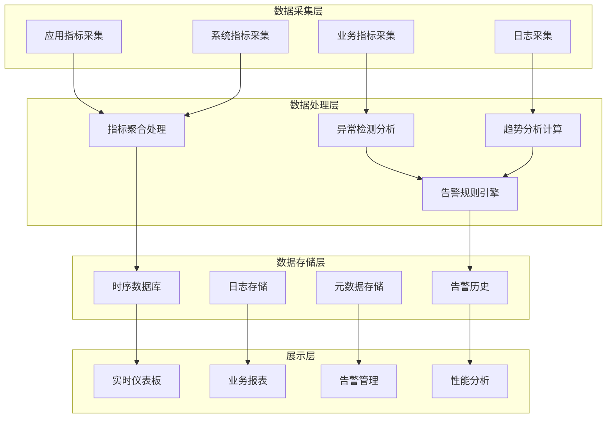
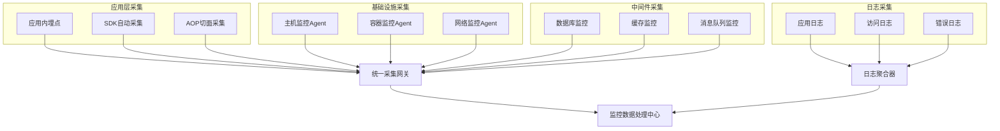
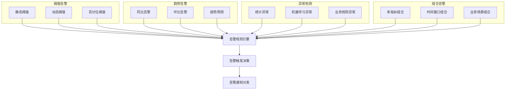
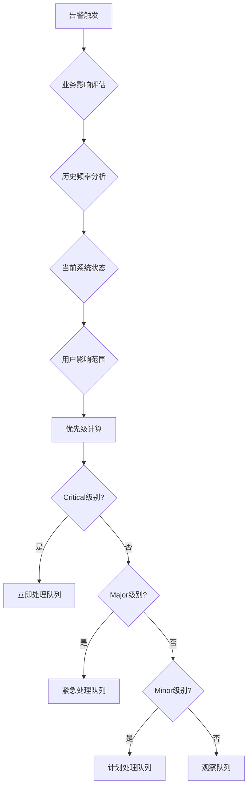
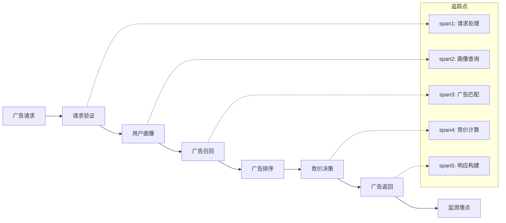
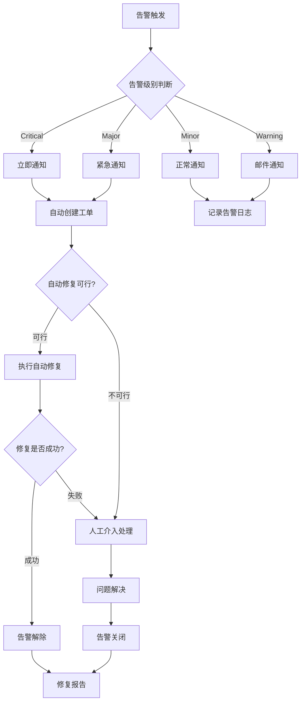
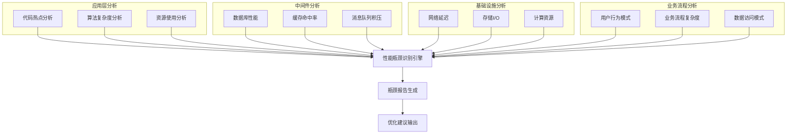

# 广告投放引擎监控与告警设计

## 1. 设计概述

### 1.1 设计目标

构建全面的监控与告警体系，实现对广告投放引擎运行状态的实时监控、异常预警、性能分析和故障诊断，确保系统的高可用性和业务连续性。

### 1.2 设计原则

- **全链路监控**: 覆盖从请求接入到响应输出的完整链路
- **多维度指标**: 业务指标、技术指标、用户体验指标并重
- **智能告警**: 基于阈值、趋势、异常检测的多层告警机制
- **可视化呈现**: 直观的仪表板和报表展示
- **快速响应**: 秒级监控数据更新和分钟级告警响应
- **可扩展性**: 支持监控指标和告警规则的动态扩展

### 1.3 监控范围

#### 系统层监控
- **基础设施**: CPU、内存、磁盘、网络使用率
- **应用服务**: 进程状态、线程池、GC性能
- **数据存储**: 数据库连接池、查询性能、存储容量
- **网络通信**: 连接数、带宽使用、延迟分布

#### 业务层监控
- **广告投放**: 请求量、填充率、点击率、转化率
- **竞价系统**: 竞价成功率、出价分布、胜出率
- **用户行为**: 访问量、停留时间、转化漏斗
- **收益分析**: 广告收入、成本控制、ROI指标

## 2. 监控架构设计

### 2.1 监控体系架构



### 2.2 数据采集策略

#### 推拉结合模式
| 采集方式  | 适用场景       | 采集频率 | 数据类型           | 优势             |
| --------- | -------------- | -------- | ------------------ | ---------------- |
| Push推送  | 实时业务指标   | 实时     | 交易数据、用户行为 | 低延迟、实时性强 |
| Pull拉取  | 系统状态指标   | 15s-60s  | 系统资源、应用状态 | 统一调度、易管理 |
| Event事件 | 异常和关键事件 | 触发式   | 错误日志、告警事件 | 精确捕获异常     |
| Batch批量 | 历史数据分析   | 小时/天  | 报表数据、趋势分析 | 高效处理大量数据 |

#### 采集器部署架构


## 3. 核心监控指标体系

### 3.1 系统性能指标

#### 应用层指标
| 指标类别 | 指标名称       | 计算方式              | 告警阈值    | 监控目的     |
| -------- | -------------- | --------------------- | ----------- | ------------ |
| 响应性能 | 平均响应时间   | 请求处理总时间/请求数 | > 100ms     | 性能监控     |
| 响应性能 | 99分位响应时间 | 99%请求的响应时间     | > 200ms     | 性能瓶颈识别 |
| 吞吐量   | QPS            | 每秒处理请求数        | < 80%设计值 | 容量规划     |
| 错误率   | 系统错误率     | 错误请求数/总请求数   | > 0.1%      | 稳定性监控   |
| 资源使用 | CPU使用率      | CPU使用时间比例       | > 80%       | 资源瓶颈     |
| 资源使用 | 内存使用率     | 已用内存/总内存       | > 85%       | 内存泄漏检测 |

#### 基础设施指标
| 监控对象 | 关键指标   | 正常范围    | 告警级别                      | 处理建议       |
| -------- | ---------- | ----------- | ----------------------------- | -------------- |
| 服务器   | CPU利用率  | < 70%       | Warning > 80%, Critical > 90% | 负载均衡调整   |
| 服务器   | 内存利用率 | < 80%       | Warning > 85%, Critical > 95% | 内存扩容或优化 |
| 服务器   | 磁盘空间   | < 80%       | Warning > 85%, Critical > 95% | 清理或扩容     |
| 网络     | 带宽利用率 | < 70%       | Warning > 80%, Critical > 90% | 带宽升级       |
| 数据库   | 连接数     | < 80%最大值 | Warning > 85%, Critical > 95% | 连接池调优     |
| 缓存     | 命中率     | > 90%       | Warning < 85%, Critical < 80% | 缓存策略优化   |

### 3.2 业务关键指标

#### 广告投放指标
| 业务域   | 指标名称    | 计算公式                    | 目标值   | 业务含义   |
| -------- | ----------- | --------------------------- | -------- | ---------- |
| 流量质量 | 广告请求量  | 每分钟广告请求数            | 监控趋势 | 流量健康度 |
| 投放效果 | 广告填充率  | 有广告响应的请求数/总请求数 | > 85%    | 变现能力   |
| 投放效果 | 点击率(CTR) | 点击数/展示数               | 行业基准 | 广告相关性 |
| 投放效果 | 转化率(CVR) | 转化数/点击数               | 业务目标 | 广告效果   |
| 收益分析 | eCPM        | 收入/展示数*1000            | 持续增长 | 单位价值   |
| 收益分析 | 总收入      | 广告收入汇总                | 预算目标 | 业务成果   |

#### 竞价系统指标
| 竞价环节 | 监控指标     | 标准值   | 异常阈值  | 影响分析       |
| -------- | ------------ | -------- | --------- | -------------- |
| 竞价响应 | 竞价响应时间 | < 50ms   | > 100ms   | 竞价成功率下降 |
| 竞价质量 | 竞价成功率   | > 20%    | < 10%     | 收入显著下降   |
| 价格分析 | 平均出价     | 市场基准 | 偏离30%   | 竞争力问题     |
| 预算控制 | 预算消耗速度 | 均匀消耗 | 过快/过慢 | 投放效率问题   |

## 4. 告警机制设计

### 4.1 告警分级体系

#### 告警严重程度定义
| 告警级别 | 影响范围     | 响应时间 | 处理方式     | 通知渠道       | 示例场景                 |
| -------- | ------------ | -------- | ------------ | -------------- | ------------------------ |
| Critical | 系统不可用   | 5分钟内  | 立即人工介入 | 电话+短信+邮件 | 系统宕机、数据丢失       |
| Major    | 核心功能异常 | 15分钟内 | 紧急处理     | 短信+邮件+钉钉 | 数据库故障、服务异常     |
| Minor    | 性能下降     | 30分钟内 | 计划处理     | 邮件+钉钉      | 响应时间增加、错误率上升 |
| Warning  | 潜在风险     | 2小时内  | 关注观察     | 邮件           | 资源使用率高、趋势异常   |
| Info     | 状态信息     | 非必须   | 记录存档     | 日志           | 配置变更、定期报告       |

### 4.2 告警规则引擎

#### 规则类型分类


#### 告警抑制策略
| 抑制类型     | 应用场景         | 抑制条件          | 抑制时间   | 目的         |
| ------------ | ---------------- | ----------------- | ---------- | ------------ |
| 重复抑制     | 同一告警重复触发 | 相同告警规则+对象 | 30分钟     | 减少告警噪音 |
| 依赖抑制     | 上下游关联故障   | 依赖关系配置      | 故障恢复   | 避免级联告警 |
| 时间窗口抑制 | 维护期间         | 维护时间窗口      | 维护期间   | 避免维护告警 |
| 级联抑制     | 大规模故障       | 故障影响范围      | 主故障恢复 | 突出根本原因 |

### 4.3 智能告警优化

#### 动态阈值算法
- **基线学习**: 基于历史数据建立正常行为基线
- **季节性调整**: 考虑业务周期性波动特征
- **异常检测**: 统计方法和机器学习结合检测异常
- **自适应调整**: 根据告警反馈自动优化阈值

#### 告警优先级算法


## 5. 链路追踪设计

### 5.1 分布式追踪架构

#### 追踪数据模型
- **Trace**: 完整的请求调用链路
- **Span**: 单个操作的执行单元
- **Tag**: 操作相关的键值对标签
- **Log**: 操作过程中的结构化日志

#### 追踪采样策略
| 采样类型     | 采样率   | 适用场景     | 存储成本 | 分析精度 |
| ------------ | -------- | ------------ | -------- | -------- |
| 固定采样     | 1-10%    | 正常业务流量 | 低       | 中等     |
| 自适应采样   | 动态调整 | 流量波动场景 | 中等     | 高       |
| 错误采样     | 100%     | 异常请求     | 中等     | 高       |
| 关键路径采样 | 100%     | 核心业务流程 | 高       | 最高     |

### 5.2 关键链路监控

#### 广告投放链路追踪


#### 性能瓶颈识别
- **响应时间分析**: 识别最耗时的操作环节
- **并发性能**: 分析并发请求的相互影响
- **资源依赖**: 识别外部依赖的性能影响
- **错误传播**: 追踪错误在系统中的传播路径

## 6. 日志监控设计

### 6.1 日志分类体系

#### 日志类型定义
| 日志类型 | 记录内容       | 重要程度 | 保留期限 | 主要用途           |
| -------- | -------------- | -------- | -------- | ------------------ |
| 访问日志 | HTTP请求响应   | 高       | 30天     | 流量分析、问题排查 |
| 应用日志 | 业务逻辑执行   | 高       | 7天      | 业务监控、错误诊断 |
| 错误日志 | 异常和错误信息 | 最高     | 90天     | 故障分析、系统优化 |
| 性能日志 | 系统性能指标   | 中       | 7天      | 性能分析、容量规划 |
| 安全日志 | 安全相关事件   | 最高     | 180天    | 安全审计、风险防控 |
| 审计日志 | 重要操作记录   | 高       | 365天    | 合规审计、操作追踪 |

### 6.2 结构化日志规范

#### 日志格式标准
```json
{
  "timestamp": "2024-01-01T10:00:00.000Z",
  "level": "INFO|WARN|ERROR|DEBUG",
  "service": "ad-delivery-engine",
  "traceId": "abc123def456",
  "spanId": "def456ghi789",
  "userId": "user_12345",
  "sessionId": "session_67890",
  "message": "业务操作描述",
  "context": {
    "operation": "广告投放",
    "duration": 45,
    "result": "success|failure",
    "errorCode": "错误代码",
    "metadata": "附加信息"
  }
}
```

#### 日志采集配置
- **采集方式**: Agent采集 + 应用直接推送
- **缓冲策略**: 本地缓存 + 批量发送
- **压缩传输**: Gzip压缩减少网络开销
- **故障恢复**: 本地存储 + 断线重连

## 7. 可视化仪表板设计

### 7.1 仪表板分层设计

#### 管理层仪表板
- **业务概览**: 关键业务指标趋势
- **收益分析**: 收入、成本、利润分析
- **用户洞察**: 用户行为和偏好分析
- **市场表现**: 竞争对手和市场趋势

#### 运营层仪表板
- **投放监控**: 广告投放实时状态
- **效果分析**: 广告效果和优化建议
- **异常处理**: 异常事件和处理进度
- **容量管理**: 系统容量和扩容建议

#### 技术层仪表板
- **系统监控**: 技术指标实时监控
- **性能分析**: 性能瓶颈和优化方向
- **错误分析**: 错误分析和解决方案
- **基础设施**: 基础设施状态监控

### 7.2 关键图表设计

#### 实时监控图表
| 图表类型 | 适用指标           | 更新频率 | 展示特点 | 交互功能     |
| -------- | ------------------ | -------- | -------- | ------------ |
| 时序图   | 请求量、响应时间   | 实时     | 趋势变化 | 时间范围选择 |
| 仪表盘   | CPU、内存使用率    | 30秒     | 当前状态 | 阈值设置     |
| 热力图   | 错误分布、性能分布 | 1分钟    | 分布模式 | 钻取分析     |
| 漏斗图   | 转化流程           | 5分钟    | 转化效率 | 环节分析     |
| 地图     | 地域分布           | 实时     | 空间分布 | 区域筛选     |

#### 历史分析图表
- **对比分析**: 同比、环比趋势对比
- **相关性分析**: 多指标关联关系分析
- **异常标注**: 异常时间点和事件标注
- **预测趋势**: 基于历史数据的趋势预测

## 8. 监控数据存储设计

### 8.1 存储架构选型

#### 时序数据存储
- **实时数据**: Redis + 内存时序数据库
- **短期历史**: InfluxDB时序数据库
- **长期存储**: Hadoop + 列式存储
- **索引加速**: Elasticsearch全文检索

#### 数据分层策略
| 数据层级 | 存储时长 | 查询频率 | 存储介质 | 访问模式 |
| -------- | -------- | -------- | -------- | -------- |
| 热数据   | 24小时   | 极高     | 内存+SSD | 实时读写 |
| 温数据   | 7天      | 高       | SSD      | 快速查询 |
| 冷数据   | 30天     | 中等     | 机械硬盘 | 批量分析 |
| 归档数据 | 1年+     | 低       | 对象存储 | 合规审计 |

### 8.2 数据压缩与清理

#### 数据聚合策略
- **实时聚合**: 秒级数据聚合为分钟级
- **定期聚合**: 分钟级数据聚合为小时级、天级
- **采样聚合**: 高频数据采样存储
- **智能聚合**: 根据查询模式动态聚合

#### 存储优化措施
- **数据压缩**: Snappy/LZ4高性能压缩算法
- **分区存储**: 按时间、业务维度分区
- **索引优化**: 稀疏索引减少存储开销
- **生命周期管理**: 自动化数据清理和归档

## 9. 告警处理流程

### 9.1 告警响应机制

#### 告警处理流程


### 9.2 自动化修复机制

#### 自动修复场景
| 故障类型     | 检测方式           | 修复动作     | 成功率 | 适用条件     |
| ------------ | ------------------ | ------------ | ------ | ------------ |
| 服务无响应   | 健康检查失败       | 重启服务     | 85%    | 非数据问题   |
| 内存泄漏     | 内存使用率持续上升 | 重启应用     | 90%    | 可重启服务   |
| 连接池耗尽   | 连接数达到上限     | 释放空闲连接 | 70%    | 连接可释放   |
| 磁盘空间不足 | 磁盘使用率>95%     | 清理临时文件 | 60%    | 有可清理文件 |
| 网络超时     | 请求超时率>阈值    | 调整超时参数 | 50%    | 网络延迟问题 |

#### 修复后验证
- **功能验证**: 核心功能可用性检查
- **性能验证**: 性能指标恢复检查
- **业务验证**: 业务流程完整性检查
- **稳定性验证**: 持续运行稳定性观察

## 10. 性能分析与优化

### 10.1 性能基线建立

#### 基线指标定义
- **响应时间基线**: P50、P90、P99响应时间基准
- **吞吐量基线**: 正常负载下的QPS基准
- **资源使用基线**: CPU、内存、网络的正常使用范围
- **错误率基线**: 系统正常运行时的错误率基准

#### 基线更新策略
- **定期更新**: 每月基于历史数据更新基线
- **业务驱动**: 重大业务变更后重新建立基线
- **性能回归**: 性能优化后更新对应基线
- **季节调整**: 考虑业务季节性调整基线范围

### 10.2 性能瓶颈识别

#### 瓶颈分析维度


### 10.3 优化效果评估

#### 评估指标体系
- **性能提升**: 响应时间、吞吐量改善程度
- **资源效率**: 资源利用率和成本效益改善
- **稳定性提升**: 错误率、可用性改善程度
- **用户体验**: 用户满意度和留存率提升

#### 持续优化机制
- **A/B测试**: 新优化方案的渐进式验证
- **性能回归检测**: 自动化性能回归测试
- **优化效果跟踪**: 长期效果监控和评估
- **最佳实践沉淀**: 优化经验的积累和推广
