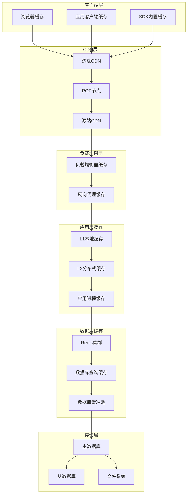
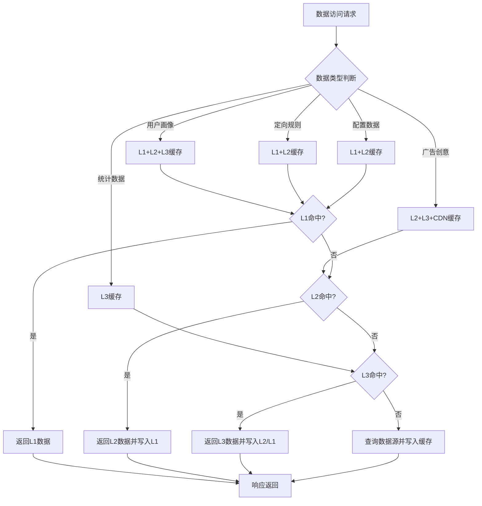
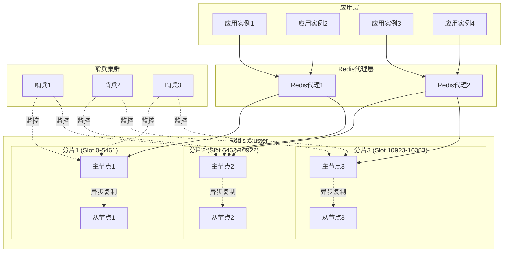
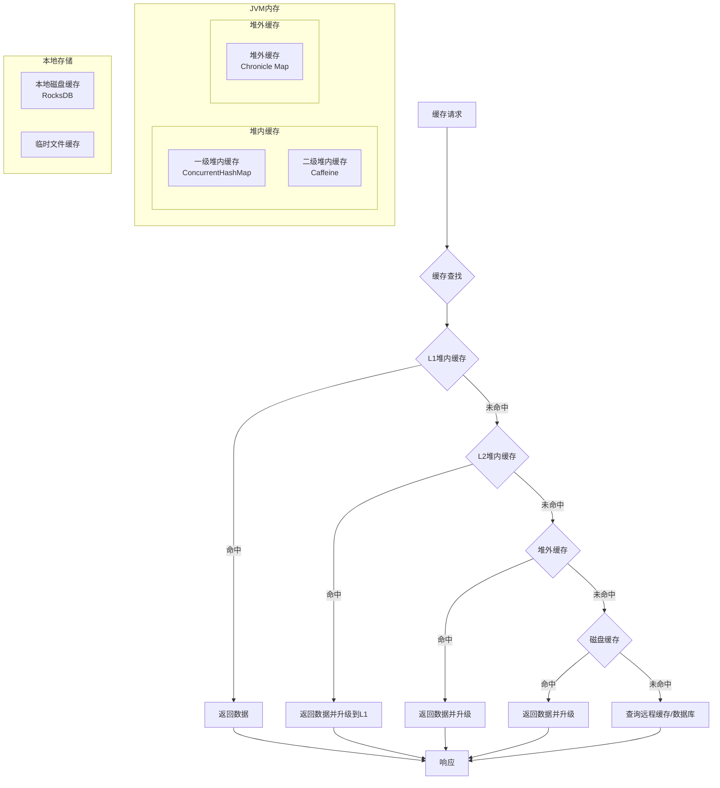
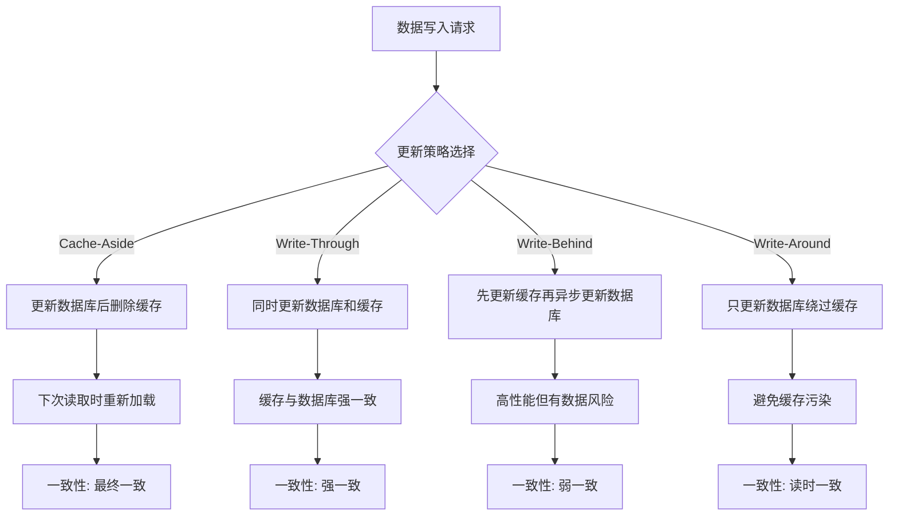
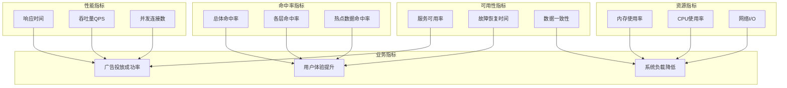
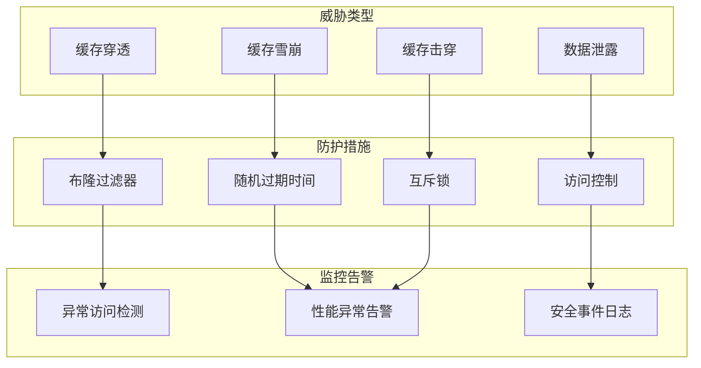
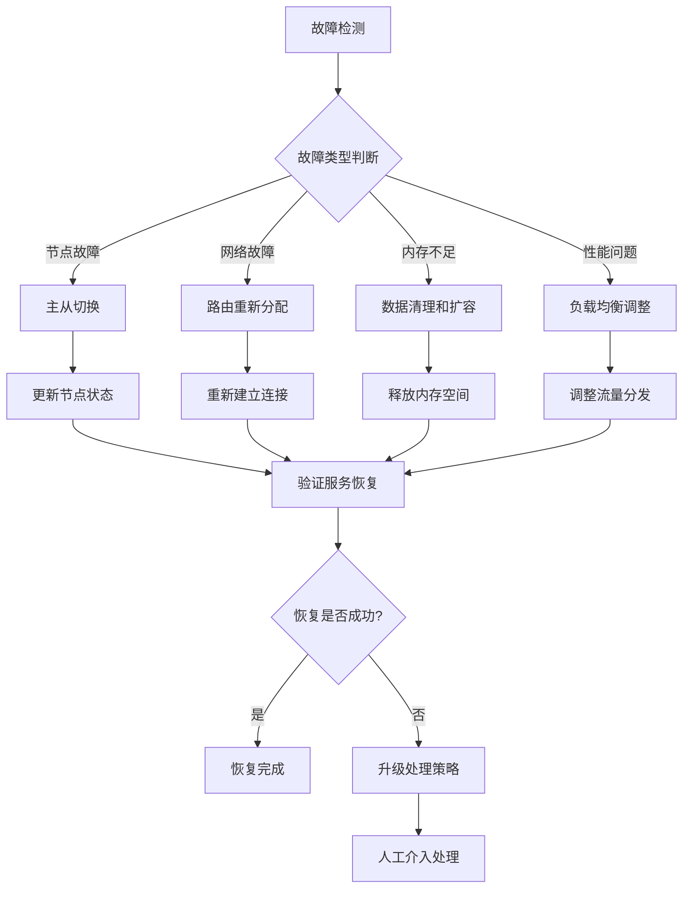
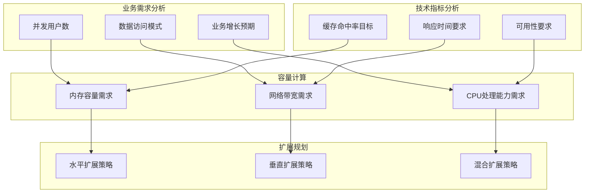

# 广告投放引擎缓存架构设计

## 1. 设计概述

### 1.1 设计目标

构建高性能、高可用的多层缓存架构，通过智能缓存策略显著提升广告投放引擎的响应速度和系统吞吐量，减少数据库访问压力，确保毫秒级的广告响应时间。

### 1.2 设计原则

- **多层缓存**: 构建从浏览器到数据库的完整缓存层次
- **热点数据优先**: 优先缓存访问频率高的热点数据
- **一致性保证**: 确保缓存与数据源的数据一致性
- **高可用性**: 缓存服务的故障转移和容灾能力
- **弹性扩展**: 支持缓存容量的动态扩展
- **智能淘汰**: 基于访问模式的智能缓存淘汰策略

### 1.3 性能目标

#### 缓存性能指标
| 指标类别 | 指标名称       | 目标值    | 当前基线 | 测量方法        | 监控频率 |
| -------- | -------------- | --------- | -------- | --------------- | -------- |
| 响应性能 | 缓存命中延迟   | < 1ms     | 3ms      | 时间统计        | 实时     |
| 命中率   | L1缓存命中率   | > 95%     | 80%      | 命中次数/总次数 | 1分钟    |
| 命中率   | L2缓存命中率   | > 85%     | 70%      | 命中次数/总次数 | 1分钟    |
| 吞吐量   | 缓存QPS        | > 200,000 | 100,000  | 每秒查询数      | 实时     |
| 可用性   | 缓存服务可用率 | > 99.9%   | 99.5%    | 正常时间/总时间 | 5分钟    |

## 2. 缓存架构设计

### 2.1 多层缓存架构

### 2.2 缓存分层策略

#### 缓存层次配置
| 缓存层级      | 缓存类型          | 容量大小 | 过期时间 | 淘汰策略  | 主要用途         |
| ------------- | ----------------- | -------- | -------- | --------- | ---------------- |
| L1-进程内缓存 | ConcurrentHashMap | 100MB    | 5分钟    | LRU       | 热点数据快速访问 |
| L2-本地缓存   | Caffeine          | 500MB    | 30分钟   | W-TinyLFU | 应用级数据缓存   |
| L3-分布式缓存 | Redis             | 10GB     | 2小时    | LRU       | 跨实例数据共享   |
| L4-数据库缓存 | Query Cache       | 2GB      | 1小时    | LRU       | 数据库查询结果   |

#### 数据类型缓存策略

## 3. Redis分布式缓存设计

### 3.1 Redis集群架构

#### 集群拓扑设计

### 3.2 Redis配置优化

#### 性能调优配置
| 配置项           | 推荐值      | 默认值     | 优化目标   | 影响说明         |
| ---------------- | ----------- | ---------- | ---------- | ---------------- |
| maxmemory        | 8GB         | 无限制     | 内存控制   | 防止OOM          |
| maxmemory-policy | allkeys-lru | noeviction | 淘汰策略   | 自动清理过期数据 |
| tcp-keepalive    | 300         | 0          | 连接保活   | 检测死连接       |
| timeout          | 300         | 0          | 空闲超时   | 释放空闲连接     |
| tcp-backlog      | 2048        | 511        | 连接队列   | 提高并发连接数   |
| maxclients       | 10000       | 10000      | 最大连接数 | 控制并发连接     |

#### 持久化策略配置
- **RDB快照**: 定期全量持久化，恢复速度快
- **AOF日志**: 实时操作日志，数据完整性好
- **混合持久化**: RDB+AOF结合，兼顾性能和安全
- **无持久化**: 纯缓存模式，最高性能

## 4. 本地缓存设计

### 4.1 多级本地缓存

#### 本地缓存架构

### 4.2 缓存算法实现

#### 淘汰算法选择
| 算法名称  | 适用场景       | 命中率 | 计算复杂度 | 内存开销 |
| --------- | -------------- | ------ | ---------- | -------- |
| LRU       | 时间局部性强   | 高     | O(1)       | 中等     |
| LFU       | 访问频率差异大 | 高     | O(log n)   | 高       |
| W-TinyLFU | 综合场景       | 最高   | O(1)       | 低       |
| Random    | 无规律访问     | 低     | O(1)       | 最低     |

#### 缓存预热策略
- **启动预热**: 应用启动时预加载核心数据
- **定时预热**: 定期批量预加载热点数据
- **智能预热**: 基于访问模式预测性预加载
- **增量预热**: 数据变更时增量更新缓存

## 5. 缓存一致性设计

### 5.1 一致性策略选择

#### 一致性级别对比
| 一致性级别 | 实现方式   | 性能影响 | 数据准确性 | 适用场景 |
| ---------- | ---------- | -------- | ---------- | -------- |
| 强一致性   | 同步更新   | 低       | 100%       | 金融数据 |
| 弱一致性   | 异步更新   | 高       | 95%        | 内容推荐 |
| 最终一致性 | 定期同步   | 中等     | 99%        | 用户画像 |
| 会话一致性 | 会话内一致 | 中等     | 会话内100% | 用户会话 |

### 5.2 缓存更新机制

#### 缓存更新策略

#### 缓存失效策略
- **TTL过期**: 基于时间的自动过期
- **版本控制**: 基于版本号的失效检测
- **依赖失效**: 基于数据依赖关系的联动失效
- **手动失效**: 基于业务逻辑的主动失效

## 6. 缓存监控与管理

### 6.1 缓存监控指标

#### 核心监控指标

### 6.2 缓存运维管理

#### 自动化管理策略
- **自动扩容**: 基于负载的缓存容量自动扩展
- **自动清理**: 定期清理过期和无效数据
- **自动预警**: 异常指标自动告警通知
- **自动恢复**: 故障自动检测和恢复

#### 缓存优化建议
| 优化方面   | 优化策略           | 预期效果        | 实施难度 |
| ---------- | ------------------ | --------------- | -------- |
| 命中率优化 | 调整TTL和淘汰策略  | 命中率提升10%   | 低       |
| 性能优化   | 连接池和序列化优化 | 响应时间降低30% | 中       |
| 容量优化   | 数据压缩和分片策略 | 存储成本降低20% | 中       |
| 一致性优化 | 更新策略和失效机制 | 数据准确性提升  | 高       |

## 7. 缓存安全设计

### 7.1 缓存安全策略

#### 安全威胁防护

### 7.2 访问控制策略

#### 缓存访问控制
- **IP白名单**: 限制访问来源IP地址
- **认证授权**: 基于Token的访问认证
- **权限控制**: 细粒度的操作权限控制
- **审计日志**: 完整的访问操作审计

#### 数据加密策略
- **传输加密**: Redis连接TLS加密
- **存储加密**: 敏感数据加密存储
- **密钥管理**: 密钥轮换和安全存储
- **数据脱敏**: 敏感信息脱敏处理

## 8. 缓存故障处理

### 8.1 故障检测机制

#### 故障类型识别
| 故障类型     | 检测方式     | 检测时间 | 影响范围 | 处理优先级 |
| ------------ | ------------ | -------- | -------- | ---------- |
| 缓存节点宕机 | 心跳检测     | 30秒     | 单节点   | 高         |
| 网络分区     | 连接超时     | 10秒     | 部分节点 | 高         |
| 内存溢出     | 内存监控     | 实时     | 单节点   | 中         |
| 性能降级     | 响应时间监控 | 1分钟    | 集群     | 中         |
| 数据不一致   | 一致性检查   | 5分钟    | 数据层   | 低         |

### 8.2 故障恢复策略

#### 自动恢复机制

#### 容灾备份策略
- **数据备份**: 定期备份缓存关键数据
- **跨地域部署**: 多地域缓存集群部署
- **故障转移**: 自动故障转移和流量切换
- **快速恢复**: 故障恢复后的快速数据同步

## 9. 缓存性能优化

### 9.1 性能调优策略

#### 系统级优化
- **内存分配**: JVM堆内外内存合理分配
- **GC调优**: 垃圾回收器选择和参数优化
- **网络优化**: TCP参数和连接池配置
- **序列化优化**: 高性能序列化协议选择

#### 应用级优化
- **批量操作**: 合并多个缓存操作减少网络开销
- **管道操作**: Redis pipeline提升吞吐量
- **异步处理**: 非阻塞异步缓存操作
- **数据压缩**: 缓存数据压缩减少内存占用

### 9.2 容量规划策略

#### 容量评估模型

#### 扩展阈值设置
| 扩展触发条件 | 阈值设置    | 扩展策略 | 扩展幅度 |
| ------------ | ----------- | -------- | -------- |
| 内存使用率   | > 80%       | 增加节点 | +25%     |
| CPU使用率    | > 70%       | 垂直扩展 | CPU翻倍  |
| 网络带宽     | > 75%       | 带宽升级 | +50%     |
| QPS压力      | > 80%设计值 | 水平扩展 | +30%节点 |

## 10. 缓存最佳实践

### 10.1 设计最佳实践

#### 缓存设计原则
- **适合缓存的数据**: 读多写少、计算复杂、访问频繁
- **不适合缓存的数据**: 频繁变更、一次性数据、大数据量
- **缓存粒度选择**: 平衡内存使用和访问效率
- **过期时间设置**: 根据数据特性设置合理TTL

#### 开发规范要求
- **缓存键命名**: 统一的命名规范和前缀管理
- **数据序列化**: 统一的序列化协议和版本管理
- **异常处理**: 完善的缓存异常处理和降级机制
- **监控埋点**: 完整的性能监控和业务埋点

### 10.2 运维最佳实践

#### 日常运维规范
- **监控告警**: 建立完善的监控告警体系
- **容量规划**: 定期进行容量评估和规划
- **性能调优**: 持续的性能监控和优化
- **故障演练**: 定期进行故障恢复演练

#### 优化迭代流程
- **性能基线**: 建立性能基线和对比标准
- **A/B测试**: 缓存策略变更的A/B测试验证
- **效果评估**: 优化效果的量化评估
- **持续改进**: 基于监控数据的持续优化
