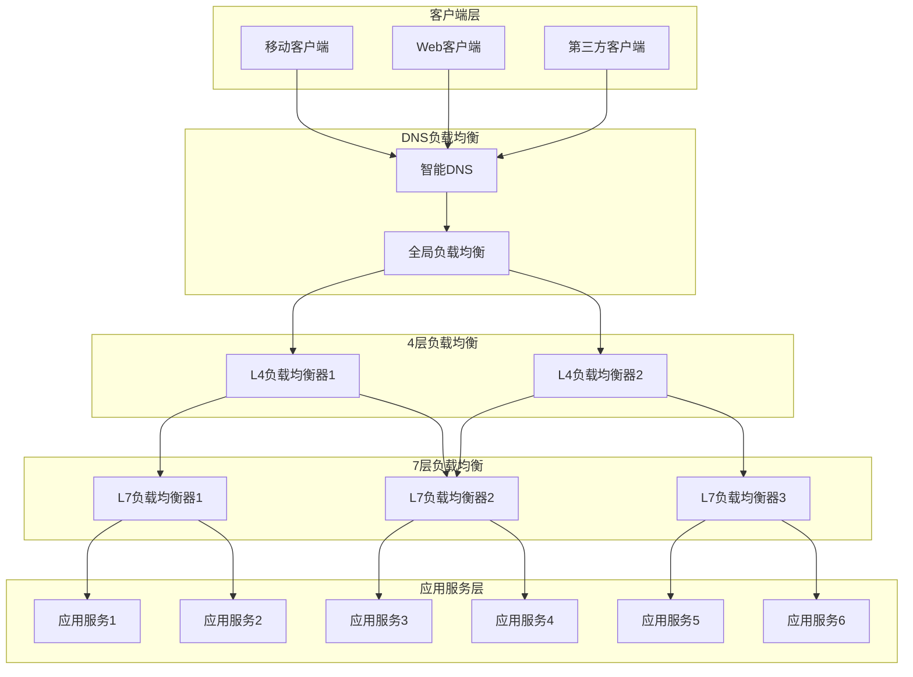
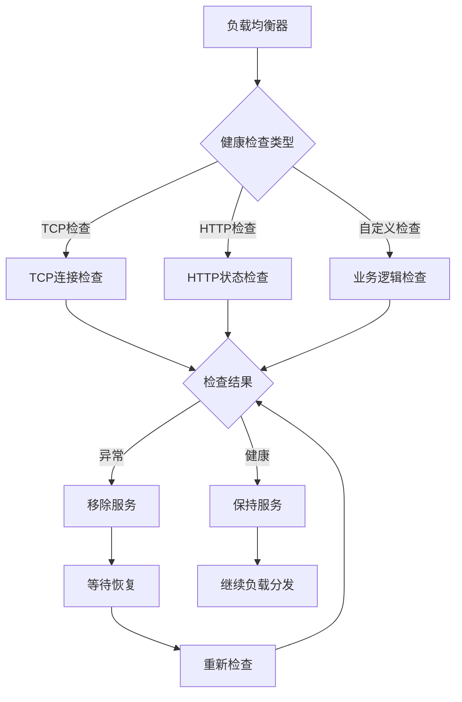
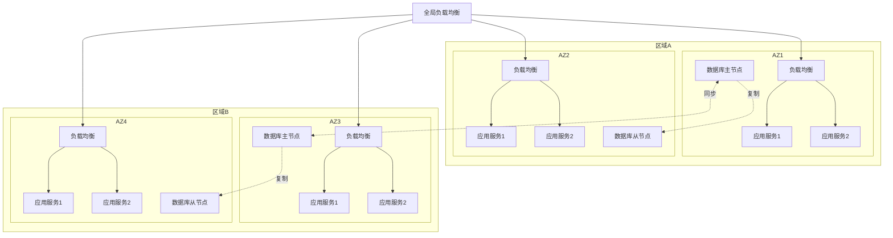
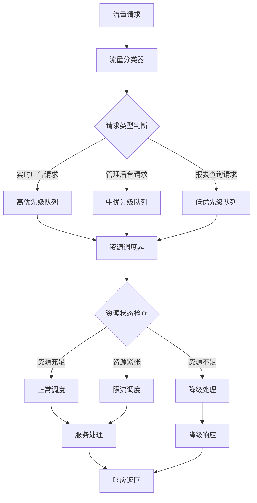
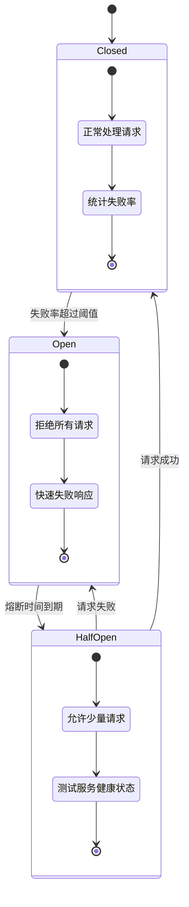
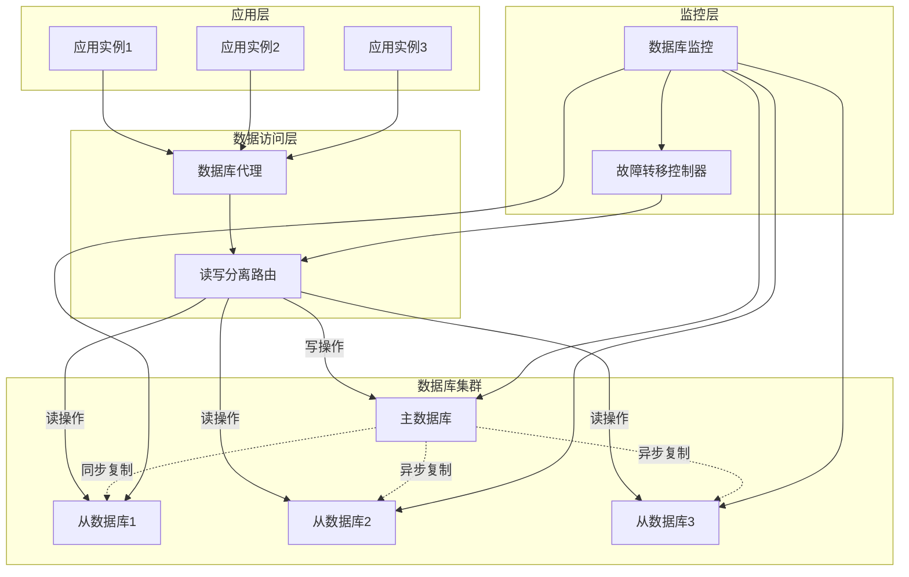
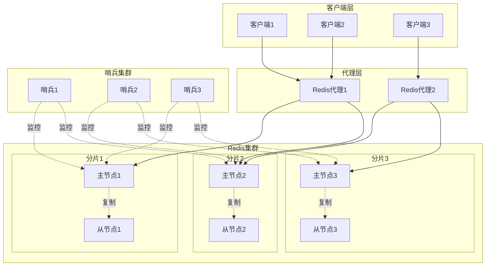
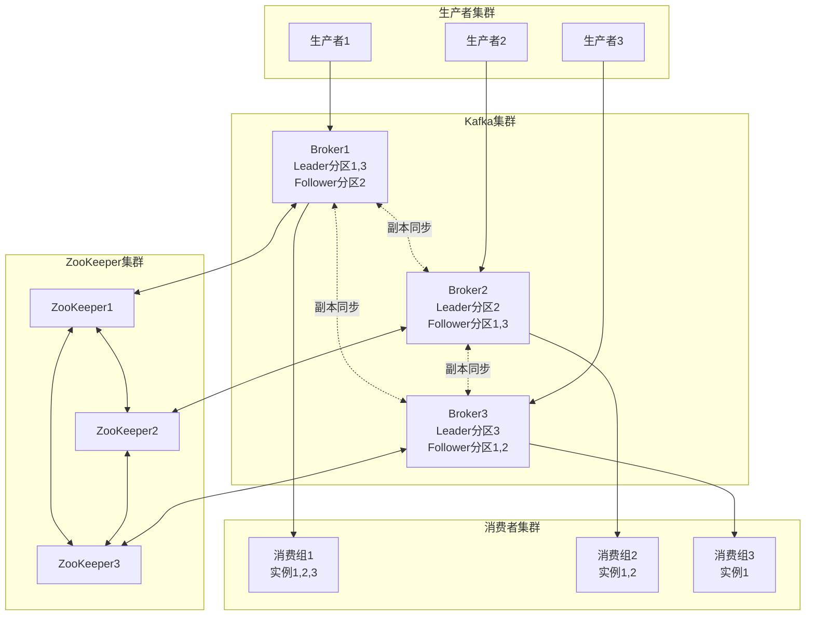
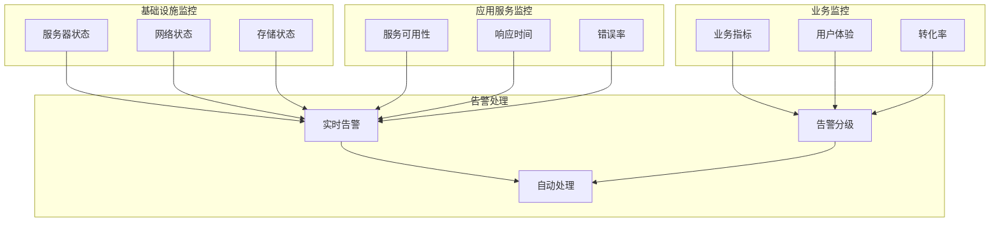
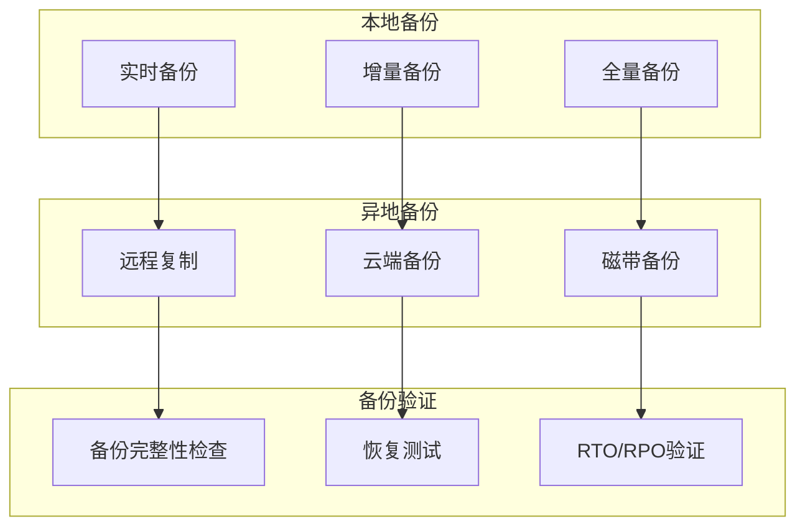

# 广告投放引擎负载均衡与高可用设计

## 1. 设计概述

### 1.1 设计目标

构建高可用、高性能的负载均衡架构，确保广告投放引擎在高并发场景下的稳定运行，实现服务的自动故障转移、流量分发和系统容灾，保障业务连续性和用户体验。

### 1.2 设计原则

- **高可用性**: 消除单点故障，实现99.9%以上的系统可用性
- **水平扩展**: 支持服务实例的弹性伸缩和负载分担
- **故障隔离**: 快速检测和隔离故障节点，防止故障扩散
- **流量控制**: 智能流量分发和过载保护机制
- **监控可视**: 实时监控负载状态和性能指标
- **自动恢复**: 故障自动检测和服务自愈能力

### 1.3 可用性指标

#### 系统可用性目标
| 指标类别   | 指标名称         | 目标值    | 测量方法            | 监控频率 |
| ---------- | ---------------- | --------- | ------------------- | -------- |
| 系统可用性 | 服务可用率       | ≥ 99.9%   | 正常运行时间/总时间 | 实时     |
| 响应性能   | 平均响应时间     | ≤ 50ms    | 请求处理时间统计    | 1分钟    |
| 故障恢复   | MTTR平均恢复时间 | ≤ 5分钟   | 故障检测到恢复时间  | 事件触发 |
| 流量处理   | 峰值QPS          | ≥ 100,000 | 每秒处理请求数      | 实时     |
| 错误率     | 系统错误率       | ≤ 0.1%    | 错误请求/总请求     | 实时     |

## 2. 负载均衡架构设计

### 2.1 多层负载均衡架构

### 2.2 负载均衡策略

#### 负载均衡算法选择
| 算法类型                    | 适用场景       | 优势                 | 缺点           | 推荐度 |
| --------------------------- | -------------- | -------------------- | -------------- | ------ |
| 轮询(Round Robin)           | 服务器性能均等 | 简单均匀             | 不考虑负载差异 | ★★★    |
| 加权轮询(Weighted RR)       | 服务器性能不等 | 按权重分配           | 静态权重配置   | ★★★★   |
| 最少连接(Least Connections) | 长连接场景     | 动态负载均衡         | 计算开销较大   | ★★★★   |
| 加权最少连接                | 异构服务器     | 综合考虑权重和连接数 | 复杂度较高     | ★★★★★  |
| IP哈希(IP Hash)             | 会话保持需求   | 会话粘性             | 负载可能不均   | ★★★    |
| 一致性哈希                  | 分布式缓存     | 扩展性好             | 实现复杂       | ★★★★   |

#### 健康检查策略

## 3. 高可用架构设计

### 3.1 服务高可用架构

#### 多区域部署架构

### 3.2 故障转移机制

#### 故障检测与处理流程
| 故障类型       | 检测方式     | 检测时间 | 处理策略      | 恢复时间 |
| -------------- | ------------ | -------- | ------------- | -------- |
| 服务实例故障   | 健康检查失败 | 30秒     | 服务摘除+重启 | 2分钟    |
| 负载均衡器故障 | 心跳检测     | 15秒     | 主备切换      | 30秒     |
| 可用区故障     | 服务监控     | 1分钟    | 流量迁移      | 5分钟    |
| 区域故障       | 全局监控     | 2分钟    | 跨区域切换    | 10分钟   |

#### 自动故障恢复策略
- **服务自愈**: 服务异常自动重启和恢复
- **流量切换**: 故障节点流量自动切换到健康节点
- **容量调整**: 根据故障情况自动调整容量
- **级联保护**: 防止故障级联传播

## 4. 流量管理设计

### 4.1 流量调度策略

#### 智能流量调度

### 4.2 限流与熔断设计

#### 多层限流策略
| 限流层级 | 限流类型  | 限流阈值  | 限流算法 | 处理策略 |
| -------- | --------- | --------- | -------- | -------- |
| 全局限流 | 总QPS限制 | 100,000/s | 令牌桶   | 拒绝服务 |
| 服务限流 | 单服务QPS | 10,000/s  | 滑动窗口 | 降级处理 |
| 用户限流 | 单用户QPS | 100/s     | 计数器   | 延迟处理 |
| IP限流   | 单IP QPS  | 1,000/s   | 漏桶算法 | 黑名单   |

#### 熔断器设计模式

## 5. 数据库高可用设计

### 5.1 数据库集群架构

#### 主从复制架构

### 5.2 数据库故障转移

#### 故障转移策略
| 故障场景     | 检测方式   | 切换时间 | 数据一致性   | 业务影响     |
| ------------ | ---------- | -------- | ------------ | ------------ |
| 主库故障     | 心跳检测   | 30秒     | 强一致性     | 短暂写入中断 |
| 从库故障     | 连接检测   | 15秒     | 最终一致性   | 读性能下降   |
| 网络分区     | 仲裁节点   | 60秒     | 分区容错     | 部分服务降级 |
| 数据中心故障 | 跨地域监控 | 5分钟    | 数据备份恢复 | 业务切换     |

#### 数据同步策略
- **同步复制**: 关键业务数据强一致性保证
- **异步复制**: 一般业务数据最终一致性
- **半同步复制**: 平衡性能和一致性
- **多点写入**: 分布式事务保证

## 6. 缓存高可用设计

### 6.1 缓存集群架构

#### Redis Cluster高可用架构

### 6.2 缓存故障处理

#### 缓存穿透防护
- **布隆过滤器**: 预过滤无效请求
- **空值缓存**: 缓存空查询结果
- **参数校验**: 前置参数有效性验证
- **访问限制**: 异常访问模式识别

#### 缓存雪崩防护
- **TTL随机化**: 避免同时过期
- **多级缓存**: 本地缓存+分布式缓存
- **限流降级**: 后端保护机制
- **预热策略**: 提前加载热点数据

## 7. 消息队列高可用

### 7.1 消息队列集群设计

#### Kafka集群高可用架构

### 7.2 消息可靠性保证

#### 消息投递保证机制
| 保证级别      | 实现方式   | 性能影响 | 可靠性   | 适用场景 |
| ------------- | ---------- | -------- | -------- | -------- |
| At Most Once  | 发送确认   | 高性能   | 可能丢失 | 日志收集 |
| At Least Once | 重试机制   | 中性能   | 可能重复 | 业务处理 |
| Exactly Once  | 幂等性保证 | 低性能   | 精确一次 | 金融交易 |

#### 消息持久化策略
- **同步刷盘**: 关键消息立即持久化
- **异步刷盘**: 一般消息批量持久化
- **副本同步**: 多副本数据同步
- **故障恢复**: 消息重放和补偿机制

## 8. 监控与告警

### 8.1 高可用监控体系

#### 监控指标体系

### 8.2 自动化运维

#### 自动化故障处理
- **自动重启**: 服务异常自动重启
- **自动扩容**: 负载高时自动扩容
- **自动切换**: 故障时自动切换
- **自动恢复**: 故障恢复后自动加入

#### 预测性维护
- **趋势分析**: 性能趋势预测
- **容量规划**: 资源需求预测
- **故障预测**: 潜在故障预警
- **优化建议**: 性能优化建议

## 9. 容灾备份策略

### 9.1 数据备份策略

#### 分层备份架构

### 9.2 灾难恢复计划

#### 灾难恢复等级
| 灾难级别 | RTO目标  | RPO目标  | 恢复策略 | 成本投入 |
| -------- | -------- | -------- | -------- | -------- |
| 1级-关键 | < 1小时  | < 15分钟 | 热备切换 | 高       |
| 2级-重要 | < 4小时  | < 1小时  | 温备恢复 | 中       |
| 3级-一般 | < 24小时 | < 4小时  | 冷备恢复 | 低       |
| 4级-延迟 | < 72小时 | < 24小时 | 手工恢复 | 最低     |

#### 业务连续性计划
- **风险评估**: 识别关键业务风险点
- **应急预案**: 制定详细应急处理流程
- **恢复演练**: 定期进行灾难恢复演练
- **持续改进**: 根据演练结果持续优化

## 10. 性能优化与扩展

### 10.1 性能调优策略

#### 系统性能优化
- **连接池优化**: 数据库连接池配置调优
- **缓存优化**: 缓存命中率和过期策略优化
- **线程池优化**: 线程池大小和队列配置
- **GC优化**: 垃圾回收策略调优

#### 网络性能优化
- **TCP优化**: TCP参数调优和连接复用
- **HTTP优化**: HTTP/2和压缩传输
- **CDN优化**: 静态资源CDN加速
- **负载均衡优化**: 负载算法和健康检查优化

### 10.2 弹性扩展设计

#### 自动扩缩容策略
| 扩容触发条件   | 扩容规则    | 缩容触发条件  | 缩容规则    | 保护机制     |
| -------------- | ----------- | ------------- | ----------- | ------------ |
| CPU > 70%      | 增加20%实例 | CPU < 30%     | 减少10%实例 | 最小实例数   |
| 内存 > 80%     | 增加30%实例 | 内存 < 40%    | 减少15%实例 | 最大实例数   |
| QPS > 80%      | 增加25%实例 | QPS < 50%     | 减少20%实例 | 冷却时间     |
| 响应时间 > 2倍 | 立即扩容50% | 连续正常1小时 | 逐步缩容    | 业务高峰保护 |

#### 扩展能力规划
- **水平扩展**: 增加服务实例数量
- **垂直扩展**: 提升单实例配置
- **存储扩展**: 数据库和缓存扩展
- **网络扩展**: 带宽和连接数扩展
