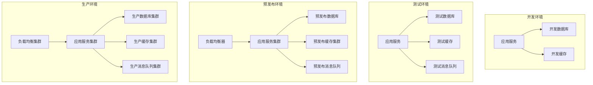
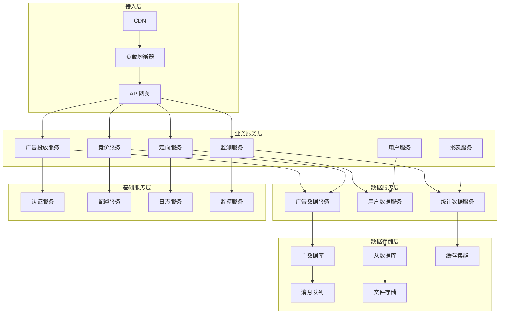
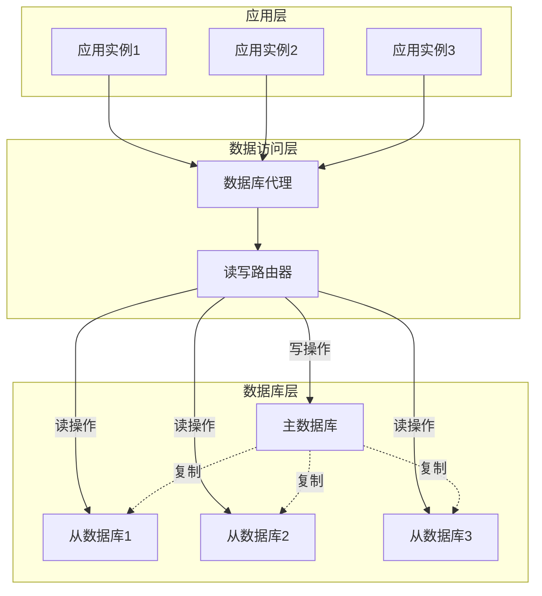
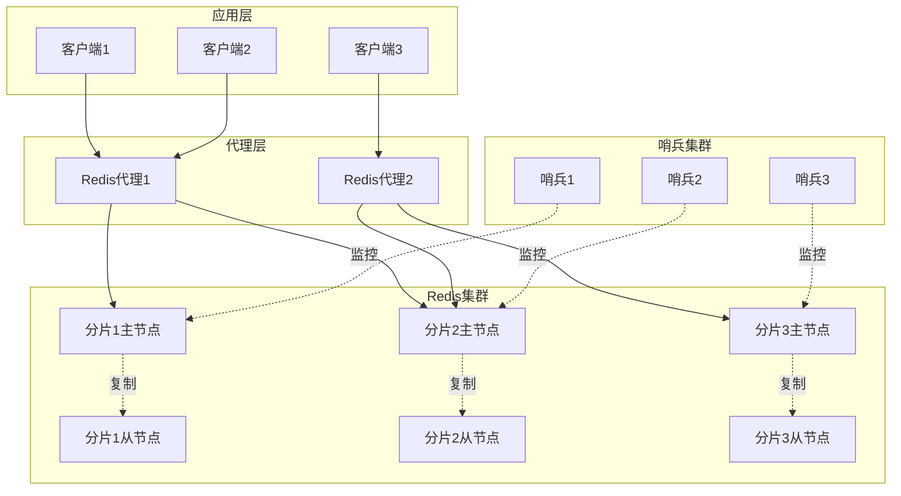
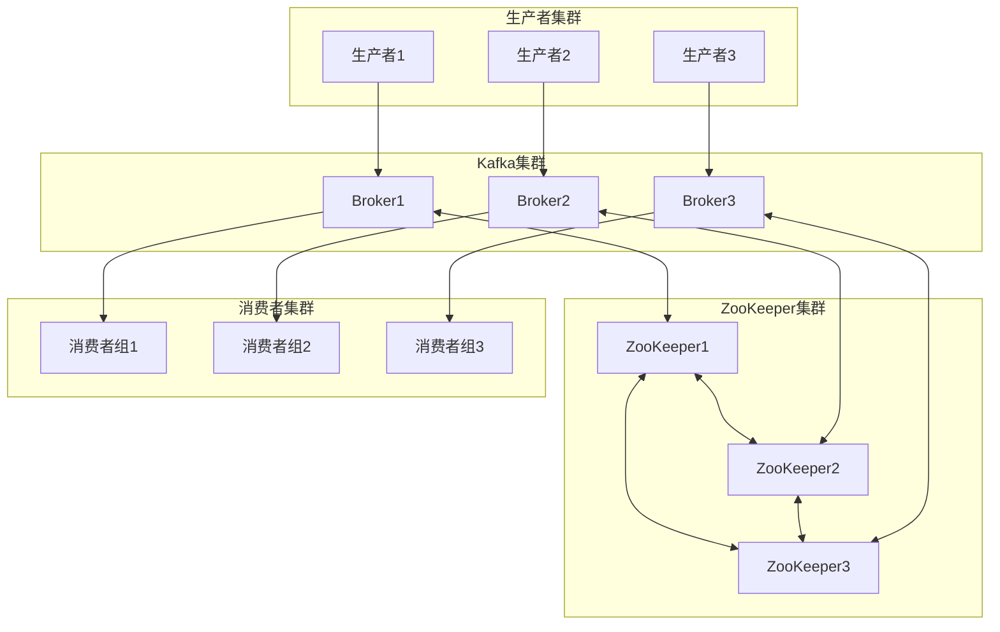
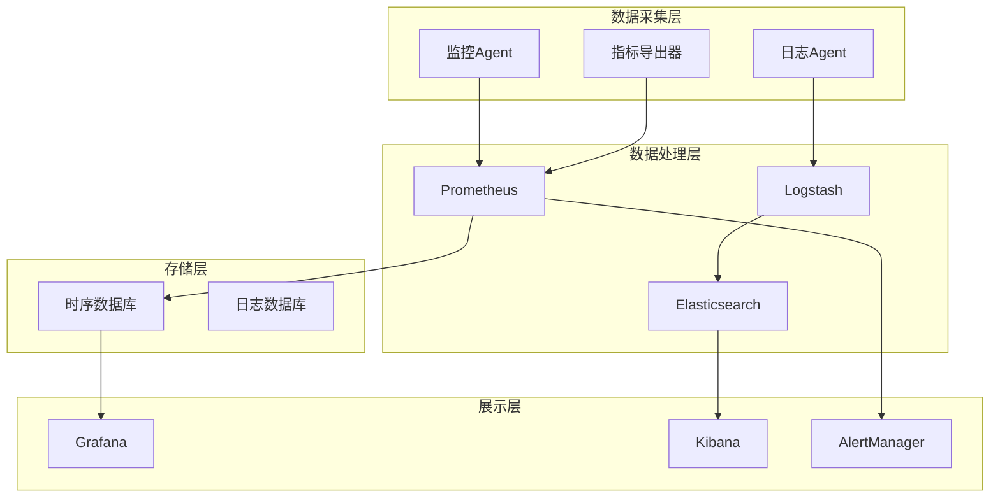
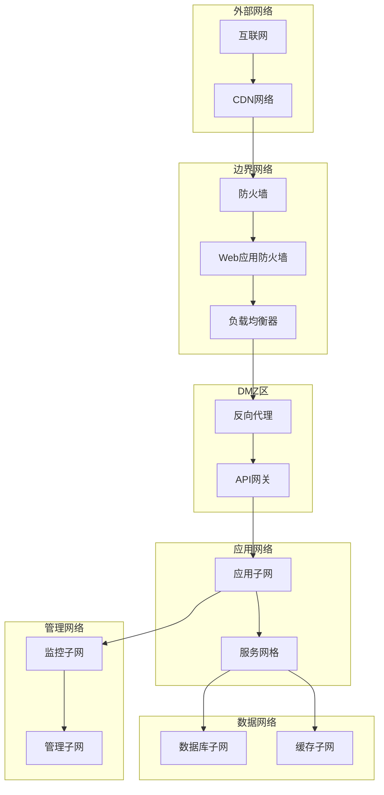
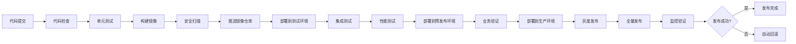

# 广告投放引擎部署架构设计

## 1. 设计概述

### 1.1 部署目标

构建高可用、高性能、易维护的广告投放引擎部署架构，支持多环境部署、自动化运维、弹性扩缩容和故障快速恢复，确保系统稳定运行和业务连续性。

### 1.2 部署原则

- **环境隔离**: 开发、测试、预发布、生产环境完全隔离
- **自动化部署**: 全流程自动化部署和回滚机制
- **容器化部署**: 基于容器的标准化部署方案
- **微服务架构**: 服务独立部署和扩展
- **监控可观测**: 完整的部署监控和日志追踪
- **安全防护**: 多层次安全防护和访问控制

### 1.3 技术选型

#### 核心技术栈
| 技术类别 | 技术选型           | 版本要求 | 用途说明     |
| -------- | ------------------ | -------- | ------------ |
| 容器平台 | Docker             | 20.10+   | 应用容器化   |
| 容器编排 | Kubernetes         | 1.24+    | 容器集群管理 |
| 服务网格 | Istio              | 1.16+    | 服务治理     |
| 负载均衡 | Nginx/Envoy        | Latest   | 流量分发     |
| 数据库   | SQL Server         | 2019+    | 数据存储     |
| 缓存     | Redis Cluster      | 6.2+     | 缓存服务     |
| 消息队列 | Apache Kafka       | 3.0+     | 异步消息     |
| 监控     | Prometheus/Grafana | Latest   | 系统监控     |

## 2. 环境架构设计

### 2.1 多环境架构




### 2.2 环境配置规范

#### 环境资源配置
| 环境类型   | CPU配置 | 内存配置 | 存储配置  | 网络配置 | 用途说明     |
| ---------- | ------- | -------- | --------- | -------- | ------------ |
| 开发环境   | 2核     | 4GB      | 100GB HDD | 100Mbps  | 功能开发调试 |
| 测试环境   | 4核     | 8GB      | 200GB SSD | 200Mbps  | 功能测试验证 |
| 预发布环境 | 8核     | 16GB     | 500GB SSD | 500Mbps  | 上线前验证   |
| 生产环境   | 16核    | 32GB     | 1TB SSD   | 1Gbps    | 正式运行     |

#### 环境隔离策略
- **网络隔离**: 不同环境使用独立的网络段
- **数据隔离**: 数据库实例完全分离
- **权限隔离**: 不同环境使用独立的账号体系
- **配置隔离**: 环境特定的配置参数管理

## 3. 容器化部署设计

### 3.1 Docker镜像设计

#### 镜像分层策略
```dockerfile
# 基础镜像层 - 操作系统和运行时
FROM mcr.microsoft.com/dotnet/aspnet:7.0

# 依赖层 - 第三方依赖库
COPY packages.json .
RUN install-packages

# 应用层 - 应用程序代码
COPY app/ /app/
WORKDIR /app

# 配置层 - 配置文件和启动脚本
COPY config/ /config/
COPY scripts/ /scripts/

EXPOSE 8080
ENTRYPOINT ["dotnet", "Lorn.ADSP.dll"]

```

#### 镜像优化策略
- **多阶段构建**: 减少镜像体积
- **层缓存优化**: 充分利用Docker层缓存
- **基础镜像选择**: 使用官方轻量级镜像
- **安全扫描**: 镜像安全漏洞扫描

### 3.2 Kubernetes部署配置

#### 核心工作负载配置
```yaml
# Deployment配置示例
apiVersion: apps/v1
kind: Deployment
metadata:
  name: ad-delivery-engine
  namespace: adsp-prod
spec:
  replicas: 3
  strategy:
    type: RollingUpdate
    rollingUpdate:
      maxSurge: 1
      maxUnavailable: 0
  template:
    spec:
      containers:
      - name: ad-engine
        image: adsp/ad-engine:v1.2.0
        ports:
        - containerPort: 8080
        resources:
          requests:
            cpu: 500m
            memory: 1Gi
          limits:
            cpu: 2000m
            memory: 4Gi
        readinessProbe:
          httpGet:
            path: /health
            port: 8080
          initialDelaySeconds: 30
          periodSeconds: 10
        livenessProbe:
          httpGet:
            path: /health
            port: 8080
          initialDelaySeconds: 60
          periodSeconds: 30

```

#### 服务发现配置
- **Service**: 内部服务发现和负载均衡
- **Ingress**: 外部流量接入和路由
- **ConfigMap**: 配置文件管理
- **Secret**: 敏感信息管理

## 4. 微服务部署架构

### 4.1 服务拆分策略

#### 服务分层部署

### 4.2 服务治理配置

#### 服务网格配置
- **流量管理**: 路由规则、负载均衡、故障转移
- **安全策略**: mTLS、访问控制、服务授权
- **可观测性**: 分布式追踪、指标收集、日志聚合
- **策略执行**: 限流、熔断、重试机制

#### 服务注册发现
| 组件         | 功能         | 配置要点     | 监控指标       |
| ------------ | ------------ | ------------ | -------------- |
| 服务注册中心 | 服务注册发现 | 健康检查配置 | 服务可用性     |
| 配置中心     | 配置管理     | 配置版本控制 | 配置更新成功率 |
| API网关      | 流量路由     | 路由规则配置 | 请求响应时间   |
| 负载均衡     | 流量分发     | 负载均衡算法 | 流量分布均匀度 |

## 5. 数据库部署架构

### 5.1 数据库集群设计

#### 主从复制架构



### 5.2 数据库配置优化

#### 性能配置参数
| 配置项       | 推荐值  | 说明         | 影响         |
| ------------ | ------- | ------------ | ------------ |
| 最大连接数   | 1000    | 并发连接限制 | 并发处理能力 |
| 缓冲池大小   | 70%内存 | 数据缓存大小 | 查询性能     |
| 日志文件大小 | 1GB     | 事务日志大小 | 写入性能     |
| 检查点间隔   | 5分钟   | 数据刷盘频率 | 恢复时间     |
| 查询超时     | 30秒    | 查询执行超时 | 资源保护     |

#### 高可用配置
- **Always On可用性组**: 自动故障转移
- **数据库镜像**: 实时数据同步
- **集群资源监控**: 节点健康检查
- **备份恢复策略**: 定期备份和恢复测试

## 6. 缓存集群部署

### 6.1 Redis集群架构

#### 集群拓扑设计


### 6.2 缓存部署配置

#### 集群配置参数
| 配置项       | 配置值  | 说明         | 用途         |
| ------------ | ------- | ------------ | ------------ |
| 集群节点数   | 6个     | 3主3从       | 高可用保证   |
| 内存分配     | 8GB     | 每节点内存   | 数据存储容量 |
| 持久化策略   | RDB+AOF | 混合持久化   | 数据安全保证 |
| 网络超时     | 5秒     | 集群通信超时 | 故障检测时间 |
| 故障转移时间 | 30秒    | 自动切换时间 | 服务恢复时间 |

## 7. 消息队列部署

### 7.1 Kafka集群设计

#### 集群架构配置


### 7.2 消息队列配置

#### 性能调优配置
| 配置项     | 推荐值 | 说明         | 性能影响     |
| ---------- | ------ | ------------ | ------------ |
| 副本因子   | 3      | 数据副本数   | 可用性保证   |
| 分区数     | 12     | Topic分区数  | 并发处理能力 |
| 批处理大小 | 16KB   | 批量发送大小 | 吞吐量提升   |
| 压缩算法   | LZ4    | 消息压缩     | 网络带宽优化 |
| 保留时间   | 7天    | 消息保留期   | 存储空间管理 |

## 8. 监控部署架构

### 8.1 监控体系部署

#### 监控组件架构


### 8.2 监控配置策略

#### 关键监控指标
| 监控类别 | 监控指标        | 采集频率 | 告警阈值  | 处理策略 |
| -------- | --------------- | -------- | --------- | -------- |
| 应用性能 | 响应时间、QPS   | 15秒     | P99>200ms | 自动扩容 |
| 系统资源 | CPU、内存使用率 | 30秒     | >80%      | 资源调度 |
| 业务指标 | 广告填充率      | 1分钟    | <85%      | 业务告警 |
| 错误监控 | 错误率、异常数  | 15秒     | >1%       | 立即告警 |

## 9. 网络架构设计

### 9.1 网络拓扑设计

#### 网络分层架构


### 9.2 网络安全配置

#### 安全策略配置
| 网络层级 | 安全措施   | 配置要点         | 防护目标     |
| -------- | ---------- | ---------------- | ------------ |
| 边界防护 | 防火墙规则 | 端口、IP白名单   | 外部攻击防护 |
| 应用防护 | WAF规则    | SQL注入、XSS防护 | Web攻击防护  |
| 内网隔离 | VLAN划分   | 网络段隔离       | 内网横向移动 |
| 流量加密 | TLS/SSL    | 证书管理         | 数据传输保护 |
| 访问控制 | ACL规则    | 最小权限原则     | 访问权限控制 |

## 10. 自动化部署流程

### 10.1 CI/CD流水线设计

#### 部署流程架构


### 10.2 部署自动化配置

#### 部署策略配置
| 部署策略   | 适用场景   | 风险程度 | 回滚时间 | 特点描述     |
| ---------- | ---------- | -------- | -------- | ------------ |
| 蓝绿部署   | 重要服务   | 低       | 秒级     | 零停机部署   |
| 滚动更新   | 无状态服务 | 中       | 分钟级   | 渐进式更新   |
| 灰度发布   | 新功能上线 | 低       | 分钟级   | 小流量验证   |
| 金丝雀发布 | 核心功能   | 极低     | 秒级     | 风险可控发布 |

#### 自动化工具配置
- **Jenkins/GitLab CI**: 持续集成流水线
- **Ansible/Terraform**: 基础设施即代码
- **Helm**: Kubernetes应用包管理
- **ArgoCD**: GitOps持续部署

## 11. 运维管理策略

### 11.1 运维自动化

#### 运维操作自动化
- **自动扩缩容**: 基于负载的弹性伸缩
- **自动故障恢复**: 服务自愈和故障转移
- **自动备份**: 定期数据备份和验证
- **自动巡检**: 系统健康状态检查

#### 运维工具集成
| 工具类型 | 工具名称           | 功能描述       | 使用场景     |
| -------- | ------------------ | -------------- | ------------ |
| 配置管理 | Ansible            | 配置自动化部署 | 环境配置管理 |
| 监控告警 | Prometheus+Grafana | 系统监控可视化 | 运行状态监控 |
| 日志管理 | ELK Stack          | 日志收集分析   | 问题排查诊断 |
| 性能分析 | APM工具            | 应用性能监控   | 性能瓶颈分析 |

### 11.2 容灾备份策略

#### 数据备份策略
- **全量备份**: 每日全量数据备份
- **增量备份**: 每小时增量数据备份
- **异地备份**: 跨地域数据备份
- **备份验证**: 定期备份恢复测试

#### 灾难恢复计划
| 灾难级别 | 恢复目标   | 恢复时间 | 恢复策略 | 数据丢失 |
| -------- | ---------- | -------- | -------- | -------- |
| 服务故障 | 单服务恢复 | 5分钟    | 服务重启 | 无       |
| 节点故障 | 节点切换   | 10分钟   | 故障转移 | 最小     |
| 机房故障 | 异地切换   | 30分钟   | 机房切换 | < 1小时  |
| 区域故障 | 跨区域切换 | 2小时    | 灾备激活 | < 4小时  |
