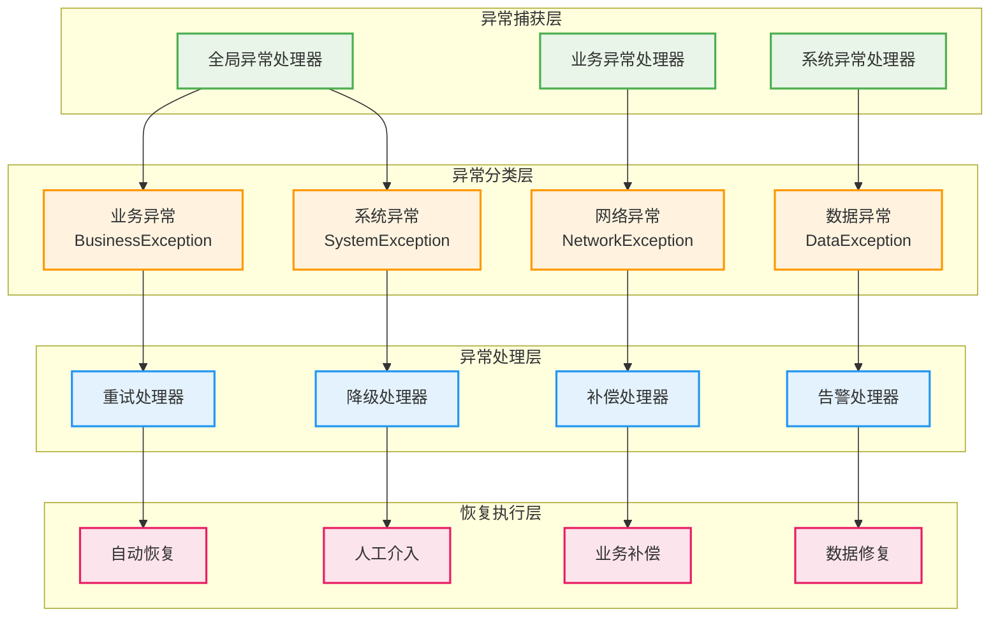
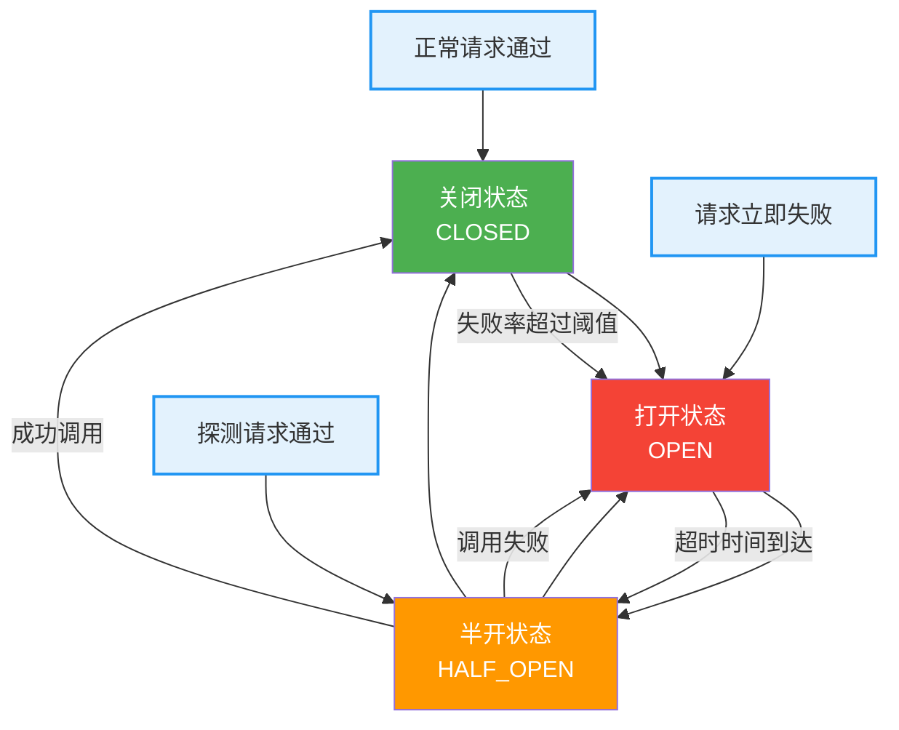
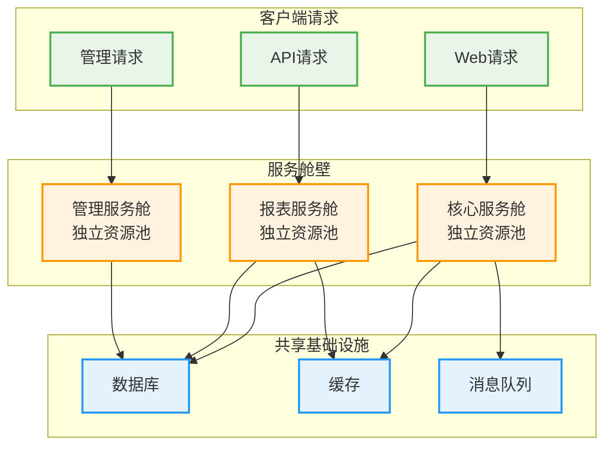
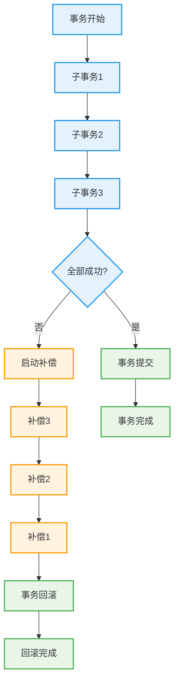

# 广告投放引擎错误处理与恢复设计

## 1. 设计概述

### 1.1 设计目标

构建健壮的错误处理与故障恢复机制，确保广告投放引擎在面对各种异常情况时能够快速识别、准确处理、自动恢复，最大化系统的可用性和业务连续性。

### 1.2 设计原则

- **快速失败**: 尽早发现和暴露错误，避免错误扩散
- **优雅降级**: 在部分功能异常时保持核心服务可用
- **自动恢复**: 对于可恢复的错误自动重试和修复
- **隔离故障**: 防止单点故障影响整个系统
- **可观测性**: 完整的错误监控和追踪机制
- **用户友好**: 向用户提供清晰的错误信息和处理建议

### 1.3 错误分类体系

#### 按影响范围分类
| 错误类型   | 影响范围 | 处理策略          | 恢复时间  | 示例           |
| ---------- | -------- | ----------------- | --------- | -------------- |
| 系统级错误 | 整个系统 | 立即告警+人工介入 | 15-30分钟 | 数据库集群故障 |
| 服务级错误 | 单个服务 | 自动重启+流量切换 | 2-5分钟   | 微服务实例崩溃 |
| 功能级错误 | 特定功能 | 功能降级+异步修复 | 1-2分钟   | 报表生成失败   |
| 请求级错误 | 单个请求 | 重试+错误响应     | 立即      | 参数验证失败   |

#### 按错误性质分类
| 错误性质   | 特征     | 处理方式 | 监控重点   |
| ---------- | -------- | -------- | ---------- |
| 暂时性错误 | 可能自愈 | 重试机制 | 重试成功率 |
| 永久性错误 | 需要修复 | 告警处理 | 错误趋势   |
| 业务错误   | 逻辑错误 | 业务处理 | 业务指标   |
| 系统错误   | 技术故障 | 技术处理 | 系统指标   |

## 2. 异常处理框架

### 2.1 异常层次架构



### 2.2 异常处理策略

#### 异常处理优先级
**处理级别定义**:
| 优先级  | 处理策略 | 响应时间 | 处理方式  |
| ------- | -------- | -------- | --------- |
| P0-致命 | 立即处理 | <5分钟   | 自动+人工 |
| P1-严重 | 优先处理 | <15分钟  | 自动为主  |
| P2-一般 | 正常处理 | <1小时   | 自动处理  |
| P3-轻微 | 延后处理 | <24小时  | 批量处理  |

#### 异常处理流程
```mermaid
graph TB
    A[异常发生] --> B[异常捕获]
    B --> C[异常识别]
    C --> D{异常类型}
    D -->|业务异常| E[业务处理逻辑]
    D -->|系统异常| F[系统恢复逻辑]
    D -->|未知异常| G[默认处理逻辑]
    
    E --> H{是否可重试}
    F --> I{是否可降级}
    G --> J[记录日志]
    
    H -->|是| K[执行重试]
    H -->|否| L[业务补偿]
    I -->|是| M[执行降级]
    I -->|否| N[服务熔断]
    
    K --> O{重试成功}
    L --> P[通知用户]
    M --> Q[降级监控]
    N --> R[告警通知]
    
    O -->|是| S[恢复正常]
    O -->|否| T[升级处理]
    
    J --> R
    P --> R
    Q --> R
    T --> R
    
    classDef start fill:#e8f5e8,stroke:#4caf50,stroke-width:2px
    classDef process fill:#fff3e0,stroke:#ff9800,stroke-width:2px
    classDef decision fill:#e3f2fd,stroke:#2196f3,stroke-width:2px
    classDef end fill:#fce4ec,stroke:#e91e63,stroke-width:2px
    
    class A,B,C start
    class E,F,G,K,L,M,N process
    class D,H,I,O decision
    class S,T,P,Q,R,J end
```

## 3. 重试机制设计

### 3.1 重试策略分类

#### 指数退避重试
**算法特点**:
- 重试间隔呈指数增长
- 避免瞬时大量重试
- 适用于瞬时故障恢复
- 可配置最大重试次数

**参数配置**:
| 参数名称 | 默认值 | 说明           | 调优建议             |
| -------- | ------ | -------------- | -------------------- |
| 初始延迟 | 100ms  | 第一次重试延迟 | 根据服务响应时间调整 |
| 退避因子 | 2.0    | 延迟增长倍数   | 1.5-3.0之间          |
| 最大延迟 | 30s    | 最大重试间隔   | 不超过超时时间       |
| 最大次数 | 3次    | 最大重试次数   | 根据错误类型调整     |
| 抖动因子 | 0.1    | 随机抖动比例   | 避免惊群效应         |

#### 固定间隔重试
**适用场景**:
- 网络抖动类错误
- 外部服务暂时不可用
- 资源竞争冲突
- 简单的连接失败

#### 线性递增重试
**特点说明**:
- 重试间隔线性增长
- 适中的退避策略
- 平衡性能和成功率
- 可预测的重试时间

### 3.2 重试条件设计

#### 可重试错误分类
**网络类错误**:
- 连接超时 (ConnectionTimeout)
- 读取超时 (ReadTimeout)
- 网络不可达 (NetworkUnreachable)
- 连接重置 (ConnectionReset)
- DNS解析失败 (DNSResolutionFailure)

**服务类错误**:
- 服务不可用 (503 Service Unavailable)
- 网关超时 (504 Gateway Timeout)
- 服务器过载 (429 Too Many Requests)
- 内部服务错误 (500 Internal Server Error)

**资源类错误**:
- 数据库连接池耗尽
- 内存不足异常
- 线程池满载
- 磁盘空间不足

#### 不可重试错误分类
**客户端错误**:
- 参数错误 (400 Bad Request)
- 认证失败 (401 Unauthorized)
- 权限不足 (403 Forbidden)
- 资源不存在 (404 Not Found)
- 方法不允许 (405 Method Not Allowed)

**业务逻辑错误**:
- 数据验证失败
- 业务规则冲突
- 状态不一致
- 重复操作错误

### 3.3 重试实现模式

#### 同步重试模式
**实现特点**:
- 调用线程阻塞等待
- 适用于实时性要求高的场景
- 简单直接的错误处理
- 可能影响系统吞吐量

#### 异步重试模式
**实现特点**:
- 非阻塞异步执行
- 使用消息队列实现
- 适用于批处理场景
- 提高系统整体性能

#### 智能重试模式
**自适应策略**:
- 根据历史成功率调整重试策略
- 基于错误类型动态选择重试算法
- 考虑系统负载动态调整重试间隔
- 集成熔断器避免恶性循环

## 4. 熔断器设计

### 4.1 熔断器状态机



### 4.2 熔断器配置策略

#### 熔断阈值配置
**基础配置参数**:
| 参数名称   | 默认值 | 说明                   | 调优建议             |
| ---------- | ------ | ---------------------- | -------------------- |
| 失败阈值   | 50%    | 触发熔断的失败率       | 根据服务SLA调整      |
| 最小请求数 | 20     | 统计失败率的最小请求数 | 避免小流量误判       |
| 统计窗口   | 60s    | 失败率统计时间窗口     | 平衡响应速度和准确性 |
| 熔断超时   | 30s    | 熔断器打开持续时间     | 给下游服务恢复时间   |
| 半开请求数 | 5      | 半开状态的探测请求数   | 平衡探测和保护       |

#### 分级熔断策略
**服务级别分类**:
| 服务重要性 | 失败阈值 | 熔断超时 | 恢复策略 | 降级方案     |
| ---------- | -------- | -------- | -------- | ------------ |
| 核心服务   | 60%      | 15s      | 快速恢复 | 最小化降级   |
| 重要服务   | 50%      | 30s      | 正常恢复 | 部分功能降级 |
| 一般服务   | 40%      | 60s      | 延迟恢复 | 功能禁用     |
| 辅助服务   | 30%      | 120s     | 缓慢恢复 | 完全降级     |

### 4.3 熔断恢复机制

#### 健康检查恢复
**检查策略**:
- 主动健康检查探测
- 被动流量探测恢复
- 分阶段流量恢复
- 监控指标验证恢复

#### 渐进式恢复
**恢复阶段设计**:
1. **探测阶段**: 5%流量验证服务可用性
2. **试探阶段**: 20%流量测试服务稳定性  
3. **部分恢复**: 50%流量确认服务性能
4. **完全恢复**: 100%流量恢复正常服务

## 5. 降级策略设计

### 5.1 降级触发条件

#### 自动降级触发
**系统性能指标**:
- CPU使用率 > 80%
- 内存使用率 > 85%
- 数据库连接数 > 90%
- 响应时间 P95 > 5秒
- 错误率 > 10%

**业务指标触发**:
- 广告请求量突增 200%
- 竞价响应超时率 > 15%
- 数据库查询超时 > 20%
- 外部服务不可用

#### 手动降级触发
**运维触发场景**:
- 系统维护期间
- 重大版本发布
- 预期流量激增
- 安全事件响应

### 5.2 降级级别设计

#### 功能降级分级
| 降级级别    | 保留功能 | 停用功能   | 用户体验 |
| ----------- | -------- | ---------- | -------- |
| L1-轻度降级 | 核心功能 | 非核心功能 | 轻微影响 |
| L2-中度降级 | 基础功能 | 高级功能   | 明显影响 |
| L3-重度降级 | 最小功能 | 大部分功能 | 严重影响 |
| L4-极限降级 | 只读功能 | 写入功能   | 仅可查看 |

#### 业务降级策略
**广告投放降级**:
- L1: 停用复杂定向算法，使用简化规则
- L2: 停用实时竞价，使用固定价格
- L3: 停用个性化推荐，使用默认广告
- L4: 停用所有广告投放，显示默认内容

**报表分析降级**:
- L1: 停用实时报表，使用近实时数据
- L2: 停用复杂图表，使用简单统计
- L3: 停用自定义报表，使用预置模板
- L4: 停用所有报表功能，显示缓存数据

### 5.3 降级恢复管理

#### 降级状态监控
**监控维度**:
- 降级功能使用情况
- 用户行为变化分析
- 系统性能指标变化
- 业务指标影响评估

#### 恢复条件判断
**自动恢复条件**:
- 系统负载恢复正常
- 错误率降低到阈值以下
- 响应时间恢复正常范围
- 依赖服务完全可用

## 6. 故障隔离设计

### 6.1 隔离策略分类

#### 物理隔离
**基础设施隔离**:
- 不同可用区部署
- 独立的网络分段
- 分离的存储系统
- 专用的计算资源

#### 逻辑隔离
**软件层面隔离**:
- 微服务架构隔离
- 数据库租户隔离
- 缓存命名空间隔离
- 消息队列主题隔离

#### 资源隔离
**资源配额管理**:
- CPU和内存限制
- 网络带宽分配
- 存储空间配额
- 数据库连接池分离

### 6.2 舱壁模式实现

#### 服务舱壁设计


#### 线程池隔离
**线程池配置策略**:
| 业务类型 | 核心线程数 | 最大线程数 | 队列大小 | 拒绝策略      |
| -------- | ---------- | ---------- | -------- | ------------- |
| 广告投放 | 20         | 50         | 1000     | CallerRuns    |
| 竞价处理 | 10         | 30         | 500      | Discard       |
| 报表生成 | 5          | 15         | 200      | DiscardOldest |
| 管理操作 | 3          | 10         | 100      | AbortPolicy   |

### 6.3 超时控制设计

#### 分层超时策略
**超时时间配置**:
| 层次     | 超时时间 | 说明           | 异常处理         |
| -------- | -------- | -------------- | ---------------- |
| 网关层   | 30s      | 总体请求超时   | 返回网关超时错误 |
| 服务层   | 20s      | 服务处理超时   | 启动降级或重试   |
| 数据库   | 10s      | 数据库查询超时 | 连接池重置       |
| 缓存     | 2s       | 缓存访问超时   | 直接访问数据源   |
| 外部调用 | 5s       | 第三方服务超时 | 使用默认值或缓存 |

#### 超时传播机制
**超时传递设计**:
- 上游超时时间向下传递
- 保留足够的处理时间缓冲
- 考虑网络延迟和重试开销
- 避免级联超时问题

## 7. 数据一致性保证

### 7.1 事务管理策略

#### 分布式事务处理
**事务模式选择**:
- **2PC模式**: 强一致性要求的核心业务
- **TCC模式**: 高性能要求的业务场景
- **Saga模式**: 长事务和复杂业务流程
- **本地消息表**: 最终一致性业务场景

#### 事务补偿机制
**补偿策略设计**:


### 7.2 数据恢复机制

#### 数据备份策略
**备份类型配置**:
| 备份类型 | 频率   | 保留期 | 恢复点   | 用途     |
| -------- | ------ | ------ | -------- | -------- |
| 全量备份 | 每日   | 30天   | 24小时前 | 灾难恢复 |
| 增量备份 | 每小时 | 7天    | 1小时前  | 快速恢复 |
| 事务日志 | 实时   | 3天    | 实时     | 精确恢复 |
| 快照备份 | 每周   | 90天   | 1周前    | 长期存档 |

#### 数据校验机制
**一致性校验**:
- 主从数据一致性检查
- 分片数据完整性验证
- 缓存与数据库同步检查
- 业务数据逻辑校验

## 8. 监控与告警

### 8.1 错误监控指标

#### 系统级监控指标
| 指标类别 | 监控指标       | 告警阈值 | 统计周期 |
| -------- | -------------- | -------- | -------- |
| 错误率   | HTTP 5xx错误率 | >5%      | 1分钟    |
| 响应时间 | P95响应时间    | >2秒     | 1分钟    |
| 可用性   | 服务健康检查   | <99%     | 30秒     |
| 重试率   | 重试请求比例   | >20%     | 5分钟    |
| 熔断状态 | 熔断器打开数量 | >0       | 实时     |

#### 业务级监控指标
| 指标类别 | 监控指标       | 告警阈值 | 统计周期 |
| -------- | -------------- | -------- | -------- |
| 广告投放 | 投放失败率     | >10%     | 5分钟    |
| 竞价处理 | 竞价超时率     | >15%     | 1分钟    |
| 用户请求 | 请求处理失败率 | >5%      | 2分钟    |
| 数据同步 | 数据同步延迟   | >5分钟   | 1分钟    |

### 8.2 告警机制设计

#### 告警级别分类
**告警严重级别**:
| 级别     | 响应时间 | 通知方式       | 处理策略 |
| -------- | -------- | -------------- | -------- |
| Critical | 立即     | 电话+短信+邮件 | 立即处理 |
| Warning  | 5分钟    | 短信+邮件      | 优先处理 |
| Info     | 30分钟   | 邮件+IM        | 正常处理 |
| Debug    | 2小时    | 日志记录       | 分析处理 |

#### 告警收敛策略
**告警优化机制**:
- 同类告警合并通知
- 告警频率限制控制
- 告警升级机制
- 告警恢复通知
- 值班轮换管理

### 8.3 故障追踪分析

#### 分布式链路追踪
**追踪数据结构**:
- TraceID: 全局唯一请求标识
- SpanID: 服务调用标识
- ParentSpanID: 父调用关系
- 错误标记和异常信息
- 性能时间统计

#### 根因分析支持
**分析维度**:
- 错误传播路径分析
- 性能瓶颈定位
- 依赖关系梳理
- 时间序列关联分析
- 业务影响范围评估

## 9. 总结

### 9.1 错误处理体系优势

本广告投放引擎错误处理与恢复设计通过多层次的防护机制和智能化的恢复策略，为系统提供了强大的容错能力：

**技术架构优势**:
- **多层防护**: 从请求到系统的多层错误处理机制
- **智能重试**: 基于错误类型的自适应重试策略
- **快速熔断**: 毫秒级故障检测和秒级熔断保护
- **优雅降级**: 分级降级策略保障核心功能可用
- **自动恢复**: 智能化的故障恢复和服务自愈能力

**业务连续性保障**:
- **高可用性**: 99.9%以上的服务可用性保障
- **故障隔离**: 单点故障不影响整体服务
- **数据一致性**: 分布式环境下的数据完整性保证
- **用户体验**: 错误对用户的影响最小化
- **快速恢复**: 故障恢复时间控制在分钟级别

### 9.2 关键技术能力

#### 错误识别与分类能力
- **实时错误检测**: 毫秒级的错误识别和分类
- **智能错误分析**: 基于模式识别的错误类型判断
- **错误影响评估**: 快速评估错误对业务的影响范围
- **错误趋势预测**: 基于历史数据预测错误发展趋势

#### 自动化处理能力
- **智能重试机制**: 基于错误特征的自适应重试策略
- **动态熔断保护**: 实时监控和动态熔断阈值调整
- **自动降级决策**: 基于系统状态的自动降级触发
- **故障自愈能力**: 常见故障的自动检测和修复

#### 容错设计能力
- **舱壁模式隔离**: 资源隔离防止故障扩散
- **超时控制机制**: 分层超时防止级联故障
- **数据一致性保障**: 分布式事务和补偿机制
- **服务降级保护**: 分级降级保障核心功能

### 9.3 持续改进建议

#### 技术能力提升
- **AI错误预测**: 引入机器学习提升错误预测能力
- **自适应参数调优**: 基于运行数据自动优化参数配置
- **混沌工程**: 通过混沌工程验证和提升容错能力
- **智能运维**: 结合AIOps提升自动化运维水平

#### 治理体系完善
- **错误模式库**: 建立完善的错误模式知识库
- **最佳实践**: 总结和推广错误处理最佳实践
- **团队培训**: 加强团队的错误处理能力培训
- **工具平台**: 建设更完善的错误处理工具平台

错误处理与恢复机制作为广告投放引擎的重要保障，需要在系统演进过程中持续优化和完善。通过智能化的错误识别、自动化的处理策略、完善的容错设计和全面的监控体系，确保广告投放业务能够在复杂的分布式环境中稳定运行，为用户提供可靠的服务体验。
