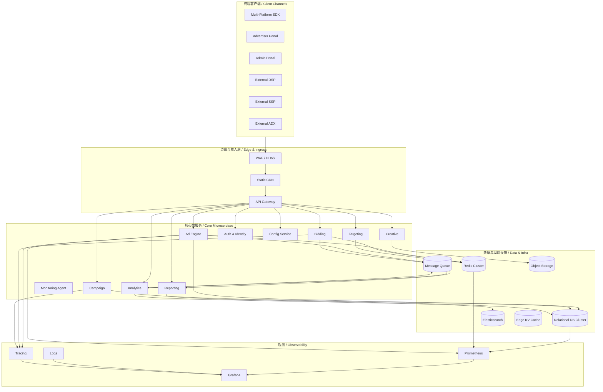
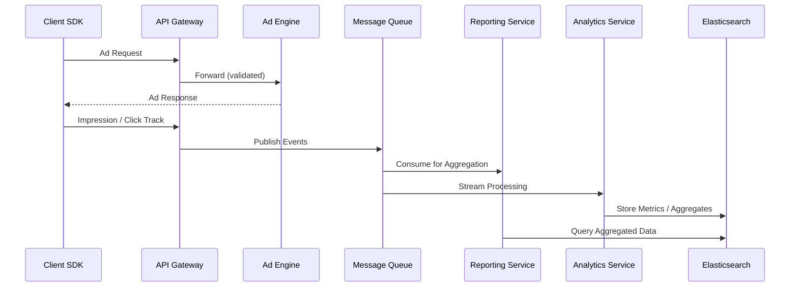
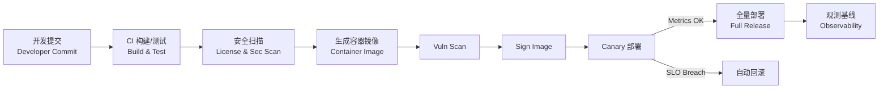

# 广告系统部署架构设计与拓扑图  
# Advertising System Deployment Architecture & Topology

> 说明：本文件展示 Lorn.ADSP 广告系统在生产环境的标准部署架构（多区域高可用、微服务分层、数据与消息基础设施、CI/CD 与观测体系），并作为运维、架构评审及容量规划的统一参考。  
> Note: This document presents the standard production deployment architecture of the Lorn.ADSP advertising system (multi‑region HA, layered microservices, data & messaging infrastructure, CI/CD and observability stack) and serves as the single reference for operations, architecture review, and capacity planning.

## 1. 范围与目标  
## 1. Scope & Objectives
本部署架构聚焦：广告投放引擎（AdEngine）、竞价 / 定向 / 报表 / 分析等核心微服务，以及外围接入（DSP/SSP/ADX/Advertiser Portal）、运营后台、数据层与监控告警。  
This deployment architecture focuses on: the Ad Engine, bidding / targeting / reporting / analytics microservices, external integration (DSP/SSP/ADX/Advertiser Portal), operations admin portal, data layer, and monitoring & alerting.
主要目标：高可用（99.9%+）、低延迟（投放链路 P99 < 50ms）、弹性水平扩展、跨区域灾备（RPO≤5min，RTO≤15min）。  
Key goals: High availability (99.9%+), low latency (delivery path P99 < 50ms), horizontal elasticity, cross‑region DR (RPO ≤ 5 min, RTO ≤ 15 min).

## 2. 环境分层  
## 2. Environment Segmentation
典型环境：Dev / Test / Staging / Prod；Staging 与 Prod 架构等价（缩容），用于性能与回归验证。  
Typical environments: Dev / Test / Staging / Prod; Staging mirrors Prod architecture (scaled down) for performance and regression validation.
安全隔离：不同环境使用独立 VPC / 虚拟网络与独立 IAM / 密钥集合，禁用跨环境数据库直连。  
Security isolation: Each environment uses dedicated VPC / virtual network and isolated IAM / secrets; cross‑environment DB direct access is prohibited.

## 3. 高层部署视图 (C4 Deployment Level)  
## 3. High-level Deployment View (C4 Level)
下图展示客户端、边缘层、网关层、微服务层、数据与观测层的交互关系。  
The diagram below shows interactions across clients, edge, gateway, microservices, data and observability layers.



## 4. 区域与可用区拓扑  
## 4. Region & Availability Zone Topology
生产部署建议“双区域 + 每区域三可用区”，广告投放与竞价组件在主区域多活，次区域热备 + 只读分析。  
Production deployment recommends "Dual Region + Three AZ per region"; ad delivery & bidding components are active in the primary region, secondary region is warm standby + read‑only analytics.

```mermaid
flowchart LR
    subgraph RegionA[Region A (Primary)]
        subgraph A_AZ1[AZ1]
            K8s1[(K8s NodePool A1)]
        end
        subgraph A_AZ2[AZ2]
            K8s2[(K8s NodePool A2)]
        end
        subgraph A_AZ3[AZ3]
            K8s3[(K8s NodePool A3)]
        end
        AdPods[AdEngine Pods HPA]
        BidPods[Bidding Pods]
        TargetPods[Targeting Pods]
        RedisA[(Redis Cluster A)]
        SQLA[(Primary DB A - Writer)]
        MQA[(MQ Cluster A)]
    end
    subgraph RegionB[Region B (DR / Secondary)]
        subgraph B_AZ1[AZ1]
            K8s4[(K8s NodePool B1)]
        end
        subgraph B_AZ2[AZ2]
            K8s5[(K8s NodePool B2)]
        end
        subgraph B_AZ3[AZ3]
            K8s6[(K8s NodePool B3)]
        end
        ReadReplicas[(DB Read Replicas)]
        RedisB[(Redis Replica)]
        MQB[(MQ Mirror)]
        ReportingB[Reporting Pods]
        AnalyticsB[Analytics Pods]
    end
    SQLA <-- WAL/CDC Replication --> ReadReplicas
    RedisA <-- Async Replication --> RedisB
    MQA <-- Mirror Sync --> MQB
    AdPods --> RedisA
    AdPods --> SQLA
```

## 5. 网络与安全分层  
## 5. Network & Security Layers
VPC 子网分层：Public(Edge/WAF/API GW) / Private-App(K8s Nodes) / Private-Data(DB/Redis/MQ/ES)；安全组实施“最小端口暴露”，DB 仅接受应用子网访问。  
VPC subnet tiers: Public (Edge/WAF/API GW) / Private-App (K8s Nodes) / Private-Data (DB/Redis/MQ/ES); security groups enforce least‑privilege port exposure, DB only accepts App subnet traffic.
零信任：内部服务通信使用 mTLS + SPIFFE ID，API 网关 OAuth2 + JWT，下游调用带有短期令牌。  
Zero trust: Internal service traffic uses mTLS + SPIFFE IDs; API Gateway OAuth2 + JWT; downstream calls carry short-lived tokens.

## 6. 数据层部署策略  
## 6. Data Layer Deployment Strategy
关系型数据库：主写 + 只读副本，使用自动故障转移与时间点恢复；Redis 用作低延迟查询与频控计数；MQ 支撑异步事件 (曝光/点击/转化流)；ES 专注日志与聚合查询。  
Relational DB: primary write + read replicas with automatic failover & point‑in‑time recovery; Redis for low‑latency lookups & frequency capping counters; MQ for async events (impression/click/conversion streams); ES for logs & aggregation queries.
冷热数据：7 日内热数据驻留 Redis + 行存索引，历史归档至对象存储 + 周期性预聚合进入 ES。  
Hot/cold data: Hot (≤7 days) in Redis + rowstore indexes; historical archived to object storage + periodically pre‑aggregated into ES.

## 7. 消息与数据流  
## 7. Messaging & Data Flow
下图展示曝光/点击事件异步流入分析与报表，避免阻塞投放主路径。  
The diagram shows asynchronous impression/click events feeding analytics & reporting, avoiding blocking the delivery hot path.



## 8. 弹性伸缩与容量规划  
## 8. Elastic Scaling & Capacity Planning
投放与竞价服务基于 HPA 指标：CPU 60%、P95 延迟、队列长度；最小副本满足夜间底线吞吐，最大副本满足峰值 *1.5 安全冗余。  
Delivery & bidding services scale via HPA metrics: CPU 60%, P95 latency, queue length; min replicas handle off‑peak baseline, max replicas sized at peak *1.5 safety margin.
初始容量估算示例（可根据压测修正）：  
Initial sizing example (adjust after load tests):

| 组件 / Component | 初始副本 / Replicas | 峰值QPS/实例 | 峰值延迟P99(ms) 目标 |
| ---------------- | ------------------- | ------------ | -------------------- |
| Ad Engine        | 8                   | 2k           | <50                  |
| Bidding          | 6                   | 1.2k         | <60                  |
| Targeting        | 6                   | 1.2k         | <60                  |
| Reporting API    | 4                   | 300          | <120                 |
| Analytics Stream | 4                   | 500 evt/s    | <500 (end2end)       |

## 9. 可观测性与运维  
## 9. Observability & Operations
三支柱：Metrics(Prometheus) + Logs(Loki/ES) + Traces(OpenTelemetry)，统一仪表盘（Grafana）与告警路由（Critical=Pager, Warning=Email/Chat）。  
Three pillars: Metrics (Prometheus), Logs (Loki/ES), Traces (OpenTelemetry) with unified dashboards (Grafana) and alert routing (Critical=Pager, Warning=Email/Chat).
SLO 监控：请求成功率 ≥ 99.5%，投放延迟 P99 < 50ms；错误预算驱动发布节奏。  
SLO tracking: request success rate ≥ 99.5%, delivery latency P99 < 50ms; error budget influences release cadence.

## 10. CI/CD 流程  
## 10. CI/CD Pipeline
采用 trunk-based + Git PR 审核：构建→单元/集成测试→安全/许可证扫描→容器镜像→扫描→签名→部署 (Canary→全量)→回滚策略。  
Trunk-based with Git PR review: build → unit/integration tests → security/license scan → container image → scan → sign → deploy (Canary → full) → rollback strategy.



## 11. 风险与缓解  
## 11. Risks & Mitigations
| 风险             | 影响     | 缓解                      |     | Risk                  | Impact        | Mitigation                               |
| ---------------- | -------- | ------------------------- | --- | --------------------- | ------------- | ---------------------------------------- |
| 单区域故障       | 服务中断 | 双区域热备 / 自动故障转移 |     | Single region failure | Outage        | Dual region warm standby / auto failover |
| 流量突增         | 延迟上升 | 预热 Pod + 峰值压测容量   |     | Traffic spike         | Latency       | Pod pre‑warm + peak load testing         |
| Redis 热点       | 频控失效 | Sharding + 本地 L1 缓存   |     | Redis hotspot         | Throttle fail | Sharding + local L1 cache                |
| 长尾查询拖慢分析 | 报表变慢 | 预聚合 + 异步导出         |     | Long tail queries     | Slow reports  | Pre‑aggregation + async export           |

## 12. 实施指引摘要  
## 12. Implementation Guidance Summary
K8s 资源命名：namespace 按域 (ad-engine, bidding, targeting, data, platform)；配置与密钥使用 GitOps (Sealed Secrets)；跨区域复制使用数据库原生复制 + 异步消息镜像。  
K8s resource naming: namespaces by domain (ad-engine, bidding, targeting, data, platform); config & secrets via GitOps (Sealed Secrets); cross‑region replication via DB native replication + async message mirroring.
发布策略：核心投放组件优先 Canary 5%→25%→100%，监控错误率与延迟回归；非关键异步服务可直接蓝绿。  
Release strategy: Core delivery components canary 5%→25%→100% monitoring error rate & latency regression; non‑critical async services may use blue‑green.

---
> 更新策略：架构变更需同步更新中英双语段落，并附容量基准压测报告链接。  
> Update policy: Architecture changes must update both Chinese & English paragraphs and attach a capacity benchmark report link.
