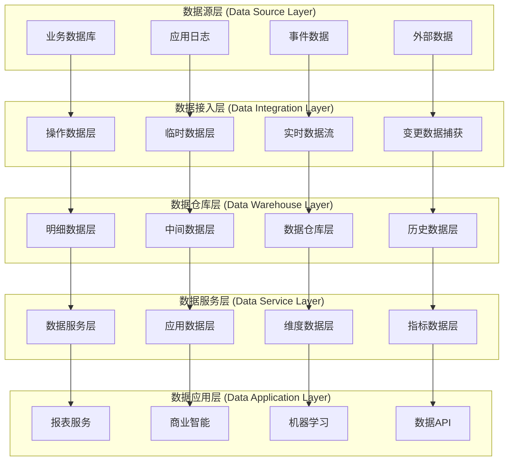
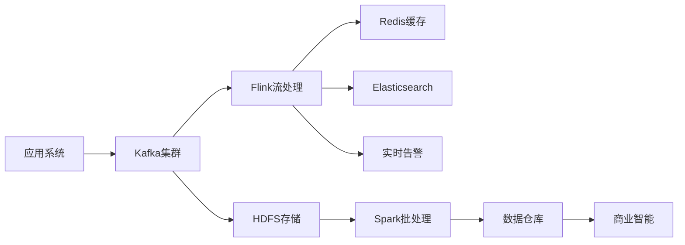

# 数据架构设计

## 架构概述

Lorn.ADSP数据架构采用分层设计理念，通过合理的数据分层、多样化的存储选型、高效的数据流转，构建支撑大规模广告业务的数据底座。架构充分考虑了广告系统的高并发读写、实时性要求、数据一致性等特殊需求。

## 数据分层架构

### 逻辑分层设计



### 数据分层说明

#### 操作数据层 (ODS)
- **定位**: 数据的初始接入层
- **功能**: 原始数据临时存储和初步清洗
- **特点**: 数据保持原始格式，按天分区存储
- **保留周期**: 7天，用于数据重跑和问题排查

#### 数据仓库层 (DW)
- **明细数据层 (DWD)**: 清洗后的明细数据
- **中间数据层 (DWM)**: 基于业务规则的数据整合
- **汇总数据层 (DWS)**: 基于主题的数据汇总
- **应用数据层 (ADS)**: 面向应用的数据服务

#### 数据服务层 (DM)
- **报表数据**: 预计算的报表和仪表板数据
- **分析数据**: 深度分析和挖掘结果
- **实时数据**: 实时计算的业务指标
- **接口数据**: 对外提供的数据API

## 存储架构设计

### 存储分类选型

#### 关系型数据库 - SQL Server
**使用场景**
- 核心业务数据存储
- 事务性操作要求
- 复杂查询和关联分析
- 数据一致性要求高

**架构配置**
- **主从架构**: 1主2从配置
- **读写分离**: 写主读从，负载分担
- **高可用**: Always On可用性组
- **备份策略**: 全量+差异+日志备份

**数据分布**
```
生产库集群:
├── 主库 (Primary)
│   ├── 广告主数据库 (AdspAdvertiser)
│   ├── 活动数据库 (AdspCampaign)  
│   ├── 创意数据库 (AdspCreative)
│   └── 系统数据库 (AdspSystem)
├── 从库1 (Secondary-1)
│   └── 只读副本 (实时报表查询)
└── 从库2 (Secondary-2)
    └── 只读副本 (数据分析查询)
```

#### 分布式缓存 - Redis Cluster
**使用场景**
- 热点数据缓存
- 会话状态存储
- 分布式锁实现
- 实时计数器

**集群配置**
- **节点数量**: 3主3从
- **数据分片**: 16384个hash slot
- **持久化**: RDB+AOF双重持久化
- **高可用**: 哨兵模式监控

**数据分类**
```
缓存分类:
├── 热点数据缓存 (TTL: 5分钟)
│   ├── 活跃广告信息
│   ├── 用户画像数据
│   └── 定向规则缓存
├── 会话数据缓存 (TTL: 30分钟)
│   ├── 用户登录状态
│   ├── API访问令牌
│   └── 临时业务状态
└── 统计数据缓存 (TTL: 1小时)
    ├── 实时展示统计
    ├── 点击率数据
    └── 转化率统计
```

#### 搜索引擎 - Elasticsearch
**使用场景**
- 全文搜索功能
- 日志分析查询
- 实时数据聚合
- 复杂条件筛选

**集群配置**
- **节点类型**: 3个Master节点 + 6个Data节点
- **索引策略**: 按时间滚动索引
- **副本配置**: 1主1副本
- **存储优化**: 冷热数据分离

#### 消息队列 - RabbitMQ & Kafka
**RabbitMQ使用场景**
- 业务事件消息
- 任务调度队列
- 系统间解耦通信
- 可靠消息传递

**Kafka使用场景**
- 大数据流处理
- 日志数据收集
- 实时数据同步
- 事件溯源存储

### 数据分库分表策略

#### 水平分片策略

**广告展示数据分片**
```
分片维度: 按日期 + 用户ID Hash
分片规则: 
- 按日期分库: ad_impression_YYYYMM
- 按用户ID分表: ad_impression_YYYYMMDD_[0-31]
保留策略: 热数据3个月，冷数据12个月，历史数据归档
```

**用户行为数据分片**
```
分片维度: 按用户ID Hash
分片规则:
- 用户画像: user_profile_[0-7] (8个分片)
- 行为日志: user_behavior_YYYYMMDD_[0-15] (16个分片)
索引策略: 用户ID主键索引 + 时间范围索引
```

#### 垂直分片策略

**业务域分离**
```
广告主域:
├── advertiser (广告主基础信息)
├── account (账户财务信息)
└── auth (认证授权信息)

活动域:
├── campaign (广告活动信息)
├── creative (广告创意信息)
└── targeting (定向规则信息)

数据域:
├── impression (展示数据)
├── click (点击数据)
└── conversion (转化数据)
```

## 数据流架构

### 实时数据流

#### 流处理架构


#### 流处理任务
**实时指标计算**
- 广告展示实时统计
- 点击率实时计算
- 预算消耗实时监控
- 异常行为实时检测

**实时数据同步**
- 业务数据变更同步
- 缓存数据实时更新
- 搜索索引实时维护
- 报表数据实时刷新

### 批量数据流

#### ETL处理流程
```
数据抽取 (Extract):
├── 增量数据抽取 (CDC)
├── 全量数据抽取 (Snapshot)
├── 日志数据采集 (Filebeat)
└── 外部数据接入 (API/FTP)

数据转换 (Transform):
├── 数据清洗和验证
├── 格式标准化转换
├── 业务规则计算
└── 数据质量检查

数据加载 (Load):
├── 数据仓库加载
├── 维度表更新
├── 指标数据生成
└── 报表数据刷新
```

## 数据质量保障

### 数据质量维度

#### 完整性 (Completeness)
- **字段完整性**: 关键字段非空检查
- **记录完整性**: 数据条数对比验证
- **时间完整性**: 时间序列数据连续性
- **关联完整性**: 关联表数据存在性

#### 准确性 (Accuracy) 
- **格式准确性**: 数据格式规范检查
- **范围准确性**: 数值范围合理性验证
- **逻辑准确性**: 业务逻辑一致性检查
- **引用准确性**: 外键引用有效性验证

#### 一致性 (Consistency)
- **系统间一致性**: 多系统数据同步一致
- **时间点一致性**: 同一时点数据统一
- **计算一致性**: 相同计算逻辑结果一致
- **格式一致性**: 数据格式标准统一

#### 及时性 (Timeliness)
- **实时性**: 实时数据延迟控制
- **时效性**: 数据时效性监控
- **同步性**: 数据同步时间窗口
- **更新性**: 数据更新频率保障

### 数据质量监控

#### 监控指标体系
```
数据量监控:
├── 每日数据增量监控
├── 数据表行数变化监控
├── 关键业务指标监控
└── 异常数据量告警

数据质量监控:
├── 空值率监控
├── 重复率监控  
├── 异常值监控
└── 一致性监控

数据时效监控:
├── 数据延迟监控
├── ETL任务时长监控
├── 实时流处理延迟
└── 数据同步状态监控
```

#### 自动化检测
- **规则引擎**: 可配置的数据质量规则
- **异常检测**: 基于统计学的异常发现
- **阈值告警**: 关键指标阈值监控
- **趋势分析**: 数据质量趋势分析

## 数据安全架构

### 数据分级分类

#### 敏感级别分类
```
公开数据 (Public):
├── 广告展示统计
├── 行业报告数据
└── 公开市场数据

内部数据 (Internal):
├── 业务运营数据
├── 系统配置信息
└── 技术架构文档

敏感数据 (Sensitive):
├── 用户个人信息
├── 广告主商业数据
└── 财务交易数据

机密数据 (Confidential):
├── 核心算法模型
├── 商业机密信息
└── 战略规划数据
```

#### 数据处理策略
- **脱敏处理**: 敏感数据自动脱敏
- **加密存储**: 机密数据加密存储
- **访问控制**: 基于角色的数据访问
- **审计跟踪**: 完整的数据访问日志

### 隐私保护机制

#### GDPR合规设计
- **数据最小化**: 按需收集和处理数据
- **用户同意**: 明确的用户授权机制
- **数据可携**: 支持数据导出功能
- **被遗忘权**: 支持数据删除请求

#### 技术实现手段
- **差分隐私**: 统计查询隐私保护
- **同态加密**: 加密数据上的计算
- **安全多方计算**: 多方数据协作
- **联邦学习**: 分布式机器学习

## 性能优化策略

### 查询性能优化

#### 索引优化策略
```sql
-- 复合索引设计
CREATE INDEX IX_Campaign_Status_Budget_Date 
ON Campaigns (Status, Budget, StartDate, EndDate)
INCLUDE (Id, Name, AdvertiserId);

-- 分区索引设计  
CREATE INDEX IX_AdImpression_UserId_Date
ON AdImpressions (UserId, ImpressionDate)
ON PartitionScheme_Date(ImpressionDate);

-- 覆盖索引设计
CREATE INDEX IX_Creative_Campaign_Cover
ON Creatives (CampaignId, Status)
INCLUDE (Id, Title, ImageUrl, ClickUrl);
```

#### 查询优化技巧
- **分页优化**: 基于游标的高效分页
- **子查询优化**: EXISTS替代IN子查询
- **连接优化**: 合适的连接类型选择
- **执行计划**: 定期执行计划分析

### 存储性能优化

#### 分区策略优化
- **时间分区**: 按月/日进行数据分区
- **Hash分区**: 基于关键字段Hash分区  
- **范围分区**: 基于数值范围分区
- **列分区**: 按列存储优化查询

#### 压缩策略优化
- **行级压缩**: 重复数据行级压缩
- **页级压缩**: 页面级数据压缩
- **列式压缩**: 列存储格式压缩
- **归档压缩**: 历史数据高比例压缩

## 容灾备份策略

### 备份架构设计

#### 备份策略分级
```
核心数据备份 (RTO: 1小时, RPO: 5分钟):
├── 实时数据同步 (Always On)
├── 事务日志备份 (每5分钟)
├── 差异备份 (每4小时)
└── 完整备份 (每日凌晨)

重要数据备份 (RTO: 4小时, RPO: 30分钟):
├── 数据库镜像同步
├── 事务日志备份 (每30分钟)
├── 差异备份 (每12小时)
└── 完整备份 (每日)

一般数据备份 (RTO: 24小时, RPO: 24小时):
├── 数据库快照
├── 完整备份 (每日)
└── 归档存储 (每周)
```

#### 多地域容灾
- **同城双活**: 主备数据中心同城部署
- **异地灾备**: 异地数据中心定期同步
- **云端备份**: 云存储定期备份
- **离线归档**: 重要数据离线存储

### 故障恢复机制

#### 自动故障转移
- **数据库**: Always On自动故障转移
- **缓存**: Redis Sentinel自动切换
- **搜索**: Elasticsearch集群自动恢复
- **消息**: RabbitMQ镜像队列切换

#### 数据恢复流程
1. **故障检测**: 自动故障检测机制
2. **影响评估**: 快速评估故障影响范围
3. **应急响应**: 启动应急响应流程
4. **数据恢复**: 按优先级恢复数据服务
5. **验证测试**: 恢复后功能验证测试
6. **复盘改进**: 故障原因分析和改进

## 总结

Lorn.ADSP数据架构通过科学的分层设计、合理的存储选型、高效的数据流转、完善的质量保障、全面的安全防护和可靠的容灾备份，构建了一个稳定、高效、安全的数据底座。该架构充分考虑了广告系统的业务特点和技术要求，能够支撑平台的长期发展和规模扩展需求。

### 架构优势
1. **高性能**: 多级缓存和读写分离提供极致性能
2. **高可用**: 多副本和自动故障转移保障服务可用性  
3. **高扩展**: 分库分表和集群架构支持水平扩展
4. **数据质量**: 全面的数据质量监控和保障机制
5. **安全合规**: 完善的数据安全和隐私保护措施
