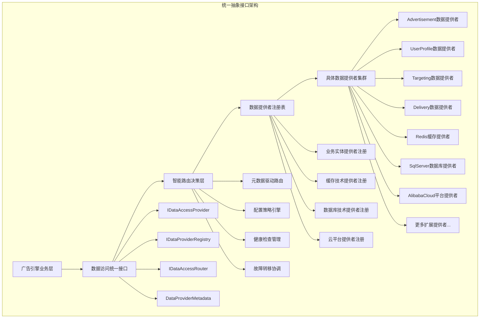
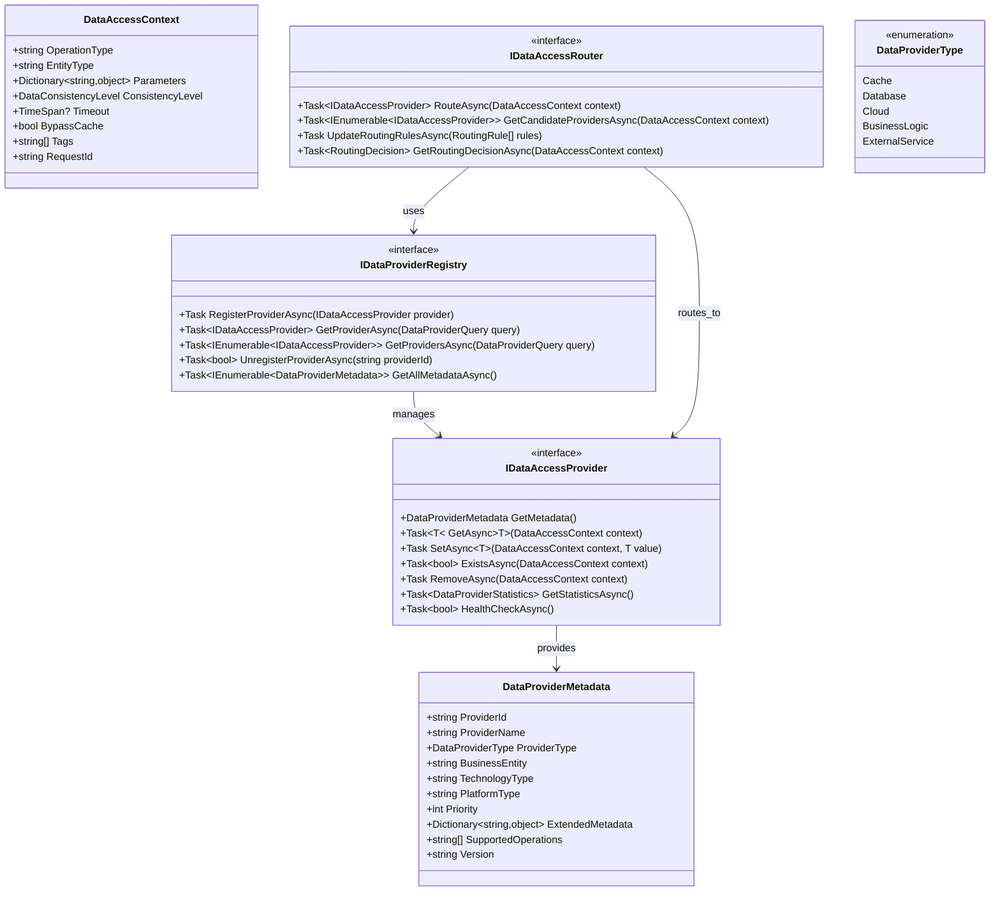
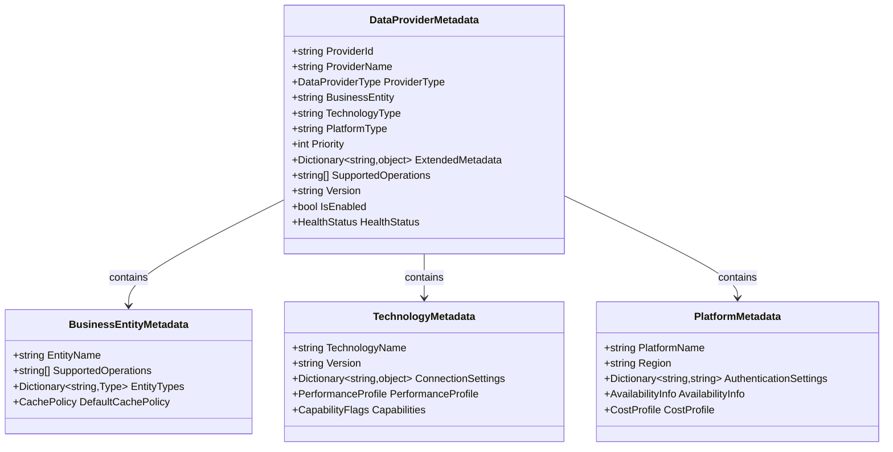
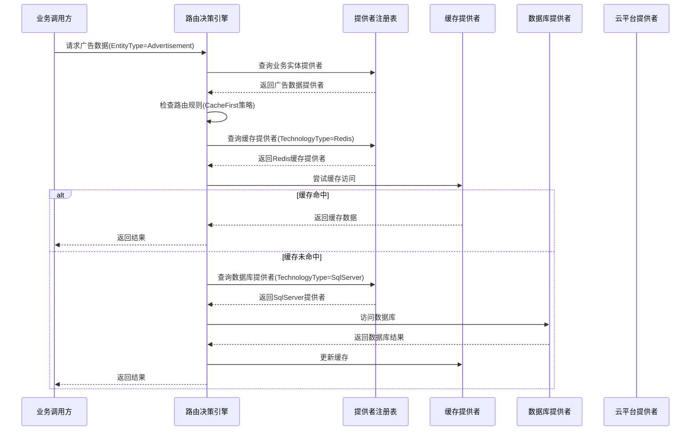
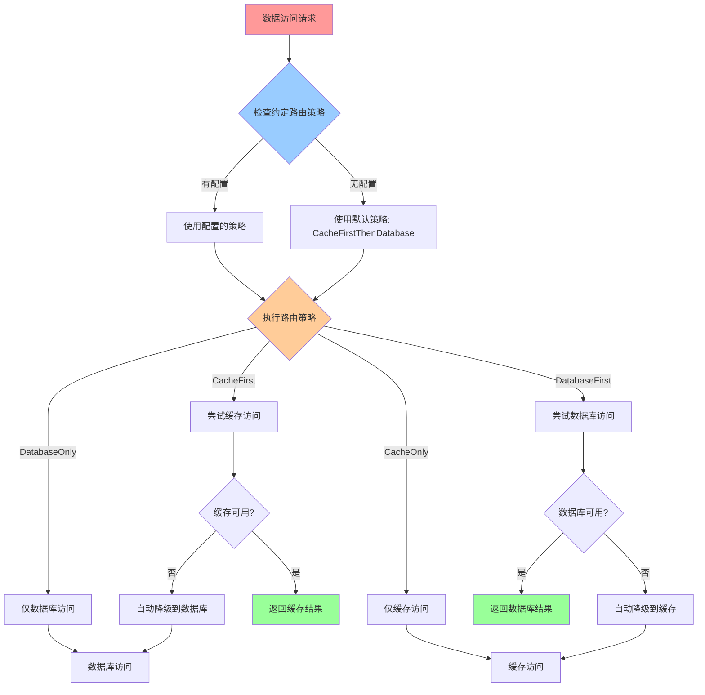
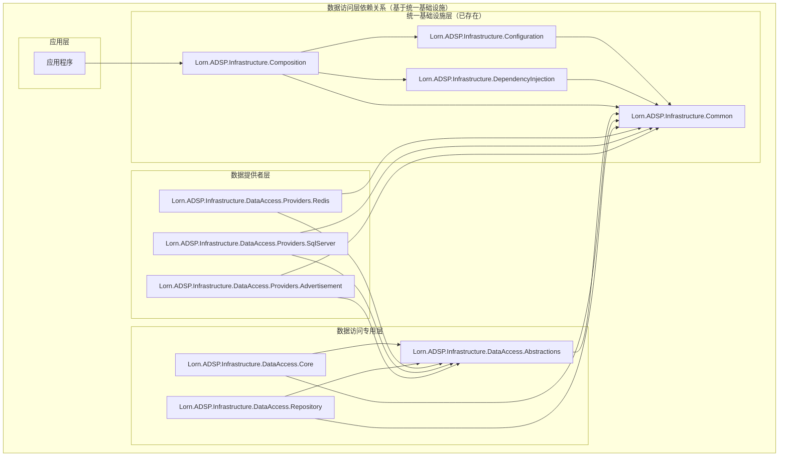
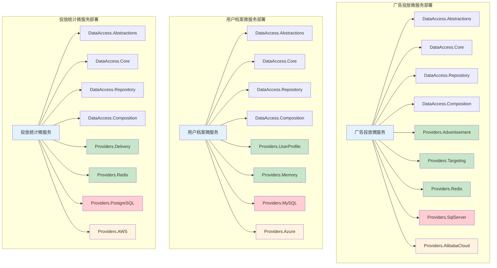
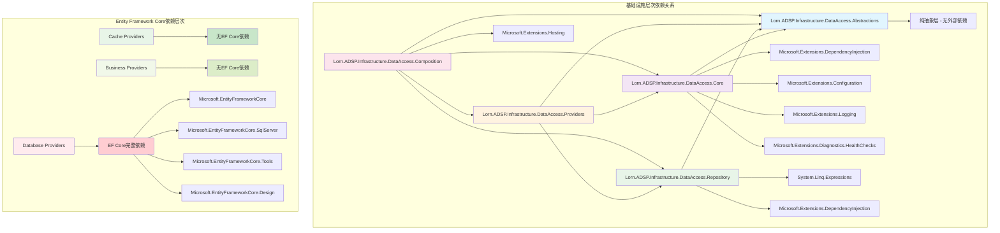
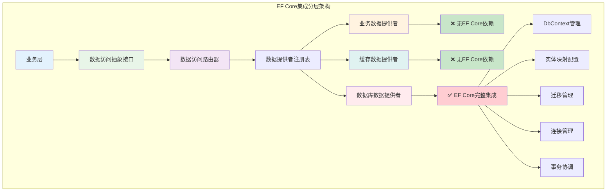

# 数据访问层技术设计

## 设计概述

广告投放平台数据访问层采用透明化数据访问架构，为上层业务提供统一的数据访问接口，完全屏蔽缓存和数据库的实现细节。该架构基于缓存优先的访问策略，通过智能缓存管理、多云数据库支持和配置驱动的存储选择，实现高性能、高可用的数据访问服务。

**重要说明**：本数据访问层设计**完全基于系统统一配置化和依赖注入架构**（参见 `docs_TecDesign/系统配置化和依赖注入设计/`），遵循其约定规范，使用其基础设施组件，不重新实现配置和依赖注入功能。

### 设计目标

**完全透明的数据访问**：
- 上层业务无需感知数据来源是缓存还是数据库
- 通过统一的数据访问抽象接口提供服务
- 缓存管理、数据库访问、云平台适配等复杂性完全封装
- 支持热切换数据源而不影响业务流程

**缓存优先的访问策略**：
- 所有数据访问请求优先查询缓存层
- 缓存未命中时自动访问数据库并更新缓存
- 智能缓存失效和数据一致性保障
- 支持多级缓存和分布式缓存协调

**基于统一基础设施的配置驱动**：
- **使用系统统一配置基础设施**：基于 `Lorn.ADSP.Infrastructure.Configuration` 实现配置管理
- **遵循统一约定规范**：所有数据提供者遵循命名约定和组件标记规范
- **自动组件发现和注册**：通过统一依赖注入基础设施实现零配置扩展
- **配置热重载和验证**：利用统一配置基础设施的热重载和验证能力

### 系统架构总览



## 架构设计原则

### 基于统一基础设施的设计原则

数据访问层严格遵循系统统一配置化和依赖注入架构的设计原则，不重新实现基础设施功能：

- **使用统一配置基础设施**：基于 `Lorn.ADSP.Infrastructure.Configuration` 提供的配置管理能力
- **遵循统一组件约定**：所有数据提供者遵循系统约定的命名规范和组件标记
- **零配置扩展原则**：新增数据提供者时无需修改基础设施代码，通过约定自动识别
- **基础设施化管理**：数据访问管理是完整的基础设施，不是业务扩展点
- **透明性保障**：上层业务完全无感知底层数据存储和路由决策的实现细节

### 数据访问专用设计原则

基于统一基础设施，数据访问层的专用设计原则：

- **统一接口原则**：所有数据访问组件都实现统一的`IDataAccessProvider`接口
- **缓存优先策略**：默认缓存优先，数据库作为后备存储
- **多云平台抽象**：通过配置驱动选择具体的云平台和数据库实现
- **业务数据分离**：业务数据提供者与技术数据提供者职责分离
- **异步访问模式**：所有数据操作采用异步模式，提高系统吞吐量

## 数据访问抽象接口设计

### 基于统一基础设施的接口设计

数据访问抽象接口完全基于系统统一配置化和依赖注入架构设计，遵循其约定规范和组件模型，不重新发明配置和注册机制。

**设计理念引用**：

- **遵循统一组件约定**：数据提供者命名遵循 `{数据源}Provider` 格式
- **使用统一配置绑定**：配置类遵循 `{模块名}Options` 格式，自动绑定配置节
- **利用统一组件发现**：通过 `[Component]` 特性标记，自动发现和注册
- **集成统一健康检查**：实现 `IHealthCheckable` 接口，自动添加健康检查

#### 数据提供者组件约定

根据系统统一基础设施的约定规范，数据提供者遵循以下约定：

```csharp
// 数据提供者组件约定
[Component(ConfigurationSection = "DataProviders:Advertisement")]
public class AdvertisementDataProvider : IDataAccessProvider, IHealthCheckable
{
    // 业务数据提供者：处理广告相关的业务逻辑
    // 配置路径：DataProviders:Advertisement
    // 生命周期：自动推断为 Scoped（因为是数据提供者）
}

[Component(ConfigurationSection = "DataProviders:Redis")]
public class RedisCacheProvider : IDataAccessProvider, IHealthCheckable
{
    // 缓存技术提供者：处理Redis缓存访问
    // 配置路径：DataProviders:Redis
    // 生命周期：自动推断为 Singleton（因为是基础设施组件）
}

[Component(ConfigurationSection = "DataProviders:SqlServer")]
public class SqlServerDatabaseProvider : IDataAccessProvider, IHealthCheckable
{
    // 数据库技术提供者：处理SQL Server数据库访问
    // 配置路径：DataProviders:SqlServer
    // 生命周期：自动推断为 Singleton（因为是基础设施组件）
}
```

#### 配置选项约定

所有数据提供者的配置选项遵循统一基础设施的配置约定：

```csharp
// 配置选项约定：{模块名}Options
public class AdvertisementDataProviderOptions
{
    // 自动绑定到配置节：DataProviders:Advertisement
}

public class RedisDataProviderOptions  
{
    // 自动绑定到配置节：DataProviders:Redis
}

public class SqlServerDataProviderOptions
{
    // 自动绑定到配置节：DataProviders:SqlServer  
}
```

#### 统一数据访问抽象接口架构



#### 基于约定的分层数据提供者架构设计

数据提供者采用分层架构设计，业务数据提供者作为上层组件被业务调用，内部通过数据访问路由器调用技术提供者（缓存、数据库）实现具体的数据访问：

```mermaid
classDiagram
    class AdvertisementDataProvider {
        +DataProviderMetadata GetMetadata()
        +string BusinessEntity = "Advertisement"
        +DataProviderType ProviderType = "BusinessLogic"
        +Task~T~ GetAsync~T~(DataAccessContext context)
        <<约定: *DataProvider 命名>>
        <<特性: [Component]>>
        <<配置: AdvertisementDataProviderOptions>>
    }
    
    class UserProfileDataProvider {
        +DataProviderMetadata GetMetadata()
        +string BusinessEntity = "UserProfile"
        +DataProviderType ProviderType = "BusinessLogic"
        +Task~T~ GetAsync~T~(DataAccessContext context)
        <<约定: *DataProvider 命名>>
        <<特性: [Component]>>
        <<配置: UserProfileDataProviderOptions>>
    }
    
    class RedisCacheProvider {
        +DataProviderMetadata GetMetadata()
        +string TechnologyType = "Redis"
        +DataProviderType ProviderType = "Cache"
        +Task~T~ GetAsync~T~(DataAccessContext context)
        <<约定: *Provider 命名>>
        <<特性: [Component]>>
        <<配置: RedisCacheProviderOptions>>
    }
    
    class SqlServerDatabaseProvider {
        +DataProviderMetadata GetMetadata()
        +string TechnologyType = "SqlServer"
        +DataProviderType ProviderType = "Database"
        +Task~T~ GetAsync~T~(DataAccessContext context)
        <<约定: *Provider 命名>>
        <<特性: [Component]>>
        <<配置: SqlServerDatabaseProviderOptions>>
    }
    
    class AlibabaCloudProvider {
        +DataProviderMetadata GetMetadata()
        +string PlatformType = "AlibabaCloud"
        +DataProviderType ProviderType = "Cloud"
        +Task~T~ GetAsync~T~(DataAccessContext context)
        <<约定: *Provider 命名>>
        <<特性: [Component]>>
        <<配置: AlibabaCloudProviderOptions>>
    }
    
    IDataAccessProvider <|.. AdvertisementDataProvider
    IDataAccessProvider <|.. UserProfileDataProvider
    IDataAccessProvider <|.. RedisCacheProvider
    IDataAccessProvider <|.. SqlServerDatabaseProvider
    
    AdvertisementDataProvider --> IDataAccessRouter : 依赖注入
    UserProfileDataProvider --> IDataAccessRouter : 依赖注入
    IDataAccessRouter --> RedisCacheProvider : 路由调用
    IDataAccessRouter --> SqlServerDatabaseProvider : 路由调用
 ```   

    note for AdvertisementDataProvider : 业务层：处理业务逻辑\n配置路径: DataProviders:Advertisement
    note for RedisCacheProvider : 技术层：缓存实现\n配置路径: Providers:RedisCache
    note for SqlServerDatabaseProvider : 技术层：数据库实现\n配置路径: Providers:SqlServerDatabase


#### 自动发现和注册机制设计

基于约定的数据提供者自动发现和零配置注册机制：

```mermaid
sequenceDiagram
    participant App as 应用启动
    participant Infrastructure as 基础设施启动器
    participant Scanner as 组件扫描器
    participant Registry as 数据提供者注册表
    participant Provider as 具体数据提供者
    participant Engine as 广告引擎
    
    App->>Infrastructure: 调用AddAdSystemInfrastructure()
    Infrastructure->>Scanner: 扫描所有程序集
    Scanner->>Scanner: 查找*Provider类型
    Scanner->>Scanner: 应用约定规则验证
    Scanner-->>Infrastructure: 返回发现的提供者类型
    
    loop 每个发现的提供者类型
        Infrastructure->>Provider: 创建提供者实例
        Infrastructure->>Provider: 自动绑定配置选项
        Provider->>Registry: 注册元数据和实例
        Infrastructure->>Infrastructure: 注册到DI容器
    end
    
    Engine->>Registry: 请求数据访问
    Registry->>Registry: 基于元数据路由
    Registry-->>Engine: 返回合适的提供者
    Engine->>Provider: 执行数据操作
    Provider-->>Engine: 返回结果
    
    note over Scanner: 基于命名约定(*Provider, *DataProvider)和组件特性([Component])自动发现
    note over Infrastructure: 自动配置绑定和生命周期管理
```

### 元数据驱动的路由决策设计

#### 数据提供者元数据体系

**元数据分类设计**：



**元数据示例**：

```text
广告数据提供者元数据：
├── ProviderId: "AdvertisementDataProvider_v1.0"
├── ProviderName: "广告数据业务提供者"
├── ProviderType: BusinessLogic
├── BusinessEntity: "Advertisement"
├── SupportedOperations: ["GetCandidates", "GetDetails", "GetCampaigns"]
├── Priority: 100
└── ExtendedMetadata:
    ├── CacheEnabled: true
    ├── TransactionSupport: true
    └── BatchOperationSupport: true

Redis缓存提供者元数据：
├── ProviderId: "RedisCacheProvider_v2.1"
├── ProviderName: "Redis分布式缓存"
├── ProviderType: Cache
├── TechnologyType: "Redis"
├── SupportedOperations: ["Get", "Set", "Remove", "Exists", "Pattern"]
├── Priority: 90
└── ExtendedMetadata:
    ├── ClusterMode: true
    ├── MaxExpiration: "24:00:00"
    └── CompressionEnabled: true

SqlServer数据库提供者元数据：
├── ProviderId: "SqlServerProvider_v1.5"
├── ProviderName: "SQL Server数据库"
├── ProviderType: Database
├── TechnologyType: "SqlServer"
├── SupportedOperations: ["Select", "Insert", "Update", "Delete", "Transaction"]
├── Priority: 80
└── ExtendedMetadata:
    ├── ReadWriteSeparation: true
    ├── ConnectionPoolSize: 100
    └── CommandTimeout: "00:00:30"

阿里云平台提供者元数据：
├── ProviderId: "AlibabaCloudProvider_v3.0"
├── ProviderName: "阿里云平台服务"
├── ProviderType: Cloud
├── PlatformType: "AlibabaCloud"
├── SupportedOperations: ["RDS", "PolarDB", "Redis", "OSS"]
├── Priority: 70
└── ExtendedMetadata:
    ├── Region: "cn-hangzhou"
    ├── AvailabilityZones: ["cn-hangzhou-a", "cn-hangzhou-b"]
    └── AutoScaling: true
```

#### 智能路由决策引擎



#### 约定优于配置的数据访问配置设计

**基于约定的零配置架构**：

数据访问层采用约定优于配置的设计原则，通过标准化的命名约定和智能默认值，实现最小化配置的数据访问管理。系统会自动发现和注册所有符合约定的数据提供者，开发者只需要遵循约定即可享受零配置的便利。

**配置结构设计**：

```json
{
  "DataAccess": {
    "DefaultRoutingStrategy": "CacheFirstThenDatabase",
    "HealthCheckInterval": "00:01:00",
    "EnablePerformanceMonitoring": true
  },
  "Providers": {
    "RedisCacheProvider": {
      "ConnectionString": "${REDIS_CONNECTION_STRING}",
      "DefaultExpiration": "01:00:00",
      "ClusterMode": true,
      "CompressionEnabled": true
    },
    "SqlServerDatabaseProvider": {
      "ConnectionString": "${SQLSERVER_CONNECTION_STRING}",
      "CommandTimeout": "00:00:30",
      "ConnectionPoolSize": 100,
      "EnableRetry": true
    },
    "AlibabaCloudProvider": {
      "Region": "cn-hangzhou",
      "AccessKeyId": "${ALIBABA_ACCESS_KEY_ID}",
      "AccessKeySecret": "${ALIBABA_ACCESS_KEY_SECRET}",
      "AutoScaling": true
    }
  },
  "DataProviders": {
    "AdvertisementDataProvider": {
      "CacheEnabled": true,
      "CacheExpiration": "00:30:00",
      "BatchSize": 100,
      "EnableDebugLogging": false
    },
    "UserProfileDataProvider": {
      "CacheEnabled": true,
      "CacheExpiration": "02:00:00",
      "EnablePrivacyMode": true
    }
  },
  "RoutingStrategies": {
    "Advertisement": "CacheFirstThenDatabase",
    "UserProfile": "CacheOnly",
    "Targeting": "DatabaseFirstThenCache",
    "Delivery": "DatabaseOnly"
  }
}
```

**约定规则说明**：

1. **数据提供者约定**：
   - 命名格式：`*DataProvider`（如：`AdvertisementDataProvider`）
   - 配置路径：`DataProviders:{ProviderName}`（去掉`DataProvider`后缀）
   - 自动生命周期：`Singleton`

2. **技术提供者约定**：
   - 命名格式：`*Provider`（如：`RedisCacheProvider`、`SqlServerDatabaseProvider`）
   - 配置路径：`Providers:{ProviderName}`（去掉`Provider`后缀）
   - 自动生命周期：`Singleton`

3. **配置选项约定**：
   - 选项类命名：`{ProviderName}Options`
   - 自动绑定到对应的配置节点
   - 支持数据注解验证

**智能默认值和降级策略**：



## 多云数据库支持架构

### 底层数据库适配设计

基于透明化数据访问的要求，底层数据库适配层完全对上层隐藏，通过配置驱动选择具体的数据库实现：


### 云平台配置和连接管理

**多云架构独立性设计**：
- 云平台抽象接口（`Lorn.ADSP.Infrastructure.Cloud.Abstractions`）作为独立项目，定义统一的云服务接口
- 每个云平台实现独立项目，避免单一部署包含多云代码：
  - `Lorn.ADSP.Infrastructure.Cloud.AlibabaCloud` - 阿里云独立实现
  - `Lorn.ADSP.Infrastructure.Cloud.Azure` - Azure云独立实现
  - `Lorn.ADSP.Infrastructure.Cloud.AWS` - AWS云独立实现
- 通过NuGet包管理和依赖注入实现运行时云平台选择
- 每个部署环境只包含当前所需的云平台实现，减少依赖和部署包大小

**配置设计指导**：
- 支持多云配置文件管理，包含连接字符串、认证信息、区域设置等
- 提供连接池管理和故障转移机制
- 实现云平台特定的监控和日志集成
- 通过配置文件指定当前部署使用的云平台类型

**连接字符串管理**：
- 支持Azure Key Vault、AWS Secrets Manager、阿里云KMS等密钥管理服务
- 提供连接字符串的加密存储和动态解密
- 支持不同环境（开发、测试、生产）的配置隔离
- 实现连接字符串的版本管理和回滚机制

**部署策略优势**：
- **减少依赖复杂性**：每个部署环境只包含必要的云平台实现
- **提高安全性**：避免在同一部署中暴露多个云平台的认证信息
- **优化性能**：减少不必要的依赖加载，提高应用启动性能
- **简化运维**：每个云平台的配置和监控独立管理，便于故障排查

## 基础设施层实现设计

### 基于统一基础设施的项目结构设计

**重要说明**：数据访问层**不再独立实现配置管理和依赖注入功能**，而是完全基于系统统一基础设施项目：

- **配置管理**：使用 `Lorn.ADSP.Infrastructure.Configuration`
- **依赖注入**：使用 `Lorn.ADSP.Infrastructure.DependencyInjection`  
- **组合管理**：使用 `Lorn.ADSP.Infrastructure.Composition`
- **公共基础**：使用 `Lorn.ADSP.Infrastructure.Common`

### 数据访问专用项目结构

```text
Infrastructure/
├── 【统一基础设施项目 - 已存在】
│   ├── Lorn.ADSP.Infrastructure.Configuration/         # 统一配置管理基础设施
│   ├── Lorn.ADSP.Infrastructure.DependencyInjection/   # 统一依赖注入基础设施
│   ├── Lorn.ADSP.Infrastructure.Composition/           # 统一基础设施组合层
│   └── Lorn.ADSP.Infrastructure.Common/                # 统一公共基础设施
├── 【数据访问专用项目 - 需要创建】
│   ├── Lorn.ADSP.Infrastructure.DataAccess.Abstractions/    # 数据访问抽象层
│   │   ├── Interfaces/                                     # 核心抽象接口
│   │   │   ├── IDataAccessProvider.cs                      # 统一数据访问提供者接口
│   │   │   ├── IDataProviderRegistry.cs                    # 数据提供者注册表接口
│   │   │   └── IDataAccessRouter.cs                        # 数据访问路由器接口
│   │   ├── Models/                                         # 核心模型
│   │   │   ├── DataProviderMetadata.cs                     # 数据提供者元数据
│   │   │   ├── DataAccessContext.cs                        # 数据访问上下文
│   │   │   └── DataProviderQuery.cs                        # 数据提供者查询
│   │   └── Enums/                                          # 枚举定义
│   │       ├── DataProviderType.cs                         # 数据提供者类型
│   │       └── DataConsistencyLevel.cs                     # 数据一致性级别
│   ├── Lorn.ADSP.Infrastructure.DataAccess.Core/           # 数据访问核心实现
│   │   ├── Registry/                                       # 注册表实现
│   │   │   ├── DataProviderRegistry.cs                     # 数据提供者注册表
│   │   │   └── InMemoryProviderRegistry.cs                 # 内存注册表实现
│   │   ├── Routing/                                        # 路由实现
│   │   │   ├── DataAccessRouter.cs                         # 数据访问路由器
│   │   │   └── DefaultRoutingStrategy.cs                   # 默认路由策略
│   │   └── Extensions/                                     # 扩展方法
│   │       └── ServiceCollectionExtensions.cs              # 数据访问扩展（基于统一基础设施）
│   ├── Lorn.ADSP.Infrastructure.DataAccess.Repository/     # 仓储模式实现
│   │   ├── Abstractions/                                  # 仓储抽象
│   │   │   ├── IRepository.cs                              # 基础仓储接口
│   │   │   ├── IReadOnlyRepository.cs                      # 只读仓储接口
│   │   │   └── IUnitOfWork.cs                              # 工作单元接口
│   │   ├── Base/                                          # 基础实现
│   │   │   ├── RepositoryBase.cs                           # 仓储基类
│   │   │   └── UnitOfWorkBase.cs                           # 工作单元基类
│   │   └── Specifications/                                # 规约模式
│   │       ├── ISpecification.cs                           # 规约接口
│   │       └── SpecificationBase.cs                        # 规约基类
│   │   └── IUnitOfWork.cs                              # 工作单元接口
│   ├── Base/                                          # 基础实现
│   │   ├── RepositoryBase.cs                           # 仓储基类
│   │   └── UnitOfWorkBase.cs                           # 工作单元基类
│   └── Specifications/                                # 规约模式
│       ├── ISpecification.cs                           # 规约接口
│       └── SpecificationBase.cs                        # 规约基类
├── Lorn.ADSP.Infrastructure.DataAccess.Composition/    # 数据访问组合层
│   ├── Extensions/                                     # 统一注册扩展
│   │   └── ServiceCollectionExtensions.cs              # 数据访问基础设施注册
│   ├── Bootstrapper/                                   # 启动器
│   │   └── DataAccessBootstrapper.cs                   # 数据访问启动器
│   └── Configuration/                                  # 组合配置
│       └── DataAccessSettings.cs                       # 数据访问设置
├── Lorn.ADSP.Infrastructure.DataAccess.Providers.Redis/    # Redis缓存提供者
│   ├── RedisCacheProvider.cs                          # Redis缓存数据提供者
│   ├── RedisConfiguration.cs                          # Redis配置选项
│   ├── RedisConnectionManager.cs                      # Redis连接管理
│   ├── RedisHealthCheck.cs                            # Redis健康检查
│   └── Extensions/                                    # Redis扩展注册
│       └── ServiceCollectionExtensions.cs             # Redis服务注册扩展
├── Lorn.ADSP.Infrastructure.DataAccess.Providers.Memory/ # 内存缓存提供者
│   ├── MemoryCacheProvider.cs                         # 内存缓存数据提供者
│   ├── MemoryCacheConfiguration.cs                    # 内存缓存配置
│   ├── MemoryHealthCheck.cs                           # 内存缓存健康检查
│   └── Extensions/                                    # 内存缓存扩展注册
│       └── ServiceCollectionExtensions.cs             # 内存缓存服务注册扩展
├── Lorn.ADSP.Infrastructure.DataAccess.Providers.SqlServer/ # SQL Server数据库提供者
│   ├── SqlServerDatabaseProvider.cs                   # SQL Server数据提供者
│   ├── SqlServerAdSystemDbContext.cs                  # SQL Server DbContext
│   ├── SqlServerRepository.cs                         # SQL Server仓储实现
│   ├── SqlServerUnitOfWork.cs                         # SQL Server工作单元
│   ├── SqlServerConfiguration.cs                      # SQL Server配置
│   ├── SqlServerHealthCheck.cs                        # SQL Server健康检查
│   ├── Migrations/                                    # SQL Server迁移文件
│   │   ├── 20240101000000_InitialCreate.cs
│   │   └── 20240201000000_AddTargetingTables.cs
│   └── Extensions/                                    # SQL Server扩展注册
│       └── ServiceCollectionExtensions.cs             # SQL Server服务注册扩展
├── Lorn.ADSP.Infrastructure.DataAccess.Providers.MySQL/ # MySQL数据库提供者
│   ├── MySqlDatabaseProvider.cs                       # MySQL数据提供者
│   ├── MySqlAdSystemDbContext.cs                      # MySQL DbContext
│   ├── MySqlRepository.cs                             # MySQL仓储实现
│   ├── MySqlUnitOfWork.cs                             # MySQL工作单元
│   ├── MySqlConfiguration.cs                          # MySQL配置
│   ├── MySqlHealthCheck.cs                            # MySQL健康检查
│   ├── Migrations/                                    # MySQL迁移文件
│   │   ├── 20240101000000_InitialCreate.cs
│   │   └── 20240201000000_AddTargetingTables.cs
│   └── Extensions/                                    # MySQL扩展注册
│       └── ServiceCollectionExtensions.cs             # MySQL服务注册扩展
├── Lorn.ADSP.Infrastructure.DataAccess.Providers.PostgreSQL/ # PostgreSQL数据库提供者
│   ├── PostgreSqlDatabaseProvider.cs                  # PostgreSQL数据提供者
│   ├── PostgreSqlAdSystemDbContext.cs                 # PostgreSQL DbContext
│   ├── PostgreSqlRepository.cs                        # PostgreSQL仓储实现
│   ├── PostgreSqlUnitOfWork.cs                        # PostgreSQL工作单元
│   ├── PostgreSqlConfiguration.cs                     # PostgreSQL配置
│   ├── PostgreSqlHealthCheck.cs                       # PostgreSQL健康检查
│   ├── Migrations/                                    # PostgreSQL迁移文件
│   │   ├── 20240101000000_InitialCreate.cs
│   │   └── 20240201000000_AddTargetingTables.cs
│   └── Extensions/                                    # PostgreSQL扩展注册
│       └── ServiceCollectionExtensions.cs             # PostgreSQL服务注册扩展
├── Lorn.ADSP.Infrastructure.DataAccess.Providers.AlibabaCloud/ # 阿里云平台提供者
│   ├── AlibabaCloudProvider.cs                        # 阿里云平台数据提供者
│   ├── AlibabaCloudConfiguration.cs                   # 阿里云配置
│   ├── Services/                                      # 阿里云服务集成
│   │   ├── AlibabaCloudRdsService.cs                  # 阿里云RDS服务
│   │   ├── AlibabaCloudPolarDbService.cs              # 阿里云PolarDB服务
│   │   └── AlibabaCloudRedisService.cs                # 阿里云Redis服务
│   ├── AlibabaCloudHealthCheck.cs                     # 阿里云健康检查
│   └── Extensions/                                    # 阿里云扩展注册
│       └── ServiceCollectionExtensions.cs             # 阿里云服务注册扩展
├── Lorn.ADSP.Infrastructure.DataAccess.Providers.Azure/ # Azure云平台提供者
│   ├── AzureCloudProvider.cs                          # Azure云平台数据提供者
│   ├── AzureCloudConfiguration.cs                     # Azure配置
│   ├── Services/                                      # Azure服务集成
│   │   ├── AzureSqlDatabaseService.cs                 # Azure SQL Database服务
│   │   ├── AzureCosmosDbService.cs                    # Azure Cosmos DB服务
│   │   └── AzureRedisService.cs                       # Azure Redis服务
│   ├── AzureHealthCheck.cs                            # Azure健康检查
│   └── Extensions/                                    # Azure扩展注册
│       └── ServiceCollectionExtensions.cs             # Azure服务注册扩展
├── Lorn.ADSP.Infrastructure.DataAccess.Providers.AWS/ # AWS云平台提供者
│   ├── AwsCloudProvider.cs                            # AWS云平台数据提供者
│   ├── AwsCloudConfiguration.cs                       # AWS配置
│   ├── Services/                                      # AWS服务集成
│   │   ├── AwsRdsService.cs                           # AWS RDS服务
│   │   ├── AwsDynamoDbService.cs                      # AWS DynamoDB服务
│   │   └── AwsElastiCacheService.cs                   # AWS ElastiCache服务
│   ├── AwsHealthCheck.cs                              # AWS健康检查
│   └── Extensions/                                    # AWS扩展注册
│       └── ServiceCollectionExtensions.cs             # AWS服务注册扩展
├── Lorn.ADSP.Infrastructure.DataAccess.Providers.Advertisement/ # 广告业务提供者
│   ├── AdvertisementDataProvider.cs                   # 广告数据提供者
│   ├── AdvertisementConfiguration.cs                  # 广告提供者配置
│   ├── Services/                                      # 广告业务服务
│   │   ├── AdvertisementCacheService.cs               # 广告缓存服务
│   │   └── AdvertisementValidationService.cs          # 广告验证服务
│   ├── AdvertisementHealthCheck.cs                    # 广告提供者健康检查
│   └── Extensions/                                    # 广告扩展注册
│       └── ServiceCollectionExtensions.cs             # 广告服务注册扩展
├── Lorn.ADSP.Infrastructure.DataAccess.Providers.UserProfile/ # 用户档案业务提供者
│   ├── UserProfileDataProvider.cs                     # 用户档案数据提供者
│   ├── UserProfileConfiguration.cs                    # 用户档案提供者配置
│   ├── Services/                                      # 用户档案业务服务
│   │   ├── UserProfileCacheService.cs                 # 用户档案缓存服务
│   │   └── UserProfilePrivacyService.cs               # 用户档案隐私服务
│   ├── UserProfileHealthCheck.cs                      # 用户档案提供者健康检查
│   └── Extensions/                                    # 用户档案扩展注册
│       └── ServiceCollectionExtensions.cs             # 用户档案服务注册扩展
├── Lorn.ADSP.Infrastructure.DataAccess.Providers.Targeting/ # 定向业务提供者
│   ├── TargetingDataProvider.cs                       # 定向数据提供者
│   ├── TargetingConfiguration.cs                      # 定向提供者配置
│   ├── Services/                                      # 定向业务服务
│   │   ├── TargetingCacheService.cs                   # 定向缓存服务
│   │   └── TargetingMatchingService.cs                # 定向匹配服务
│   ├── TargetingHealthCheck.cs                        # 定向提供者健康检查
│   └── Extensions/                                    # 定向扩展注册
│       └── ServiceCollectionExtensions.cs             # 定向服务注册扩展
└── Lorn.ADSP.Infrastructure.DataAccess.Providers.Delivery/ # 投放业务提供者
    ├── DeliveryDataProvider.cs                        # 投放数据提供者
    ├── DeliveryConfiguration.cs                       # 投放提供者配置
    ├── Services/                                      # 投放业务服务
    │   ├── DeliveryTrackingService.cs                 # 投放跟踪服务
    │   └── DeliveryAnalyticsService.cs                # 投放分析服务
    ├── DeliveryHealthCheck.cs                         # 投放提供者健康检查
    └── Extensions/                                    # 投放扩展注册
        └── ServiceCollectionExtensions.cs             # 投放服务注册扩展
```

### 基于统一基础设施的依赖关系设计

数据访问层项目的依赖关系完全基于系统统一基础设施架构：



### 关键依赖设计原则

#### 1. 统一基础设施优先原则

- **配置管理**：数据访问层不实现配置管理，使用 `Infrastructure.Configuration`
- **依赖注入**：数据访问层不实现组件注册，使用 `Infrastructure.DependencyInjection`
- **健康检查**：数据访问层不实现健康检查框架，使用 `Infrastructure.Common.IHealthCheckable`
- **组件发现**：数据访问层不实现组件扫描，使用统一基础设施的组件发现机制

#### 2. 项目职责清晰原则

**Lorn.ADSP.Infrastructure.DataAccess.Abstractions**：

- **依赖**：仅依赖 `Infrastructure.Common`（获取基础接口和约定）
- **职责**：定义数据访问专用的抽象接口和模型
- **不包含**：配置管理、依赖注入、组件发现等通用功能

**Lorn.ADSP.Infrastructure.DataAccess.Core**：

- **依赖**：`DataAccess.Abstractions` + `Infrastructure.Common`
- **职责**：实现数据访问专用的路由和注册逻辑
- **使用统一基础设施**：通过 `Infrastructure.Common` 的约定和接口实现组件发现和注册

**数据提供者项目**：

- **依赖**：`DataAccess.Abstractions` + `Infrastructure.Common`
- **职责**：实现具体的数据访问逻辑
- **遵循约定**：使用 `[Component]` 特性标记，遵循统一命名约定

#### 3. 应用程序集成原则

应用程序只需要引用统一基础设施的组合层：

```csharp
// 应用程序 Program.cs
services.AddAdSystemInfrastructure(Configuration);
// 这一行代码自动发现和注册所有数据提供者组件
```

### 重新设计的项目间依赖关系图

基于微服务架构和按需部署的原则，将数据提供者拆分为独立项目，实现精细化的依赖管理：

```mermaid
graph TB
    subgraph "原有的基础设施层次依赖关系（已废弃，由统一基础设施替代）"
        A[Lorn.ADSP.Infrastructure.DataAccess.Abstractions] --> B[纯抽象层 - 现在依赖 Infrastructure.Common]
        
        C[Lorn.ADSP.Infrastructure.DataAccess.Core] --> A
        C --> D[不再直接依赖 Microsoft.Extensions.*]
        C --> E[现在通过 Infrastructure.Common 间接使用]
        C --> G[Microsoft.Extensions.Diagnostics.HealthChecks]
        
        H[Lorn.ADSP.Infrastructure.DataAccess.Repository] --> A
        H --> I[System.Linq.Expressions]
        H --> J[Microsoft.Extensions.DependencyInjection]
        
        K[Lorn.ADSP.Infrastructure.DataAccess.Composition] --> A
        K --> C
        K --> H
        K --> L[Microsoft.Extensions.Hosting]
        
        style A fill:#e1f5fe
        style C fill:#f3e5f5
        style H fill:#e8f5e8
        style K fill:#fce4ec
    end
    
    subgraph "数据库提供者项目依赖（按需选择）"
        M[Providers.SqlServer] --> A
        M --> H
        M --> N[Microsoft.EntityFrameworkCore]
        M --> O[Microsoft.EntityFrameworkCore.SqlServer]
        
        P[Providers.MySQL] --> A
        P --> H
        P --> Q[Microsoft.EntityFrameworkCore]
        P --> R[Pomelo.EntityFrameworkCore.MySql]
        
        S[Providers.PostgreSQL] --> A
        S --> H
        S --> T[Microsoft.EntityFrameworkCore]
        S --> U[Npgsql.EntityFrameworkCore.PostgreSQL]
        
        style M fill:#ffebee
        style P fill:#ffebee
        style S fill:#ffebee
    end
    
    subgraph "缓存提供者项目依赖（按需选择）"
        V[Providers.Redis] --> A
        V --> W[StackExchange.Redis]
        V --> X[Microsoft.Extensions.Caching.StackExchangeRedis]
        
        Y[Providers.Memory] --> A
        Y --> Z[Microsoft.Extensions.Caching.Memory]
        
        style V fill:#e8f5e8
        style Y fill:#e8f5e8
    end
    
    subgraph "云平台提供者项目依赖（按需选择）"
        AA[Providers.AlibabaCloud] --> A
        AA --> BB[Aliyun.Acs.Core]
        AA --> CC[Aliyun.Acs.Rds]
        
        DD[Providers.Azure] --> A
        DD --> EE[Azure.Identity]
        DD --> FF[Microsoft.Azure.Management.Sql]
        
        GG[Providers.AWS] --> A
        GG --> HH[AWSSDK.Core]
        GG --> II[AWSSDK.RDS]
        
        style AA fill:#fff3e0
        style DD fill:#fff3e0
        style GG fill:#fff3e0
    end
    
    subgraph "业务提供者项目依赖（按需选择）"
        JJ[Providers.Advertisement] --> A
        JJ --> KK[Lorn.ADSP.Core.Domain]
        
        LL[Providers.UserProfile] --> A
        LL --> MM[Lorn.ADSP.Core.Domain]
        
        NN[Providers.Targeting] --> A
        NN --> OO[Lorn.ADSP.Core.Domain.Targeting]
        
        PP[Providers.Delivery] --> A
        PP --> QQ[Lorn.ADSP.Core.Domain]
        
        style JJ fill:#f1f8e9
        style LL fill:#f1f8e9
        style NN fill:#f1f8e9
        style PP fill:#f1f8e9
    end
    
    subgraph "缓存技术提供者项目"
        M[Providers.Redis] --> A
        M --> C
        M --> N[StackExchange.Redis]
        M --> O[Microsoft.Extensions.Caching.StackExchangeRedis]
        
        P[Providers.Memory] --> A
        P --> C
        P --> Q[Microsoft.Extensions.Caching.Memory]
        
        style M fill:#e8f5e8
        style P fill:#e8f5e8
    end
    
    subgraph "数据库技术提供者项目"
        R[Providers.SqlServer] --> A
        R --> C
        R --> H
        R --> S[Microsoft.EntityFrameworkCore]
        R --> T[Microsoft.EntityFrameworkCore.SqlServer]
        
        U[Providers.MySQL] --> A
        U --> C
        U --> H
        U --> V[Microsoft.EntityFrameworkCore]
        U --> W[Pomelo.EntityFrameworkCore.MySql]
        
        X[Providers.PostgreSQL] --> A
        X --> C
        X --> H
        X --> Y[Microsoft.EntityFrameworkCore]
        X --> Z[Npgsql.EntityFrameworkCore.PostgreSQL]
        
        style R fill:#ffebee
        style U fill:#ffebee
        style X fill:#ffebee
    end
    
    subgraph "云平台提供者项目"
        AA[Providers.AlibabaCloud] --> A
        AA --> C
        AA --> BB[阿里云SDK]
        
        CC[Providers.Azure] --> A
        CC --> C
        CC --> DD[Azure SDK]
        
        EE[Providers.AWS] --> A
        EE --> C
        EE --> FF[AWS SDK]
        
        style AA fill:#fff3e0
        style CC fill:#fff3e0
        style EE fill:#fff3e0
    end
    
    subgraph "业务数据提供者项目"
        GG[Providers.Advertisement] --> A
        GG --> C
        GG --> HH[Lorn.ADSP.Core.Domain]
        
        II[Providers.UserProfile] --> A
        II --> C
        II --> JJ[Lorn.ADSP.Core.Domain]
        
        KK[Providers.Targeting] --> A
        KK --> C
        KK --> LL[Lorn.ADSP.Core.Domain]
        
        MM[Providers.Delivery] --> A
        MM --> C
        MM --> NN[Lorn.ADSP.Core.Domain]
        
        style GG fill:#f1f8e9
        style II fill:#f1f8e9
        style KK fill:#f1f8e9
        style MM fill:#f1f8e9
    end
```



### 微服务按需部署架构

通过独立的提供者项目，每个微服务可以按需选择和部署所需的数据提供者：



### 项目拆分的核心优势

#### 1. 微服务架构优势

**按需部署**：
- 每个微服务只引用所需的数据提供者项目
- 减少部署包大小和启动时间
- 降低运行时内存占用
- 提高安全性（避免不必要的依赖暴露）

**独立升级**：
- 单独升级某个技术提供者不影响其他组件
- 支持灰度发布和回滚
- 减少整体系统升级风险
- 提高系统可维护性

#### 2. 技术选择灵活性

**缓存技术选择**：
- 开发环境：`Providers.Memory`
- 生产环境：`Providers.Redis`
- 可以根据场景动态选择，无需修改业务代码

**数据库技术选择**：
- 企业客户：`Providers.SqlServer`
- 成本敏感：`Providers.MySQL`
- 高级功能：`Providers.PostgreSQL`
- 根据客户需求和部署环境灵活选择

**云平台选择**：
- 国内部署：`Providers.AlibabaCloud`
- 国际部署：`Providers.Azure` 或 `Providers.AWS`
- 混合云部署：可同时引用多个云平台提供者

#### 3. 开发和测试优势

**独立开发**：
- 不同团队可以独立开发不同的提供者项目
- 减少代码冲突和合并复杂性
- 提高开发效率

**精确测试**：
- 可以针对单个提供者进行精确测试
- 减少测试复杂度和耦合性
- 提高测试覆盖率和准确性

#### 4. 配置管理优势

**简化配置**：
- 每个微服务只需要配置使用的提供者
- 避免配置文件中的冗余信息
- 提高配置的可读性和维护性

**环境隔离**：
- 不同环境可以使用不同的提供者组合
- 支持多租户和多环境部署
- 提高部署的灵活性和安全性

### 统一的扩展注册机制

每个独立的提供者项目都包含自己的扩展注册方法，确保依赖注入的一致性：

```csharp
// 示例：Redis缓存提供者的扩展注册
public static class ServiceCollectionExtensions
{
    public static IServiceCollection AddRedisCacheProvider(
        this IServiceCollection services, 
        IConfiguration configuration)
    {
        // 注册Redis缓存提供者
        services.AddSingleton<IDataAccessProvider, RedisCacheProvider>();
        
        // 注册Redis缓存服务
        services.AddStackExchangeRedisCache(options =>
        {
            options.Configuration = configuration.GetConnectionString("Redis");
            options.InstanceName = "AdSystemCache";
        });
        
        // 注册配置选项
        services.Configure<RedisCacheProviderOptions>(
            configuration.GetSection("Providers:Redis"));
        
        // 注册健康检查
        services.AddHealthChecks()
            .AddCheck<RedisHealthCheck>("redis_cache");
        
        return services;
    }
}
```

这种设计确保了：

1. **最小化依赖**：每个微服务只引用必需的项目
2. **技术独立性**：可以独立选择和升级技术组件
3. **部署灵活性**：支持多种部署组合和环境配置
4. **开发效率**：团队可以并行开发不同的提供者项目
5. **运维简化**：减少不必要的组件和配置管理复杂性


### 项目间依赖关系图



### 详细依赖关系分析

#### 1. Lorn.ADSP.Infrastructure.DataAccess.Abstractions（抽象层）

**项目依赖关系**：
- **无外部依赖**：作为纯抽象层，仅依赖.NET标准库
- **被依赖项目**：所有其他数据访问基础设施项目都依赖此项目

**Entity Framework Core依赖**：
- **依赖状态**：❌ 无依赖
- **设计原因**：保持抽象层的纯净性，不绑定任何具体ORM技术

**核心职责**：
- 定义统一的数据访问抽象接口
- 提供元数据和上下文模型
- 声明组件约定和特性标记

#### 2. Lorn.ADSP.Infrastructure.DataAccess.Core（核心实现层）

**项目依赖关系**：
```text
项目引用：
├── Lorn.ADSP.Infrastructure.DataAccess.Abstractions
└── NuGet包依赖：
    ├── Microsoft.Extensions.DependencyInjection.Abstractions (>= 8.0.0)
    ├── Microsoft.Extensions.Configuration.Abstractions (>= 8.0.0)
    ├── Microsoft.Extensions.Logging.Abstractions (>= 8.0.0)
    ├── Microsoft.Extensions.Diagnostics.HealthChecks.Abstractions (>= 8.0.0)
    └── Microsoft.Extensions.Options.ConfigurationExtensions (>= 8.0.0)
```

**Entity Framework Core依赖**：
- **依赖状态**：❌ 无依赖
- **设计原因**：核心层负责路由和注册逻辑，与具体ORM技术无关

**核心职责**：
- 实现数据提供者注册表和路由器
- 提供组件自动发现和配置绑定
- 管理健康检查和性能监控

#### 3. Lorn.ADSP.Infrastructure.DataAccess.Repository（仓储模式层）

**项目依赖关系**：
```text
项目引用：
├── Lorn.ADSP.Infrastructure.DataAccess.Abstractions
└── NuGet包依赖：
    ├── Microsoft.Extensions.DependencyInjection.Abstractions (>= 8.0.0)
    └── System.Linq.Expressions (内置)
```

**Entity Framework Core依赖**：
- **依赖状态**：❌ 无依赖
- **设计原因**：仓储抽象层不绑定具体ORM，支持多种数据访问技术

**核心职责**：
- 定义仓储和工作单元抽象接口
- 提供规约模式的查询抽象
- 实现基础的仓储模式框架

#### 4. Lorn.ADSP.Infrastructure.DataAccess.Providers（数据提供者实现层）

**项目依赖关系**：
```text
项目引用：
├── Lorn.ADSP.Infrastructure.DataAccess.Abstractions
├── Lorn.ADSP.Infrastructure.DataAccess.Core
├── Lorn.ADSP.Infrastructure.DataAccess.Repository
└── 按提供者类型的特定依赖（见下文详细分析）
```

**Entity Framework Core依赖**：
- **依赖状态**：✅ 数据库提供者依赖，❌ 缓存和业务提供者无依赖
- **依赖策略**：按需引用，不同提供者类型有不同的依赖需求

##### 4.1 缓存提供者（Cache Providers）

**Redis缓存提供者依赖**：
```text
NuGet包依赖：
├── StackExchange.Redis (>= 2.7.4)
├── Microsoft.Extensions.Caching.StackExchangeRedis (>= 8.0.0)
└── Microsoft.Extensions.Options (>= 8.0.0)

Entity Framework Core依赖：❌ 无依赖
```

**内存缓存提供者依赖**：
```text
NuGet包依赖：
├── Microsoft.Extensions.Caching.Memory (>= 8.0.0)
└── Microsoft.Extensions.Options (>= 8.0.0)

Entity Framework Core依赖：❌ 无依赖
```

##### 4.2 数据库提供者（Database Providers）

**SQL Server数据提供者依赖**：
```text
NuGet包依赖：
├── Microsoft.EntityFrameworkCore (>= 8.0.0)
├── Microsoft.EntityFrameworkCore.SqlServer (>= 8.0.0)
├── Microsoft.EntityFrameworkCore.Tools (>= 8.0.0) [仅开发时]
├── Microsoft.EntityFrameworkCore.Design (>= 8.0.0) [仅开发时]
├── Microsoft.EntityFrameworkCore.Relational (>= 8.0.0)
└── Microsoft.Data.SqlClient (>= 5.1.0)

Entity Framework Core依赖：✅ 完整依赖
```

**MySQL数据提供者依赖**：
```text
NuGet包依赖：
├── Microsoft.EntityFrameworkCore (>= 8.0.0)
├── Pomelo.EntityFrameworkCore.MySql (>= 8.0.0)
├── Microsoft.EntityFrameworkCore.Tools (>= 8.0.0) [仅开发时]
├── Microsoft.EntityFrameworkCore.Design (>= 8.0.0) [仅开发时]
├── Microsoft.EntityFrameworkCore.Relational (>= 8.0.0)
└── MySqlConnector (>= 2.3.0)

Entity Framework Core依赖：✅ 完整依赖
```

**PostgreSQL数据提供者依赖**：
```text
NuGet包依赖：
├── Microsoft.EntityFrameworkCore (>= 8.0.0)
├── Npgsql.EntityFrameworkCore.PostgreSQL (>= 8.0.0)
├── Microsoft.EntityFrameworkCore.Tools (>= 8.0.0) [仅开发时]
├── Microsoft.EntityFrameworkCore.Design (>= 8.0.0) [仅开发时]
├── Microsoft.EntityFrameworkCore.Relational (>= 8.0.0)
└── Npgsql (>= 8.0.0)

Entity Framework Core依赖：✅ 完整依赖
```

##### 4.3 云平台提供者（Cloud Providers）

**阿里云平台提供者依赖**：
```text
项目引用：
├── Lorn.ADSP.Infrastructure.DataAccess.Abstractions

NuGet包依赖：
├── Aliyun.Acs.Core (>= 1.5.0)
├── Aliyun.Acs.Rds (>= 1.0.0)
├── Aliyun.Acs.R-kvstore (>= 1.0.0)
├── Aliyun.Acs.PolarDB (>= 1.0.0)
├── Microsoft.Extensions.Options (>= 8.0.0)
├── Microsoft.Extensions.Logging.Abstractions (>= 8.0.0)
└── Microsoft.Extensions.Diagnostics.HealthChecks (>= 8.0.0)

Entity Framework Core依赖：❌ 无依赖
```

**Azure云平台提供者依赖**：
```text
项目引用：
├── Lorn.ADSP.Infrastructure.DataAccess.Abstractions

NuGet包依赖：
├── Azure.Identity (>= 1.10.0)
├── Microsoft.Azure.Management.Sql (>= 3.0.0)
├── Microsoft.Azure.Management.Redis (>= 8.0.0)
├── Azure.ResourceManager.CosmosDB (>= 1.3.0)
├── Microsoft.Extensions.Options (>= 8.0.0)
├── Microsoft.Extensions.Logging.Abstractions (>= 8.0.0)
└── Microsoft.Extensions.Diagnostics.HealthChecks (>= 8.0.0)

Entity Framework Core依赖：❌ 无依赖
```

**AWS云平台提供者依赖**：
```text
项目引用：
├── Lorn.ADSP.Infrastructure.DataAccess.Abstractions

NuGet包依赖：
├── AWSSDK.Core (>= 3.7.0)
├── AWSSDK.RDS (>= 3.7.0)
├── AWSSDK.ElastiCache (>= 3.7.0)
├── AWSSDK.DynamoDBv2 (>= 3.7.0)
├── Microsoft.Extensions.Options (>= 8.0.0)
├── Microsoft.Extensions.Logging.Abstractions (>= 8.0.0)
└── Microsoft.Extensions.Diagnostics.HealthChecks (>= 8.0.0)

Entity Framework Core依赖：❌ 无依赖
```

##### 4.4 业务数据提供者（Business Data Providers）

**广告数据提供者依赖**：
```text
项目引用：
├── Lorn.ADSP.Infrastructure.DataAccess.Abstractions
├── Lorn.ADSP.Core.Domain
└── Lorn.ADSP.Core.Shared

NuGet包依赖：
├── Microsoft.Extensions.Options (>= 8.0.0)
├── Microsoft.Extensions.Logging.Abstractions (>= 8.0.0)
├── Microsoft.Extensions.Caching.Abstractions (>= 8.0.0)
└── Microsoft.Extensions.Diagnostics.HealthChecks (>= 8.0.0)

Entity Framework Core依赖：❌ 无依赖
```

**用户档案数据提供者依赖**：
```text
项目引用：
├── Lorn.ADSP.Infrastructure.DataAccess.Abstractions
├── Lorn.ADSP.Core.Domain
└── Lorn.ADSP.Core.Shared

NuGet包依赖：
├── Microsoft.Extensions.Options (>= 8.0.0)
├── Microsoft.Extensions.Logging.Abstractions (>= 8.0.0)
├── Microsoft.Extensions.Caching.Abstractions (>= 8.0.0)
└── Microsoft.Extensions.Diagnostics.HealthChecks (>= 8.0.0)

Entity Framework Core依赖：❌ 无依赖
```

**定向数据提供者依赖**：
```text
项目引用：
├── Lorn.ADSP.Infrastructure.DataAccess.Abstractions
├── Lorn.ADSP.Core.Domain.Targeting
└── Lorn.ADSP.Core.Shared

NuGet包依赖：
├── Microsoft.Extensions.Options (>= 8.0.0)
├── Microsoft.Extensions.Logging.Abstractions (>= 8.0.0)
├── Microsoft.Extensions.Caching.Abstractions (>= 8.0.0)
└── Microsoft.Extensions.Diagnostics.HealthChecks (>= 8.0.0)

Entity Framework Core依赖：❌ 无依赖
```

**投放数据提供者依赖**：
```text
项目引用：
├── Lorn.ADSP.Infrastructure.DataAccess.Abstractions
├── Lorn.ADSP.Core.Domain
└── Lorn.ADSP.Core.Shared

NuGet包依赖：
├── Microsoft.Extensions.Options (>= 8.0.0)
├── Microsoft.Extensions.Logging.Abstractions (>= 8.0.0)
├── Microsoft.Extensions.Caching.Abstractions (>= 8.0.0)
└── Microsoft.Extensions.Diagnostics.HealthChecks (>= 8.0.0)

Entity Framework Core依赖：❌ 无依赖
```

##### 4.3 业务数据提供者（Business Providers）

**广告数据提供者依赖**：
```text
项目引用：
├── Lorn.ADSP.Core.Domain (业务领域模型)
└── Lorn.ADSP.Core.Shared (共享组件)

NuGet包依赖：
├── Microsoft.Extensions.Options (>= 8.0.0)
├── Microsoft.Extensions.Logging.Abstractions (>= 8.0.0)
└── Microsoft.Extensions.Caching.Abstractions (>= 8.0.0)

Entity Framework Core依赖：❌ 无依赖
```

**用户档案数据提供者依赖**：
```text
项目引用：
├── Lorn.ADSP.Core.Domain (业务领域模型)
└── Lorn.ADSP.Core.Shared (共享组件)

NuGet包依赖：
├── Microsoft.Extensions.Options (>= 8.0.0)
├── Microsoft.Extensions.Logging.Abstractions (>= 8.0.0)
└── Microsoft.Extensions.Caching.Abstractions (>= 8.0.0)

Entity Framework Core依赖：❌ 无依赖
```

#### 5. Lorn.ADSP.Infrastructure.DataAccess.Composition（组合层）

**项目依赖关系**：
```text
项目引用：
├── Lorn.ADSP.Infrastructure.DataAccess.Abstractions
├── Lorn.ADSP.Infrastructure.DataAccess.Core
├── Lorn.ADSP.Infrastructure.DataAccess.Repository
└── [按需引用具体的数据提供者项目]

NuGet包依赖：
├── Microsoft.Extensions.DependencyInjection (>= 8.0.0)
├── Microsoft.Extensions.Configuration (>= 8.0.0)
├── Microsoft.Extensions.Hosting.Abstractions (>= 8.0.0)
├── Microsoft.Extensions.Diagnostics.HealthChecks (>= 8.0.0)
└── Microsoft.Extensions.Options.ConfigurationExtensions (>= 8.0.0)
```

**Entity Framework Core依赖**：

- **依赖状态**：❌ 无直接依赖
- **间接依赖**：通过引用的数据库提供者项目间接依赖
- **设计原因**：组合层负责组装和配置，不直接使用ORM功能

### 按需部署的项目组合策略

#### 微服务场景的项目组合示例

**广告投放微服务**：
```text
必需项目：
├── Lorn.ADSP.Infrastructure.DataAccess.Abstractions
├── Lorn.ADSP.Infrastructure.DataAccess.Core
├── Lorn.ADSP.Infrastructure.DataAccess.Repository
├── Lorn.ADSP.Infrastructure.DataAccess.Composition
├── Lorn.ADSP.Infrastructure.DataAccess.Providers.Advertisement
├── Lorn.ADSP.Infrastructure.DataAccess.Providers.Targeting
└── 选择性技术提供者：
    ├── Lorn.ADSP.Infrastructure.DataAccess.Providers.SqlServer
    └── Lorn.ADSP.Infrastructure.DataAccess.Providers.Redis
```

**用户档案微服务**：
```text
必需项目：
├── Lorn.ADSP.Infrastructure.DataAccess.Abstractions
├── Lorn.ADSP.Infrastructure.DataAccess.Core
├── Lorn.ADSP.Infrastructure.DataAccess.Repository
├── Lorn.ADSP.Infrastructure.DataAccess.Composition
├── Lorn.ADSP.Infrastructure.DataAccess.Providers.UserProfile
└── 选择性技术提供者：
    ├── Lorn.ADSP.Infrastructure.DataAccess.Providers.PostgreSQL
    └── Lorn.ADSP.Infrastructure.DataAccess.Providers.Memory
```

**数据分析微服务**：
```text
必需项目：
├── Lorn.ADSP.Infrastructure.DataAccess.Abstractions
├── Lorn.ADSP.Infrastructure.DataAccess.Core
├── Lorn.ADSP.Infrastructure.DataAccess.Repository
├── Lorn.ADSP.Infrastructure.DataAccess.Composition
├── Lorn.ADSP.Infrastructure.DataAccess.Providers.Delivery
└── 选择性技术提供者：
    ├── Lorn.ADSP.Infrastructure.DataAccess.Providers.MySQL
    └── Lorn.ADSP.Infrastructure.DataAccess.Providers.Redis
```

#### 不同部署环境的项目组合

**开发环境**：
```text
轻量级组合：
├── 基础设施项目（必需）
├── 业务提供者（按需）
├── Lorn.ADSP.Infrastructure.DataAccess.Providers.Memory
└── Lorn.ADSP.Infrastructure.DataAccess.Providers.SqlServer
```

**测试环境**：
```text
完整测试组合：
├── 基础设施项目（必需）
├── 所有业务提供者
├── 所有技术提供者（验证兼容性）
└── 所有云平台提供者（集成测试）
```

**生产环境**：
```text
精简生产组合：
├── 基础设施项目（必需）
├── 所需业务提供者
├── 单一数据库提供者（如：Providers.PostgreSQL）
├── 单一缓存提供者（如：Providers.Redis）
└── 单一云平台提供者（如：Providers.AlibabaCloud）
```

#### 组合层的动态配置加载

**按需组合配置**：
```csharp
// 动态组合配置示例
public class DataAccessCompositionOptions
{
    public string[] EnabledProviders { get; set; } = Array.Empty<string>();
    public string DefaultCachingProvider { get; set; } = "Memory";
    public string DefaultDatabaseProvider { get; set; } = "SqlServer";
    public string DefaultCloudProvider { get; set; } = null;
    public Dictionary<string, string> ProviderMappings { get; set; } = new();
}

// 配置示例
{
  "DataAccessComposition": {
    "EnabledProviders": [
      "Advertisement",
      "UserProfile",
      "SqlServer",
      "Redis",
      "AlibabaCloud"
    ],
    "DefaultCachingProvider": "Redis",
    "DefaultDatabaseProvider": "SqlServer",
    "DefaultCloudProvider": "AlibabaCloud",
    "ProviderMappings": {
      "Advertisement": "SqlServer,Redis",
      "UserProfile": "SqlServer,Redis"
    }
  }
}
```

### Entity Framework Core集成策略

#### 分层隔离的EF Core使用策略

数据访问层采用分层隔离的Entity Framework Core集成策略，确保ORM技术的变更不会影响业务层和基础设施层的稳定性：



#### EF Core版本和组件选择策略

**核心组件版本管理**：

```text
Entity Framework Core 8.0 LTS 技术栈：
├── Microsoft.EntityFrameworkCore (8.0.0)                    # 核心框架
├── Microsoft.EntityFrameworkCore.Relational (8.0.0)        # 关系数据库支持
├── Microsoft.EntityFrameworkCore.Abstractions (8.0.0)      # 抽象接口
├── Microsoft.EntityFrameworkCore.Design (8.0.0)            # 设计时工具
├── Microsoft.EntityFrameworkCore.Tools (8.0.0)             # 开发工具
├── Microsoft.EntityFrameworkCore.InMemory (8.0.0)          # 内存数据库（测试）
├── Microsoft.EntityFrameworkCore.Proxies (8.0.0)           # 动态代理支持
└── Microsoft.EntityFrameworkCore.Analyzers (8.0.0)         # 代码分析器

数据库特定提供者：
├── Microsoft.EntityFrameworkCore.SqlServer (8.0.0)         # SQL Server
├── Pomelo.EntityFrameworkCore.MySql (8.0.0)               # MySQL
├── Npgsql.EntityFrameworkCore.PostgreSQL (8.0.0)          # PostgreSQL
├── Microsoft.EntityFrameworkCore.Sqlite (8.0.0)           # SQLite
└── Oracle.EntityFrameworkCore (8.0.0)                     # Oracle

云平台扩展：
├── Microsoft.EntityFrameworkCore.SqlServer.NetTopologySuite (8.0.0)  # 空间数据
├── Microsoft.EntityFrameworkCore.Cosmos (8.0.0)                     # Azure Cosmos DB
└── Amazon.EntityFrameworkCore.PostgreSQL (8.0.0)                    # AWS RDS
```

**版本选择原则**：

1. **LTS版本优先**：选择Entity Framework Core 8.0 LTS版本，确保长期支持
2. **统一版本管理**：所有EF Core相关包使用相同的版本号，避免兼容性问题
3. **最小化依赖**：仅在数据库提供者中引入EF Core依赖，其他层保持无关
4. **按需引用**：根据部署目标选择特定的数据库提供者包

#### DbContext架构设计

**每个数据库提供者的DbContext设计**：

```csharp
// SQL Server数据库提供者的DbContext实现
public class SqlServerAdSystemDbContext : DbContext
{
    public SqlServerAdSystemDbContext(DbContextOptions<SqlServerAdSystemDbContext> options)
        : base(options)
    {
    }
    
    // 广告系统核心实体
    public DbSet<Advertisement> Advertisements { get; set; }
    public DbSet<Campaign> Campaigns { get; set; }
    public DbSet<DeliveryRecord> DeliveryRecords { get; set; }
    public DbSet<Advertiser> Advertisers { get; set; }
    public DbSet<MediaResource> MediaResources { get; set; }
    public DbSet<UserProfile> UserProfiles { get; set; }
    public DbSet<TargetingConfig> TargetingConfigs { get; set; }
    public DbSet<TargetingPolicy> TargetingPolicies { get; set; }
    
    protected override void OnModelCreating(ModelBuilder modelBuilder)
    {
        // 应用所有实体配置
        modelBuilder.ApplyConfigurationsFromAssembly(typeof(SqlServerAdSystemDbContext).Assembly);
        
        // 应用SQL Server特定配置
        ApplySqlServerSpecificConfigurations(modelBuilder);
        
        // 应用数据库命名约定
        ApplyNamingConventions(modelBuilder);
        
        // 配置软删除全局过滤器
        ConfigureGlobalFilters(modelBuilder);
        
        base.OnModelCreating(modelBuilder);
    }
    
    private void ApplySqlServerSpecificConfigurations(ModelBuilder modelBuilder)
    {
        // SQL Server特定的索引和约束
        modelBuilder.Entity<Advertisement>()
            .HasIndex(a => new { a.Status, a.CreatedDate })
            .HasDatabaseName("IX_Advertisement_Status_CreatedDate")
            .IncludeProperties(a => new { a.Title, a.Budget });
            
        // 配置时间戳字段
        modelBuilder.Entity<Advertisement>()
            .Property(a => a.Timestamp)
            .IsRowVersion();
            
        // 配置JSON字段（SQL Server 2016+）
        modelBuilder.Entity<TargetingConfig>()
            .Property(t => t.CriteriaJson)
            .HasColumnType("nvarchar(max)");
    }
    
    private void ApplyNamingConventions(ModelBuilder modelBuilder)
    {
        // 统一表名约定
        foreach (var entityType in modelBuilder.Model.GetEntityTypes())
        {
            var tableName = entityType.GetTableName();
            entityType.SetTableName($"AdSystem_{tableName}");
        }
    }
    
    private void ConfigureGlobalFilters(ModelBuilder modelBuilder)
    {
        // 软删除全局过滤器
        foreach (var entityType in modelBuilder.Model.GetEntityTypes())
        {
            if (typeof(ISoftDeletable).IsAssignableFrom(entityType.ClrType))
            {
                var method = typeof(SqlServerAdSystemDbContext)
                    .GetMethod(nameof(GetSoftDeleteFilter), BindingFlags.NonPublic | BindingFlags.Static)
                    .MakeGenericMethod(entityType.ClrType);
                    
                var filter = method.Invoke(null, new object[] { });
                entityType.SetQueryFilter((LambdaExpression)filter);
            }
        }
    }
    
    private static LambdaExpression GetSoftDeleteFilter<TEntity>()
        where TEntity : class, ISoftDeletable
    {
        Expression<Func<TEntity, bool>> filter = e => !e.IsDeleted;
        return filter;
    }
}
```

#### 多数据库支持的统一配置

**配置管理策略**：

```csharp
// 数据库提供者配置管理
public class DatabaseProviderConfigurationManager
{
    private readonly IConfiguration _configuration;
    
    public DatabaseProviderConfigurationManager(IConfiguration configuration)
    {
        _configuration = configuration;
    }
    
    public DbContextOptions<T> CreateDbContextOptions<T>(string providerName) where T : DbContext
    {
        var builder = new DbContextOptionsBuilder<T>();
        var connectionString = _configuration.GetConnectionString(providerName);
        
        switch (providerName.ToLower())
        {
            case "sqlserver":
                builder.UseSqlServer(connectionString, options =>
                {
                    options.EnableRetryOnFailure(maxRetryCount: 3);
                    options.CommandTimeout(30);
                    options.MigrationsAssembly(typeof(T).Assembly.FullName);
                });
                break;
                
            case "mysql":
                builder.UseMySql(connectionString, ServerVersion.AutoDetect(connectionString), options =>
                {
                    options.EnableRetryOnFailure(maxRetryCount: 3);
                    options.CommandTimeout(30);
                    options.MigrationsAssembly(typeof(T).Assembly.FullName);
                });
                break;
                
            case "postgresql":
                builder.UseNpgsql(connectionString, options =>
                {
                    options.EnableRetryOnFailure(maxRetryCount: 3);
                    options.CommandTimeout(TimeSpan.FromSeconds(30));
                    options.MigrationsAssembly(typeof(T).Assembly.FullName);
                });
                break;
                
            default:
                throw new NotSupportedException($"数据库提供者 '{providerName}' 不受支持");
        }
        
        // 通用配置
        builder.EnableSensitiveDataLogging(_configuration.GetValue<bool>("Database:EnableSensitiveDataLogging"));
        builder.EnableDetailedErrors(_configuration.GetValue<bool>("Database:EnableDetailedErrors"));
        builder.EnableServiceProviderCaching();
        builder.EnableQueryTrackingBehavior(QueryTrackingBehavior.NoTracking);
        
        return builder.Options;
    }
}
```

#### 迁移管理策略

**分库迁移管理**：

```text
迁移文件组织结构：
├── Migrations/
│   ├── SqlServer/                                          # SQL Server迁移
│   │   ├── 20240101000000_InitialCreate.cs
│   │   ├── 20240115000000_AddAdvertisementIndexes.cs
│   │   └── 20240201000000_AddTargetingTables.cs
│   ├── MySQL/                                              # MySQL迁移
│   │   ├── 20240101000000_InitialCreate.cs
│   │   ├── 20240115000000_AddAdvertisementIndexes.cs
│   │   └── 20240201000000_AddTargetingTables.cs
│   └── PostgreSQL/                                         # PostgreSQL迁移
│       ├── 20240101000000_InitialCreate.cs
│       ├── 20240115000000_AddAdvertisementIndexes.cs
│       └── 20240201000000_AddTargetingTables.cs
```

**迁移命令脚本**：

```powershell
# SQL Server迁移
dotnet ef migrations add InitialCreate --context SqlServerAdSystemDbContext --output-dir Migrations/SqlServer
dotnet ef database update --context SqlServerAdSystemDbContext

# MySQL迁移
dotnet ef migrations add InitialCreate --context MySqlAdSystemDbContext --output-dir Migrations/MySQL
dotnet ef database update --context MySqlAdSystemDbContext

# PostgreSQL迁移
dotnet ef migrations add InitialCreate --context PostgreSqlAdSystemDbContext --output-dir Migrations/PostgreSQL
dotnet ef database update --context PostgreSqlAdSystemDbContext
```

#### 性能优化和监控集成

**EF Core性能优化策略**：

```csharp
// 性能优化的数据提供者基类
public abstract class EfCoreDataProviderBase<TContext> : IDataAccessProvider
    where TContext : DbContext
{
    protected readonly TContext _context;
    protected readonly ILogger _logger;
    protected readonly IMemoryCache _cache;
    
    protected EfCoreDataProviderBase(TContext context, ILogger logger, IMemoryCache cache)
    {
        _context = context;
        _logger = logger;
        _cache = cache;
    }
    
    protected virtual IQueryable<T> ApplyPerformanceOptimizations<T>(IQueryable<T> query)
        where T : class
    {
        return query
            .AsNoTracking()                    // 禁用变更跟踪
            .AsSplitQuery()                    // 分拆复杂查询
            .TagWith($"Provider:{GetType().Name}"); // 添加查询标签
    }
    
    protected virtual async Task<T> GetWithCacheAsync<T>(string cacheKey, Func<Task<T>> factory, TimeSpan? expiration = null)
        where T : class
    {
        if (_cache.TryGetValue(cacheKey, out T cachedResult))
        {
            _logger.LogDebug("缓存命中: {CacheKey}", cacheKey);
            return cachedResult;
        }
        
        var result = await factory();
        if (result != null)
        {
            _cache.Set(cacheKey, result, expiration ?? TimeSpan.FromMinutes(15));
            _logger.LogDebug("缓存设置: {CacheKey}", cacheKey);
        }
        
        return result;
    }
    
    protected virtual async Task<PagedResult<T>> GetPagedAsync<T>(
        IQueryable<T> query, 
        int pageIndex, 
        int pageSize,
        CancellationToken cancellationToken = default)
        where T : class
    {
        var totalCount = await query.CountAsync(cancellationToken);
        var items = await query
            .Skip(pageIndex * pageSize)
            .Take(pageSize)
            .ToListAsync(cancellationToken);
            
        return new PagedResult<T>
        {
            Items = items,
            TotalCount = totalCount,
            PageIndex = pageIndex,
            PageSize = pageSize
        };
    }
}
```

### 依赖注入集成和生命周期管理

#### 数据提供者的生命周期策略

```csharp
// 数据访问基础设施的依赖注入配置
public static class DataAccessServiceCollectionExtensions
{
    public static IServiceCollection AddDataAccessInfrastructure(
        this IServiceCollection services, 
        IConfiguration configuration)
    {
        // 1. 注册核心基础设施组件（单例）
        services.AddSingleton<IDataProviderRegistry, DataProviderRegistry>();
        services.AddSingleton<IDataAccessRouter, DataAccessRouter>();
        services.AddSingleton<DataProviderScanner>();
        
        // 2. 注册数据库上下文（作用域）
        RegisterDatabaseContexts(services, configuration);
        
        // 3. 注册数据提供者（单例）
        RegisterDataProviders(services, configuration);
        
        // 4. 注册缓存提供者（单例）
        RegisterCacheProviders(services, configuration);
        
        // 5. 注册健康检查
        RegisterHealthChecks(services);
        
        return services;
    }
    
    private static void RegisterDatabaseContexts(IServiceCollection services, IConfiguration configuration)
    {
        // SQL Server DbContext
        services.AddDbContext<SqlServerAdSystemDbContext>(options =>
        {
            var connectionString = configuration.GetConnectionString("SqlServer");
            options.UseSqlServer(connectionString, sqlOptions =>
            {
                sqlOptions.EnableRetryOnFailure(maxRetryCount: 3);
                sqlOptions.CommandTimeout(30);
            });
            options.EnableSensitiveDataLogging(false);
            options.EnableDetailedErrors(false);
        }, ServiceLifetime.Scoped);
        
        // MySQL DbContext
        services.AddDbContext<MySqlAdSystemDbContext>(options =>
        {
            var connectionString = configuration.GetConnectionString("MySQL");
            options.UseMySql(connectionString, ServerVersion.AutoDetect(connectionString));
        }, ServiceLifetime.Scoped);
        
        // PostgreSQL DbContext
        services.AddDbContext<PostgreSqlAdSystemDbContext>(options =>
        {
            var connectionString = configuration.GetConnectionString("PostgreSQL");
            options.UseNpgsql(connectionString);
        }, ServiceLifetime.Scoped);
    }
    
    private static void RegisterDataProviders(IServiceCollection services, IConfiguration configuration)
    {
        // 数据库提供者注册（单例，内部使用DbContext工厂）
        services.AddSingleton<IDataAccessProvider, SqlServerDatabaseProvider>();
        services.AddSingleton<IDataAccessProvider, MySqlDatabaseProvider>();
        services.AddSingleton<IDataAccessProvider, PostgreSqlDatabaseProvider>();
        
        // 业务数据提供者注册（单例）
        services.AddSingleton<IDataAccessProvider, AdvertisementDataProvider>();
        services.AddSingleton<IDataAccessProvider, UserProfileDataProvider>();
        services.AddSingleton<IDataAccessProvider, TargetingDataProvider>();
        
        // DbContext工厂注册
        services.AddSingleton<IDbContextFactory<SqlServerAdSystemDbContext>>();
        services.AddSingleton<IDbContextFactory<MySqlAdSystemDbContext>>();
        services.AddSingleton<IDbContextFactory<PostgreSqlAdSystemDbContext>>();
    }
    
    private static void RegisterCacheProviders(IServiceCollection services, IConfiguration configuration)
    {
        // Redis缓存提供者
        services.AddSingleton<IDataAccessProvider, RedisCacheProvider>();
        services.AddStackExchangeRedisCache(options =>
        {
            options.Configuration = configuration.GetConnectionString("Redis");
            options.InstanceName = "AdSystemCache";
        });
        
        // 内存缓存提供者
        services.AddSingleton<IDataAccessProvider, MemoryCacheProvider>();
        services.AddMemoryCache();
    }
}
```

这样的架构设计确保了：

1. **清晰的依赖边界**：只有数据库提供者依赖EF Core，其他层保持技术无关
2. **灵活的数据库切换**：通过配置可以轻松切换不同的数据库提供者
3. **优化的性能**：合理的生命周期管理和缓存策略
4. **统一的接口**：业务层始终通过相同的接口访问数据，无需关心底层实现

### 基于约定的组件自动发现和注册

**数据访问启动器实现**：

```csharp
// Lorn.ADSP.Infrastructure.DataAccess.Composition/Bootstrapper/DataAccessBootstrapper.cs
public class DataAccessBootstrapper
{
    private readonly IServiceCollection _services;
    private readonly IConfiguration _configuration;
    
    public DataAccessBootstrapper(IServiceCollection services, IConfiguration configuration)
    {
        _services = services;
        _configuration = configuration;
    }
    
    public IServiceCollection Bootstrap()
    {
        // 1. 注册核心基础设施
        RegisterCoreInfrastructure();
        
        // 2. 自动发现和注册数据提供者
        RegisterDataProviders();
        
        // 3. 注册配置选项和验证器
        RegisterConfiguration();
        
        // 4. 注册健康检查
        RegisterHealthChecks();
        
        return _services;
    }
    
    private void RegisterCoreInfrastructure()
    {
        // 注册核心组件
        _services.AddSingleton<IDataProviderRegistry, DataProviderRegistry>();
        _services.AddSingleton<IDataAccessRouter, DataAccessRouter>();
        _services.AddSingleton<DataProviderScanner>();
        _services.AddSingleton<RoutingRuleEngine>();
    }
    
    private void RegisterDataProviders()
    {
        var scanner = new DataProviderScanner();
        var discoveredProviders = scanner.ScanForDataProviders();
        
        foreach (var providerType in discoveredProviders)
        {
            // 基于约定确定注册方式
            var convention = DataAccessConventions.FindRuleByType(providerType);
            if (convention != null)
            {
                // 注册数据提供者
                _services.Add(new ServiceDescriptor(
                    typeof(IDataAccessProvider), 
                    providerType, 
                    convention.Lifetime));
                
                // 自动绑定配置选项
                RegisterProviderConfiguration(providerType, convention);
            }
        }
    }
    
    private void RegisterProviderConfiguration(Type providerType, ComponentConventionRule convention)
    {
        // 查找对应的配置选项类型
        var optionsTypeName = $"{providerType.Name}Options";
        var optionsType = providerType.Assembly.GetTypes()
            .FirstOrDefault(t => t.Name == optionsTypeName);
            
        if (optionsType != null)
        {
            // 计算配置路径
            var configPath = CalculateConfigurationPath(providerType, convention);
            
            // 绑定配置选项
            var configSection = _configuration.GetSection(configPath);
            _services.Configure(optionsType, configSection);
            
            // 注册配置验证器
            RegisterValidatorsForOptionsType(optionsType);
        }
    }
    
    private string CalculateConfigurationPath(Type providerType, ComponentConventionRule convention)
    {
        var componentName = providerType.Name;
        if (componentName.EndsWith(convention.Suffix))
        {
            componentName = componentName.Substring(0, 
                componentName.Length - convention.Suffix.Length);
        }
        
        return string.Format(convention.ConfigurationPathTemplate, componentName);
    }
}
```

### 统一数据访问基础设施扩展入口

```csharp
// Lorn.ADSP.Infrastructure.DataAccess.Composition/Extensions/ServiceCollectionExtensions.cs
public static class ServiceCollectionExtensions
{
    /// <summary>
    /// 添加数据访问基础设施 - 这是数据访问层唯一的对外接口
    /// </summary>
    public static IServiceCollection AddDataAccessInfrastructure(
        this IServiceCollection services, 
        IConfiguration configuration)
    {
        // 使用数据访问启动器来组装所有组件
        var bootstrapper = new DataAccessBootstrapper(services, configuration);
        return bootstrapper.Bootstrap();
    }
    
    /// <summary>
    /// 为数据访问组件添加健康检查支持
    /// </summary>
    public static IHealthChecksBuilder AddDataAccessHealthChecks(
        this IHealthChecksBuilder builder)
    {
        // 自动扫描所有实现 IHealthCheckable 的数据提供者
        var healthCheckableProviders = AssemblyScanner.FindTypes(type => 
            typeof(IHealthCheckable).IsAssignableFrom(type) && 
            typeof(IDataAccessProvider).IsAssignableFrom(type) &&
            type.IsClass && 
            !type.IsAbstract);
            
        foreach (var providerType in healthCheckableProviders)
        {
            builder.AddTypeActivatedCheck($"DataProvider_{providerType.Name}", providerType);
        }
        
        return builder;
    }
}
```

### 基础仓储接口设计


### 接口设计说明

**仓储层在统一架构中的定位**：

- **内部服务接口**：仓储接口仅供数据库技术提供者内部使用，不直接暴露给业务层
- **技术绑定实现**：每个数据库技术提供者（SqlServer、MySQL等）内部使用对应的仓储实现
- **业务无感知**：业务层通过统一的`IDataAccessProvider`接口访问，无需了解底层仓储实现
- **元数据协调**：数据库提供者通过元数据声明支持的业务实体和操作类型

**泛型基础接口**：

- `IReadOnlyRepository<T>`：提供只读数据访问操作，支持查询、分页、聚合等
- `IRepository<T>`：继承只读接口，增加增删改操作和批量处理能力
- 支持规格模式进行复杂查询条件的组合和重用
- 内置分页支持，优化大数据集的处理性能

**业务特定接口**：

- 继承基础泛型接口，添加业务领域特定的查询方法
- 根据数据模型分层设计中的实体关系，提供关联查询方法
- 支持复杂的业务查询，如预算计算、统计分析、匹配查询等
- 提供批量操作优化，如批量插入投放记录、批量更新预算状态

**异步设计**：

- 所有数据库操作都采用异步模式，提高系统吞吐量
- 支持CancellationToken，提供操作取消和超时控制
- 异步批量操作，减少数据库连接时间和网络开销

## 统一事务管理接口设计

### 事务管理在统一架构中的定位

事务管理作为数据库技术提供者的核心内部机制，通过统一的抽象接口为业务层提供透明的事务控制能力。业务层通过`IDataAccessProvider`接口的事务方法进行操作，由数据库提供者内部协调具体的事务实现：


### 统一事务管理设计原则

**元数据驱动的事务选择**：

- **事务能力声明**：每个数据库技术提供者通过`TransactionMetadata`声明其事务能力
- **自动能力匹配**：系统根据业务需求自动选择具备相应事务能力的提供者
- **透明技术切换**：业务层无需关心底层使用的具体事务技术
- **扩展性保证**：新增事务技术只需实现统一接口并声明元数据

**统一抽象接口设计**：

- **技术无关性**：`ITransactionManager`接口抽象了所有事务管理操作，不依赖具体技术
- **能力查询机制**：提供运行时查询事务能力的标准方法
- **配置驱动选择**：通过配置系统控制事务管理器的选择和路由
- **内部实现隔离**：具体的事务实现细节完全封装在数据库提供者内部

**事务边界统一管理**：

- **声明式事务控制**：通过统一接口提供声明式的事务边界管理
- **自动资源管理**：事务范围自动管理连接、锁等资源的生命周期
- **嵌套事务支持**：通过保存点机制支持安全的嵌套事务操作
- **补偿机制集成**：内置补偿操作注册，支持复杂业务场景的事务回滚

### 事务类型和能力支持

**本地事务支持**：

```csharp
// 业务层使用示例（通过统一接口）
public async Task<bool> CreateAdvertisementWithCampaignAsync(
    Advertisement advertisement, 
    Campaign campaign)
{
    var provider = await _dataAccessRouter.RouteAsync(new DataAccessContext
    {
        BusinessEntity = BusinessEntity.Advertisement,
        OperationType = OperationType.Create,
        RequiredCapabilities = new[] { "LocalTransaction" }
    });
    
    return await provider.ExecuteInTransactionAsync(async (scope, cancellationToken) =>
    {
        var savedAd = await provider.SaveAsync(advertisement, cancellationToken);
        campaign.AdvertisementId = savedAd.Id;
        var savedCampaign = await provider.SaveAsync(campaign, cancellationToken);
        
        return savedAd != null && savedCampaign != null;
    }, new TransactionOptions
    {
        IsolationLevel = IsolationLevel.ReadCommitted,
        Timeout = TimeSpan.FromSeconds(30)
    });
}
```

**分布式事务支持**：

```csharp
// 跨多个数据提供者的分布式事务
public async Task<bool> CreateCompleteAdvertisementSetupAsync(
    Advertisement advertisement,
    UserProfile targetProfile,
    DeliveryConfiguration deliveryConfig)
{
    var coordinator = _serviceProvider.GetRequiredService<ITransactionCoordinator>();
    
    using var distributedTx = await coordinator.CreateDistributedTransactionAsync(
        new DistributedTransactionOptions
        {
            GlobalTimeout = TimeSpan.FromMinutes(5),
            ConsistencyLevel = ConsistencyLevel.StrongConsistency
        });
    
    try
    {
        // 广告数据操作（可能在SQL Server）
        var adProvider = await _dataAccessRouter.RouteAsync(new DataAccessContext
        {
            BusinessEntity = BusinessEntity.Advertisement,
            RequiredCapabilities = new[] { "DistributedTransaction" }
        });
        
        var adScope = await distributedTx.CreateLocalScopeAsync("Advertisement", 
            new TransactionOptions { IsolationLevel = IsolationLevel.Serializable });
        var savedAd = await adProvider.SaveAsync(advertisement);
        
        // 用户画像操作（可能在MongoDB）
        var profileProvider = await _dataAccessRouter.RouteAsync(new DataAccessContext
        {
            BusinessEntity = BusinessEntity.UserProfile,
            RequiredCapabilities = new[] { "DistributedTransaction" }
        });
        
        var profileScope = await distributedTx.CreateLocalScopeAsync("UserProfile",
            new TransactionOptions { IsolationLevel = IsolationLevel.ReadCommitted });
        var savedProfile = await profileProvider.SaveAsync(targetProfile);
        
        // 投放配置操作（可能在Redis）
        var deliveryProvider = await _dataAccessRouter.RouteAsync(new DataAccessContext
        {
            BusinessEntity = BusinessEntity.Delivery,
            RequiredCapabilities = new[] { "DistributedTransaction" }
        });
        
        var deliveryScope = await distributedTx.CreateLocalScopeAsync("Delivery",
            new TransactionOptions { IsolationLevel = IsolationLevel.ReadUncommitted });
        var savedConfig = await deliveryProvider.SaveAsync(deliveryConfig);
        
        // 两阶段提交
        if (await distributedTx.PreparePhaseAsync())
        {
            await distributedTx.CommitAllAsync();
            return true;
        }
        else
        {
            await distributedTx.RollbackAllAsync();
            return false;
        }
    }
    catch
    {
        await distributedTx.RollbackAllAsync();
        throw;
    }
}
```

**事务能力元数据示例**：

```csharp
// SQL Server事务管理器的元数据声明
public class SqlServerTransactionManager : ITransactionManager
{
    public TransactionMetadata Metadata => new TransactionMetadata
    {
        Technology = TransactionTechnology.RelationalDatabase,
        SupportedIsolationLevels = IsolationLevel.ReadUncommitted | 
                                 IsolationLevel.ReadCommitted | 
                                 IsolationLevel.RepeatableRead | 
                                 IsolationLevel.Serializable,
        SupportsDistributed = true,
        SupportsNested = true,
        SupportsSavepoints = true,
        MaxTransactionDuration = TimeSpan.FromMinutes(30),
        MaxConcurrentTransactions = 1000,
        ExtendedProperties = new Dictionary<string, object>
        {
            ["SupportsDeadlockDetection"] = true,
            ["SupportsTransactionLog"] = true,
            ["SupportsOnlineIndexing"] = true
        }
    };
    
    // 实现具体的事务管理逻辑...
}

// Redis事务管理器的元数据声明
public class RedisTransactionManager : ITransactionManager
{
    public TransactionMetadata Metadata => new TransactionMetadata
    {
        Technology = TransactionTechnology.KeyValueStore,
        SupportedIsolationLevels = IsolationLevel.ReadCommitted, // Redis特性
        SupportsDistributed = true,
        SupportsNested = false, // Redis限制
        SupportsSavepoints = false, // Redis限制
        MaxTransactionDuration = TimeSpan.FromSeconds(60),
        MaxConcurrentTransactions = 10000,
        ExtendedProperties = new Dictionary<string, object>
        {
            ["SupportsMultiExec"] = true,
            ["SupportsOptimisticLocking"] = true,
            ["SupportsLuaScripts"] = true
        }
    };
    
    // 实现具体的事务管理逻辑...
}
```

#### 数据提供者约定规则和实现示例

基于统一配置化和依赖注入设计的约定规则，数据访问层定义了标准化的组件约定规则：

**数据提供者约定规则**：

```csharp
// 数据提供者约定规则配置
public static class DataAccessConventions
{
    public static readonly ComponentConventionRule[] Rules = new[]
    {
        new ComponentConventionRule
        {
            Suffix = "DataProvider",
            Lifetime = ServiceLifetime.Singleton,
            RequiredInterfaceNames = new[] { "IDataAccessProvider" },
            ConfigurationPathTemplate = "DataProviders:{0}",
            Description = "业务数据提供者组件",
            RequireSpecificInterface = true
        },
        new ComponentConventionRule
        {
            Suffix = "CacheProvider", 
            Lifetime = ServiceLifetime.Singleton,
            RequiredInterfaceNames = new[] { "IDataAccessProvider" },
            ConfigurationPathTemplate = "Providers:{0}",
            Description = "缓存技术提供者组件",
            RequireSpecificInterface = true
        },
        new ComponentConventionRule
        {
            Suffix = "DatabaseProvider",
            Lifetime = ServiceLifetime.Singleton,
            RequiredInterfaceNames = new[] { "IDataAccessProvider" },
            ConfigurationPathTemplate = "Providers:{0}",
            Description = "数据库技术提供者组件",
            RequireSpecificInterface = true
        },
        new ComponentConventionRule
        {
            Suffix = "CloudProvider",
            Lifetime = ServiceLifetime.Singleton,
            RequiredInterfaceNames = new[] { "IDataAccessProvider" },
            ConfigurationPathTemplate = "Providers:{0}",
            Description = "云平台提供者组件",
            RequireSpecificInterface = true
        }
    };
}
```

#### 数据提供者实现示例

**业务数据提供者实现**：

```csharp
// 广告数据提供者 - 业务层组件，通过路由器调用技术提供者
[Component] // 可选，基于命名约定也会自动发现
public class AdvertisementDataProvider : IDataAccessProvider, IHealthCheckable
{
    private readonly AdvertisementDataProviderOptions _options;
    private readonly IDataAccessRouter _router;
    private readonly ILogger<AdvertisementDataProvider> _logger;
    
    // 依赖注入：配置选项和数据访问路由器
    public AdvertisementDataProvider(
        IOptions<AdvertisementDataProviderOptions> options,
        IDataAccessRouter router,
        ILogger<AdvertisementDataProvider> logger)
    {
        _options = options.Value;
        _router = router;
        _logger = logger;
    }
    
    public DataProviderMetadata GetMetadata()
    {
        return new DataProviderMetadata
        {
            ProviderId = "AdvertisementDataProvider_v1.0",
            ProviderName = "广告数据业务提供者",
            ProviderType = DataProviderType.BusinessLogic,
            BusinessEntity = "Advertisement",
            SupportedOperations = new[] { "GetCandidates", "GetDetails", "GetCampaigns" },
            Priority = 100,
            Version = "1.0.0"
        };
    }
    
    public async Task<T> GetAsync<T>(DataAccessContext context)
    {
        _logger.LogDebug("业务层获取广告数据: {OperationType}", context.OperationType);
        
        // 业务层逻辑：通过路由器获取数据，实现缓存优先策略
        var result = await _router.GetWithCacheStrategyAsync<T>(context);
        
        // 可以在这里添加业务层的数据处理逻辑
        if (result != null && _options.EnableBusinessRules)
        {
            result = await ApplyBusinessRulesAsync(result, context);
        }
        
        return result;
    }
    
    public async Task SetAsync<T>(DataAccessContext context, T value)
    {
        _logger.LogDebug("业务层存储广告数据: {OperationType}", context.OperationType);
        
        // 业务层逻辑：数据验证和预处理
        if (_options.EnableDataValidation)
        {
            ValidateBusinessData(value, context);
        }
        
        // 通过路由器存储数据
        await _router.SetWithCacheStrategyAsync(context, value);
    }
    
    private async Task<T> ApplyBusinessRulesAsync<T>(T data, DataAccessContext context)
    {
        // 应用业务规则，如广告状态检查、权限验证等
        _logger.LogDebug("应用业务规则: {EntityType}", context.EntityType);
        
        // 示例：广告状态过滤
        if (data is Advertisement[] ads)
        {
            // 过滤掉已过期或未激活的广告
            var activeAds = ads.Where(ad => ad.Status == AdStatus.Active && ad.EndDate > DateTime.Now);
            return (T)(object)activeAds.ToArray();
        }
        
        return data;
    }
    
    private void ValidateBusinessData<T>(T data, DataAccessContext context)
    {
        // 业务数据验证逻辑
        if (data == null)
            throw new ArgumentNullException(nameof(data), "业务数据不能为空");
            
        // 添加更多业务验证规则...
    }
    
    public async Task<bool> HealthCheckAsync()
    {
        try
        {
            // 检查路由器和底层技术提供者的健康状态
            var testContext = new DataAccessContext
            {
                OperationType = "HealthCheck",
                EntityType = "Advertisement"
            };
            
            // 通过路由器检查技术提供者的健康状态
            var providers = await _router.GetCandidateProvidersAsync(testContext);
            return providers.Any();
        }
        catch (Exception ex)
        {
            _logger.LogError(ex, "广告数据提供者健康检查失败");
            return false;
        }
    }
}

// 配置选项类 - 会自动绑定到 DataProviders:Advertisement 配置节
public class AdvertisementDataProviderOptions
{
    public bool CacheEnabled { get; set; } = true;
    public TimeSpan CacheExpiration { get; set; } = TimeSpan.FromMinutes(30);
    public int BatchSize { get; set; } = 100;
    public bool EnableDebugLogging { get; set; } = false;
    public int MaxRetryAttempts { get; set; } = 3;
    
    // 业务层配置
    public bool EnableBusinessRules { get; set; } = true;
    public bool EnableDataValidation { get; set; } = true;
    public string DefaultRoutingStrategy { get; set; } = "CacheFirstThenDatabase";
    public TimeSpan BusinessRuleTimeout { get; set; } = TimeSpan.FromSeconds(5);
}

// 配置验证器 - 会自动发现并注册
public class AdvertisementDataProviderOptionsValidator : IValidateOptions<AdvertisementDataProviderOptions>
{
    public ValidateOptionsResult Validate(string name, AdvertisementDataProviderOptions options)
    {
        var failures = new List<string>();
        
        if (options.BatchSize <= 0)
            failures.Add("BatchSize 必须大于 0");
            
        if (options.CacheExpiration <= TimeSpan.Zero)
            failures.Add("CacheExpiration 必须大于 0");
            
        if (options.MaxRetryAttempts < 0)
            failures.Add("MaxRetryAttempts 不能小于 0");
        
        return failures.Count > 0 
            ? ValidateOptionsResult.Fail(failures)
            : ValidateOptionsResult.Success;
    }
}
```

**技术提供者实现**：

```csharp
// Redis缓存提供者 - 自动发现和注册
[Component]
public class RedisCacheProvider : IDataAccessProvider, IHealthCheckable
{
    private readonly RedisCacheProviderOptions _options;
    private readonly IConnectionMultiplexer _redis;
    private readonly ILogger<RedisCacheProvider> _logger;
    
    // 配置选项会自动注入 - 绑定到 Providers:RedisCache 配置节
    public RedisCacheProvider(
        IOptions<RedisCacheProviderOptions> options,
        IConnectionMultiplexer redis,
        ILogger<RedisCacheProvider> logger)
    {
        _options = options.Value;
        _redis = redis;
        _logger = logger;
    }
    
    public DataProviderMetadata GetMetadata()
    {
        return new DataProviderMetadata
        {
            ProviderId = "RedisCacheProvider_v2.1",
            ProviderName = "Redis分布式缓存",
            ProviderType = DataProviderType.Cache,
            TechnologyType = "Redis",
            SupportedOperations = new[] { "Get", "Set", "Remove", "Exists", "Pattern" },
            Priority = 90,
            Version = "2.1.0"
        };
    }
    
    public async Task<T> GetAsync<T>(DataAccessContext context)
    {
        var database = _redis.GetDatabase();
        var key = GenerateKey(context);
        
        _logger.LogDebug("从 Redis 获取数据: {Key}", key);
        
        var value = await database.StringGetAsync(key);
        if (!value.HasValue)
        {
            return default(T);
        }
        
        return JsonSerializer.Deserialize<T>(value);
    }
    
    public async Task SetAsync<T>(DataAccessContext context, T value)
    {
        var database = _redis.GetDatabase();
        var key = GenerateKey(context);
        var serializedValue = JsonSerializer.Serialize(value);
        
        _logger.LogDebug("向 Redis 存储数据: {Key}", key);
        
        await database.StringSetAsync(key, serializedValue, _options.DefaultExpiration);
    }
    
    // ...实现其他接口方法...
    
    private string GenerateKey(DataAccessContext context)
    {
        var keyParts = new List<string>
        {
            context.EntityType,
            context.OperationType
        };
        
        // 添加参数到键名
        foreach (var param in context.Parameters)
        {
            keyParts.Add($"{param.Key}:{param.Value}");
        }
        
        return string.Join(":", keyParts);
    }
}

// Redis 配置选项类
public class RedisCacheProviderOptions
{
    public string ConnectionString { get; set; }
    public TimeSpan DefaultExpiration { get; set; } = TimeSpan.FromHours(1);
    public bool ClusterMode { get; set; } = false;
    public bool CompressionEnabled { get; set; } = true;
    public int Database { get; set; } = 0;
}
```

## 总结

### 设计目标达成情况

通过采用统一配置化和依赖注入设计的思想，数据访问层技术设计实现了以下核心目标：

**完全零配置的扩展能力**：
- 新增数据提供者只需遵循命名约定（`*DataProvider`、`*Provider`），无需修改基础设施代码
- 配置选项通过约定自动绑定（`{ProviderName}Options` → `DataProviders:{ProviderName}` 或 `Providers:{ProviderName}`）
- 组件生命周期和依赖注入自动管理

**基础设施化的数据访问管理**：
- 数据访问管理作为完整的基础设施提供开箱即用的服务
- 通过 `AddDataAccessInfrastructure()` 一键启用所有数据访问能力
- 智能路由、健康检查、配置验证等功能自动集成

**约定优于配置的简化开发**：
- 标准化的组件约定规则确保一致性
- 最小化配置文件，智能默认值和降级策略
- 开发者专注于业务逻辑实现，无需关心基础设施配置

### 与系统配置化和依赖注入设计的一致性

1. **统一的基础设施管理**：数据访问层完全符合"基础设施不是业务扩展点"的设计理念
2. **约定驱动的自动化**：完全采用约定优于配置的设计模式，实现零配置扩展
3. **智能依赖注入**：基于组件约定和元数据的自动发现和注册机制
4. **配置管理集成**：与系统统一配置管理无缝集成，支持配置验证和热重载

### 开发者使用体验

**最简使用方式**：
```csharp
// 1. 应用启动 - 一行代码启用数据访问
services.AddAdSystemInfrastructure(configuration);

// 2. 创建数据提供者 - 遵循约定即可
[Component]
public class ProductDataProvider : IDataAccessProvider { /* 实现 */ }

// 3. 配置文件 - 最小化配置
{
  "DataProviders": {
    "Product": { "CacheEnabled": true }
  }
}
```

数据访问层技术设计成功将复杂的数据访问基础设施简化为约定驱动的零配置架构，为广告投放平台提供了高性能、高可用、易扩展的数据访问能力.

## 架构澄清说明

### 数据提供者分层关系

基于您的反馈，本设计明确了数据提供者的分层关系：

**业务数据提供者（Business Data Providers）**：

- 命名约定：`*DataProvider`（如 `AdvertisementDataProvider`）
- 职责：处理业务逻辑，被业务组件直接调用
- 依赖：通过 `IDataAccessRouter` 调用技术提供者
- 配置路径：`DataProviders:{BusinessEntity}`

**技术提供者（Technology Providers）**：

- 命名约定：`*Provider`（如 `RedisCacheProvider`, `SqlServerDatabaseProvider`）
- 职责：提供具体的技术实现（缓存、数据库、云服务）
- 依赖：直接操作底层技术资源
- 配置路径：`Providers:{TechnologyName}`

**调用关系**：

```text
业务组件 → 业务数据提供者 → 数据访问路由器 → 技术提供者 → 底层存储
```

这种分层设计确保了：

- 业务逻辑与技术实现的清晰分离
- 技术提供者的可组合性和可替换性
- 配置驱动的灵活路由策略
- 统一的监控和健康检查机制

数据访问层技术设计成功将复杂的数据访问基础设施简化为约定驱动的零配置架构，为广告投放平台提供了高性能、高可用、易扩展的数据访问能力。

## 分层项目架构的关键优势总结

### 1. 微服务友好的精细化部署

**按需组合**：
- 每个微服务只引用必需的数据提供者项目
- 减少部署包大小和依赖复杂性
- 提高应用启动性能和运行效率

**独立升级**：
- 单独升级某个技术提供者不影响其他组件
- 支持灰度发布和版本回滚
- 降低系统变更风险

### 2. 多技术栈支持的灵活性

**技术选择自由**：
- 缓存技术：Redis vs Memory（按环境选择）
- 数据库技术：SqlServer vs MySQL vs PostgreSQL（按客户需求）
- 云平台技术：AlibabaCloud vs Azure vs AWS（按部署策略）

**Entity Framework Core隔离**：
- 仅数据库提供者项目依赖EF Core
- 其他层保持ORM技术无关
- 支持未来切换到其他ORM框架

### 3. 开发和运维效率提升

**团队协作**：
- 不同团队可以独立开发不同的提供者项目
- 清晰的项目边界和责任划分
- 并行开发和集成能力

**测试策略**：
- 可以针对单个提供者进行精确测试
- 支持模拟和集成测试的分离
- 简化CI/CD流水线配置

### 4. 运营成本和性能优化

**资源利用**：
- 每个微服务只需要配置使用的提供者
- 减少不必要的连接和资源占用
- 优化内存使用和网络开销

**监控和诊断**：
- 不同环境可以使用不同的提供者组合
- 精确的性能监控和故障定位
- 支持A/B测试和性能对比

### 5. 企业级部署的适应性

**多云策略**：
- 支持混合云和多云部署
- 避免云厂商锁定
- 灵活的灾难恢复策略

**合规性要求**：
- 不同地区可以使用不同的数据库提供者
- 满足数据本地化要求
- 支持隐私和安全合规

## 基于统一基础设施的数据访问使用指南

### 部署和配置指南

#### 1. 依赖基础设施组件

数据访问层完全依赖系统统一基础设施，部署时需要确保以下组件：

```xml
<!-- 必需的基础设施包引用 -->
<PackageReference Include="Lorn.ADSP.Infrastructure.Composition" Version="1.0.0" />
<PackageReference Include="Lorn.ADSP.Infrastructure.Configuration" Version="1.0.0" />
<PackageReference Include="Lorn.ADSP.Infrastructure.DependencyInjection" Version="1.0.0" />

<!-- 根据需要选择数据提供者包 -->
<PackageReference Include="Lorn.ADSP.Infrastructure.DataAccess.Providers.Redis" Version="1.0.0" />
<PackageReference Include="Lorn.ADSP.Infrastructure.DataAccess.Providers.SqlServer" Version="1.0.0" />
<PackageReference Include="Lorn.ADSP.Infrastructure.DataAccess.Providers.Advertisement" Version="1.0.0" />
```

#### 2. 应用程序启动配置

使用统一基础设施的一键注册方式：

```csharp
// Program.cs 或 Startup.cs
public void ConfigureServices(IServiceCollection services)
{
    // 一键注册整个广告系统基础设施（包括数据访问层）
    services.AddAdSystemInfrastructure(Configuration);
    
    // 或者单独注册数据访问基础设施
    services.AddDataAccessInfrastructure(Configuration);
}
```

#### 3. 配置文件标准化

基于统一配置基础设施的标准化配置：

```json
{
  "DataProviders": {
    "Advertisement": {
      "CacheEnabled": true,
      "CacheTtl": "00:15:00",
      "MaxCandidates": 1000,
      "Priority": 100
    },
    "Redis": {
      "ConnectionString": "localhost:6379",
      "Database": 0,
      "KeyPrefix": "adsp:",
      "DefaultTtl": "01:00:00",
      "Priority": 90
    },
    "SqlServer": {
      "ConnectionString": "Server=.;Database=AdSystem;Trusted_Connection=true;",
      "CommandTimeout": "00:00:30",
      "ReadWriteSeparation": true,
      "Priority": 80
    },
    "AlibabaCloud": {
      "Region": "cn-hangzhou",
      "AccessKeyId": "${ALIBABA_ACCESS_KEY}",
      "AccessKeySecret": "${ALIBABA_ACCESS_SECRET}",
      "RdsEndpoint": "rm-xxx.mysql.rds.aliyuncs.com",
      "RedisEndpoint": "r-xxx.redis.rds.aliyuncs.com",
      "Priority": 70
    }
  }
}
```

### 组件开发指南

#### 1. 创建新的数据提供者

遵循统一基础设施的组件约定：

```csharp
[Component(ConfigurationSection = "DataProviders:Custom")]
public class CustomDataProvider : IDataAccessProvider, IHealthCheckable
{
    private readonly CustomDataProviderOptions _options;
    private readonly ILogger<CustomDataProvider> _logger;

    public CustomDataProvider(
        IOptions<CustomDataProviderOptions> options,
        ILogger<CustomDataProvider> logger)
    {
        _options = options.Value;
        _logger = logger;
    }

    public async Task<T?> GetAsync<T>(DataAccessContext context) where T : class
    {
        // 实现数据获取逻辑
        _logger.LogInformation("Getting data for {EntityType}", context.EntityType);
        return await DoGetAsync<T>(context);
    }

    public async Task<HealthStatus> CheckHealthAsync(CancellationToken cancellationToken = default)
    {
        // 实现健康检查逻辑
        return HealthStatus.Healthy;
    }

    // 其他接口实现...
}

// 配置选项类
public class CustomDataProviderOptions
{
    public string? ConnectionString { get; set; }
    public int MaxConnections { get; set; } = 100;
    public TimeSpan Timeout { get; set; } = TimeSpan.FromSeconds(30);
}
```

#### 2. 扩展组件注册

通过统一基础设施扩展方法注册：

```csharp
// 在独立的扩展项目中
public static class ServiceCollectionExtensions
{
    public static IServiceCollection AddCustomDataProvider(
        this IServiceCollection services,
        IConfiguration configuration)
    {
        // 利用统一基础设施的组件注册能力
        return services.AddComponentsFromAssembly<IDataAccessProvider>(
            typeof(CustomDataProvider).Assembly);
    }
}
```

### 运维和监控指南

#### 1. 健康检查配置

利用统一基础设施的健康检查能力：

```csharp
public void ConfigureServices(IServiceCollection services)
{
    services.AddAdSystemInfrastructure(Configuration);
    
    // 健康检查自动包含所有实现 IHealthCheckable 的数据提供者
    services.AddHealthChecks()
            .AddComponentHealthChecks(); // 统一基础设施提供的扩展方法
}

public void Configure(IApplicationBuilder app)
{
    app.UseRouting();
    app.UseEndpoints(endpoints =>
    {
        endpoints.MapHealthChecks("/health");
        endpoints.MapHealthChecks("/health/dataaccess", new HealthCheckOptions
        {
            Predicate = check => check.Tags.Contains("dataaccess")
        });
    });
}
```

#### 2. 监控和日志配置

基于统一基础设施的监控配置：

```json
{
  "Logging": {
    "LogLevel": {
      "Default": "Information",
      "Lorn.ADSP.Infrastructure.DataAccess": "Debug",
      "Lorn.ADSP.Infrastructure": "Information"
    }
  },
  "Monitoring": {
    "DataAccess": {
      "EnableMetrics": true,
      "EnableTracing": true,
      "SampleRate": 0.1
    }
  }
}
```

### 环境配置示例

#### 开发环境配置

```json
{
  "DataProviders": {
    "Advertisement": {
      "CacheEnabled": false,
      "MaxCandidates": 100
    },
    "Memory": {
      "MaxSize": "100MB",
      "DefaultTtl": "00:05:00",
      "Priority": 90
    },
    "SqlServer": {
      "ConnectionString": "Server=(localdb)\\mssqllocaldb;Database=AdSystem_Dev;Trusted_Connection=true;",
      "Priority": 80
    }
  }
}
```

#### 生产环境配置

```json
{
  "DataProviders": {
    "Advertisement": {
      "CacheEnabled": true,
      "CacheTtl": "00:30:00",
      "MaxCandidates": 5000
    },
    "Redis": {
      "ConnectionString": "${REDIS_CONNECTION_STRING}",
      "Database": 1,
      "KeyPrefix": "prod:adsp:",
      "Priority": 90
    },
    "SqlServer": {
      "ConnectionString": "${SQL_CONNECTION_STRING}",
      "ReadWriteSeparation": true,
      "Priority": 80
    },
    "AlibabaCloud": {
      "Region": "cn-hangzhou",
      "AccessKeyId": "${ALIBABA_ACCESS_KEY}",
      "AccessKeySecret": "${ALIBABA_ACCESS_SECRET}",
      "Priority": 70
    }
  }
}
```

### 故障排查指南

#### 1. 组件发现问题

如果数据提供者未被自动发现：

```csharp
// 检查组件是否正确标记
[Component(ConfigurationSection = "DataProviders:YourProvider")] // 确保有此特性
public class YourDataProvider : IDataAccessProvider // 确保实现了接口

// 检查程序集是否被扫描
services.AddAdSystemInfrastructure(Configuration); // 确保调用了基础设施注册
```

#### 2. 配置绑定问题

检查配置节路径是否正确：

```csharp
// 配置类命名：YourProviderOptions
// 配置节路径：DataProviders:YourProvider
// 特性声明：[Component(ConfigurationSection = "DataProviders:YourProvider")]
```

#### 3. 健康检查失败

查看健康检查端点输出：

```bash
curl http://localhost:5000/health/dataaccess
```

## 总结与优势

### 基于统一基础设施的设计优势

通过完全基于系统统一配置化和依赖注入架构，数据访问层实现了以下关键优势：

#### 1. 真正的零配置扩展

**开发新数据提供者**：
```csharp
// 1. 创建提供者类（遵循约定）
[Component(ConfigurationSection = "DataProviders:NewProvider")]
public class NewDataProvider : IDataAccessProvider, IHealthCheckable
{
    // 实现接口
}

// 2. 创建配置类（遵循约定）
public class NewDataProviderOptions
{
    // 配置属性
}

// 3. 完成！无需任何注册代码
```

**部署配置**：
```json
{
  "DataProviders": {
    "NewProvider": {
      "ConnectionString": "...",
      "Priority": 85
    }
  }
}
```

#### 2. 完全的基础设施复用

- **配置管理**：100% 复用统一配置基础设施的所有能力
- **依赖注入**：100% 复用统一依赖注入的组件发现和注册
- **健康检查**：100% 复用统一健康检查框架
- **监控日志**：100% 复用统一监控和日志基础设施

#### 3. 一致的开发体验

数据访问层的开发体验与系统其他组件完全一致：

- **相同的约定规范**：命名约定、配置约定、组件标记
- **相同的注册方式**：`services.AddAdSystemInfrastructure(Configuration)`
- **相同的配置模式**：分层配置、环境变量、热重载
- **相同的健康检查**：自动注册、统一监控

#### 4. 最小化的维护成本

- **无重复代码**：没有重新实现配置和依赖注入逻辑
- **统一升级**：基础设施升级自动惠及数据访问层
- **一致的文档**：开发者只需学习一套约定规范
- **共享测试**：基础设施的测试覆盖数据访问层的基础功能

### 与传统数据访问层设计的对比

| 对比维度   | 传统设计                 | 基于统一基础设施的设计         |
| ---------- | ------------------------ | ------------------------------ |
| 配置管理   | 重新实现配置绑定和验证   | 100% 复用统一配置基础设施      |
| 依赖注入   | 自定义组件发现和注册     | 100% 复用统一依赖注入框架      |
| 健康检查   | 实现专用健康检查逻辑     | 遵循 IHealthCheckable 接口约定 |
| 新增提供者 | 修改注册代码 + 配置绑定  | 零代码修改，纯约定驱动         |
| 文档维护   | 独立的配置和使用文档     | 遵循统一基础设施文档           |
| 测试复杂度 | 测试配置、注册、健康检查 | 只测试数据访问业务逻辑         |
| 学习成本   | 学习专用的数据访问API    | 复用已掌握的统一约定           |

### 技术债务消除

传统数据访问层设计中的技术债务：

**❌ 原有问题**：
- 重复实现配置管理逻辑
- 自定义的组件发现机制
- 专用的扩展方法和注册代码
- 与其他模块不一致的约定规范
- 独立的健康检查和监控实现

**✅ 新设计解决方案**：
- 完全基于统一配置基础设施
- 100% 复用统一组件发现和注册
- 遵循系统统一的约定规范
- 自动集成统一健康检查和监控
- 与其他模块完全一致的开发体验

### 部署和运维优势

#### 1. 标准化部署

```csharp
// 应用程序启动 - 与其他模块完全一致
services.AddAdSystemInfrastructure(Configuration);
```

#### 2. 统一监控

```bash
# 健康检查端点 - 与其他模块共享
GET /health/dataaccess
GET /health/components
```

#### 3. 一致的配置管理

```json
{
  "Strategies": { ... },      // 策略组件配置
  "Services": { ... },        // 服务组件配置  
  "DataProviders": { ... },   // 数据提供者配置 - 完全一致的模式
  "Targeting": { ... }        // 定向组件配置
}
```

通过这种基于统一基础设施的设计，数据访问层实现了真正的零配置扩展和标准化部署，所有配置和组件管理都通过统一的基础设施完成。
