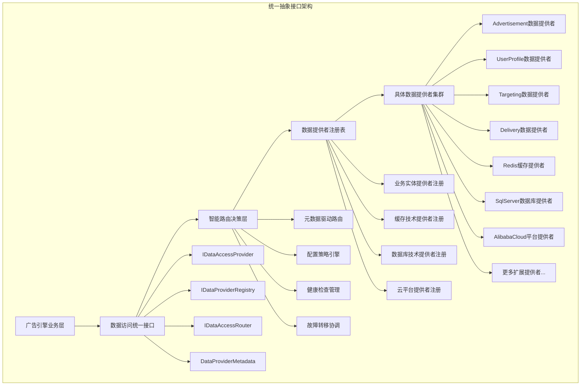
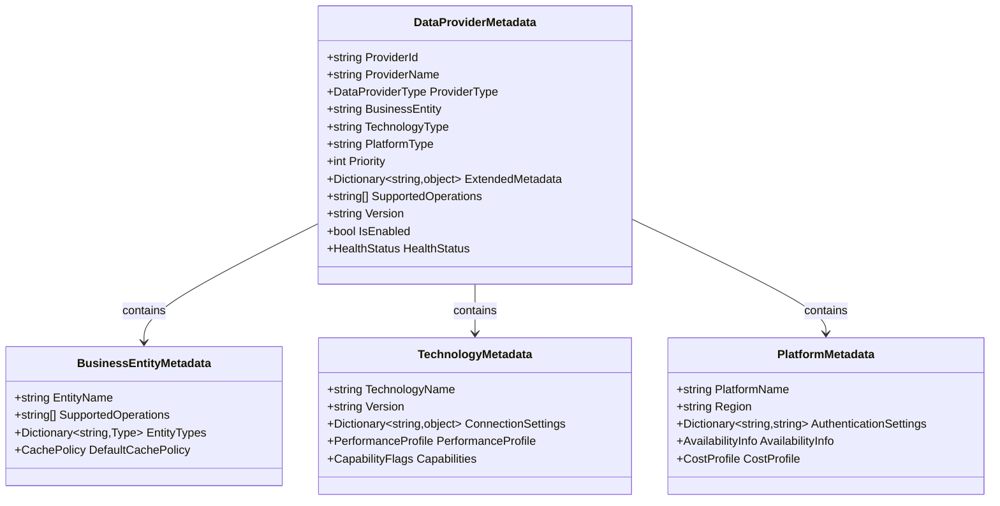
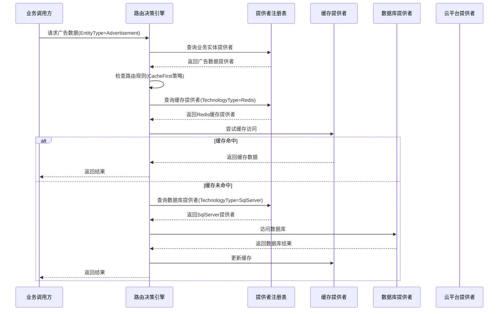
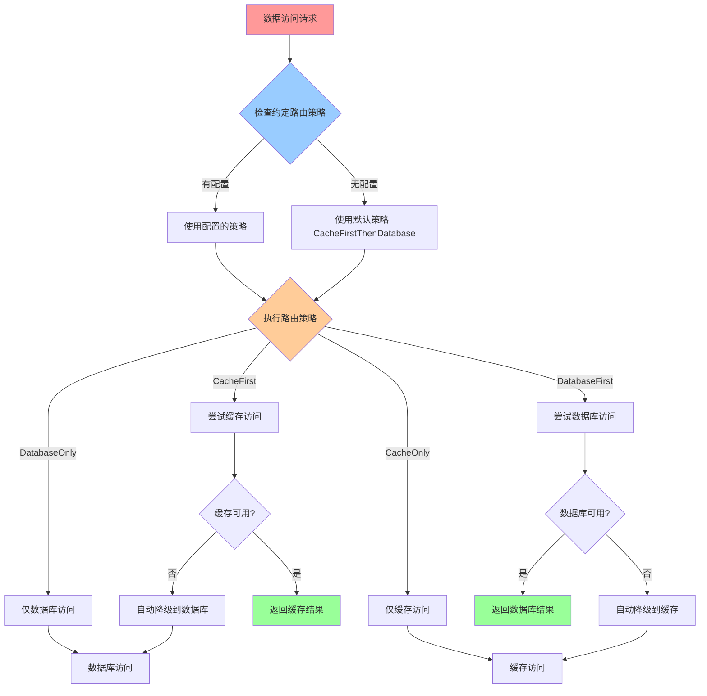
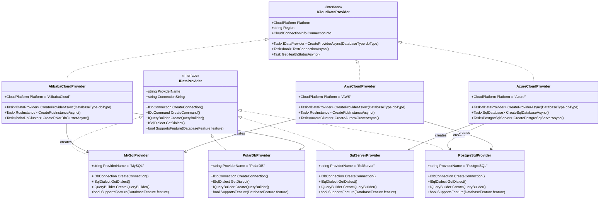

# 数据访问层技术设计

## 设计概述

广告投放平台数据访问层采用透明化数据访问架构，为上层业务提供统一的数据访问接口，完全屏蔽缓存和数据库的实现细节。该架构基于缓存优先的访问策略，通过智能缓存管理、多云数据库支持和配置驱动的存储选择，实现高性能、高可用的数据访问服务。系统支持SQL Server、MySQL、PostgreSQL、PolarDB等多种关系型数据库，以及Redis、MongoDB、InfluxDB等NoSQL数据库，确保在不同云平台间的无缝迁移和扩展。

### 设计目标

**完全透明的数据访问**：
- 上层业务无需感知数据来源是缓存还是数据库
- 通过统一的数据访问抽象接口提供服务
- 缓存管理、数据库访问、云平台适配等复杂性完全封装
- 支持热切换数据源而不影响业务流程

**缓存优先的访问策略**：
- 所有数据访问请求优先查询缓存层
- 缓存未命中时自动访问数据库并更新缓存
- 智能缓存失效和数据一致性保障
- 支持多级缓存和分布式缓存协调

**配置驱动的存储选择**：
- 通过配置文件动态选择具体的数据库实现
- 支持运行时切换云平台和数据库类型
- 提供环境隔离和多租户支持
- 实现蓝绿部署和灾难恢复策略

### 系统架构总览



## 架构设计原则

### 核心设计原则

- **统一接口原则**：所有数据访问组件都实现统一的`IDataAccessProvider`接口
- **约定优于配置**：基于命名约定和组件特性自动发现和注册数据提供者
- **零配置扩展**：新增数据提供者时无需修改基础设施代码，通过约定自动识别
- **元数据驱动原则**：通过元数据标识业务实体、技术类型、平台信息，实现智能路由
- **基础设施化管理**：数据访问管理是完整的基础设施，不是业务扩展点
- **透明性保障**：上层业务完全无感知底层数据存储和路由决策的实现细节

### 技术架构约束

- **抽象接口优先**：所有数据访问通过统一的`IDataAccessProvider`接口
- **约定驱动自动化**：通过标准化的命名约定和组件特性实现自动发现
- **自动注册机制**：基于程序集扫描和约定规则自动注册所有数据提供者
- **配置绑定集成**：数据提供者注册时自动绑定对应的配置选项
- **路由决策集中**：通过专门的路由器实现智能的提供者选择
- **异步访问模式**：所有数据操作采用异步模式，提高系统吞吐量

## 数据访问抽象接口设计

### 接口设计概述

基于统一配置化和依赖注入设计原则，数据访问抽象接口采用约定优于配置的设计思想，通过标准化的组件约定和自动发现机制实现高度可扩展和零配置的架构。所有具体实现都继承统一的顶层接口，通过命名约定和组件特性自动识别其业务领域、技术类型和平台信息。

**核心设计理念**：
- **数据访问管理是基础设施**：数据访问层是完整的、开箱即用的基础设施，不是业务扩展点
- **约定优于配置**：通过标准化命名约定（如`*Provider`、`*DataProvider`等）自动发现组件
- **零配置扩展**：新增数据提供者只需遵循约定，无需修改基础设施代码
- **智能依赖注入**：基于组件特性和约定自动完成依赖注入和配置绑定

#### 统一数据访问抽象接口架构


#### 基于约定的分层数据提供者架构设计

数据提供者采用分层架构设计，业务数据提供者作为上层组件被业务调用，内部通过数据访问路由器调用技术提供者（缓存、数据库）实现具体的数据访问：

```mermaid
classDiagram
    class AdvertisementDataProvider {
        +DataProviderMetadata GetMetadata()
        +string BusinessEntity = "Advertisement"
        +DataProviderType ProviderType = "BusinessLogic"
        +Task~T~ GetAsync~T~(DataAccessContext context)
        <<约定: *DataProvider 命名>>
        <<特性: [Component]>>
        <<配置: AdvertisementDataProviderOptions>>
    }
    
    class UserProfileDataProvider {
        +DataProviderMetadata GetMetadata()
        +string BusinessEntity = "UserProfile"
        +DataProviderType ProviderType = "BusinessLogic"
        +Task~T~ GetAsync~T~(DataAccessContext context)
        <<约定: *DataProvider 命名>>
        <<特性: [Component]>>
        <<配置: UserProfileDataProviderOptions>>
    }
    
    class RedisCacheProvider {
        +DataProviderMetadata GetMetadata()
        +string TechnologyType = "Redis"
        +DataProviderType ProviderType = "Cache"
        +Task~T~ GetAsync~T~(DataAccessContext context)
        <<约定: *Provider 命名>>
        <<特性: [Component]>>
        <<配置: RedisCacheProviderOptions>>
    }
    
    class SqlServerDatabaseProvider {
        +DataProviderMetadata GetMetadata()
        +string TechnologyType = "SqlServer"
        +DataProviderType ProviderType = "Database"
        +Task~T~ GetAsync~T~(DataAccessContext context)
        <<约定: *Provider 命名>>
        <<特性: [Component]>>
        <<配置: SqlServerDatabaseProviderOptions>>
    }
    
    class AlibabaCloudProvider {
        +DataProviderMetadata GetMetadata()
        +string PlatformType = "AlibabaCloud"
        +DataProviderType ProviderType = "Cloud"
        +Task~T~ GetAsync~T~(DataAccessContext context)
        <<约定: *Provider 命名>>
        <<特性: [Component]>>
        <<配置: AlibabaCloudProviderOptions>>
    }
    
    IDataAccessProvider <|.. AdvertisementDataProvider
    IDataAccessProvider <|.. UserProfileDataProvider
    IDataAccessProvider <|.. RedisCacheProvider
    IDataAccessProvider <|.. SqlServerDatabaseProvider
    
    AdvertisementDataProvider --> IDataAccessRouter : 依赖注入
    UserProfileDataProvider --> IDataAccessRouter : 依赖注入
    IDataAccessRouter --> RedisCacheProvider : 路由调用
    IDataAccessRouter --> SqlServerDatabaseProvider : 路由调用
 ```   

    note for AdvertisementDataProvider : 业务层：处理业务逻辑\n配置路径: DataProviders:Advertisement
    note for RedisCacheProvider : 技术层：缓存实现\n配置路径: Providers:RedisCache
    note for SqlServerDatabaseProvider : 技术层：数据库实现\n配置路径: Providers:SqlServerDatabase


#### 自动发现和注册机制设计

基于约定的数据提供者自动发现和零配置注册机制：

```mermaid
sequenceDiagram
    participant App as 应用启动
    participant Infrastructure as 基础设施启动器
    participant Scanner as 组件扫描器
    participant Registry as 数据提供者注册表
    participant Provider as 具体数据提供者
    participant Engine as 广告引擎
    
    App->>Infrastructure: 调用AddAdSystemInfrastructure()
    Infrastructure->>Scanner: 扫描所有程序集
    Scanner->>Scanner: 查找*Provider类型
    Scanner->>Scanner: 应用约定规则验证
    Scanner-->>Infrastructure: 返回发现的提供者类型
    
    loop 每个发现的提供者类型
        Infrastructure->>Provider: 创建提供者实例
        Infrastructure->>Provider: 自动绑定配置选项
        Provider->>Registry: 注册元数据和实例
        Infrastructure->>Infrastructure: 注册到DI容器
    end
    
    Engine->>Registry: 请求数据访问
    Registry->>Registry: 基于元数据路由
    Registry-->>Engine: 返回合适的提供者
    Engine->>Provider: 执行数据操作
    Provider-->>Engine: 返回结果
    
    note over Scanner: 基于命名约定(*Provider, *DataProvider)和组件特性([Component])自动发现
    note over Infrastructure: 自动配置绑定和生命周期管理
```

### 元数据驱动的路由决策设计

#### 数据提供者元数据体系

**元数据分类设计**：



**元数据示例**：

```text
广告数据提供者元数据：
├── ProviderId: "AdvertisementDataProvider_v1.0"
├── ProviderName: "广告数据业务提供者"
├── ProviderType: BusinessLogic
├── BusinessEntity: "Advertisement"
├── SupportedOperations: ["GetCandidates", "GetDetails", "GetCampaigns"]
├── Priority: 100
└── ExtendedMetadata:
    ├── CacheEnabled: true
    ├── TransactionSupport: true
    └── BatchOperationSupport: true

Redis缓存提供者元数据：
├── ProviderId: "RedisCacheProvider_v2.1"
├── ProviderName: "Redis分布式缓存"
├── ProviderType: Cache
├── TechnologyType: "Redis"
├── SupportedOperations: ["Get", "Set", "Remove", "Exists", "Pattern"]
├── Priority: 90
└── ExtendedMetadata:
    ├── ClusterMode: true
    ├── MaxExpiration: "24:00:00"
    └── CompressionEnabled: true

SqlServer数据库提供者元数据：
├── ProviderId: "SqlServerProvider_v1.5"
├── ProviderName: "SQL Server数据库"
├── ProviderType: Database
├── TechnologyType: "SqlServer"
├── SupportedOperations: ["Select", "Insert", "Update", "Delete", "Transaction"]
├── Priority: 80
└── ExtendedMetadata:
    ├── ReadWriteSeparation: true
    ├── ConnectionPoolSize: 100
    └── CommandTimeout: "00:00:30"

阿里云平台提供者元数据：
├── ProviderId: "AlibabaCloudProvider_v3.0"
├── ProviderName: "阿里云平台服务"
├── ProviderType: Cloud
├── PlatformType: "AlibabaCloud"
├── SupportedOperations: ["RDS", "PolarDB", "Redis", "OSS"]
├── Priority: 70
└── ExtendedMetadata:
    ├── Region: "cn-hangzhou"
    ├── AvailabilityZones: ["cn-hangzhou-a", "cn-hangzhou-b"]
    └── AutoScaling: true
```

#### 智能路由决策引擎



#### 约定优于配置的数据访问配置设计

**基于约定的零配置架构**：

数据访问层采用约定优于配置的设计原则，通过标准化的命名约定和智能默认值，实现最小化配置的数据访问管理。系统会自动发现和注册所有符合约定的数据提供者，开发者只需要遵循约定即可享受零配置的便利。

**配置结构设计**：

```json
{
  "DataAccess": {
    "DefaultRoutingStrategy": "CacheFirstThenDatabase",
    "HealthCheckInterval": "00:01:00",
    "EnablePerformanceMonitoring": true
  },
  "Providers": {
    "RedisCacheProvider": {
      "ConnectionString": "${REDIS_CONNECTION_STRING}",
      "DefaultExpiration": "01:00:00",
      "ClusterMode": true,
      "CompressionEnabled": true
    },
    "SqlServerDatabaseProvider": {
      "ConnectionString": "${SQLSERVER_CONNECTION_STRING}",
      "CommandTimeout": "00:00:30",
      "ConnectionPoolSize": 100,
      "EnableRetry": true
    },
    "AlibabaCloudProvider": {
      "Region": "cn-hangzhou",
      "AccessKeyId": "${ALIBABA_ACCESS_KEY_ID}",
      "AccessKeySecret": "${ALIBABA_ACCESS_KEY_SECRET}",
      "AutoScaling": true
    }
  },
  "DataProviders": {
    "AdvertisementDataProvider": {
      "CacheEnabled": true,
      "CacheExpiration": "00:30:00",
      "BatchSize": 100,
      "EnableDebugLogging": false
    },
    "UserProfileDataProvider": {
      "CacheEnabled": true,
      "CacheExpiration": "02:00:00",
      "EnablePrivacyMode": true
    }
  },
  "RoutingStrategies": {
    "Advertisement": "CacheFirstThenDatabase",
    "UserProfile": "CacheOnly",
    "Targeting": "DatabaseFirstThenCache",
    "Delivery": "DatabaseOnly"
  }
}
```

**约定规则说明**：

1. **数据提供者约定**：
   - 命名格式：`*DataProvider`（如：`AdvertisementDataProvider`）
   - 配置路径：`DataProviders:{ProviderName}`（去掉`DataProvider`后缀）
   - 自动生命周期：`Singleton`

2. **技术提供者约定**：
   - 命名格式：`*Provider`（如：`RedisCacheProvider`、`SqlServerDatabaseProvider`）
   - 配置路径：`Providers:{ProviderName}`（去掉`Provider`后缀）
   - 自动生命周期：`Singleton`

3. **配置选项约定**：
   - 选项类命名：`{ProviderName}Options`
   - 自动绑定到对应的配置节点
   - 支持数据注解验证

**智能默认值和降级策略**：



## 多云数据库支持架构

### 底层数据库适配设计

基于透明化数据访问的要求，底层数据库适配层完全对上层隐藏，通过配置驱动选择具体的数据库实现：



### 云平台配置和连接管理

**多云架构独立性设计**：
- 云平台抽象接口（`Lorn.ADSP.Infrastructure.Cloud.Abstractions`）作为独立项目，定义统一的云服务接口
- 每个云平台实现独立项目，避免单一部署包含多云代码：
  - `Lorn.ADSP.Infrastructure.Cloud.AlibabaCloud` - 阿里云独立实现
  - `Lorn.ADSP.Infrastructure.Cloud.Azure` - Azure云独立实现
  - `Lorn.ADSP.Infrastructure.Cloud.AWS` - AWS云独立实现
- 通过NuGet包管理和依赖注入实现运行时云平台选择
- 每个部署环境只包含当前所需的云平台实现，减少依赖和部署包大小

**配置设计指导**：
- 支持多云配置文件管理，包含连接字符串、认证信息、区域设置等
- 提供连接池管理和故障转移机制
- 实现云平台特定的监控和日志集成
- 通过配置文件指定当前部署使用的云平台类型

**连接字符串管理**：
- 支持Azure Key Vault、AWS Secrets Manager、阿里云KMS等密钥管理服务
- 提供连接字符串的加密存储和动态解密
- 支持不同环境（开发、测试、生产）的配置隔离
- 实现连接字符串的版本管理和回滚机制

**部署策略优势**：
- **减少依赖复杂性**：每个部署环境只包含必要的云平台实现
- **提高安全性**：避免在同一部署中暴露多个云平台的认证信息
- **优化性能**：减少不必要的依赖加载，提高应用启动性能
- **简化运维**：每个云平台的配置和监控独立管理，便于故障排查

## 基础设施层实现设计

### 数据访问基础设施项目结构

基于统一配置化和依赖注入设计，数据访问层采用分层的基础设施项目结构：

```text
Infrastructure/
├── Lorn.ADSP.Infrastructure.DataAccess.Abstractions/    # 数据访问抽象层
│   ├── Interfaces/                                     # 核心抽象接口
│   │   ├── IDataAccessProvider.cs                      # 统一数据访问提供者接口
│   │   ├── IDataProviderRegistry.cs                    # 数据提供者注册表接口
│   │   ├── IDataAccessRouter.cs                        # 数据访问路由器接口
│   │   └── IHealthCheckable.cs                         # 健康检查接口
│   ├── Models/                                         # 核心模型
│   │   ├── DataProviderMetadata.cs                     # 数据提供者元数据
│   │   ├── DataAccessContext.cs                        # 数据访问上下文
│   │   ├── DataProviderQuery.cs                        # 数据提供者查询
│   │   └── RoutingRule.cs                              # 路由规则
│   ├── Enums/                                          # 枚举定义
│   │   ├── DataProviderType.cs                         # 数据提供者类型
│   │   ├── DataConsistencyLevel.cs                     # 数据一致性级别
│   │   └── RoutingStrategy.cs                          # 路由策略
│   └── Attributes/                                     # 特性标记
│       ├── DataProviderAttribute.cs                    # 数据提供者特性
│       └── ConfigurationBindingAttribute.cs            # 配置绑定特性
├── Lorn.ADSP.Infrastructure.DataAccess.Core/           # 数据访问核心实现
│   ├── Registry/                                       # 注册表实现
│   │   ├── DataProviderRegistry.cs                     # 数据提供者注册表
│   │   └── InMemoryProviderRegistry.cs                 # 内存注册表实现
│   ├── Routing/                                        # 路由实现
│   │   ├── DataAccessRouter.cs                         # 数据访问路由器
│   │   ├── RoutingRuleEngine.cs                        # 路由规则引擎
│   │   └── DefaultRoutingStrategy.cs                   # 默认路由策略
│   ├── Discovery/                                      # 组件发现
│   │   ├── DataProviderScanner.cs                      # 数据提供者扫描器
│   │   └── ConventionBasedDiscovery.cs                 # 基于约定的发现器
│   ├── Configuration/                                  # 配置管理
│   │   ├── DataAccessConfiguration.cs                  # 数据访问配置
│   │   └── DataProviderOptionsManager.cs               # 提供者配置管理器
│   └── Extensions/                                     # 扩展方法
│       └── ServiceCollectionExtensions.cs              # 服务注册扩展
├── Lorn.ADSP.Infrastructure.DataAccess.Repository/     # 仓储模式实现
│   ├── Abstractions/                                  # 仓储抽象
│   │   ├── IRepository.cs                              # 基础仓储接口
│   │   ├── IReadOnlyRepository.cs                      # 只读仓储接口
│   │   └── IUnitOfWork.cs                              # 工作单元接口
│   ├── Base/                                          # 基础实现
│   │   ├── RepositoryBase.cs                           # 仓储基类
│   │   └── UnitOfWorkBase.cs                           # 工作单元基类
│   └── Specifications/                                # 规约模式
│       ├── ISpecification.cs                           # 规约接口
│       └── SpecificationBase.cs                        # 规约基类
└── Lorn.ADSP.Infrastructure.DataAccess.Composition/    # 数据访问组合层
    ├── Extensions/                                     # 统一注册扩展
    │   └── ServiceCollectionExtensions.cs              # 数据访问基础设施注册
    ├── Bootstrapper/                                   # 启动器
    │   └── DataAccessBootstrapper.cs                   # 数据访问启动器
    └── Configuration/                                  # 组合配置
        └── DataAccessSettings.cs                       # 数据访问设置
```

### 基于约定的组件自动发现和注册

**数据访问启动器实现**：

```csharp
// Lorn.ADSP.Infrastructure.DataAccess.Composition/Bootstrapper/DataAccessBootstrapper.cs
public class DataAccessBootstrapper
{
    private readonly IServiceCollection _services;
    private readonly IConfiguration _configuration;
    
    public DataAccessBootstrapper(IServiceCollection services, IConfiguration configuration)
    {
        _services = services;
        _configuration = configuration;
    }
    
    public IServiceCollection Bootstrap()
    {
        // 1. 注册核心基础设施
        RegisterCoreInfrastructure();
        
        // 2. 自动发现和注册数据提供者
        RegisterDataProviders();
        
        // 3. 注册配置选项和验证器
        RegisterConfiguration();
        
        // 4. 注册健康检查
        RegisterHealthChecks();
        
        return _services;
    }
    
    private void RegisterCoreInfrastructure()
    {
        // 注册核心组件
        _services.AddSingleton<IDataProviderRegistry, DataProviderRegistry>();
        _services.AddSingleton<IDataAccessRouter, DataAccessRouter>();
        _services.AddSingleton<DataProviderScanner>();
        _services.AddSingleton<RoutingRuleEngine>();
    }
    
    private void RegisterDataProviders()
    {
        var scanner = new DataProviderScanner();
        var discoveredProviders = scanner.ScanForDataProviders();
        
        foreach (var providerType in discoveredProviders)
        {
            // 基于约定确定注册方式
            var convention = DataAccessConventions.FindRuleByType(providerType);
            if (convention != null)
            {
                // 注册数据提供者
                _services.Add(new ServiceDescriptor(
                    typeof(IDataAccessProvider), 
                    providerType, 
                    convention.Lifetime));
                
                // 自动绑定配置选项
                RegisterProviderConfiguration(providerType, convention);
            }
        }
    }
    
    private void RegisterProviderConfiguration(Type providerType, ComponentConventionRule convention)
    {
        // 查找对应的配置选项类型
        var optionsTypeName = $"{providerType.Name}Options";
        var optionsType = providerType.Assembly.GetTypes()
            .FirstOrDefault(t => t.Name == optionsTypeName);
            
        if (optionsType != null)
        {
            // 计算配置路径
            var configPath = CalculateConfigurationPath(providerType, convention);
            
            // 绑定配置选项
            var configSection = _configuration.GetSection(configPath);
            _services.Configure(optionsType, configSection);
            
            // 注册配置验证器
            RegisterValidatorsForOptionsType(optionsType);
        }
    }
    
    private string CalculateConfigurationPath(Type providerType, ComponentConventionRule convention)
    {
        var componentName = providerType.Name;
        if (componentName.EndsWith(convention.Suffix))
        {
            componentName = componentName.Substring(0, 
                componentName.Length - convention.Suffix.Length);
        }
        
        return string.Format(convention.ConfigurationPathTemplate, componentName);
    }
}
```

### 统一数据访问基础设施扩展入口

```csharp
// Lorn.ADSP.Infrastructure.DataAccess.Composition/Extensions/ServiceCollectionExtensions.cs
public static class ServiceCollectionExtensions
{
    /// <summary>
    /// 添加数据访问基础设施 - 这是数据访问层唯一的对外接口
    /// </summary>
    public static IServiceCollection AddDataAccessInfrastructure(
        this IServiceCollection services, 
        IConfiguration configuration)
    {
        // 使用数据访问启动器来组装所有组件
        var bootstrapper = new DataAccessBootstrapper(services, configuration);
        return bootstrapper.Bootstrap();
    }
    
    /// <summary>
    /// 为数据访问组件添加健康检查支持
    /// </summary>
    public static IHealthChecksBuilder AddDataAccessHealthChecks(
        this IHealthChecksBuilder builder)
    {
        // 自动扫描所有实现 IHealthCheckable 的数据提供者
        var healthCheckableProviders = AssemblyScanner.FindTypes(type => 
            typeof(IHealthCheckable).IsAssignableFrom(type) && 
            typeof(IDataAccessProvider).IsAssignableFrom(type) &&
            type.IsClass && 
            !type.IsAbstract);
            
        foreach (var providerType in healthCheckableProviders)
        {
            builder.AddTypeActivatedCheck($"DataProvider_{providerType.Name}", providerType);
        }
        
        return builder;
    }
}
```

### 基础仓储接口设计

```mermaid
classDiagram
    class IReadOnlyRepository~T~ {
        <<interface>>
        +Task~T~ GetByIdAsync(object id, CancellationToken cancellationToken)
        +Task~IEnumerable~T~~ GetAllAsync(CancellationToken cancellationToken)
        +Task~IEnumerable~T~~ FindAsync(ISpecification~T~ specification, CancellationToken cancellationToken)
        +Task~PagedResult~T~~ GetPagedAsync(ISpecification~T~ specification, int pageIndex, int pageSize, CancellationToken cancellationToken)
        +Task~int~ CountAsync(ISpecification~T~ specification, CancellationToken cancellationToken)
        +Task~bool~ ExistsAsync(ISpecification~T~ specification, CancellationToken cancellationToken)
        +Task~TResult~ AggregateAsync~TResult~(IAggregateSpecification~T,TResult~ specification, CancellationToken cancellationToken)
    }
    
    class IRepository~T~ {
        <<interface>>
        +Task~T~ AddAsync(T entity, CancellationToken cancellationToken)
        +Task~IEnumerable~T~~ AddRangeAsync(IEnumerable~T~ entities, CancellationToken cancellationToken)
        +Task UpdateAsync(T entity, CancellationToken cancellationToken)
        +Task UpdateRangeAsync(IEnumerable~T~ entities, CancellationToken cancellationToken)
        +Task DeleteAsync(T entity, CancellationToken cancellationToken)
        +Task DeleteRangeAsync(IEnumerable~T~ entities, CancellationToken cancellationToken)
        +Task~int~ DeleteAsync(ISpecification~T~ specification, CancellationToken cancellationToken)
        +Task~int~ BulkUpdateAsync(ISpecification~T~ specification, object updateValues, CancellationToken cancellationToken)
    }
    
    class IAdvertisementRepository {
        <<interface>>
        +Task~IEnumerable~Advertisement~~ GetActiveAdvertisementsAsync(CancellationToken cancellationToken)
        +Task~IEnumerable~Advertisement~~ GetByStatusAsync(AdStatus status, CancellationToken cancellationToken)
        +Task~Advertisement~ GetWithCampaignsAsync(int id, CancellationToken cancellationToken)
        +Task~Advertisement~ GetWithCreativesAsync(int id, CancellationToken cancellationToken)
        +Task~bool~ HasActiveCampaignsAsync(int advertisementId, CancellationToken cancellationToken)
        +Task~IEnumerable~Advertisement~~ GetMatchingAdvertisementsAsync(TargetingCriteria criteria, CancellationToken cancellationToken)
        +Task~IEnumerable~Advertisement~~ GetByAdvertiserIdAsync(int advertiserId, CancellationToken cancellationToken)
        +Task~Advertisement~ GetWithAuditHistoryAsync(int id, CancellationToken cancellationToken)
    }
    
    class ICampaignRepository {
        <<interface>>
        +Task~IEnumerable~Campaign~~ GetByAdvertisementIdAsync(int advertisementId, CancellationToken cancellationToken)
        +Task~IEnumerable~Campaign~~ GetActiveCampaignsAsync(CancellationToken cancellationToken)
        +Task~IEnumerable~Campaign~~ GetByStatusAsync(CampaignStatus status, CancellationToken cancellationToken)
        +Task~Campaign~ GetWithDeliveryRecordsAsync(int id, CancellationToken cancellationToken)
        +Task~decimal~ GetTotalSpentAsync(int campaignId, CancellationToken cancellationToken)
        +Task~decimal~ GetDailySpentAsync(int campaignId, DateTime date, CancellationToken cancellationToken)
        +Task~IEnumerable~Campaign~~ GetBudgetExceededCampaignsAsync(CancellationToken cancellationToken)
        +Task~bool~ UpdateBudgetAsync(int campaignId, decimal spentAmount, CancellationToken cancellationToken)
        +Task~IEnumerable~Campaign~~ GetByTargetingConfigAsync(TargetingConfig config, CancellationToken cancellationToken)
    }
    
    class IDeliveryRecordRepository {
        <<interface>>
        +Task~IEnumerable~DeliveryRecord~~ GetByCampaignIdAsync(int campaignId, CancellationToken cancellationToken)
        +Task~IEnumerable~DeliveryRecord~~ GetByDateRangeAsync(DateTime startDate, DateTime endDate, CancellationToken cancellationToken)
        +Task~IEnumerable~DeliveryRecord~~ GetByMediaResourceIdAsync(int mediaResourceId, CancellationToken cancellationToken)
        +Task~DeliveryStatistics~ GetStatisticsAsync(int campaignId, DateTime startDate, DateTime endDate, CancellationToken cancellationToken)
        +Task~IEnumerable~DeliveryRecord~~ GetTopPerformingRecordsAsync(int count, CancellationToken cancellationToken)
        +Task BulkInsertAsync(IEnumerable~DeliveryRecord~ records, CancellationToken cancellationToken)
        +Task~decimal~ CalculateTotalCostAsync(int campaignId, DateTime date, CancellationToken cancellationToken)
        +Task~IEnumerable~DeliveryRecord~~ GetByUserIdAsync(string userId, DateTime fromDate, CancellationToken cancellationToken)
    }
    
    class IAdvertiserRepository {
        <<interface>>
        +Task~IEnumerable~Advertiser~~ GetByStatusAsync(AdvertiserStatus status, CancellationToken cancellationToken)
        +Task~Advertiser~ GetWithAdvertisementsAsync(int id, CancellationToken cancellationToken)
        +Task~IEnumerable~Advertiser~~ GetByRegistrationDateAsync(DateTime fromDate, DateTime toDate, CancellationToken cancellationToken)
        +Task~bool~ EmailExistsAsync(string email, CancellationToken cancellationToken)
        +Task~Advertiser~ GetByEmailAsync(string email, CancellationToken cancellationToken)
        +Task~IEnumerable~Advertiser~~ SearchByCompanyNameAsync(string companyName, CancellationToken cancellationToken)
    }
    
    class IMediaResourceRepository {
        <<interface>>
        +Task~IEnumerable~MediaResource~~ GetByTypeAsync(MediaType type, CancellationToken cancellationToken)
        +Task~IEnumerable~MediaResource~~ GetByPublisherIdAsync(int publisherId, CancellationToken cancellationToken)
        +Task~IEnumerable~MediaResource~~ GetAvailableInventoryAsync(DateTime fromDate, DateTime toDate, CancellationToken cancellationToken)
        +Task~MediaResource~ GetWithTrafficProfileAsync(int id, CancellationToken cancellationToken)
        +Task~IEnumerable~MediaResource~~ GetByAdSlotConfigurationAsync(AdSlotConfiguration config, CancellationToken cancellationToken)
        +Task~int~ GetInventoryCountAsync(int mediaResourceId, DateTime date, CancellationToken cancellationToken)
    }
    
    class IUserProfileRepository {
        <<interface>>
        +Task~UserProfile~ GetByUserIdAsync(string userId, CancellationToken cancellationToken)
        +Task~IEnumerable~UserProfile~~ GetBySegmentIdAsync(string segmentId, CancellationToken cancellationToken)
        +Task~IEnumerable~UserProfile~~ GetByInterestsAsync(List~string~ interests, CancellationToken cancellationToken)
        +Task~IEnumerable~UserProfile~~ GetByBehaviorsAsync(List~string~ behaviors, CancellationToken cancellationToken)
        +Task~bool~ HasUserProfileAsync(string userId, CancellationToken cancellationToken)
        +Task UpdateInterestsAsync(string userId, List~string~ interests, CancellationToken cancellationToken)
        +Task MergeProfilesAsync(string primaryUserId, string secondaryUserId, CancellationToken cancellationToken)
        +Task~IEnumerable~UserProfile~~ GetTargetAudienceAsync(TargetingConfig config, CancellationToken cancellationToken)
    }
    
    class ITargetingConfigRepository {
        <<interface>>
        +Task~TargetingConfig~ GetByCampaignIdAsync(string campaignId, CancellationToken cancellationToken)
        +Task~IEnumerable~TargetingConfig~~ GetBySourcePolicyIdAsync(string policyId, CancellationToken cancellationToken)
        +Task~TargetingConfig~ GetWithCriteriaAsync(string configId, CancellationToken cancellationToken)
        +Task~bool~ HasConfigAsync(string campaignId, CancellationToken cancellationToken)
        +Task UpdateCriteriaAsync(string configId, Dictionary~string,ITargetingCriteria~ criteria, CancellationToken cancellationToken)
        +Task~IEnumerable~TargetingConfig~~ GetActiveConfigsAsync(CancellationToken cancellationToken)
    }
    
    class ITargetingPolicyRepository {
        <<interface>>
        +Task~IEnumerable~TargetingPolicy~~ GetPublicPoliciesAsync(CancellationToken cancellationToken)
        +Task~IEnumerable~TargetingPolicy~~ GetByCategoryAsync(string category, CancellationToken cancellationToken)
        +Task~IEnumerable~TargetingPolicy~~ GetByCreatedByAsync(string createdBy, CancellationToken cancellationToken)
        +Task~TargetingPolicy~ GetWithUsageStatsAsync(string policyId, CancellationToken cancellationToken)
        +Task~IEnumerable~TargetingPolicy~~ SearchByTagsAsync(List~string~ tags, CancellationToken cancellationToken)
        +Task~bool~ IsPolicyInUseAsync(string policyId, CancellationToken cancellationToken)
        +Task~PolicyUsageStats~ GetUsageStatisticsAsync(string policyId, CancellationToken cancellationToken)
    }
    
    IReadOnlyRepository~T~ <|-- IRepository~T~
    IRepository~Advertisement~ <|-- IAdvertisementRepository
    IRepository~Campaign~ <|-- ICampaignRepository
    IRepository~DeliveryRecord~ <|-- IDeliveryRecordRepository
    IRepository~Advertiser~ <|-- IAdvertiserRepository
    IRepository~MediaResource~ <|-- IMediaResourceRepository
    IRepository~UserProfile~ <|-- IUserProfileRepository
    IRepository~TargetingConfig~ <|-- ITargetingConfigRepository
    IRepository~TargetingPolicy~ <|-- ITargetingPolicyRepository
```



### 接口设计说明

**仓储层在统一架构中的定位**：

- **内部服务接口**：仓储接口仅供数据库技术提供者内部使用，不直接暴露给业务层
- **技术绑定实现**：每个数据库技术提供者（SqlServer、MySQL等）内部使用对应的仓储实现
- **业务无感知**：业务层通过统一的`IDataAccessProvider`接口访问，无需了解底层仓储实现
- **元数据协调**：数据库提供者通过元数据声明支持的业务实体和操作类型

**泛型基础接口**：

- `IReadOnlyRepository<T>`：提供只读数据访问操作，支持查询、分页、聚合等
- `IRepository<T>`：继承只读接口，增加增删改操作和批量处理能力
- 支持规格模式进行复杂查询条件的组合和重用
- 内置分页支持，优化大数据集的处理性能

**业务特定接口**：

- 继承基础泛型接口，添加业务领域特定的查询方法
- 根据数据模型分层设计中的实体关系，提供关联查询方法
- 支持复杂的业务查询，如预算计算、统计分析、匹配查询等
- 提供批量操作优化，如批量插入投放记录、批量更新预算状态

**异步设计**：

- 所有数据库操作都采用异步模式，提高系统吞吐量
- 支持CancellationToken，提供操作取消和超时控制
- 异步批量操作，减少数据库连接时间和网络开销

## 统一事务管理接口设计

### 事务管理在统一架构中的定位

事务管理作为数据库技术提供者的核心内部机制，通过统一的抽象接口为业务层提供透明的事务控制能力。业务层通过`IDataAccessProvider`接口的事务方法进行操作，由数据库提供者内部协调具体的事务实现：

```mermaid
classDiagram
    %% 统一事务抽象接口
    class ITransactionManager {
        <<interface>>
        +TransactionMetadata Metadata
        +Task~ITransactionScope~ BeginTransactionAsync(TransactionOptions options, CancellationToken cancellationToken)
        +Task~ITransactionScope~ BeginDistributedTransactionAsync(DistributedTransactionOptions options, CancellationToken cancellationToken)
        +Task~T~ ExecuteInTransactionAsync~T~(Func~ITransactionScope, CancellationToken, Task~T~~ operation, TransactionOptions options, CancellationToken cancellationToken)
        +Task~bool~ SupportsTransactionType(TransactionType type)
        +Task~TransactionCapabilities~ GetCapabilitiesAsync(CancellationToken cancellationToken)
    }
    
    class ITransactionScope {
        <<interface>>
        +string TransactionId
        +TransactionType Type
        +IsolationLevel IsolationLevel
        +TransactionStatus Status
        +DateTime StartedAt
        +TimeSpan Duration
        +Task CommitAsync(CancellationToken cancellationToken)
        +Task RollbackAsync(CancellationToken cancellationToken)
        +Task~ITransactionScope~ CreateSavepointAsync(string name, CancellationToken cancellationToken)
        +Task RollbackToSavepointAsync(string name, CancellationToken cancellationToken)
        +void RegisterCompensation(Func~CancellationToken, Task~ compensation)
        +Task~TransactionStatistics~ GetStatisticsAsync()
        +ValueTask DisposeAsync()
    }
    
    class IDistributedTransactionScope {
        <<interface>>
        +string GlobalTransactionId
        +IReadOnlyList~ITransactionScope~ LocalScopes
        +Task~ITransactionScope~ CreateLocalScopeAsync(string scopeName, TransactionOptions options, CancellationToken cancellationToken)
        +Task CommitAllAsync(CancellationToken cancellationToken)
        +Task RollbackAllAsync(CancellationToken cancellationToken)
        +Task~bool~ PreparePhaseAsync(CancellationToken cancellationToken)
        +Task~DistributedTransactionResult~ GetResultAsync()
    }
    
    class ITransactionCoordinator {
        <<interface>>
        +Task~IDistributedTransactionScope~ CreateDistributedTransactionAsync(DistributedTransactionOptions options, CancellationToken cancellationToken)
        +Task~bool~ RegisterParticipantAsync(ITransactionManager participant, CancellationToken cancellationToken)
        +Task~CoordinationResult~ CoordinateCommitAsync(string globalTransactionId, CancellationToken cancellationToken)
        +Task~CoordinationResult~ CoordinateRollbackAsync(string globalTransactionId, CancellationToken cancellationToken)
        +Task~IEnumerable~TransactionManager~~ GetActiveParticipantsAsync(CancellationToken cancellationToken)
    }
    
    %% 元数据和配置
    class TransactionMetadata {
        +TransactionTechnology Technology
        +SupportedIsolationLevels SupportedIsolationLevels
        +bool SupportsDistributed
        +bool SupportsNested
        +bool SupportsSavepoints
        +TimeSpan MaxTransactionDuration
        +int MaxConcurrentTransactions
        +Dictionary~string,object~ ExtendedProperties
    }
    
    class TransactionOptions {
        +IsolationLevel IsolationLevel
        +TimeSpan Timeout
        +bool EnableAutoRetry
        +int MaxRetryAttempts
        +TransactionPriority Priority
        +Dictionary~string,object~ CustomProperties
    }
    
    %% 具体实现层（数据库技术提供者内部）
    class SqlServerTransactionManager {
        +TransactionMetadata Metadata
        -IConnectionManager connectionManager
        -ITransactionLogger logger
        +Task~ITransactionScope~ BeginTransactionAsync(TransactionOptions options, CancellationToken cancellationToken)
        +Task~bool~ SupportsTransactionType(TransactionType type)
    }
    
    class MySqlTransactionManager {
        +TransactionMetadata Metadata
        -IConnectionManager connectionManager
        -ITransactionLogger logger
        +Task~ITransactionScope~ BeginTransactionAsync(TransactionOptions options, CancellationToken cancellationToken)
        +Task~bool~ SupportsTransactionType(TransactionType type)
    }
    
    class RedisTransactionManager {
        +TransactionMetadata Metadata
        -IRedisConnectionManager connectionManager
        -ITransactionLogger logger
        +Task~ITransactionScope~ BeginTransactionAsync(TransactionOptions options, CancellationToken cancellationToken)
        +Task~bool~ SupportsTransactionType(TransactionType type)
    }
    
    %% 关系定义
    ITransactionManager <|-- SqlServerTransactionManager
    ITransactionManager <|-- MySqlTransactionManager
    ITransactionManager <|-- RedisTransactionManager
    ITransactionScope <|-- IDistributedTransactionScope
    ITransactionManager --> TransactionMetadata : contains
    ITransactionManager --> ITransactionScope : creates
    ITransactionCoordinator --> IDistributedTransactionScope : manages
    ITransactionCoordinator --> ITransactionManager : coordinates
    SqlServerTransactionManager --> TransactionOptions : uses
    MySqlTransactionManager --> TransactionOptions : uses
    RedisTransactionManager --> TransactionOptions : uses
```



### 统一事务管理设计原则

**元数据驱动的事务选择**：

- **事务能力声明**：每个数据库技术提供者通过`TransactionMetadata`声明其事务能力
- **自动能力匹配**：系统根据业务需求自动选择具备相应事务能力的提供者
- **透明技术切换**：业务层无需关心底层使用的具体事务技术
- **扩展性保证**：新增事务技术只需实现统一接口并声明元数据

**统一抽象接口设计**：

- **技术无关性**：`ITransactionManager`接口抽象了所有事务管理操作，不依赖具体技术
- **能力查询机制**：提供运行时查询事务能力的标准方法
- **配置驱动选择**：通过配置系统控制事务管理器的选择和路由
- **内部实现隔离**：具体的事务实现细节完全封装在数据库提供者内部

**事务边界统一管理**：

- **声明式事务控制**：通过统一接口提供声明式的事务边界管理
- **自动资源管理**：事务范围自动管理连接、锁等资源的生命周期
- **嵌套事务支持**：通过保存点机制支持安全的嵌套事务操作
- **补偿机制集成**：内置补偿操作注册，支持复杂业务场景的事务回滚

### 事务类型和能力支持

**本地事务支持**：

```csharp
// 业务层使用示例（通过统一接口）
public async Task<bool> CreateAdvertisementWithCampaignAsync(
    Advertisement advertisement, 
    Campaign campaign)
{
    var provider = await _dataAccessRouter.RouteAsync(new DataAccessContext
    {
        BusinessEntity = BusinessEntity.Advertisement,
        OperationType = OperationType.Create,
        RequiredCapabilities = new[] { "LocalTransaction" }
    });
    
    return await provider.ExecuteInTransactionAsync(async (scope, cancellationToken) =>
    {
        var savedAd = await provider.SaveAsync(advertisement, cancellationToken);
        campaign.AdvertisementId = savedAd.Id;
        var savedCampaign = await provider.SaveAsync(campaign, cancellationToken);
        
        return savedAd != null && savedCampaign != null;
    }, new TransactionOptions
    {
        IsolationLevel = IsolationLevel.ReadCommitted,
        Timeout = TimeSpan.FromSeconds(30)
    });
}
```

**分布式事务支持**：

```csharp
// 跨多个数据提供者的分布式事务
public async Task<bool> CreateCompleteAdvertisementSetupAsync(
    Advertisement advertisement,
    UserProfile targetProfile,
    DeliveryConfiguration deliveryConfig)
{
    var coordinator = _serviceProvider.GetRequiredService<ITransactionCoordinator>();
    
    using var distributedTx = await coordinator.CreateDistributedTransactionAsync(
        new DistributedTransactionOptions
        {
            GlobalTimeout = TimeSpan.FromMinutes(5),
            ConsistencyLevel = ConsistencyLevel.StrongConsistency
        });
    
    try
    {
        // 广告数据操作（可能在SQL Server）
        var adProvider = await _dataAccessRouter.RouteAsync(new DataAccessContext
        {
            BusinessEntity = BusinessEntity.Advertisement,
            RequiredCapabilities = new[] { "DistributedTransaction" }
        });
        
        var adScope = await distributedTx.CreateLocalScopeAsync("Advertisement", 
            new TransactionOptions { IsolationLevel = IsolationLevel.Serializable });
        var savedAd = await adProvider.SaveAsync(advertisement);
        
        // 用户画像操作（可能在MongoDB）
        var profileProvider = await _dataAccessRouter.RouteAsync(new DataAccessContext
        {
            BusinessEntity = BusinessEntity.UserProfile,
            RequiredCapabilities = new[] { "DistributedTransaction" }
        });
        
        var profileScope = await distributedTx.CreateLocalScopeAsync("UserProfile",
            new TransactionOptions { IsolationLevel = IsolationLevel.ReadCommitted });
        var savedProfile = await profileProvider.SaveAsync(targetProfile);
        
        // 投放配置操作（可能在Redis）
        var deliveryProvider = await _dataAccessRouter.RouteAsync(new DataAccessContext
        {
            BusinessEntity = BusinessEntity.Delivery,
            RequiredCapabilities = new[] { "DistributedTransaction" }
        });
        
        var deliveryScope = await distributedTx.CreateLocalScopeAsync("Delivery",
            new TransactionOptions { IsolationLevel = IsolationLevel.ReadUncommitted });
        var savedConfig = await deliveryProvider.SaveAsync(deliveryConfig);
        
        // 两阶段提交
        if (await distributedTx.PreparePhaseAsync())
        {
            await distributedTx.CommitAllAsync();
            return true;
        }
        else
        {
            await distributedTx.RollbackAllAsync();
            return false;
        }
    }
    catch
    {
        await distributedTx.RollbackAllAsync();
        throw;
    }
}
```

**事务能力元数据示例**：

```csharp
// SQL Server事务管理器的元数据声明
public class SqlServerTransactionManager : ITransactionManager
{
    public TransactionMetadata Metadata => new TransactionMetadata
    {
        Technology = TransactionTechnology.RelationalDatabase,
        SupportedIsolationLevels = IsolationLevel.ReadUncommitted | 
                                 IsolationLevel.ReadCommitted | 
                                 IsolationLevel.RepeatableRead | 
                                 IsolationLevel.Serializable,
        SupportsDistributed = true,
        SupportsNested = true,
        SupportsSavepoints = true,
        MaxTransactionDuration = TimeSpan.FromMinutes(30),
        MaxConcurrentTransactions = 1000,
        ExtendedProperties = new Dictionary<string, object>
        {
            ["SupportsDeadlockDetection"] = true,
            ["SupportsTransactionLog"] = true,
            ["SupportsOnlineIndexing"] = true
        }
    };
    
    // 实现具体的事务管理逻辑...
}

// Redis事务管理器的元数据声明
public class RedisTransactionManager : ITransactionManager
{
    public TransactionMetadata Metadata => new TransactionMetadata
    {
        Technology = TransactionTechnology.KeyValueStore,
        SupportedIsolationLevels = IsolationLevel.ReadCommitted, // Redis特性
        SupportsDistributed = true,
        SupportsNested = false, // Redis限制
        SupportsSavepoints = false, // Redis限制
        MaxTransactionDuration = TimeSpan.FromSeconds(60),
        MaxConcurrentTransactions = 10000,
        ExtendedProperties = new Dictionary<string, object>
        {
            ["SupportsMultiExec"] = true,
            ["SupportsOptimisticLocking"] = true,
            ["SupportsLuaScripts"] = true
        }
    };
    
    // 实现具体的事务管理逻辑...
}
```

#### 数据提供者约定规则和实现示例

基于统一配置化和依赖注入设计的约定规则，数据访问层定义了标准化的组件约定规则：

**数据提供者约定规则**：

```csharp
// 数据提供者约定规则配置
public static class DataAccessConventions
{
    public static readonly ComponentConventionRule[] Rules = new[]
    {
        new ComponentConventionRule
        {
            Suffix = "DataProvider",
            Lifetime = ServiceLifetime.Singleton,
            RequiredInterfaceNames = new[] { "IDataAccessProvider" },
            ConfigurationPathTemplate = "DataProviders:{0}",
            Description = "业务数据提供者组件",
            RequireSpecificInterface = true
        },
        new ComponentConventionRule
        {
            Suffix = "CacheProvider", 
            Lifetime = ServiceLifetime.Singleton,
            RequiredInterfaceNames = new[] { "IDataAccessProvider" },
            ConfigurationPathTemplate = "Providers:{0}",
            Description = "缓存技术提供者组件",
            RequireSpecificInterface = true
        },
        new ComponentConventionRule
        {
            Suffix = "DatabaseProvider",
            Lifetime = ServiceLifetime.Singleton,
            RequiredInterfaceNames = new[] { "IDataAccessProvider" },
            ConfigurationPathTemplate = "Providers:{0}",
            Description = "数据库技术提供者组件",
            RequireSpecificInterface = true
        },
        new ComponentConventionRule
        {
            Suffix = "CloudProvider",
            Lifetime = ServiceLifetime.Singleton,
            RequiredInterfaceNames = new[] { "IDataAccessProvider" },
            ConfigurationPathTemplate = "Providers:{0}",
            Description = "云平台提供者组件",
            RequireSpecificInterface = true
        }
    };
}
```

#### 数据提供者实现示例

**业务数据提供者实现**：

```csharp
// 广告数据提供者 - 业务层组件，通过路由器调用技术提供者
[Component] // 可选，基于命名约定也会自动发现
public class AdvertisementDataProvider : IDataAccessProvider, IHealthCheckable
{
    private readonly AdvertisementDataProviderOptions _options;
    private readonly IDataAccessRouter _router;
    private readonly ILogger<AdvertisementDataProvider> _logger;
    
    // 依赖注入：配置选项和数据访问路由器
    public AdvertisementDataProvider(
        IOptions<AdvertisementDataProviderOptions> options,
        IDataAccessRouter router,
        ILogger<AdvertisementDataProvider> logger)
    {
        _options = options.Value;
        _router = router;
        _logger = logger;
    }
    
    public DataProviderMetadata GetMetadata()
    {
        return new DataProviderMetadata
        {
            ProviderId = "AdvertisementDataProvider_v1.0",
            ProviderName = "广告数据业务提供者",
            ProviderType = DataProviderType.BusinessLogic,
            BusinessEntity = "Advertisement",
            SupportedOperations = new[] { "GetCandidates", "GetDetails", "GetCampaigns" },
            Priority = 100,
            Version = "1.0.0"
        };
    }
    
    public async Task<T> GetAsync<T>(DataAccessContext context)
    {
        _logger.LogDebug("业务层获取广告数据: {OperationType}", context.OperationType);
        
        // 业务层逻辑：通过路由器获取数据，实现缓存优先策略
        var result = await _router.GetWithCacheStrategyAsync<T>(context);
        
        // 可以在这里添加业务层的数据处理逻辑
        if (result != null && _options.EnableBusinessRules)
        {
            result = await ApplyBusinessRulesAsync(result, context);
        }
        
        return result;
    }
    
    public async Task SetAsync<T>(DataAccessContext context, T value)
    {
        _logger.LogDebug("业务层存储广告数据: {OperationType}", context.OperationType);
        
        // 业务层逻辑：数据验证和预处理
        if (_options.EnableDataValidation)
        {
            ValidateBusinessData(value, context);
        }
        
        // 通过路由器存储数据
        await _router.SetWithCacheStrategyAsync(context, value);
    }
    
    private async Task<T> ApplyBusinessRulesAsync<T>(T data, DataAccessContext context)
    {
        // 应用业务规则，如广告状态检查、权限验证等
        _logger.LogDebug("应用业务规则: {EntityType}", context.EntityType);
        
        // 示例：广告状态过滤
        if (data is Advertisement[] ads)
        {
            // 过滤掉已过期或未激活的广告
            var activeAds = ads.Where(ad => ad.Status == AdStatus.Active && ad.EndDate > DateTime.Now);
            return (T)(object)activeAds.ToArray();
        }
        
        return data;
    }
    
    private void ValidateBusinessData<T>(T data, DataAccessContext context)
    {
        // 业务数据验证逻辑
        if (data == null)
            throw new ArgumentNullException(nameof(data), "业务数据不能为空");
            
        // 添加更多业务验证规则...
    }
    
    public async Task<bool> HealthCheckAsync()
    {
        try
        {
            // 检查路由器和底层技术提供者的健康状态
            var testContext = new DataAccessContext
            {
                OperationType = "HealthCheck",
                EntityType = "Advertisement"
            };
            
            // 通过路由器检查技术提供者的健康状态
            var providers = await _router.GetCandidateProvidersAsync(testContext);
            return providers.Any();
        }
        catch (Exception ex)
        {
            _logger.LogError(ex, "广告数据提供者健康检查失败");
            return false;
        }
    }
}

// 配置选项类 - 会自动绑定到 DataProviders:Advertisement 配置节
public class AdvertisementDataProviderOptions
{
    public bool CacheEnabled { get; set; } = true;
    public TimeSpan CacheExpiration { get; set; } = TimeSpan.FromMinutes(30);
    public int BatchSize { get; set; } = 100;
    public bool EnableDebugLogging { get; set; } = false;
    public int MaxRetryAttempts { get; set; } = 3;
    
    // 业务层配置
    public bool EnableBusinessRules { get; set; } = true;
    public bool EnableDataValidation { get; set; } = true;
    public string DefaultRoutingStrategy { get; set; } = "CacheFirstThenDatabase";
    public TimeSpan BusinessRuleTimeout { get; set; } = TimeSpan.FromSeconds(5);
}

// 配置验证器 - 会自动发现并注册
public class AdvertisementDataProviderOptionsValidator : IValidateOptions<AdvertisementDataProviderOptions>
{
    public ValidateOptionsResult Validate(string name, AdvertisementDataProviderOptions options)
    {
        var failures = new List<string>();
        
        if (options.BatchSize <= 0)
            failures.Add("BatchSize 必须大于 0");
            
        if (options.CacheExpiration <= TimeSpan.Zero)
            failures.Add("CacheExpiration 必须大于 0");
            
        if (options.MaxRetryAttempts < 0)
            failures.Add("MaxRetryAttempts 不能小于 0");
        
        return failures.Count > 0 
            ? ValidateOptionsResult.Fail(failures)
            : ValidateOptionsResult.Success;
    }
}
```

**技术提供者实现**：

```csharp
// Redis缓存提供者 - 自动发现和注册
[Component]
public class RedisCacheProvider : IDataAccessProvider, IHealthCheckable
{
    private readonly RedisCacheProviderOptions _options;
    private readonly IConnectionMultiplexer _redis;
    private readonly ILogger<RedisCacheProvider> _logger;
    
    // 配置选项会自动注入 - 绑定到 Providers:RedisCache 配置节
    public RedisCacheProvider(
        IOptions<RedisCacheProviderOptions> options,
        IConnectionMultiplexer redis,
        ILogger<RedisCacheProvider> logger)
    {
        _options = options.Value;
        _redis = redis;
        _logger = logger;
    }
    
    public DataProviderMetadata GetMetadata()
    {
        return new DataProviderMetadata
        {
            ProviderId = "RedisCacheProvider_v2.1",
            ProviderName = "Redis分布式缓存",
            ProviderType = DataProviderType.Cache,
            TechnologyType = "Redis",
            SupportedOperations = new[] { "Get", "Set", "Remove", "Exists", "Pattern" },
            Priority = 90,
            Version = "2.1.0"
        };
    }
    
    public async Task<T> GetAsync<T>(DataAccessContext context)
    {
        var database = _redis.GetDatabase();
        var key = GenerateKey(context);
        
        _logger.LogDebug("从 Redis 获取数据: {Key}", key);
        
        var value = await database.StringGetAsync(key);
        if (!value.HasValue)
        {
            return default(T);
        }
        
        return JsonSerializer.Deserialize<T>(value);
    }
    
    public async Task SetAsync<T>(DataAccessContext context, T value)
    {
        var database = _redis.GetDatabase();
        var key = GenerateKey(context);
        var serializedValue = JsonSerializer.Serialize(value);
        
        _logger.LogDebug("向 Redis 存储数据: {Key}", key);
        
        await database.StringSetAsync(key, serializedValue, _options.DefaultExpiration);
    }
    
    // ...实现其他接口方法...
    
    private string GenerateKey(DataAccessContext context)
    {
        var keyParts = new List<string>
        {
            context.EntityType,
            context.OperationType
        };
        
        // 添加参数到键名
        foreach (var param in context.Parameters)
        {
            keyParts.Add($"{param.Key}:{param.Value}");
        }
        
        return string.Join(":", keyParts);
    }
}

// Redis 配置选项类
public class RedisCacheProviderOptions
{
    public string ConnectionString { get; set; }
    public TimeSpan DefaultExpiration { get; set; } = TimeSpan.FromHours(1);
    public bool ClusterMode { get; set; } = false;
    public bool CompressionEnabled { get; set; } = true;
    public int Database { get; set; } = 0;
}
```

## 总结

### 设计目标达成情况

通过采用统一配置化和依赖注入设计的思想，数据访问层技术设计实现了以下核心目标：

**完全零配置的扩展能力**：
- 新增数据提供者只需遵循命名约定（`*DataProvider`、`*Provider`），无需修改基础设施代码
- 配置选项通过约定自动绑定（`{ProviderName}Options` → `DataProviders:{ProviderName}` 或 `Providers:{ProviderName}`）
- 组件生命周期和依赖注入自动管理

**基础设施化的数据访问管理**：
- 数据访问管理作为完整的基础设施提供开箱即用的服务
- 通过 `AddDataAccessInfrastructure()` 一键启用所有数据访问能力
- 智能路由、健康检查、配置验证等功能自动集成

**约定优于配置的简化开发**：
- 标准化的组件约定规则确保一致性
- 最小化配置文件，智能默认值和降级策略
- 开发者专注于业务逻辑实现，无需关心基础设施配置

### 与系统配置化和依赖注入设计的一致性

1. **统一的基础设施管理**：数据访问层完全符合"基础设施不是业务扩展点"的设计理念
2. **约定驱动的自动化**：完全采用约定优于配置的设计模式，实现零配置扩展
3. **智能依赖注入**：基于组件约定和元数据的自动发现和注册机制
4. **配置管理集成**：与系统统一配置管理无缝集成，支持配置验证和热重载

### 开发者使用体验

**最简使用方式**：
```csharp
// 1. 应用启动 - 一行代码启用数据访问
services.AddAdSystemInfrastructure(configuration);

// 2. 创建数据提供者 - 遵循约定即可
[Component]
public class ProductDataProvider : IDataAccessProvider { /* 实现 */ }

// 3. 配置文件 - 最小化配置
{
  "DataProviders": {
    "Product": { "CacheEnabled": true }
  }
}
```

数据访问层技术设计成功将复杂的数据访问基础设施简化为约定驱动的零配置架构，为广告投放平台提供了高性能、高可用、易扩展的数据访问能力.

## 架构澄清说明

### 数据提供者分层关系

基于您的反馈，本设计明确了数据提供者的分层关系：

**业务数据提供者（Business Data Providers）**：

- 命名约定：`*DataProvider`（如 `AdvertisementDataProvider`）
- 职责：处理业务逻辑，被业务组件直接调用
- 依赖：通过 `IDataAccessRouter` 调用技术提供者
- 配置路径：`DataProviders:{BusinessEntity}`

**技术提供者（Technology Providers）**：

- 命名约定：`*Provider`（如 `RedisCacheProvider`, `SqlServerDatabaseProvider`）
- 职责：提供具体的技术实现（缓存、数据库、云服务）
- 依赖：直接操作底层技术资源
- 配置路径：`Providers:{TechnologyName}`

**调用关系**：

```text
业务组件 → 业务数据提供者 → 数据访问路由器 → 技术提供者 → 底层存储
```

这种分层设计确保了：

- 业务逻辑与技术实现的清晰分离
- 技术提供者的可组合性和可替换性
- 配置驱动的灵活路由策略
- 统一的监控和健康检查机制

数据访问层技术设计成功将复杂的数据访问基础设施简化为约定驱动的零配置架构，为广告投放平台提供了高性能、高可用、易扩展的数据访问能力。