# 系统整体技术架构设计

## 架构概述

Lorn.ADSP是一个企业级互联网广告投放平台，采用微服务分层架构设计，基于.NET 9技术栈构建。系统严格遵循IAB行业标准，支持OpenRTB实时竞价协议和VAST/VMAP视频广告标准，具备高并发、低延迟、高可用的技术特性。

## 技术架构原则

### 设计原则
- **高性能设计**：广告请求响应时间 < 50ms，支持10万+QPS
- **高可用架构**：系统可用性 ≥ 99.9%，支持故障自动恢复
- **弹性扩展**：支持水平扩展，按需弹性伸缩
- **标准合规**：严格遵循IAB OpenRTB、VAST、VMAP等行业标准
- **安全可靠**：多层安全防护，完善的反作弊机制
- **数据驱动**：全链路数据追踪，支持实时决策优化

### 架构约束
- 单一职责：每个微服务专注单一业务领域
- 服务自治：服务间通过标准API通信，避免直接数据库访问
- 数据一致性：采用最终一致性，关键业务保证强一致性
- 无状态设计：应用层无状态，状态存储在缓存和数据库中

## 技术架构图

```mermaid
graph TB
    subgraph "接入层 (Gateway Layer)"
        LB[负载均衡器<br/>Nginx/HAProxy]
        AG[API网关<br/>ASP.NET Core Gateway]
        CDN[CDN<br/>广告素材分发]
    end

    subgraph "应用层 (Application Layer)"
        subgraph "广告投放微服务"
            ADS[广告投放引擎<br/>.NET 9 Web API]
            BID[竞价服务<br/>OpenRTB实现]
            TARGET[定向服务<br/>用户画像匹配]
        end
        
        subgraph "业务管理微服务"
            ADM[广告主管理<br/>ASP.NET Core MVC]
            CAM[广告内容管理<br/>.NET 9 Web API]
            MED[媒体管理<br/>ASP.NET Core MVC]
        end
        
        subgraph "数据分析微服务"
            RPT[报表服务<br/>.NET 9 Web API]
            BI[商业智能<br/>数据分析引擎]
            ML[机器学习<br/>算法服务]
        end
    end

    subgraph "服务治理层 (Service Governance)"
        REG[服务注册中心<br/>Consul]
        CONF[配置中心<br/>Consul KV]
        DISC[服务发现<br/>Consul DNS]
    end

    subgraph "数据层 (Data Layer)"
        subgraph "关系型数据库"
            SQLM[SQL Server Master<br/>主库]
            SQLS[SQL Server Slaves<br/>读库集群]
        end
        
        subgraph "缓存层"
            REDIS[Redis Cluster<br/>分布式缓存]
            MEMCACHE[本地缓存<br/>Memory Cache]
        end
        
        subgraph "消息队列"
            MQ[RabbitMQ<br/>异步消息处理]
            KAFKA[Apache Kafka<br/>大数据流处理]
        end
        
        subgraph "搜索引擎"
            ES[Elasticsearch<br/>日志分析]
            SOLR[Apache Solr<br/>广告搜索]
        end
    end

    subgraph "监控运维层 (Monitoring Layer)"
        PROM[Prometheus<br/>指标收集]
        GRAF[Grafana<br/>监控面板]
        ELK[ELK Stack<br/>日志分析]
        ALERT[AlertManager<br/>告警系统]
    end

    subgraph "第三方集成 (External Integration)"
        DSP[第三方DSP<br/>需求方平台]
        SSP[第三方SSP<br/>供应方平台]
        ADX[第三方ADX<br/>广告交易平台]
        DMP[第三方DMP<br/>数据管理平台]
    end

    %% 请求流转
    LB --> AG
    AG --> ADS
    AG --> ADM
    AG --> CAM
    
    %% 服务间通信
    ADS --> BID
    ADS --> TARGET
    BID --> DSP
    ADS --> REDIS
    
    %% 数据访问
    ADS --> SQLM
    ADM --> SQLS
    CAM --> SQLS
    RPT --> SQLS
    
    %% 服务治理
    ADS --> REG
    BID --> REG
    TARGET --> REG
    
    %% 消息传递
    ADS --> MQ
    BID --> KAFKA
    
    %% 监控
    ADS --> PROM
    BID --> PROM
    TARGET --> PROM
    
    %% 样式
    classDef gateway fill:#e3f2fd,stroke:#1976d2,stroke-width:2px
    classDef service fill:#f3e5f5,stroke:#6a1b9a,stroke-width:2px
    classDef data fill:#fff3e0,stroke:#f57c00,stroke-width:2px
    classDef monitor fill:#e8f5e8,stroke:#2e7d32,stroke-width:2px
    classDef external fill:#ffebee,stroke:#c62828,stroke-width:2px
    
    class LB,AG,CDN gateway
    class ADS,BID,TARGET,ADM,CAM,MED,RPT,BI,ML service
    class SQLM,SQLS,REDIS,MEMCACHE,MQ,KAFKA,ES,SOLR data
    class PROM,GRAF,ELK,ALERT monitor
    class DSP,SSP,ADX,DMP external
```



## Visual Studio解决方案架构

### 解决方案结构设计

```
Lorn.ADSP.sln
│
├── 01.Presentation                          # 表示层
│   ├── Lorn.ADSP.Web.Api                   # Web API项目
│   ├── Lorn.ADSP.Web.Admin                 # 管理后台 (ASP.NET Core MVC)
│   ├── Lorn.ADSP.Web.Advertiser           # 广告主门户 (ASP.NET Core MVC)
│   └── Lorn.ADSP.Desktop.Monitor          # 桌面监控工具 (WPF)
│
├── 02.Services                              # 微服务层
│   ├── Lorn.ADSP.AdEngine                 # 广告投放引擎服务
│   ├── Lorn.ADSP.Bidding                  # 竞价服务
│   │   ├── Lorn.ADSP.Bidding.Recall      # 竞价召回服务
│   │   ├── Lorn.ADSP.Bidding.Filter      # 竞价过滤服务
│   │   └── Lorn.ADSP.Bidding.Ranking     # 竞价排序服务
│   ├── Lorn.ADSP.Targeting                # 定向服务
│   │   ├── Lorn.ADSP.Targeting.Recall    # 定向召回服务
│   │   ├── Lorn.ADSP.Targeting.Filter    # 定向过滤服务
│   │   └── Lorn.ADSP.Targeting.Ranking   # 定向排序服务
│   ├── Lorn.ADSP.Creative                 # 广告创意服务
│   ├── Lorn.ADSP.Campaign                 # 广告活动服务
│   ├── Lorn.ADSP.Analytics                # 数据分析服务
│   ├── Lorn.ADSP.Reporting                # 报表服务
│   └── Lorn.ADSP.Gateway                  # API网关服务
│
├── 03.Core                                  # 关键核心层
│   ├── Lorn.ADSP.Core.Domain              # 领域模型
│   │   ├── Aggregates/                     # 聚合根
│   │   ├── Entities/                       # 实体
│   │   ├── ValueObjects/                   # 值对象
│   │   ├── Events/                         # 领域事件
│   │   ├── Repositories/                   # 仓储接口（抽象层）
│   │   └── Specifications/                 # 规格模式接口
│   ├── Lorn.ADSP.Core.Application         # 应用服务
│   │   ├── Services/                       # 应用服务
│   │   ├── Commands/                       # 命令处理
│   │   ├── Queries/                        # 查询处理
│   │   └── DTOs/                          # 数据传输对象
│   ├── Lorn.ADSP.Core.Shared              # 共享组件
│   │   ├── Constants/                      # 常量定义
│   │   ├── Enums/                         # 枚举定义
│   │   ├── Extensions/                     # 扩展方法
│   │   └── Helpers/                       # 辅助类
│   └── Lorn.ADSP.Core.AdEngine.Abstractions # 广告引擎抽象接口层
│       ├── Targeting/                      # 定向抽象接口
│       ├── Bidding/                        # 竞价抽象接口
│       └── Delivery/                       # 投放抽象接口
│
├── 04.Infrastructure                       # 基础设施层（数据访问）
│   ├── Lorn.ADSP.Infrastructure.Data      # 数据访问核心实现
│   │   ├── Repositories/                   # 仓储实现
│   │   ├── UnitOfWork/                     # 工作单元实现
│   │   ├── DbContext/                      # 数据库上下文
│   │   ├── Configurations/                 # 实体配置
│   │   └── Extensions/                     # 扩展方法
│   ├── Lorn.ADSP.Infrastructure.Data.Providers # 数据库提供程序
│   │   ├── SqlServer/                      # SQL Server提供程序
│   │   ├── MySQL/                          # MySQL提供程序
│   │   ├── PostgreSQL/                     # PostgreSQL提供程序
│   │   └── SQLite/                         # SQLite提供程序
│   ├── Lorn.ADSP.Infrastructure.Caching   # 缓存组件
│   │   ├── Redis/                          # Redis缓存实现
│   │   ├── Memory/                         # 内存缓存实现
│   │   └── Abstractions/                   # 缓存抽象接口
│   ├── Lorn.ADSP.Infrastructure.Search    # 搜索引擎组件
│   │   ├── Elasticsearch/                  # ES搜索引擎访问
│   │   └── Abstractions/                   # 搜索抽象接口
│   └── Lorn.ADSP.Infrastructure.Messaging # 消息队列组件
│       ├── RabbitMQ/                       # RabbitMQ实现
│       ├── Kafka/                          # Kafka实现
│       └── Abstractions/                   # 消息抽象接口
│
├── 05.External                             # 外部集成层
│   ├── Lorn.ADSP.External.OpenRTB         # OpenRTB协议实现
│   ├── Lorn.ADSP.External.VAST            # VAST视频广告标准
│   ├── Lorn.ADSP.External.DSP             # DSP平台集成
│   └── Lorn.ADSP.External.SSP             # SSP平台集成
│
├── 06.Infrastructure                       # 基础设施层（横切关注点）
│   ├── Lorn.ADSP.Infrastructure.Logging   # 日志组件
│   ├── Lorn.ADSP.Infrastructure.Security  # 安全组件
│   ├── Lorn.ADSP.Infrastructure.Monitoring# 监控组件
│   └── Lorn.ADSP.Infrastructure.Config    # 配置管理
│
├── 07.Tests                                # 测试项目
│   ├── Lorn.ADSP.Tests.Unit              # 单元测试
│   ├── Lorn.ADSP.Tests.Integration       # 集成测试
│   ├── Lorn.ADSP.Tests.Performance       # 性能测试
│   └── Lorn.ADSP.Tests.E2E               # 端到端测试
│
└── 08.Tools                                # 工具项目
    ├── Lorn.ADSP.Tools.DataMigration      # 数据迁移工具
    ├── Lorn.ADSP.Tools.LoadTesting        # 负载测试工具
    └── Lorn.ADSP.Tools.Deployment         # 部署工具
```

### 项目依赖关系

#### 核心依赖层次

- **表示层** → 应用服务层 → 领域层
- **微服务层** → 核心层 → 基础设施层（数据访问）
- **基础设施层（横切关注点）** ← 所有层级

#### 数据访问层依赖关系

- **领域层（Core.Domain）** → 定义仓储接口和规格模式接口
- **数据访问实现层（Infrastructure.Data）** → 实现仓储和工作单元，依赖领域层接口
- **数据库提供程序层（Infrastructure.Data.Providers）** → 实现特定数据库支持，依赖数据访问实现层
- **应用服务层** → 通过依赖注入使用仓储接口，不直接依赖具体实现

#### 关键依赖规则

1. **向内依赖**：外层依赖内层，内层不依赖外层
2. **接口隔离**：通过接口定义依赖关系，避免具体实现依赖
3. **数据库抽象**：业务逻辑层只依赖仓储接口，不依赖具体数据库实现
4. **运行时选择**：通过依赖注入容器在运行时选择具体的数据库提供程序
5. **循环依赖检查**：使用NDepend等工具检测和避免循环依赖
6. **共享组件**：公共组件通过NuGet包管理，避免项目引用耦合

## 技术栈选型

### 开发框架
- **.NET 9**: 主要开发框架，提供高性能和现代化的开发体验
- **ASP.NET Core 9.0**: Web API和MVC框架，支持高并发和跨平台部署
- **Entity Framework Core 9.0**: ORM框架，支持Code First和Database First开发模式
- **WPF (.NET 9)**: 桌面应用开发框架，用于监控和管理工具

### 数据存储
- **SQL Server 2022**: 主数据库，支持高可用、分区表、读写分离
- **Redis 7.0**: 分布式缓存和会话存储，支持集群模式
- **Elasticsearch 8.0**: 搜索引擎和日志分析，支持全文搜索和数据分析
- **Apache Kafka**: 高吞吐量消息队列，用于大数据流处理
- **RabbitMQ**: 可靠消息队列，用于业务事件和任务调度

### 网关和代理
- **Ocelot**: .NET生态的API网关，支持路由、限流、熔断
- **Nginx**: 负载均衡和反向代理，支持高并发和SSL终结
- **Consul**: 服务发现和配置中心，支持健康检查和KV存储

### 监控和运维
- **Prometheus**: 指标收集和监控，支持多维度数据模型
- **Grafana**: 监控仪表板和可视化，支持多数据源
- **Jaeger**: 分布式追踪系统，支持全链路性能分析
- **ELK Stack**: 日志收集、存储和分析解决方案
- **Docker**: 容器化部署，支持镜像管理和编排
- **Kubernetes**: 容器编排平台，支持自动扩缩容和服务治理

### 测试框架
- **xUnit**: 单元测试框架
- **Moq**: Mock框架，用于单元测试
- **TestContainers**: 集成测试，支持数据库和中间件容器
- **NBomber**: 性能测试框架，支持负载测试和压力测试

## 微服务架构设计

### 服务拆分原则

#### 业务边界划分
- **广告投放域**: 广告引擎、竞价服务、定向服务
- **内容管理域**: 广告创意、活动管理、素材管理
- **用户管理域**: 广告主管理、权限管理、账户服务
- **数据分析域**: 报表服务、商业智能、机器学习
- **平台集成域**: OpenRTB、VAST、第三方平台对接

#### 服务规模控制
- **团队规模**: 每个微服务团队2-8人（两个披萨原则）
- **代码规模**: 单个服务代码量控制在50k行以内
- **数据库**: 每个服务拥有独立的数据库实例
- **部署单元**: 每个服务独立部署和扩展

### 服务间通信

#### 同步通信
- **HTTP/REST**: 服务间API调用，适用于实时查询
- **gRPC**: 高性能RPC调用，适用于内部服务通信
- **GraphQL**: 前端数据聚合，减少API调用次数

#### 异步通信
- **事件驱动**: 基于领域事件的异步处理
- **消息队列**: RabbitMQ处理业务事件
- **流处理**: Kafka处理大数据流和日志

#### 通信模式
- **请求-响应**: 同步获取数据
- **发布-订阅**: 事件通知和状态同步
- **请求-异步响应**: 长时间处理任务

## 数据架构设计

### 数据分层策略

#### 操作数据层(ODS)
- **实时数据**: 广告请求、点击、展示等实时事件
- **业务数据**: 广告主、活动、创意等业务实体
- **配置数据**: 系统配置、定向规则、竞价策略

#### 数据仓库层(DW)
- **明细数据**: 按天分区的历史明细数据
- **汇总数据**: 按小时、天、月汇总的统计数据
- **维度数据**: 广告主、媒体、地域等维度表

#### 数据服务层(DM)
- **报表数据**: 预计算的报表和仪表板数据
- **分析数据**: 用户画像、效果分析等分析结果
- **机器学习**: 模型训练数据和预测结果

### 数据存储选型

#### 关系型数据库
- **主数据**: SQL Server存储核心业务数据
- **读写分离**: 1主2从配置，读写比例约1:3
- **分库分表**: 按业务域和数据量进行水平拆分
- **备份策略**: 全量+增量备份，RTO<1小时，RPO<5分钟

#### NoSQL数据库
- **缓存数据**: Redis存储热点数据和会话信息
- **搜索数据**: Elasticsearch存储搜索索引和日志
- **时序数据**: InfluxDB存储监控指标和时序数据

#### 文件存储
- **静态资源**: CDN存储广告素材和静态文件
- **数据文件**: 对象存储保存数据备份和大文件
- **日志文件**: 分布式文件系统存储应用日志

## 安全架构设计

### 认证和授权

#### 身份认证
- **JWT Token**: 无状态令牌，支持分布式验证
- **OAuth 2.0**: 第三方登录和授权
- **多因素认证**: 短信、邮箱、TOTP等多种验证方式
- **单点登录**: 统一身份认证和授权中心

#### 权限控制
- **RBAC模型**: 基于角色的访问控制
- **ABAC模型**: 基于属性的访问控制
- **API权限**: 接口级别的细粒度权限控制
- **数据权限**: 行级和列级的数据访问控制

### 数据安全

#### 数据加密
- **传输加密**: HTTPS/TLS保护数据传输
- **存储加密**: 数据库透明数据加密(TDE)
- **字段加密**: 敏感字段应用层加密
- **密钥管理**: 统一密钥管理服务

#### 隐私保护
- **数据脱敏**: 敏感数据展示脱敏
- **访问日志**: 完整的数据访问审计
- **数据分级**: 按敏感度分级管理
- **合规检查**: GDPR、CCPA等法规合规

### 网络安全

#### 网络隔离
- **DMZ区域**: 公网访问的前端服务
- **内网区域**: 核心业务服务
- **数据库区域**: 数据存储服务
- **管理网络**: 运维管理专用网络

#### 安全防护
- **WAF防护**: Web应用防火墙
- **DDoS防护**: 分布式拒绝服务攻击防护
- **入侵检测**: 实时入侵检测和响应
- **安全扫描**: 定期安全漏洞扫描

## 性能架构设计

### 性能目标

#### 响应时间要求
- **广告请求**: 平均响应时间 < 50ms，99%分位 < 100ms
- **管理界面**: 页面加载时间 < 2s，操作响应 < 500ms
- **报表查询**: 简单查询 < 3s，复杂查询 < 10s
- **批处理**: 日批处理 < 6小时，实时处理延迟 < 1s

#### 吞吐量要求
- **广告请求**: 支持10万QPS峰值处理
- **数据写入**: 支持1万TPS数据写入
- **并发用户**: 支持1万并发用户访问
- **数据查询**: 支持1千QPS复杂查询

### 性能优化策略

#### 缓存策略
- **多级缓存**: L1本地缓存 + L2分布式缓存
- **缓存模式**: Cache-Aside、Write-Through、Write-Behind
- **缓存失效**: TTL过期 + 主动失效
- **缓存预热**: 系统启动时预加载热点数据

#### 数据库优化
- **索引优化**: 覆盖索引、组合索引、分区索引
- **查询优化**: SQL优化、执行计划分析
- **连接池**: 数据库连接池优化
- **读写分离**: 读库扩展和负载均衡

#### 应用优化
- **异步处理**: 非阻塞I/O和异步编程
- **批量处理**: 减少网络调用次数
- **资源池化**: 连接池、线程池、对象池
- **CDN加速**: 静态资源全球分发

## 可用性架构设计

### 高可用目标
- **系统可用性**: 99.9%（年停机时间 < 8.76小时）
- **数据可用性**: 99.99%（年数据丢失时间 < 52.56分钟）
- **故障恢复**: RTO < 1小时，RPO < 5分钟
- **容灾能力**: 支持同城双活和异地灾备

### 容错设计

#### 服务容错
- **熔断器**: 防止故障扩散和雪崩
- **限流器**: 保护系统不被过载
- **重试机制**: 指数退避的智能重试
- **降级策略**: 关键功能的优雅降级

#### 数据容错
- **数据备份**: 多副本数据存储
- **故障转移**: 自动主从切换
- **数据修复**: 数据一致性检查和修复
- **备份验证**: 定期备份数据验证

#### 基础设施容错
- **多可用区**: 跨可用区部署
- **负载均衡**: 多实例负载分担
- **健康检查**: 实例健康状态监控
- **自动扩缩容**: 基于负载的自动伸缩

## 可扩展性架构设计

### 水平扩展

#### 应用层扩展
- **无状态设计**: 应用实例间无依赖
- **负载均衡**: 多种负载均衡算法
- **服务注册**: 动态服务发现和注册
- **自动扩容**: 基于CPU、内存、QPS的自动扩容

#### 数据层扩展
- **分库分表**: 水平拆分数据存储
- **读写分离**: 读库水平扩展
- **缓存集群**: Redis集群模式
- **消息队列**: 分区和集群部署

### 垂直扩展

#### 资源升级
- **CPU升级**: 更高性能的处理器
- **内存升级**: 更大容量的内存
- **存储升级**: 更快速度的SSD
- **网络升级**: 更高带宽的网络

#### 架构优化
- **算法优化**: 更高效的算法实现
- **数据结构**: 更适合的数据结构
- **并发模型**: 更高效的并发处理
- **I/O模型**: 更优化的I/O处理

## 总结

Lorn.ADSP的技术架构采用现代化的微服务设计理念，通过合理的技术选型、科学的架构分层、完善的治理机制，构建了一个高性能、高可用、可扩展的广告投放平台。整体架构严格遵循IAB行业标准，具备良好的技术前瞻性和业务适应性，能够支撑大规模广告投放业务的长期发展需求。

### 关键架构决策
1. **微服务架构**: 支持团队独立开发和部署
2. **.NET 9技术栈**: 统一的开发技术栈和生态
3. **多层缓存**: 提供极致的访问性能
4. **事件驱动**: 实现松耦合的服务协作
5. **容器化部署**: 支持云原生和弹性伸缩

### 技术风险与缓解
1. **性能风险**: 通过多级缓存和数据库优化缓解
2. **可用性风险**: 通过多副本和故障转移缓解
3. **一致性风险**: 通过事件溯源和补偿机制缓解
4. **复杂性风险**: 通过标准化和自动化缓解
5. **安全性风险**: 通过多层防护和合规检查缓解
