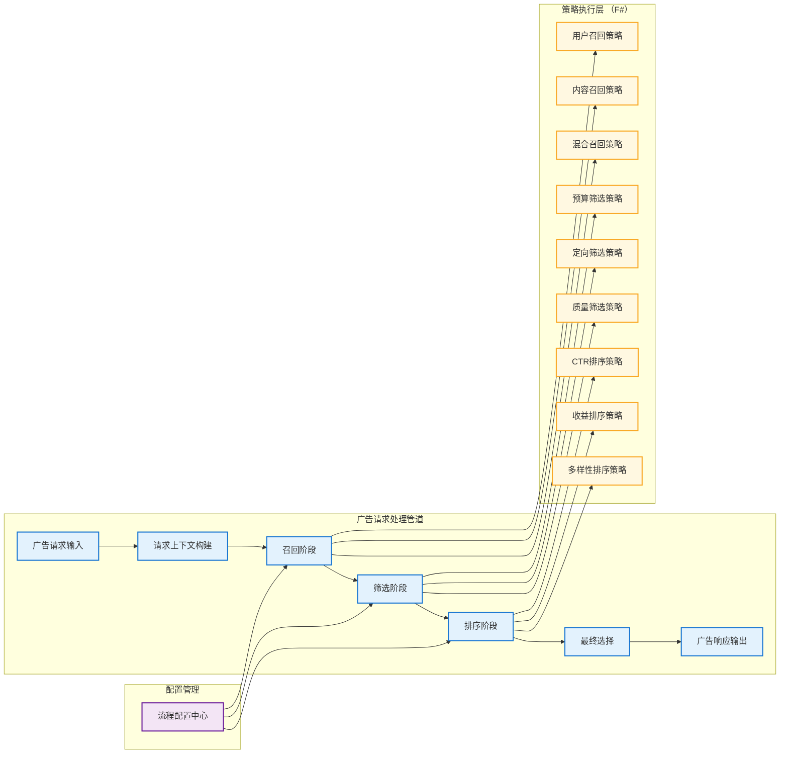

# 系统整体技术架构设计

## 架构概述

Lorn.ADSP是一个企业级互联网广告投放平台，采用微服务分层架构设计，基于.NET 9技术栈构建。系统严格遵循IAB行业标准，支持OpenRTB实时竞价协议和VAST/VMAP视频广告标准，具备高并发、低延迟、高可用的技术特性。

## 技术架构原则

### 设计原则
- **高性能设计**：广告请求响应时间 < 50ms，支持10万+QPS
- **高可用架构**：系统可用性 ≥ 99.9%，支持故障自动恢复
- **弹性扩展**：支持水平扩展，按需弹性伸缩
- **标准合规**：严格遵循IAB OpenRTB、VAST、VMAP等行业标准
- **安全可靠**：多层安全防护，完善的反作弊机制
- **数据驱动**：全链路数据追踪，支持实时决策优化
- **多云支持**：支持阿里云、Azure、AWS等多种云平台部署
- **数据库无关**：通过抽象层实现数据库厂商解耦
- **流程可配置**：广告投放引擎支持动态流程配置和策略扩展
- **多端统一**：客户端SDK支持多平台统一开发和部署

### 架构约束
- 单一职责：每个微服务专注单一业务领域
- 服务自治：服务间通过标准API通信，避免直接数据库访问
- 数据一致性：采用最终一致性，关键业务保证强一致性
- 无状态设计：应用层无状态，状态存储在缓存和数据库中
- 云平台解耦：基础设施抽象化，支持多云部署切换
- 数据访问抽象：仓储模式+适配器模式实现数据库无关性
- 策略可插拔：基于管道模式实现广告投放策略的动态配置
- 客户端统一：通过跨平台框架实现多端代码复用

## 技术架构图

```mermaid
graph TB
    subgraph "客户端层 （Client Layer）"
        subgraph "原生应用客户端"
            MAUI[.NET MAUI SDK<br/>iOS/Android/Windows]
        end
        
        subgraph "小程序/轻应用客户端"
            WECHAT[微信小程序<br/>TypeScript SDK]
            ALIPAY[支付宝小程序<br/>TypeScript SDK]
            QUICKAPP[快应用<br/>TypeScript SDK]
        end
    end

    subgraph "接入层 （Gateway Layer）"
        LB[负载均衡器<br/>Nginx/HAProxy]
        AG[API网关<br/>ASP.NET Core Gateway]
        CDN[CDN<br/>广告素材分发]
    end

    subgraph "应用层 （Application Layer）"
        subgraph "广告投放微服务"
            ADS[广告投放引擎<br/>.NET 9 Web API + 管道模式]
            subgraph "策略引擎 （F# 实现）"
                RECALL[召回策略<br/>F# 并行处理]
                FILTER[筛选策略<br/>F# 并行处理]
                RANKING[排序策略<br/>F# 并行处理]
            end
            BID[竞价服务<br/>OpenRTB实现]
            TARGET[定向服务<br/>用户画像匹配]
        end
        
        subgraph "业务管理微服务"
            ADM[广告主管理<br/>ASP.NET Core MVC]
            CAM[广告内容管理<br/>.NET 9 Web API]
            MED[媒体管理<br/>ASP.NET Core MVC]
        end
        
        subgraph "数据分析微服务"
            RPT[报表服务<br/>.NET 9 Web API]
            BI[商业智能<br/>数据分析引擎]
            ML[机器学习<br/>算法服务]
        end
    end

    subgraph "服务治理层 （Service Governance）"
        REG[服务注册中心<br/>Consul]
        CONF[配置中心<br/>Consul KV]
        DISC[服务发现<br/>Consul DNS]
        PIPELINE[流程配置中心<br/>动态策略配置]
    end

    subgraph "数据访问抽象层 （Data Access Abstraction）"
        REPO[仓储抽象接口<br/>Repository Pattern]
        UOW[工作单元抽象<br/>Unit of Work Pattern]
        ADAPTER[数据库适配器<br/>Provider Pattern]
    end

    subgraph "多云基础设施层 （Multi-Cloud Infrastructure）"
        subgraph "阿里云 （Alibaba Cloud）"
            ALI_RDS[RDS<br/>MySQL/PostgreSQL]
            ALI_REDIS[Redis集群]
            ALI_KAFKA[消息队列]
            ALI_OSS[对象存储]
        end
        
        subgraph "Azure云 （Microsoft Azure）"
            AZ_SQL[Azure SQL Database]
            AZ_REDIS[Azure Cache for Redis]
            AZ_SB[Service Bus]
            AZ_BLOB[Blob Storage]
        end
        
        subgraph "AWS云 （Amazon Web Services）"
            AWS_RDS[RDS<br/>SQL Server/MySQL]
            AWS_REDIS[ElastiCache]
            AWS_SQS[SQS/SNS]
            AWS_S3[S3 Storage]
        end
    end

    subgraph "监控运维层 （Monitoring Layer）"
        PROM[Prometheus<br/>指标收集]
        GRAF[Grafana<br/>监控面板]
        ELK[ELK Stack<br/>日志分析]
        ALERT[AlertManager<br/>告警系统]
    end

    subgraph "第三方集成 (External Integration)"
        DSP[第三方DSP<br/>需求方平台]
        SSP[第三方SSP<br/>供应方平台]
        ADX[第三方ADX<br/>广告交易平台]
        DMP[第三方DMP<br/>数据管理平台]
    end

    %% 客户端到服务端
    MAUI --> AG
    WECHAT --> AG
    ALIPAY --> AG
    QUICKAPP --> AG
    
    %% 请求流转
    LB --> AG
    AG --> ADS
    AG --> ADM
    AG --> CAM
    
    %% 广告引擎内部流程
    ADS --> RECALL
    ADS --> FILTER
    ADS --> RANKING
    ADS --> PIPELINE
    
    %% 服务间通信
    ADS --> BID
    ADS --> TARGET
    BID --> DSP
    
    %% 数据访问抽象
    ADS --> REPO
    ADM --> REPO
    CAM --> REPO
    REPO --> UOW
    UOW --> ADAPTER
    
    %% 多云数据存储
    ADAPTER --> ALI_RDS
    ADAPTER --> AZ_SQL
    ADAPTER --> AWS_RDS
    
    %% 缓存访问
    ADS --> ALI_REDIS
    ADS --> AZ_REDIS
    ADS --> AWS_REDIS
    
    %% 服务治理
    ADS --> REG
    BID --> REG
    TARGET --> REG
    
    %% 消息传递
    ADS --> ALI_KAFKA
    BID --> AZ_SB
    TARGET --> AWS_SQS
    
    %% 监控
    ADS --> PROM
    BID --> PROM
    TARGET --> PROM
    
    %% 样式
    classDef client fill:#e1f5fe,stroke:#0277bd,stroke-width:2px
    classDef gateway fill:#e3f2fd,stroke:#1976d2,stroke-width:2px
    classDef service fill:#f3e5f5,stroke:#6a1b9a,stroke-width:2px
    classDef strategy fill:#fff8e1,stroke:#f9a825,stroke-width:2px
    classDef data fill:#fff3e0,stroke:#f57c00,stroke-width:2px
    classDef cloud fill:#f1f8e9,stroke:#689f38,stroke-width:2px
    classDef monitor fill:#e8f5e8,stroke:#2e7d32,stroke-width:2px
    classDef external fill:#ffebee,stroke:#c62828,stroke-width:2px
    
    class MAUI,WECHAT,ALIPAY,QUICKAPP client
    class LB,AG,CDN gateway
    class ADS,BID,TARGET,ADM,CAM,MED,RPT,BI,ML service
    class RECALL,FILTER,RANKING strategy
    class REPO,UOW,ADAPTER,PIPELINE data
    class ALI_RDS,ALI_REDIS,ALI_KAFKA,ALI_OSS,AZ_SQL,AZ_REDIS,AZ_SB,AZ_BLOB,AWS_RDS,AWS_REDIS,AWS_SQS,AWS_S3 cloud
    class PROM,GRAF,ELK,ALERT monitor
    class DSP,SSP,ADX,DMP external
```



## Visual Studio解决方案架构

### 解决方案结构设计

```
Lorn.ADSP.sln
│
├── 01.Presentation                          # 表示层
│   ├── Lorn.ADSP.Web.Api                   # Web API项目
│   │   ├── Controllers/                    # API控制器
│   │   ├── Models/                         # 数据模型
│   │   └── ...
│   ├── Lorn.ADSP.Web.Admin                 # 管理后台 (ASP.NET Core MVC)
│   │   ├── Controllers/                    # 后台控制器
│   │   ├── Views/                          # 管理后台视图
│   │   └── ...
│   ├── Lorn.ADSP.Web.Advertiser            # 广告主门户 (ASP.NET Core MVC)
│   │   ├── Controllers/                    # 广告主控制器
│   │   ├── Views/                          # 广告主门户视图
│   │   └── ...
│   └── Lorn.ADSP.Desktop.Monitor           # 桌面监控工具 (WPF)
│       ├── ViewModels/                     # 视图模型
│       ├── Views/                          # WPF界面
│       └── ...
│
├── 02.Services                              # 微服务层
│   ├── Lorn.ADSP.AdEngine                  # 广告投放引擎服务
│   │   ├── Controllers/                    # API控制器
│   │   ├── Pipeline/                       # 广告管道处理
│   │   ├── Configuration/                  # 流程配置
│   │   └── Orchestrator/                   # 策略编排
│   ├── Lorn.ADSP.Bidding                   # 竞价服务
│   │   ├── Recall/                         # 竞价召回
│   │   ├── Filter/                         # 竞价过滤
│   │   └── Ranking/                        # 竞价排序
│   ├── Lorn.ADSP.Targeting                 # 定向服务
│   │   ├── Recall/                         # 定向召回
│   │   ├── Filter/                         # 定向过滤
│   │   └── Ranking/                        # 定向排序
│   ├── Lorn.ADSP.Creative                  # 广告创意服务
│   │   ├── Controllers/                    # 创意API
│   │   └── ...
│   ├── Lorn.ADSP.Campaign                  # 广告活动服务
│   │   ├── Controllers/                    # 活动API
│   │   └── ...
│   ├── Lorn.ADSP.Analytics                 # 数据分析服务
│   │   ├── Controllers/                    # 分析API
│   │   └── ...
│   ├── Lorn.ADSP.Reporting                 # 报表服务
│   │   ├── Controllers/                    # 报表API
│   │   └── ...
│   └── Lorn.ADSP.Gateway                   # API网关服务
│       ├── Controllers/                    # 网关API
│       └── ...
│
├── 03.Strategies                            # 策略引擎层 (F# 实现)
│   ├── Lorn.ADSP.Strategies.Recall         # 召回策略
│   │   └── ...                             # 召回策略相关目录
│   ├── Lorn.ADSP.Strategies.Filter         # 筛选策略
│   │   └── ...                             # 筛选策略相关目录
│   ├── Lorn.ADSP.Strategies.Ranking        # 排序策略
│   │   └── ...                             # 排序策略相关目录
│   └── Lorn.ADSP.Strategies.Common         # 策略公共组件
│       └── ...                             # 公共类型/工具
│
├── 04.Core                                  # 关键核心层
│   ├── Lorn.ADSP.Core.Domain               # 领域模型
│   │   ├── Aggregates/                     # 聚合根
│   │   ├── Entities/                       # 实体
│   │   ├── ValueObjects/                   # 值对象
│   │   ├── Events/                         # 领域事件
│   │   ├── Repositories/                   # 仓储接口
│   │   └── Specifications/                 # 规格模式
│   ├── Lorn.ADSP.Core.Application          # 应用服务
│   │   ├── Services/                       # 应用服务
│   │   ├── Commands/                       # 命令处理
│   │   ├── Queries/                        # 查询处理
│   │   └── DTOs/                           # 数据传输对象
│   ├── Lorn.ADSP.Core.Shared               # 共享组件
│   │   ├── Constants/                      # 常量定义
│   │   ├── Enums/                          # 枚举定义
│   │   ├── Extensions/                     # 扩展方法
│   │   └── Helpers/                        # 辅助类
│   └── Lorn.ADSP.Core.AdEngine.Abstractions # 广告引擎抽象接口层
│       ├── Targeting/                      # 定向抽象接口
│       ├── Bidding/                        # 竞价抽象接口
│       ├── Delivery/                       # 投放抽象接口
│       ├── Pipeline/                       # 管道抽象接口
│       └── Strategy/                       # 策略抽象接口
│
├── 05.Infrastructure                       # 基础设施层
│   ├── Lorn.ADSP.Infrastructure.Data.Abstractions      # 数据访问抽象层
│   │   ├── Interfaces/                     # 数据访问接口
│   │   ├── Models/                         # 数据模型
│   │   └── ...
│   ├── Lorn.ADSP.Infrastructure.Data.SqlServer         # SQL Server实现
│   │   ├── Repositories/                   # SQL Server仓储
│   │   ├── UnitOfWork/                     # SQL Server工作单元
│   │   ├── DbContext/                      # SQL Server上下文
│   │   └── ...
│   ├── Lorn.ADSP.Infrastructure.Data.MySQL             # MySQL实现
│   │   ├── Repositories/                   # MySQL仓储
│   │   ├── UnitOfWork/                     # MySQL工作单元
│   │   ├── DbContext/                      # MySQL上下文
│   │   └── ...
│   ├── Lorn.ADSP.Infrastructure.Data.PostgreSQL        # PostgreSQL实现
│   │   ├── Repositories/                   # PostgreSQL仓储
│   │   ├── UnitOfWork/                     # PostgreSQL工作单元
│   │   ├── DbContext/                      # PostgreSQL上下文
│   │   └── ...
│   ├── Lorn.ADSP.Infrastructure.Data.PolarDB           # PolarDB实现
│   │   ├── Repositories/                   # PolarDB仓储
│   │   ├── UnitOfWork/                     # PolarDB工作单元
│   │   ├── DbContext/                      # PolarDB上下文
│   │   └── ...
│   ├── Lorn.ADSP.Infrastructure.Caching.Abstractions   # 缓存抽象层
│   │   ├── Interfaces/                     # 缓存接口
│   │   └── ...
│   ├── Lorn.ADSP.Infrastructure.Caching.Redis          # Redis缓存实现
│   │   └── ...
│   ├── Lorn.ADSP.Infrastructure.Caching.Memory         # 内存缓存实现
│   │   └── ...
│   ├── Lorn.ADSP.Infrastructure.Search.Abstractions    # 搜索引擎抽象层
│   │   ├── Interfaces/                     # 搜索接口
│   │   └── ...
│   ├── Lorn.ADSP.Infrastructure.Search.Elasticsearch   # ES搜索引擎实现
│   │   └── ...
│   ├── Lorn.ADSP.Infrastructure.Messaging.Abstractions # 消息队列抽象层
│   │   ├── Interfaces/                     # 消息接口
│   │   └── ...
│   ├── Lorn.ADSP.Infrastructure.Messaging.RabbitMQ     # RabbitMQ实现
│   │   └── ...
│   ├── Lorn.ADSP.Infrastructure.Messaging.Kafka        # Kafka实现
│   │   └── ...
│   ├── Lorn.ADSP.Infrastructure.Logging                # 日志组件
│   │   └── ...
│   ├── Lorn.ADSP.Infrastructure.Security               # 安全组件
│   │   └── ...
│   ├── Lorn.ADSP.Infrastructure.Monitoring             # 监控组件
│   │   └── ...
│   ├── Lorn.ADSP.Infrastructure.Config                 # 配置管理
│   │   └── ...
│   └── Lorn.ADSP.Infrastructure.Cloud                  # 多云支持组件
│       ├── Abstractions/                              # 云服务抽象接口
│       ├── AlibabaCloud/                              # 阿里云实现
│       ├── Azure/                                     # Azure云实现
│       └── AWS/                                       # AWS云实现
│
├── 06.External                             # 外部集成层
│   ├── Lorn.ADSP.External.OpenRTB          # OpenRTB协议实现
│   ├── Lorn.ADSP.External.VAST             # VAST视频广告标准
│   ├── Lorn.ADSP.External.DSP              # DSP平台集成
│   └── Lorn.ADSP.External.SSP              # SSP平台集成
│
├── 07.ClientSDK                            # 客户端SDK层
│   ├── Lorn.ADSP.SDK.Shared                # 共享SDK核心组件
│   │   ├── Models/                         # 共享数据模型
│   │   ├── Interfaces/                     # 共享接口定义
│   │   ├── Constants/                      # 共享常量定义
│   │   ├── Services/                       # 共享业务逻辑
│   │   └── Extensions/                     # 扩展方法
│   ├── Lorn.ADSP.SDK.UI.Shared             # 共享UI表现模型/协议
│   │   ├── ViewModels/                     # 广告视图模型
│   │   ├── Events/                         # UI事件协议
│   │   └── DTOs/                           # 数据传输对象
│   ├── Lorn.ADSP.SDK.MAUI                  # .NET MAUI SDK
│   │   ├── Platforms/                      # 平台特定实现
│   │   ├── Views/                          # MAUI视图控件
│   │   ├── Handlers/                       # 平台处理器
│   │   ├── Services/                       # MAUI服务
│   │   └── Extensions/                     # MAUI扩展
│   ├── Lorn.ADSP.SDK.Blazor                # Blazor SDK
│   │   ├── Components/                     # Razor组件
│   │   ├── Services/                       # Blazor服务
│   │   ├── Interop/                        # JS互操作
│   │   ├── Extensions/                     # Blazor扩展
│   │   └── Configuration/                  # 配置
│   └── Lorn.ADSP.SDK.TypeScript            # TypeScript小程序SDK
│       ├── src/
│       │   ├── core/                       # 核心功能
│       │   ├── models/                     # 数据模型
│       │   ├── interfaces/                 # 接口定义
│       │   ├── constants/                  # 常量定义
│       │   ├── platforms/                  # 平台适配
│       │   └── utils/                      # 工具函数
│       ├── dist/                           # 编译输出
│       └── ...
│
├── 08.Tests                                # 测试项目
│   ├── Lorn.ADSP.Tests.Unit                # 单元测试
│   ├── Lorn.ADSP.Tests.Integration         # 集成测试
│   ├── Lorn.ADSP.Tests.Performance         # 性能测试
│   ├── Lorn.ADSP.Tests.E2E                 # 端到端测试
│   └── Lorn.ADSP.Tests.Strategy            # F#策略测试
│
└── 09.Tools                                # 工具项目
    ├── Lorn.ADSP.Tools.DataMigration       # 数据迁移工具
    ├── Lorn.ADSP.Tools.LoadTesting         # 负载测试工具
    ├── Lorn.ADSP.Tools.Deployment          # 部署工具
    └── Lorn.ADSP.Tools.CodeGeneration      # 代码生成工具
```

### 项目依赖关系

#### 核心依赖层次

- **表示层** → 应用服务层 → 领域层
- **微服务层** → 核心层 → 基础设施层（数据访问）
- **策略引擎层（F#）** → 核心抽象层 → 共享组件层
#### 客户端SDK层依赖关系

- **SDK共享组件层（SDK.Shared）** → 共享组件层 → 外部集成层
- **.NET MAUI SDK** → SDK共享组件层 → 平台特定API
- **Blazor SDK** → SDK共享组件层 → Web API/JavaScript互操作
- **TypeScript SDK** → 独立实现 → 小程序平台API
- **基础设施层（横切关注点）** ← 所有层级

#### 数据访问层依赖关系

- **领域层（Core.Domain）** → 定义仓储接口和规格模式接口
- **数据访问抽象层（Infrastructure.Data.Abstractions）** → 定义数据访问统一接口
- **数据访问实现层（Infrastructure.Data）** → 实现仓储和工作单元，依赖抽象层
- **数据库提供程序层（Infrastructure.Data.Providers）** → 实现特定数据库支持，依赖抽象层
- **应用服务层** → 通过依赖注入使用仓储接口，不直接依赖具体实现
- **多云支持层（Infrastructure.Cloud）** → 提供云平台特定的数据库连接和配置

#### 广告引擎与策略层依赖关系

- **广告引擎主干（C#）** → 定义管道接口和策略编排逻辑
- **策略抽象层（Core.AdEngine.Abstractions）** → 定义策略接口规范
- **策略实现层（F#）** → 实现具体策略算法，依赖抽象接口
- **策略公共组件（Strategies.Common）** → 提供F#策略间共享的类型和工具
- **流程配置层** → 管理策略组合和执行顺序的动态配置

#### 客户端SDK依赖关系

- **.NET MAUI SDK** → 依赖.NET生态和Core.Shared组件，实现跨平台原生应用支持
- **TypeScript SDK** → 独立的TypeScript技术栈，通过API规范与服务端通信
- **接口规范统一** → 两个SDK遵循相同的API接口规范和数据模型定义（但实现技术栈不同）
- **平台适配层** → 各自处理不同平台的API差异和特性
- **协议一致性** → 通过OpenAPI规范确保客户端与服务端通信协议的一致性

#### 关键依赖规则

1. **向内依赖**：外层依赖内层，内层不依赖外层
2. **接口隔离**：通过接口定义依赖关系，避免具体实现依赖
3. **数据库抽象**：业务逻辑层只依赖仓储接口，不依赖具体数据库实现
4. **运行时选择**：通过依赖注入容器在运行时选择具体的数据库提供程序
5. **策略可插拔**：F#策略模块通过接口与C#主干解耦，支持动态加载
6. **云平台解耦**：通过抽象接口支持多云部署，运行时配置具体云服务
7. **客户端统一**：通过共享组件和接口规范实现多端代码复用
8. **循环依赖检查**：使用NDepend等工具检测和避免循环依赖
9. **共享组件**：公共组件通过NuGet包管理，避免项目引用耦合

## 技术栈选型

### 开发框架

- **.NET 9**: 主要开发框架，提供高性能和现代化的开发体验
- **ASP.NET Core 9.0**: Web API和MVC框架，支持高并发和跨平台部署
- **Entity Framework Core 9.0**: ORM框架，支持Code First和Database First开发模式
- **WPF (.NET 9)**: 桌面应用开发框架，用于监控和管理工具
- **F# 9.0**: 函数式编程语言，用于实现广告投放策略算法，提供强类型和并发优势
- **.NET MAUI**: 跨平台客户端开发框架，支持iOS、Android、Windows原生应用
- **TypeScript**: 强类型JavaScript超集，用于小程序和轻应用SDK开发

### 数据存储

- **多数据库支持**: 通过Provider模式支持多种数据库
  - **SQL Server 2022**: 微软主推数据库，支持高可用、分区表、读写分离
  - **MySQL 8.0**: 开源关系型数据库，阿里云RDS和AWS RDS支持
  - **PostgreSQL 16**: 高性能开源数据库，支持复杂查询和扩展
  - **PolarDB**: 阿里云云原生数据库，兼容MySQL和PostgreSQL
  - **Azure SQL Database**: Azure云托管SQL数据库服务
- **分布式缓存**: 
  - **Redis 7.0**: 分布式缓存和会话存储，支持集群模式
  - **Azure Cache for Redis**: Azure托管Redis服务
  - **阿里云Redis**: 阿里云托管Redis服务
- **搜索引擎**: 
  - **Elasticsearch 8.0**: 搜索引擎和日志分析，支持全文搜索和数据分析
  - **阿里云Elasticsearch**: 阿里云托管ES服务
- **消息队列**: 
  - **Apache Kafka**: 高吞吐量消息队列，用于大数据流处理
  - **RabbitMQ**: 可靠消息队列，用于业务事件和任务调度
  - **Azure Service Bus**: Azure云消息服务
  - **阿里云消息队列**: 阿里云托管消息服务

### 云平台支持

- **阿里云 (Alibaba Cloud)**:
  - RDS (MySQL/PostgreSQL/PolarDB)
  - Redis 企业版
  - 消息队列 (MQ/Kafka)
  - 对象存储 OSS
  - 负载均衡 SLB
- **Microsoft Azure**:
  - Azure SQL Database
  - Azure Cache for Redis  
  - Azure Service Bus
  - Azure Blob Storage
  - Azure Load Balancer
- **Amazon Web Services (AWS)**:
  - RDS (SQL Server/MySQL/PostgreSQL)
  - ElastiCache (Redis)
  - SQS/SNS
  - S3 Storage
  - Elastic Load Balancer

### 网关和代理

- **Ocelot**: .NET生态的API网关，支持路由、限流、熔断
- **Nginx**: 负载均衡和反向代理，支持高并发和SSL终结
- **Consul**: 服务发现和配置中心，支持健康检查和KV存储

### 监控和运维

- **Prometheus**: 指标收集和监控，支持多维度数据模型
- **Grafana**: 监控仪表板和可视化，支持多数据源
- **Jaeger**: 分布式追踪系统，支持全链路性能分析
- **ELK Stack**: 日志收集、存储和分析解决方案
- **Docker**: 容器化部署，支持镜像管理和编排
- **Kubernetes**: 容器编排平台，支持自动扩缩容和服务治理

### 测试框架

- **xUnit**: 单元测试框架
- **Moq**: Mock框架，用于单元测试
- **TestContainers**: 集成测试，支持数据库和中间件容器
- **NBomber**: 性能测试框架，支持负载测试和压力测试
- **FsCheck**: F#属性测试框架，用于策略算法测试

## 微服务架构设计

### 服务拆分原则

#### 业务边界划分
- **广告投放域**: 广告引擎、竞价服务、定向服务
- **内容管理域**: 广告创意、活动管理、素材管理
- **用户管理域**: 广告主管理、权限管理、账户服务
- **数据分析域**: 报表服务、商业智能、机器学习
- **平台集成域**: OpenRTB、VAST、第三方平台对接

#### 服务规模控制
- **团队规模**: 每个微服务团队2-8人（两个披萨原则）
- **代码规模**: 单个服务代码量控制在50k行以内
- **数据库**: 每个服务拥有独立的数据库实例
- **部署单元**: 每个服务独立部署和扩展

### 服务间通信

#### 同步通信
- **HTTP/REST**: 服务间API调用，适用于实时查询
- **gRPC**: 高性能RPC调用，适用于内部服务通信
- **GraphQL**: 前端数据聚合，减少API调用次数

#### 异步通信
- **事件驱动**: 基于领域事件的异步处理
- **消息队列**: RabbitMQ处理业务事件
- **流处理**: Kafka处理大数据流和日志

#### 通信模式
- **请求-响应**: 同步获取数据
- **发布-订阅**: 事件通知和状态同步
- **请求-异步响应**: 长时间处理任务

## 数据架构设计

### 数据分层策略

#### 操作数据层(ODS)
- **实时数据**: 广告请求、点击、展示等实时事件
- **业务数据**: 广告主、活动、创意等业务实体
- **配置数据**: 系统配置、定向规则、竞价策略

#### 数据仓库层(DW)
- **明细数据**: 按天分区的历史明细数据
- **汇总数据**: 按小时、天、月汇总的统计数据
- **维度数据**: 广告主、媒体、地域等维度表

#### 数据服务层(DM)
- **报表数据**: 预计算的报表和仪表板数据
- **分析数据**: 用户画像、效果分析等分析结果
- **机器学习**: 模型训练数据和预测结果

### 数据存储选型

#### 关系型数据库（多云支持）

- **主数据存储**: 根据云平台选择对应的关系型数据库
  - **阿里云**: RDS MySQL/PostgreSQL, PolarDB (云原生数据库)
  - **Azure**: Azure SQL Database, Azure Database for MySQL/PostgreSQL
  - **AWS**: RDS SQL Server/MySQL/PostgreSQL, Aurora
  - **私有云/混合云**: SQL Server, MySQL, PostgreSQL
- **读写分离**: 1主2从配置，读写比例约1:3，支持跨可用区部署
- **分库分表**: 按业务域和数据量进行水平拆分，使用中间件实现路由
- **备份策略**: 全量+增量备份，RTO<1小时，RPO<5分钟
- **数据库连接抽象**: 通过Provider模式实现数据库厂商解耦

#### NoSQL数据库（云平台适配）

- **缓存数据**: 
  - **阿里云**: Redis企业版, Tair
  - **Azure**: Azure Cache for Redis
  - **AWS**: ElastiCache (Redis)
  - **自建**: Redis Cluster
- **搜索数据**: 
  - **阿里云**: Elasticsearch Service
  - **Azure**: Azure Cognitive Search
  - **AWS**: Amazon OpenSearch Service
  - **自建**: Elasticsearch集群
- **时序数据**: 
  - **阿里云**: InfluxDB Service
  - **Azure**: Azure Time Series Insights
  - **AWS**: Amazon Timestream
  - **自建**: InfluxDB集群

#### 文件存储（对象存储）

- **静态资源**: 
  - **阿里云**: OSS (对象存储服务)
  - **Azure**: Azure Blob Storage
  - **AWS**: Amazon S3
  - **私有云**: MinIO
- **CDN加速**: 
  - **阿里云**: CDN
  - **Azure**: Azure CDN
  - **AWS**: CloudFront
- **数据备份**: 跨云同步备份，保证数据安全性和可恢复性

## 安全架构设计

### 认证和授权

#### 身份认证
- **JWT Token**: 无状态令牌，支持分布式验证
- **OAuth 2.0**: 第三方登录和授权
- **多因素认证**: 短信、邮箱、TOTP等多种验证方式
- **单点登录**: 统一身份认证和授权中心

#### 权限控制
- **RBAC模型**: 基于角色的访问控制
- **ABAC模型**: 基于属性的访问控制
- **API权限**: 接口级别的细粒度权限控制
- **数据权限**: 行级和列级的数据访问控制

### 数据安全

#### 数据加密
- **传输加密**: HTTPS/TLS保护数据传输
- **存储加密**: 数据库透明数据加密(TDE)
- **字段加密**: 敏感字段应用层加密
- **密钥管理**: 统一密钥管理服务

#### 隐私保护
- **数据脱敏**: 敏感数据展示脱敏
- **访问日志**: 完整的数据访问审计
- **数据分级**: 按敏感度分级管理
- **合规检查**: GDPR、CCPA等法规合规

### 网络安全

#### 网络隔离
- **DMZ区域**: 公网访问的前端服务
- **内网区域**: 核心业务服务
- **数据库区域**: 数据存储服务
- **管理网络**: 运维管理专用网络

#### 安全防护
- **WAF防护**: Web应用防火墙
- **DDoS防护**: 分布式拒绝服务攻击防护
- **入侵检测**: 实时入侵检测和响应
- **安全扫描**: 定期安全漏洞扫描

## 性能架构设计

### 性能目标

#### 响应时间要求
- **广告请求**: 平均响应时间 < 50ms，99%分位 < 100ms
- **管理界面**: 页面加载时间 < 2s，操作响应 < 500ms
- **报表查询**: 简单查询 < 3s，复杂查询 < 10s
- **批处理**: 日批处理 < 6小时，实时处理延迟 < 1s

#### 吞吐量要求
- **广告请求**: 支持10万QPS峰值处理
- **数据写入**: 支持1万TPS数据写入
- **并发用户**: 支持1万并发用户访问
- **数据查询**: 支持1千QPS复杂查询

### 性能优化策略

#### 缓存策略
- **多级缓存**: L1本地缓存 + L2分布式缓存
- **缓存模式**: Cache-Aside、Write-Through、Write-Behind
- **缓存失效**: TTL过期 + 主动失效
- **缓存预热**: 系统启动时预加载热点数据

#### 数据库优化
- **索引优化**: 覆盖索引、组合索引、分区索引
- **查询优化**: SQL优化、执行计划分析
- **连接池**: 数据库连接池优化
- **读写分离**: 读库扩展和负载均衡

#### 应用优化
- **异步处理**: 非阻塞I/O和异步编程
- **批量处理**: 减少网络调用次数
- **资源池化**: 连接池、线程池、对象池
- **CDN加速**: 静态资源全球分发

## 可用性架构设计

### 高可用目标
- **系统可用性**: 99.9%（年停机时间 < 8.76小时）
- **数据可用性**: 99.99%（年数据丢失时间 < 52.56分钟）
- **故障恢复**: RTO < 1小时，RPO < 5分钟
- **容灾能力**: 支持同城双活和异地灾备

### 容错设计

#### 服务容错
- **熔断器**: 防止故障扩散和雪崩
- **限流器**: 保护系统不被过载
- **重试机制**: 指数退避的智能重试
- **降级策略**: 关键功能的优雅降级

#### 数据容错
- **数据备份**: 多副本数据存储
- **故障转移**: 自动主从切换
- **数据修复**: 数据一致性检查和修复
- **备份验证**: 定期备份数据验证

#### 基础设施容错
- **多可用区**: 跨可用区部署
- **负载均衡**: 多实例负载分担
- **健康检查**: 实例健康状态监控
- **自动扩缩容**: 基于负载的自动伸缩

## 可扩展性架构设计

### 水平扩展

#### 应用层扩展
- **无状态设计**: 应用实例间无依赖
- **负载均衡**: 多种负载均衡算法
- **服务注册**: 动态服务发现和注册
- **自动扩容**: 基于CPU、内存、QPS的自动扩容

#### 数据层扩展
- **分库分表**: 水平拆分数据存储
- **读写分离**: 读库水平扩展
- **缓存集群**: Redis集群模式
- **消息队列**: 分区和集群部署

### 垂直扩展

#### 资源升级
- **CPU升级**: 更高性能的处理器
- **内存升级**: 更大容量的内存
- **存储升级**: 更快速度的SSD
- **网络升级**: 更高带宽的网络

#### 架构优化
- **算法优化**: 更高效的算法实现
- **数据结构**: 更适合的数据结构
- **并发模型**: 更高效的并发处理
- **I/O模型**: 更优化的I/O处理

## 广告引擎可扩展架构设计

### 管道式处理架构

广告投放引擎采用管道模式（Pipeline Pattern）实现可扩展的广告处理流程，支持动态配置处理步骤和策略组合。

#### 核心处理流程



#### 管道接口设计

**核心抽象接口层次结构**

- `IAdPipelineStep<TContext, TCandidate>`: 管道步骤基础接口，定义Execute方法签名
- `IRecallStrategy<TContext, TCandidate>`: 召回策略接口，继承管道步骤接口
- `IFilterStrategy<TContext, TCandidate>`: 筛选策略接口，继承管道步骤接口  
- `IRankingStrategy<TContext, TCandidate>`: 排序策略接口，继承管道步骤接口
- `IPipelineOrchestrator`: 管道编排器接口，负责策略组合和执行流程控制
- `IStrategyConfiguration`: 策略配置接口，管理策略参数和运行时元数据

**数据流模型约定**

- **输入约定**: AdRequestContext（请求上下文）+ List<AdCandidate>（候选广告集合）
- **输出约定**: AdRequestContext（更新后上下文）+ List<AdCandidate>（处理后候选集合）
- **上下文内容**: 用户信息、设备信息、环境信息、会话状态等
- **候选广告结构**: 广告内容、出价信息、定向规则、质量评分等
- **候选广告**: 包含广告内容、出价、定向信息等

### F#策略实现架构

#### 策略模块组织设计

**召回策略模块架构 (Lorn.ADSP.Strategies.Recall)**

- **用户行为召回策略**: 基于用户兴趣图谱和行为序列的召回算法
  - 输入: 用户画像数据、历史行为数据、实时上下文信息
  - 处理: 兴趣匹配算法、协同过滤算法、序列模式挖掘
  - 输出: 候选广告集合及其相关性评分

- **内容相关召回策略**: 基于内容特征和语义匹配的召回算法
  - 输入: 广告内容特征、用户内容偏好、上下文语义信息
  - 处理: 向量相似度计算、主题模型匹配、语义理解算法
  - 输出: 内容相关的候选广告集合

- **混合召回策略**: 多种召回策略的融合算法
  - 输入: 多个单一策略的召回结果
  - 处理: 结果融合算法、权重动态调整、冲突消解机制
  - 输出: 综合优化的候选广告集合

**筛选策略模块架构 (Lorn.ADSP.Strategies.Filter)**

- **预算筛选策略**: 基于预算约束的过滤算法
  - 预算上限检查、消耗速率控制、时间分段管理
  - 支持日预算、总预算、实时预算等多种约束模式

- **定向筛选策略**: 基于定向条件的精确匹配算法
  - 地理位置定向、用户属性定向、设备类型定向
  - 支持包含定向、排除定向、复合定向条件

- **质量筛选策略**: 基于广告质量评估的过滤算法
  - 创意质量评估、落地页质量检测、用户体验评分
  - 支持质量阈值动态调整和质量评估模型更新

**排序策略模块架构 (Lorn.ADSP.Strategies.Ranking)**

- **CTR预测排序策略**: 基于点击率预测的排序算法
  - 特征工程、模型预测、排序优化
  - 支持在线学习和模型实时更新

- **收益优化排序策略**: 基于收益最大化的排序算法
  - eCPM计算、ROI优化、收益预估
  - 支持多目标优化和收益平衡策略

- **多样性排序策略**: 基于内容多样性的排序算法
  - 去重算法、多样性评估、平衡策略
  - 支持用户体验优化和内容分布均衡

#### C#与F#互操作设计

**策略包装器架构**

- **包装器设计模式**: 为每个F#策略模块创建对应的C#包装器类
  - 实现统一的策略接口（IRecallStrategy、IFilterStrategy、IRankingStrategy）
  - 负责C#与F#之间的类型转换和数据映射
  - 处理异常转换和错误传播机制
  - 提供异步包装和性能监控功能

- **动态加载机制**: 支持F#策略程序集的动态加载和调用
  - 程序集热加载和卸载机制
  - 反射调用F#函数的封装
  - 类型安全的参数传递和结果返回
  - 版本兼容性检查和错误恢复

- **策略工厂模式**: 基于配置创建策略实例的工厂类
  - 根据策略类型和配置参数创建包装器实例
  - 策略实例池化和生命周期管理
  - 依赖注入容器集成
  - 策略性能监控和度量收集

### 动态配置管理

#### 流程配置模型

**管道配置定义**

```json
{
  "pipelineId": "default-ad-pipeline",
  "version": "1.0.0",
  "steps": [
    {
      "stepType": "Recall",
      "stepName": "user-content-hybrid-recall",
      "strategies": [
        {
          "strategyType": "UserBasedRecall",
          "assemblyPath": "Lorn.ADSP.Strategies.Recall.dll",
          "functionName": "UserBasedRecall.recallByUserInterests",
          "weight": 0.6,
          "timeout": 50,
          "isParallel": true
        },
        {
          "strategyType": "ContentBasedRecall", 
          "assemblyPath": "Lorn.ADSP.Strategies.Recall.dll",
          "functionName": "ContentBasedRecall.recallByContent",
          "weight": 0.4,
          "timeout": 50,
          "isParallel": true
        }
      ]
    },
    {
      "stepType": "Filter",
      "stepName": "comprehensive-filter",
      "strategies": [
        {
          "strategyType": "BudgetFilter",
          "assemblyPath": "Lorn.ADSP.Strategies.Filter.dll", 
          "functionName": "BudgetFilter.filterByBudget",
          "weight": 1.0,
          "timeout": 30,
          "isParallel": false
        }
      ]
    },
    {
      "stepType": "Ranking",
      "stepName": "ctr-revenue-ranking",
      "strategies": [
        {
          "strategyType": "CTRRanking",
          "assemblyPath": "Lorn.ADSP.Strategies.Ranking.dll",
          "functionName": "CTRRanking.rankByCTR", 
          "weight": 0.7,
          "timeout": 100,
          "isParallel": false
        }
      ]
    }
  ]
}
```

#### 配置中心集成

**Consul KV配置管理**

- 管道配置存储在Consul KV中，支持版本管理
- 配置变更时触发热加载，无需重启服务
- 支持A/B测试配置，不同流量使用不同管道配置
- 配置验证和回滚机制，确保配置安全性

**配置监听与热更新架构**

- **配置监听机制**: 基于Consul Watch机制实现配置变更的实时监听
  - 配置版本管理和变更检测
  - 配置变更事件的发布和订阅
  - 配置更新的原子性和一致性保证
  - 配置回滚和故障恢复机制

- **热更新流程设计**: 实现配置变更的无感知热更新
  - 新配置的验证和兼容性检查
  - 管道实例的平滑切换机制
  - 正在处理请求的优雅处理
  - 更新成功/失败的状态反馈和告警

### 性能优化策略

#### 并行处理优化

- **策略并行执行**: 同一阶段的多个策略支持并行执行
- **异步管道**: 整个管道采用异步处理模式，提高吞吐量
- **资源池化**: F#策略实例池化，避免频繁创建销毁
- **内存管理**: 采用对象池和内存复用减少GC压力

#### 缓存优化

- **策略结果缓存**: 相同输入的策略结果缓存在Redis中
- **配置缓存**: 管道配置缓存在本地内存，定期同步
- **模型缓存**: 机器学习模型缓存在内存中，定期更新
- **候选广告缓存**: 热门广告候选集预加载到缓存

#### 监控与度量

- **性能指标**: 每个策略的执行时间、成功率、错误率
- **业务指标**: 召回率、点击率、转化率等业务指标
- **资源指标**: CPU、内存、网络等资源使用情况
- **告警机制**: 异常情况自动告警和故障恢复

## 多端客户端SDK架构设计

### UI共享层设计

在Blazor SDK与.NET MAUI SDK架构中，UI层可独立出“UI表现模型/协议”共享项目，实现跨平台的UI业务逻辑和状态管理复用。

- 该共享层不包含具体UI控件，仅包含：
  - ViewModel（广告视图模型、广告状态、广告交互数据）
  - UI事件协议（如广告点击、曝光、关闭等事件的接口定义）
  - 数据绑定DTO（广告内容、素材、交互参数等）
- 各平台（MAUI/Blazor）分别实现具体的UI渲染（XAML控件、Razor组件），但都依赖同一套ViewModel和事件协议。

**推荐项目结构：**

```
├── Lorn.ADSP.SDK.UI.Shared         # 共享UI表现模型（ViewModel/DTO/事件协议）
├── Lorn.ADSP.SDK.MAUI              # MAUI平台UI控件（依赖UI.Shared）
├── Lorn.ADSP.SDK.Blazor            # Blazor平台Razor组件（依赖UI.Shared）
```

**设计优势：**
- 业务一致性、开发效率高、平台体验最佳、易于维护
- 适用于广告展示、广告交互、广告状态管理等“UI逻辑”高度一致但渲染方式不同的场景

### 跨平台SDK统一架构

采用分层架构设计，通过共享组件实现不同平台的代码复用和统一API接口，支持原生应用、Web应用和小程序等多种客户端形态。

#### SDK整体架构图

```mermaid
graph TB
    subgraph "客户端应用层"
        IOS[iOS App]
        ANDROID[Android App] 
        WINDOWS[Windows App]
        BLAZOR_SERVER[Blazor Server]
        BLAZOR_WASM[Blazor WebAssembly]
        BLAZOR_HYBRID[Blazor Hybrid]
        WECHAT[微信小程序]
        ALIPAY[支付宝小程序]
        QUICKAPP[快应用]
    end
    
    subgraph "SDK架构层"
        subgraph "共享组件层 （.NET 9）"
            SHARED_MODEL[共享数据模型]
            SHARED_INTERFACE[共享接口定义]
            SHARED_SERVICE[共享业务逻辑]
            SHARED_CONST[共享常量定义]
        end
        
        subgraph ".NET MAUI SDK"
            MAUI_MANAGER[AdManager （MAUI）]
            MAUI_VIEW[AdView （MAUI）]
            MAUI_PLATFORM[平台特定实现]
        end
        
        subgraph "Blazor SDK"
            BLAZOR_MANAGER[AdManager （Blazor）]
            BLAZOR_COMPONENT[Blazor组件]
            BLAZOR_INTEROP[JavaScript互操作]
            BLAZOR_SERVICE[Blazor特定服务]
        end
        
        subgraph "TypeScript SDK"
            TS_MANAGER[AdManager.ts]
            TS_VIEW[AdView.ts]
            TS_ADAPTER[平台适配器]
        end
    end
    
    %% UI共享层依赖
    MAUI_VIEW --> UI_VIEWMODEL
    BLAZOR_COMPONENT --> UI_VIEWMODEL
    
    %% 连接关系 - 原生应用
    IOS --> MAUI_MANAGER
    ANDROID --> MAUI_MANAGER
    WINDOWS --> MAUI_MANAGER
    
    %% 连接关系 - Blazor应用
    BLAZOR_SERVER --> BLAZOR_MANAGER
    BLAZOR_WASM --> BLAZOR_MANAGER
    BLAZOR_HYBRID --> BLAZOR_MANAGER
    
    %% 连接关系 - 小程序
    WECHAT --> TS_MANAGER
    ALIPAY --> TS_MANAGER
    QUICKAPP --> TS_MANAGER
    
    %% SDK内部依赖
    MAUI_MANAGER --> SHARED_MODEL
    MAUI_MANAGER --> SHARED_INTERFACE
    MAUI_MANAGER --> SHARED_SERVICE
    
    BLAZOR_MANAGER --> SHARED_MODEL
    BLAZOR_MANAGER --> SHARED_INTERFACE
    BLAZOR_MANAGER --> SHARED_SERVICE
    
    %% 服务端连接
    MAUI_MANAGER --> ADSERVER
    BLAZOR_MANAGER --> ADSERVER
    TS_MANAGER --> ADSERVER
    
    MAUI_VIEW --> TRACKING
    BLAZOR_COMPONENT --> TRACKING
    TS_VIEW --> TRACKING
    
    classDef client fill:#e1f5fe,stroke:#0277bd,stroke-width:2px
    classDef shared fill:#fff3e0,stroke:#f57c00,stroke-width:2px
    classDef maui fill:#e8f5e8,stroke:#2e7d32,stroke-width:2px
    classDef blazor fill:#f3e5f5,stroke:#7b1fa2,stroke-width:2px
    classDef typescript fill:#fff8e1,stroke:#f9a825,stroke-width:2px
    classDef server fill:#ffebee,stroke:#c62828,stroke-width:2px
    
    class IOS,ANDROID,WINDOWS,BLAZOR_SERVER,BLAZOR_WASM,BLAZOR_HYBRID,WECHAT,ALIPAY,QUICKAPP client
    class SHARED_MODEL,SHARED_INTERFACE,SHARED_SERVICE,SHARED_CONST shared
    class MAUI_MANAGER,MAUI_VIEW,MAUI_PLATFORM maui
    class BLAZOR_MANAGER,BLAZOR_COMPONENT,BLAZOR_INTEROP,BLAZOR_SERVICE blazor
    class TS_MANAGER,TS_VIEW,TS_ADAPTER typescript
    class ADSERVER,TRACKING,CONFIG server
```



### SDK共享组件设计

#### 核心共享组件架构

**数据模型共享**

- **AdRequest**: 标准化广告请求模型，适用于所有平台
- **AdResponse**: 统一广告响应数据结构
- **AdSlot**: 广告位配置信息模型
- **UserProfile**: 用户画像数据模型
- **AdError**: 统一错误处理模型

**接口定义共享**

- **IAdManager**: 广告管理器核心接口，定义跨平台统一API
- **INetworkService**: 网络服务抽象，封装HTTP通信逻辑
- **IStorageService**: 存储服务接口，提供跨平台数据持久化
- **IAnalyticsService**: 分析服务接口，统一事件追踪和数据上报
- **IPlatformService**: 平台服务接口，获取设备和环境信息

**业务逻辑共享**

- **AdRequestBuilder**: 广告请求构建器，处理复杂请求参数组装
- **AdResponseParser**: 广告响应解析器，统一响应数据处理逻辑
- **NetworkClient**: 网络客户端基类，封装通用HTTP操作
- **EventTracker**: 事件追踪服务，处理用户行为和广告事件

#### 技术选型说明

**.NET 9选择理由**

相比传统的.NET Standard 2.1，选择.NET 9作为共享组件的目标框架具有以下优势：

- **现代化API支持**: .NET 9提供了更多现代化的API和语言特性，如record类型、pattern matching增强、nullable引用类型等
- **性能优化**: .NET 9在性能方面有显著提升，特别是在序列化、网络通信、内存管理等方面
- **统一平台**: .NET MAUI基于.NET 9，Blazor也完全支持.NET 9，避免了跨版本兼容性问题
- **长期支持**: .NET 9是LTS版本，提供3年的长期支持，确保项目的稳定性
- **原生AOT支持**: 支持原生提前编译，可以显著减少应用启动时间和内存占用
- **云原生特性**: 更好的容器化支持和云原生功能，便于微服务架构部署

**兼容性保证**

- **.NET MAUI兼容性**: .NET MAUI完全基于.NET 9，无兼容性问题
- **Blazor兼容性**: Blazor Server、WebAssembly、Hybrid都完全支持.NET 9
- **向后兼容**: 如需要支持更早版本的.NET，可以通过多目标框架（multi-targeting）实现

### .NET MAUI SDK设计

#### .NET MAUI SDK架构设计

**接口设计层次**

- **IAdManager**: 广告管理器核心接口，负责广告请求、展示和事件处理
- **IPlatformService**: 平台服务抽象接口，封装不同平台的系统信息获取
- **INetworkService**: 网络服务接口，统一HTTP请求处理和错误重试机制
- **IStorageService**: 存储服务接口，提供跨平台的本地数据存储能力
- **IAnalyticsService**: 分析服务接口，处理用户行为追踪和数据上报

**核心组件设计**

- **AdManager**: 广告管理器实现类，协调各服务完成广告生命周期管理
- **AdView**: 广告视图组件，提供声明式UI和数据绑定支持
- **AdRequest/AdResponse**: 广告请求响应模型，定义标准化数据结构
- **平台特定实现**: iOS、Android、Windows平台的具体实现类

**依赖注入架构**

- 基于.NET依赖注入容器进行服务注册和生命周期管理
- 平台特定服务的条件注册机制
- 服务间的松耦合设计和接口隔离原则

### Blazor SDK架构设计

#### Blazor SDK组件架构

**Blazor组件层次**

- **AdComponent**: 广告组件基类，提供通用的广告展示逻辑
- **BannerAdComponent**: 横幅广告组件，支持各种尺寸的展示广告
- **InterstitialAdComponent**: 插屏广告组件，实现全屏广告展示
- **VideoAdComponent**: 视频广告组件，集成视频播放和广告控制
- **AdContainerComponent**: 广告容器组件，管理多个广告位的布局

**服务实现架构**

- **BlazorAdManager**: Blazor特定的广告管理器实现，继承共享接口
- **BlazorNetworkService**: 基于HttpClient的网络服务实现
- **BlazorStorageService**: 基于localStorage/sessionStorage的存储服务
- **BlazorPlatformService**: 获取浏览器和设备信息的平台服务
- **BlazorAnalyticsService**: Web端的分析和追踪服务实现

#### JavaScript互操作架构

**互操作接口设计**

- **AdInterop**: 广告相关的JavaScript互操作，处理DOM操作和事件
- **TrackingInterop**: 追踪相关的JavaScript互操作，处理页面行为监测
- **VideoInterop**: 视频广告的JavaScript互操作，控制视频播放

**JavaScript文件架构**

- **adSdk.js**: 核心广告SDK JavaScript实现
- **tracking.js**: 用户行为追踪和数据上报脚本
- **video-player.js**: 视频广告播放器控制脚本

#### 多宿主模式支持

**Blazor Server架构**

- 服务端渲染模式下的广告组件实现
- SignalR连接管理和状态同步
- 服务端缓存和会话管理
- 实时广告内容更新和推送

**Blazor WebAssembly架构**

- 客户端运行的完整.NET应用
- 本地存储和离线缓存支持
- PWA集成和服务工作者支持
- 性能优化和资源压缩

**Blazor Hybrid架构**

- 在移动应用中嵌入的Web视图
- 与原生平台的深度集成
- 原生API访问和平台特定功能
- .NET MAUI集成和组件共享

### TypeScript SDK架构设计

#### TypeScript SDK核心架构

**模块化架构设计**

- **core/**: 核心功能模块，包含广告管理、请求处理、响应解析等核心逻辑
- **models/**: 数据模型定义，与.NET SDK保持API一致性的TypeScript接口
- **interfaces/**: 接口定义层，抽象不同小程序平台的API差异
- **platforms/**: 平台适配层，为每个小程序平台提供特定的实现
- **utils/**: 工具函数集合，提供通用的辅助功能和工具方法
- **constants/**: 常量定义，集中管理配置项和固定值

**TypeScript类型系统设计**

- **严格类型检查**: 启用strict模式，确保类型安全和编译时错误检测
- **泛型支持**: 大量使用TypeScript泛型提供灵活性和类型复用
- **接口继承**: 通过接口继承实现代码复用和扩展性
- **联合类型**: 使用联合类型处理不同平台的API差异
- **装饰器模式**: 利用装饰器实现横切关注点如日志、缓存、错误处理

#### 平台适配器架构

**适配器模式实现**

- **IPlatformAdapter**: 平台适配器基础接口，定义统一的平台操作规范
- **INetworkAdapter**: 网络请求适配器，封装不同平台的HTTP请求API
- **IStorageAdapter**: 存储适配器，统一本地存储和缓存操作
- **ISystemAdapter**: 系统信息适配器，获取设备和环境信息
- **IAnalyticsAdapter**: 分析适配器，处理用户行为追踪和数据上报

**微信小程序适配实现**

- **WeChatNetworkAdapter**: 基于wx.request的网络请求实现
- **WeChatStorageAdapter**: 基于wx.setStorage/wx.getStorage的存储实现
- **WeChatSystemAdapter**: 基于wx.getSystemInfo的系统信息获取
- **WeChatAnalyticsAdapter**: 基于微信统计API的数据分析实现
- **WeChatAdAdapter**: 微信广告API的封装和适配

**支付宝小程序适配实现**

- **AlipayNetworkAdapter**: 基于my.request的网络请求实现
- **AlipayStorageAdapter**: 基于my.setStorage/my.getStorage的存储实现

- **AlipaySystemAdapter**: 基于my.getSystemInfo的系统信息获取
- **AlipayAnalyticsAdapter**: 基于支付宝统计API的数据分析实现
- **AlipayAdAdapter**: 支付宝广告API的封装和适配

**快应用适配实现**

- **QuickAppNetworkAdapter**: 基于fetch API的网络请求实现
- **QuickAppStorageAdapter**: 基于storage模块的存储实现
- **QuickAppSystemAdapter**: 基于device模块的系统信息获取
- **QuickAppAnalyticsAdapter**: 基于快应用统计API的数据分析实现
- **QuickAppAdAdapter**: 快应用广告API的封装和适配

#### 构建与发布架构

**TypeScript编译配置**

- **多目标编译**: 支持ES2015+、ES5等多种JavaScript版本输出
- **模块系统支持**: 同时支持CommonJS、ES Modules、UMD等模块格式
- **类型声明文件**: 自动生成完整的.d.ts类型声明文件
- **Source Map**: 生成源代码映射文件，便于调试和错误定位
- **代码优化**: Tree-shaking、代码分割、压缩等构建优化

**平台特定构建**

- **微信小程序构建**: 针对微信小程序的特定构建配置和优化
- **支付宝小程序构建**: 适配支付宝小程序的API和规范要求
- **快应用构建**: 符合快应用技术规范的构建输出
- **通用构建**: 提供通用版本，支持其他小程序平台的快速适配

**NPM包管理**

- **Monorepo架构**: 使用Lerna或Nx管理多包依赖和版本发布
- **作用域包**: 使用@lorn-adsp命名空间管理SDK相关包
- **语义化版本**: 严格遵循SemVer语义化版本规范
- **自动化发布**: CI/CD自动化测试、构建和发布流程

#### 性能优化策略

**加载性能优化**

- **按需加载**: 平台适配器的动态加载，减少初始包体积
- **代码分割**: 核心功能与平台特定代码的分离加载
- **资源预加载**: 智能预加载广告资源，提升展示速度
- **缓存策略**: HTTP缓存、本地存储缓存的多级缓存机制

**运行时性能优化**

- **内存管理**: 对象池、事件监听器清理等内存优化
- **DOM操作优化**: 批量DOM操作、虚拟滚动等渲染优化
- **网络优化**: 请求合并、超时控制、重试机制
- **图片优化**: 自动图片压缩、格式转换、懒加载

**用户体验优化**

- **响应式设计**: 适配不同设备和屏幕尺寸
- **无障碍支持**: 符合无障碍访问标准的实现
- **国际化支持**: 多语言和本地化适配
- **错误恢复**: 优雅的错误处理和降级策略

#### 测试与质量保证

**单元测试架构**

- **Jest测试框架**: 使用Jest进行单元测试和集成测试
- **Mock策略**: 平台API的Mock实现，支持离线测试
- **覆盖率要求**: 保持90%以上的代码覆盖率
- **类型测试**: TypeScript类型的编译时测试

**端到端测试**

- **多平台测试**: 在微信、支付宝、快应用等平台的实际测试
- **自动化测试**: 基于Puppeteer的自动化测试流程
- **性能测试**: 加载速度、内存使用、电池消耗等性能指标测试
- **兼容性测试**: 不同版本小程序平台的兼容性验证

### 跨平台UI共享层设计

#### UI共享层架构思路

- 针对Blazor SDK与.NET MAUI SDK，UI层可独立出“UI表现模型/协议”共享项目，实现跨平台的UI业务逻辑和状态管理复用。
- 该共享层不包含具体UI控件，仅包含：
  - ViewModel（广告视图模型、广告状态、广告交互数据）
  - UI事件协议（如广告点击、曝光、关闭等事件的接口定义）
  - 数据绑定DTO（广告内容、素材、交互参数等）
- 各平台（MAUI/Blazor）分别实现具体的UI渲染（XAML控件、Razor组件），但都依赖同一套ViewModel和事件协议。

#### 推荐项目结构

```
├── Lorn.ADSP.SDK.UI.Shared         # 共享UI表现模型（ViewModel/DTO/事件协议）
├── Lorn.ADSP.SDK.MAUI              # MAUI平台UI控件（依赖UI.Shared）
├── Lorn.ADSP.SDK.Blazor            # Blazor平台Razor组件（依赖UI.Shared）
```

#### 设计优势

- **业务一致性**：广告展示、交互、状态管理等UI逻辑高度一致，极大提升复用率
- **开发效率**：ViewModel和事件协议只需开发一次，两个平台均可直接复用
- **平台体验**：UI控件和渲染细节由各自平台实现，保证最佳用户体验
- **易于维护**：Bug修复和业务变更只需在共享层处理一次

#### 典型内容举例

- `AdViewModel`：广告内容、状态、交互属性
- `IAdViewEventHandler`：广告点击、曝光、关闭等事件接口
- `AdDisplayState`：广告加载、展示、失败、关闭等状态枚举
- `AdInteractionDTO`：广告交互参数传递对象

#### 适用范围说明

- 适用于广告展示、广告交互、广告状态管理等“UI逻辑”高度一致但渲染方式不同的场景
- UI控件本身（如XAML控件、Razor组件）仍需各自实现，但业务逻辑和数据流可完全共享

---
