# 统一配置化和依赖注入架构设计

## 设计目标

为 Lorn.ADSP 广告平台设计一个统一的配置管理和依赖注入基础设施，解决当前系统中配置和组件注册分散、缺乏标准的问题。

**核心目标**：

- **统一配置管理**：提供标准化的配置加载、验证、热重载机制
- **统一组件注册**：提供标准化的组件发现、注册、生命周期管理
- **零配置扩展**：新增配置项和组件时无需修改基础设施代码
- **开箱即用**：基于约定和元数据，自动完成配置绑定和组件注册

## 系统架构设计

### 整体架构视图

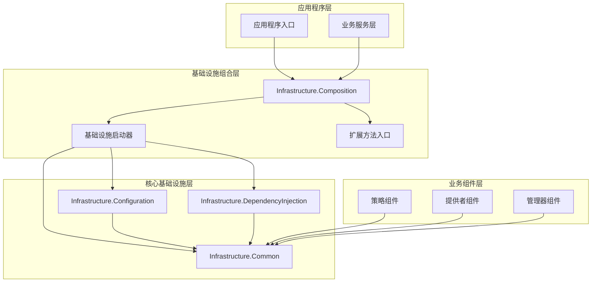

### 项目组织结构

**Visual Studio解决方案中的项目位置**：

```text
Infrastructure/
├── Lorn.ADSP.Infrastructure.Configuration/       # 配置管理基础设施
├── Lorn.ADSP.Infrastructure.DependencyInjection/ # 依赖注入基础设施
├── Lorn.ADSP.Infrastructure.Composition/          # 基础设施组合层
└── Lorn.ADSP.Infrastructure.Common/               # 公共基础设施
```

### 项目依赖关系设计

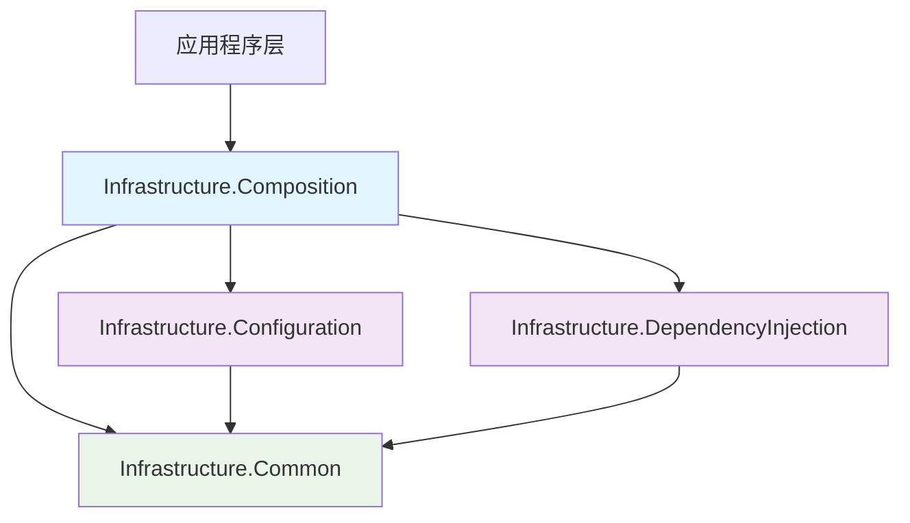

**依赖关系说明**：

1. **应用程序层** → 仅依赖组合层，避免直接依赖多个基础设施项目
2. **组合层** → 依赖所有核心基础设施项目，负责协调和组装
3. **配置管理项目** → 依赖公共基础设施，提供配置管理能力
4. **依赖注入项目** → 依赖公共基础设施，提供组件注册能力
5. **公共基础设施** → 不依赖其他项目，提供基础抽象和约定

### 核心组件设计

#### 1. 配置管理组件设计

**项目位置**：`Infrastructure/Lorn.ADSP.Infrastructure.Configuration/`

**主要职责**：

- 多源配置支持（JSON、环境变量、数据库、命令行）
- 强类型配置绑定
- 配置验证和错误处理
- 配置热重载机制
- 配置加密和安全存储

**关键组件设计**：

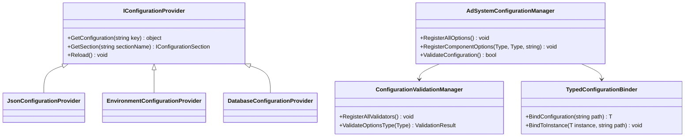

**输入输出设计**：

- **输入**：配置文件路径、环境变量、数据库连接信息
- **输出**：强类型配置对象、配置验证结果、配置变更事件

#### 2. 依赖注入组件设计

**项目位置**：`Infrastructure/Lorn.ADSP.Infrastructure.DependencyInjection/`

**主要职责**：

- 程序集扫描和组件发现
- 基于约定的自动注册
- 生命周期管理
- 条件注册和环境适配
- 装饰器模式支持

**关键组件设计**：

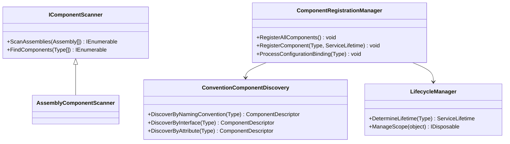

**输入输出设计**：

- **输入**：程序集集合、组件类型、配置信息
- **输出**：服务描述符、注册结果、依赖关系图

#### 3. 公共基础设施设计

**项目位置**：`Infrastructure/Lorn.ADSP.Infrastructure.Common/`

**主要职责**：

- 基础接口和抽象类定义
- 约定规范和命名规则
- 通用扩展方法和工具类
- 元数据模型和描述符

**核心接口设计**：

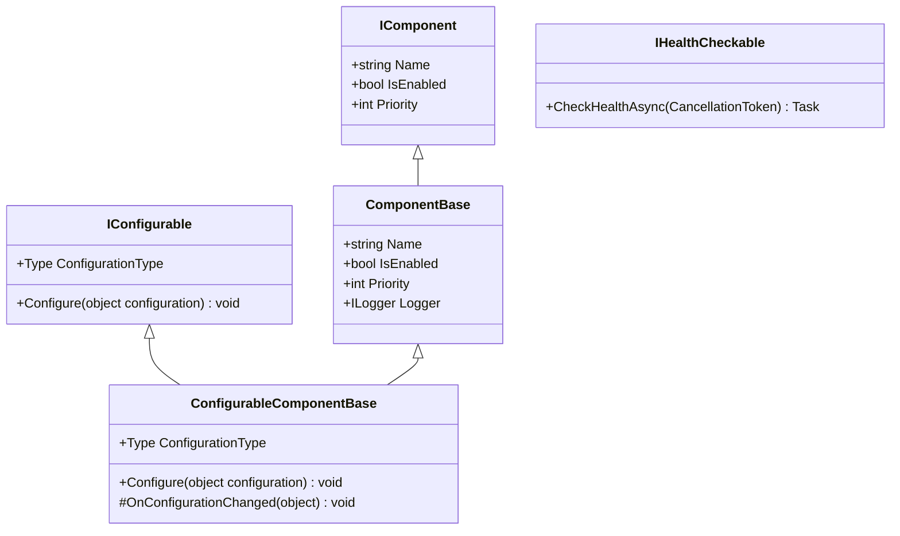

**约定规范设计**：

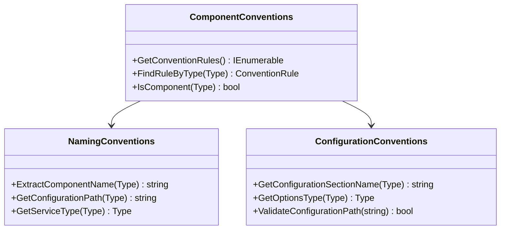

### 组合层设计

**项目位置**：`Infrastructure/Lorn.ADSP.Infrastructure.Composition/`

**核心设计理念**：避免循环依赖，提供统一的基础设施入口

**组合器设计**：

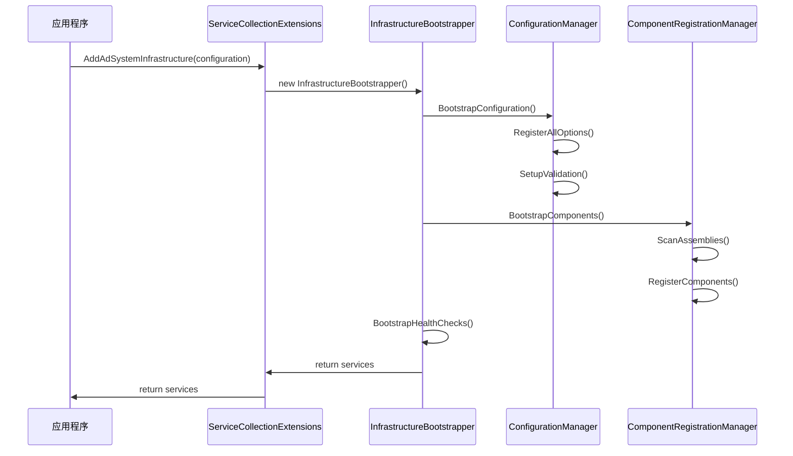

## 约定规范设计

### 组件命名约定

**命名规则**：

| 组件类型   | 命名后缀    | 生命周期  | 必需接口              | 配置路径模板                |
| ---------- | ----------- | --------- | --------------------- | --------------------------- |
| 策略组件   | *Strategy   | Transient | IAdProcessingStrategy | Strategies:{ComponentName}  |
| 服务组件   | *Service    | Singleton | 无                    | Services:{ComponentName}    |
| 管理器组件 | *Manager    | Singleton | 无                    | Managers:{ComponentName}    |
| 提供者组件 | *Provider   | Scoped    | IDataAccessProvider   | Providers:{ComponentName}   |
| 匹配器组件 | *Matcher    | Transient | ITargetingMatcher     | Matchers:{ComponentName}    |
| 计算器组件 | *Calculator | Transient | ICalculator           | Calculators:{ComponentName} |

**约定规则实现指导**：

- 在 `Infrastructure.Common` 项目中实现 `ComponentConventions` 类
- 使用反射和字符串比较实现类型识别
- 支持运行时动态添加新的约定规则
- 提供约定规则优先级管理

### 配置约定规范

**配置文件结构约定**：

```json
{
  "AdEngine": { "核心广告引擎配置" },
  "DataAccess": { "数据访问配置" },
  "Strategies": {
    "UserInterestRecall": { "用户兴趣召回策略配置" },
    "ContextualTargeting": { "上下文定向策略配置" }
  },
  "DataProviders": {
    "UserProfile": { "用户档案提供者配置" },
    "AdInventory": { "广告库存提供者配置" }
  }
}
```

**配置选项类约定**：

- 命名格式：`{ModuleName}Options`
- 位置：与对应组件同一程序集
- 验证器：`{ModuleName}OptionsValidator`
- 基础属性：继承 `BaseComponentOptions`

### 特性标记设计

**组件标记特性**：

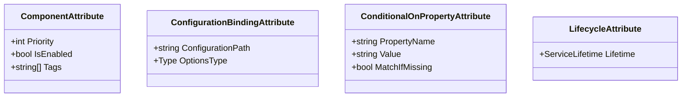

## 实现指导

### 配置管理实现指导

**在 `Infrastructure.Configuration` 项目中实现**：

1. **AdSystemConfigurationManager** 类：
   - 扫描所有 `*Options` 类型
   - 基于约定自动映射配置节
   - 集成配置验证机制
   - 支持配置热重载

2. **ConfigurationValidationManager** 类：
   - 扫描所有 `IValidateOptions<T>` 实现
   - 自动注册验证器
   - 提供统一的验证入口

3. **TypedConfigurationBinder** 类：
   - 实现强类型配置绑定
   - 支持嵌套配置对象
   - 处理配置类型转换

### 依赖注入实现指导

**在 `Infrastructure.DependencyInjection` 项目中实现**：

1. **ComponentRegistrationManager** 类：
   - 实现程序集扫描逻辑
   - 基于约定规则进行组件识别
   - 自动确定服务生命周期
   - 集成配置绑定机制

2. **ConventionComponentDiscovery** 类：
   - 实现命名约定匹配
   - 实现接口约定匹配
   - 实现特性标记识别

3. **LifecycleManager** 类：
   - 基于约定推断生命周期
   - 支持显式生命周期标记
   - 管理作用域和释放

### 组合层实现指导

**在 `Infrastructure.Composition` 项目中实现**：

1. **ServiceCollectionExtensions** 类：
   - 提供 `AddAdSystemInfrastructure` 扩展方法
   - 作为唯一的外部API入口
   - 集成健康检查扩展

2. **InfrastructureBootstrapper** 类：
   - 协调各基础设施组件的启动顺序
   - 处理组件间的依赖关系
   - 提供启动错误处理

### 公共基础设施实现指导

**在 `Infrastructure.Common` 项目中实现**：

1. **基础接口定义**：
   - `IComponent`：组件基础接口
   - `IConfigurable`：可配置组件接口
   - `IHealthCheckable`：健康检查接口

2. **约定规范实现**：
   - `ComponentConventions`：组件约定规则
   - `NamingConventions`：命名约定规则
   - `ConfigurationConventions`：配置约定规则

3. **基础类实现**：
   - `ComponentBase`：组件基础类
   - `ConfigurableComponentBase`：可配置组件基础类

## 配置热重载设计

### 热重载机制设计

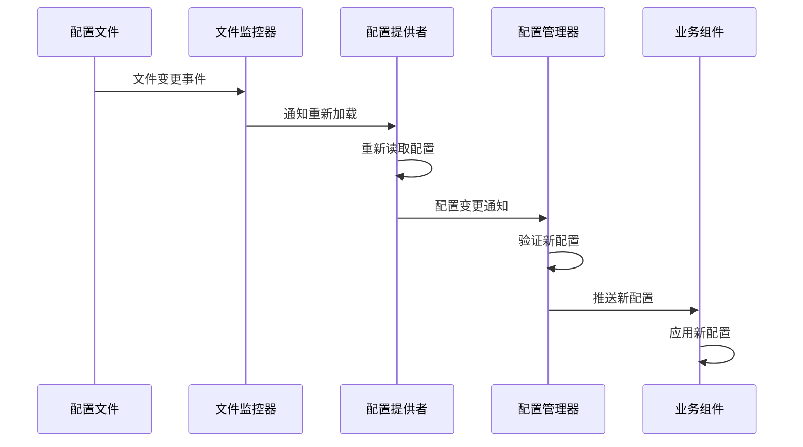

**实现要点**：

- 使用 `IOptionsMonitor<T>` 实现配置监控
- 配置变更时先验证后应用
- 支持配置验证失败时的回滚机制
- 提供配置变更事件通知

### 健康检查集成设计

**健康检查架构**：

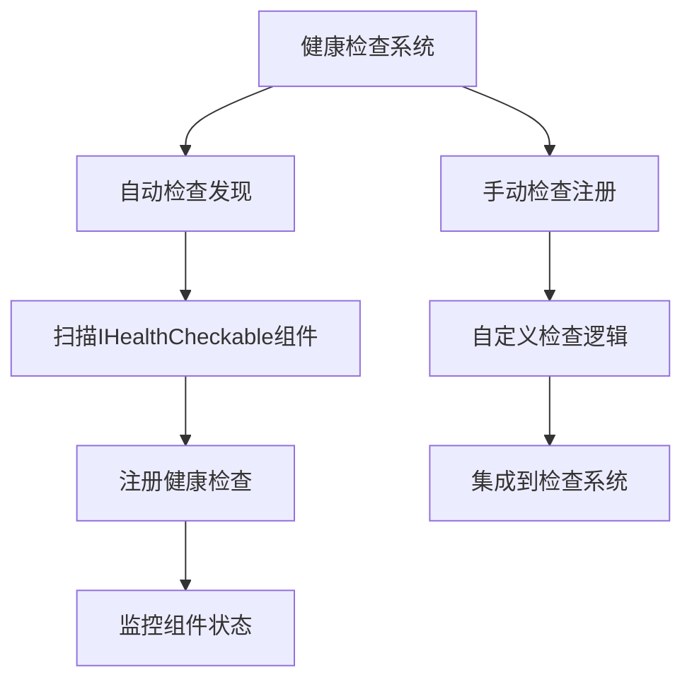

**实现指导**：

- 自动扫描实现 `IHealthCheckable` 的组件
- 为每个组件生成健康检查注册
- 支持组件级和系统级健康状态聚合
- 集成配置驱动的健康检查策略

## 扩展性设计

### 新增组件类型扩展

**扩展步骤**：

1. 在 `ComponentConventions` 中添加新的约定规则
2. 定义对应的接口（如果需要）
3. 创建基础类模板（如果需要）
4. 无需修改基础设施注册代码

### 新增配置源扩展

**扩展点设计**：

- 实现 `IConfigurationProvider` 接口
- 在 `AdSystemConfigurationManager` 中注册新提供者
- 支持配置源优先级管理
- 支持配置源热插拔

### 新增验证规则扩展

**扩展机制**：

- 实现 `IValidateOptions<T>` 接口
- 自动发现和注册机制
- 支持多个验证器组合
- 支持自定义验证失败处理

## 性能和监控设计

### 性能监控点

**关键性能指标**：

- 组件扫描耗时
- 配置加载耗时
- 组件注册耗时
- 配置验证耗时
- 热重载响应时间

### 监控集成设计

**监控架构**：

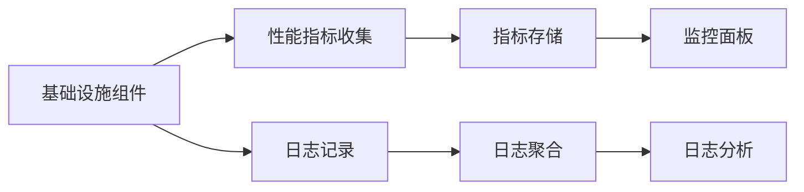

**实现指导**：

- 在关键路径添加性能计数器
- 集成结构化日志记录
- 支持监控数据导出
- 提供性能分析工具

## 测试策略设计

### 单元测试设计

**测试覆盖范围**：

- 约定规则识别测试
- 配置绑定测试
- 组件注册测试
- 配置验证测试

### 集成测试设计

**测试场景**：

- 完整基础设施启动测试
- 配置热重载测试
- 健康检查集成测试
- 多组件协作测试

### 性能测试设计

**测试指标**：

- 大量组件扫描性能
- 配置加载性能
- 内存使用情况
- 启动时间测试

## 部署和运维设计

### 部署策略

**部署模式**：

- 单体应用部署
- 微服务架构部署
- 容器化部署
- 云原生部署

### 运维监控

**监控维度**：

- 基础设施健康状态
- 组件注册状态
- 配置加载状态
- 性能指标监控

### 故障处理

**故障恢复机制**：

- 配置加载失败降级
- 组件注册失败隔离
- 依赖缺失优雅处理
- 系统自动恢复

此技术设计文档提供了完整的架构设计指导，明确了各项目的职责和实现要求，为开发团队提供了详细的技术实现路线图。所有实现都应遵循此设计文档中的架构原则和约定规范。

**项目位置**：`Infrastructure/Lorn.ADSP.Infrastructure.DependencyInjection/`

**主要职责**：

- 程序集扫描和组件发现
- 基于约定的自动注册
- 生命周期管理
- 条件注册和环境适配
- 装饰器模式支持

**关键组件设计**：


**输入输出设计**：

- **输入**：程序集集合、组件类型、配置信息
- **输出**：服务描述符、注册结果、依赖关系图

#### 3. 公共基础设施设计

**项目位置**：`Infrastructure/Lorn.ADSP.Infrastructure.Common/`

**主要职责**：

- 基础接口和抽象类定义
- 约定规范和命名规则
- 通用扩展方法和工具类
- 元数据模型和描述符

**核心接口设计**：


**约定规范设计**：


### 组合层设计

**项目位置**：`Infrastructure/Lorn.ADSP.Infrastructure.Composition/`

**核心设计理念**：避免循环依赖，提供统一的基础设施入口

**组合器设计**：


## 约定规范设计

### 组件命名约定

**命名规则**：

| 组件类型   | 命名后缀    | 生命周期  | 必需接口              | 配置路径模板                |
| ---------- | ----------- | --------- | --------------------- | --------------------------- |
| 策略组件   | *Strategy   | Transient | IAdProcessingStrategy | Strategies:{ComponentName}  |
| 服务组件   | *Service    | Singleton | 无                    | Services:{ComponentName}    |
| 管理器组件 | *Manager    | Singleton | 无                    | Managers:{ComponentName}    |
| 提供者组件 | *Provider   | Scoped    | IDataAccessProvider   | Providers:{ComponentName}   |
| 匹配器组件 | *Matcher    | Transient | ITargetingMatcher     | Matchers:{ComponentName}    |
| 计算器组件 | *Calculator | Transient | ICalculator           | Calculators:{ComponentName} |

**约定规则实现指导**：

- 在 `Infrastructure.Common` 项目中实现 `ComponentConventions` 类
- 使用反射和字符串比较实现类型识别
- 支持运行时动态添加新的约定规则
- 提供约定规则优先级管理

### 配置约定规范

**配置文件结构约定**：

```json
{
  "AdEngine": { "核心广告引擎配置" },
  "DataAccess": { "数据访问配置" },
  "Strategies": {
    "UserInterestRecall": { "用户兴趣召回策略配置" },
    "ContextualTargeting": { "上下文定向策略配置" }
  },
  "DataProviders": {
    "UserProfile": { "用户档案提供者配置" },
    "AdInventory": { "广告库存提供者配置" }
  }
}
```

**配置选项类约定**：

- 命名格式：`{ModuleName}Options`
- 位置：与对应组件同一程序集
- 验证器：`{ModuleName}OptionsValidator`
- 基础属性：继承 `BaseComponentOptions`

### 特性标记设计

**组件标记特性**：


## 实现指导

### 配置管理实现指导

**在 `Infrastructure.Configuration` 项目中实现**：

1. **AdSystemConfigurationManager** 类：
   - 扫描所有 `*Options` 类型
   - 基于约定自动映射配置节
   - 集成配置验证机制
   - 支持配置热重载

2. **ConfigurationValidationManager** 类：
   - 扫描所有 `IValidateOptions<T>` 实现
   - 自动注册验证器
   - 提供统一的验证入口

3. **TypedConfigurationBinder** 类：
   - 实现强类型配置绑定
   - 支持嵌套配置对象
   - 处理配置类型转换

### 依赖注入实现指导

**在 `Infrastructure.DependencyInjection` 项目中实现**：

1. **ComponentRegistrationManager** 类：
   - 实现程序集扫描逻辑
   - 基于约定规则进行组件识别
   - 自动确定服务生命周期
   - 集成配置绑定机制

2. **ConventionComponentDiscovery** 类：
   - 实现命名约定匹配
   - 实现接口约定匹配
   - 实现特性标记识别

3. **LifecycleManager** 类：
   - 基于约定推断生命周期
   - 支持显式生命周期标记
   - 管理作用域和释放

### 组合层实现指导

**在 `Infrastructure.Composition` 项目中实现**：

1. **ServiceCollectionExtensions** 类：
   - 提供 `AddAdSystemInfrastructure` 扩展方法
   - 作为唯一的外部API入口
   - 集成健康检查扩展

2. **InfrastructureBootstrapper** 类：
   - 协调各基础设施组件的启动顺序
   - 处理组件间的依赖关系
   - 提供启动错误处理

### 公共基础设施实现指导

**在 `Infrastructure.Common` 项目中实现**：

1. **基础接口定义**：
   - `IComponent`：组件基础接口
   - `IConfigurable`：可配置组件接口
   - `IHealthCheckable`：健康检查接口

2. **约定规范实现**：
   - `ComponentConventions`：组件约定规则
   - `NamingConventions`：命名约定规则
   - `ConfigurationConventions`：配置约定规则

3. **基础类实现**：
   - `ComponentBase`：组件基础类
   - `ConfigurableComponentBase`：可配置组件基础类

## 配置热重载设计

### 热重载机制设计


**实现要点**：

- 使用 `IOptionsMonitor<T>` 实现配置监控
- 配置变更时先验证后应用
- 支持配置验证失败时的回滚机制
- 提供配置变更事件通知

### 健康检查集成设计

**健康检查架构**：


**实现指导**：

- 自动扫描实现 `IHealthCheckable` 的组件
- 为每个组件生成健康检查注册
- 支持组件级和系统级健康状态聚合
- 集成配置驱动的健康检查策略

## 扩展性设计

### 新增组件类型扩展

**扩展步骤**：

1. 在 `ComponentConventions` 中添加新的约定规则
2. 定义对应的接口（如果需要）
3. 创建基础类模板（如果需要）
4. 无需修改基础设施注册代码

### 新增配置源扩展

**扩展点设计**：

- 实现 `IConfigurationProvider` 接口
- 在 `AdSystemConfigurationManager` 中注册新提供者
- 支持配置源优先级管理
- 支持配置源热插拔

### 新增验证规则扩展

**扩展机制**：

- 实现 `IValidateOptions<T>` 接口
- 自动发现和注册机制
- 支持多个验证器组合
- 支持自定义验证失败处理

## 性能和监控设计

### 性能监控点

**关键性能指标**：

- 组件扫描耗时
- 配置加载耗时
- 组件注册耗时
- 配置验证耗时
- 热重载响应时间

### 监控集成设计

**监控架构**：


**实现指导**：

- 在关键路径添加性能计数器
- 集成结构化日志记录
- 支持监控数据导出
- 提供性能分析工具

## 测试策略设计

### 单元测试设计

**测试覆盖范围**：

- 约定规则识别测试
- 配置绑定测试
- 组件注册测试
- 配置验证测试

### 集成测试设计

**测试场景**：

- 完整基础设施启动测试
- 配置热重载测试
- 健康检查集成测试
- 多组件协作测试

### 性能测试设计

**测试指标**：

- 大量组件扫描性能
- 配置加载性能
- 内存使用情况
- 启动时间测试

此技术设计文档提供了完整的架构设计指导，明确了各项目的职责和实现要求，为开发团队提供了详细的技术实现路线图。所有实现都应遵循此设计文档中的架构原则和约定规范。