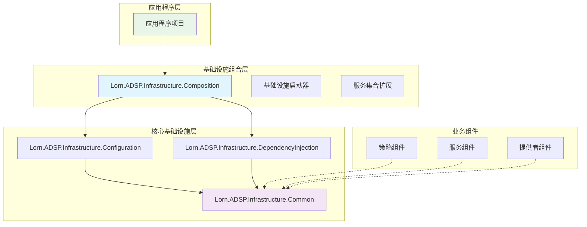
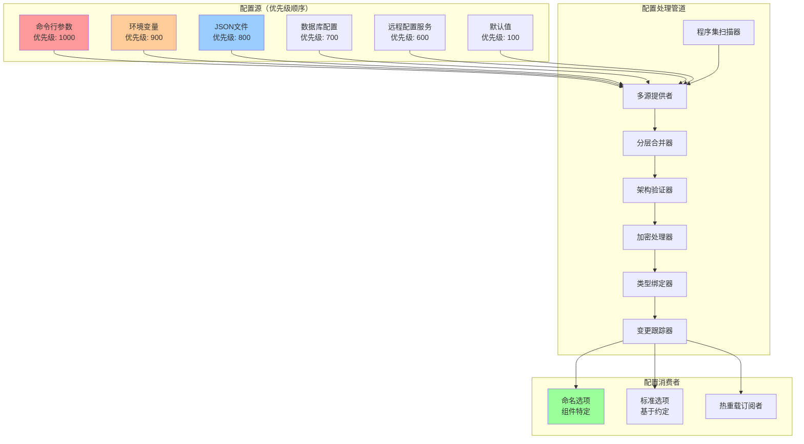
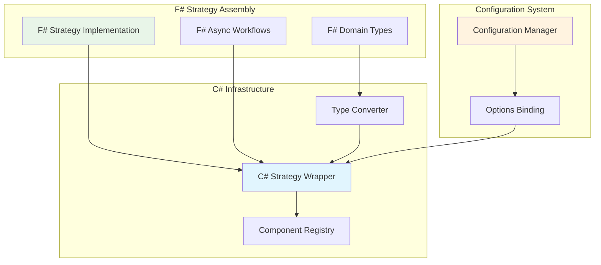
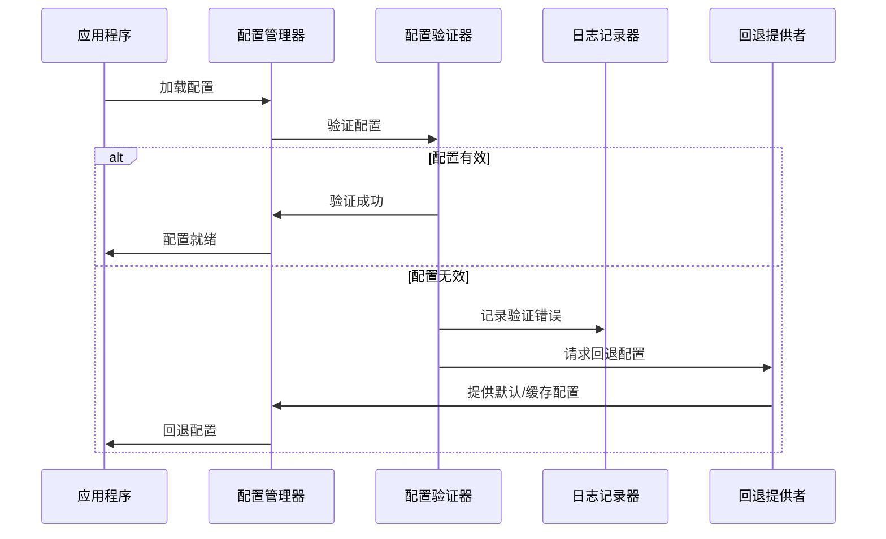
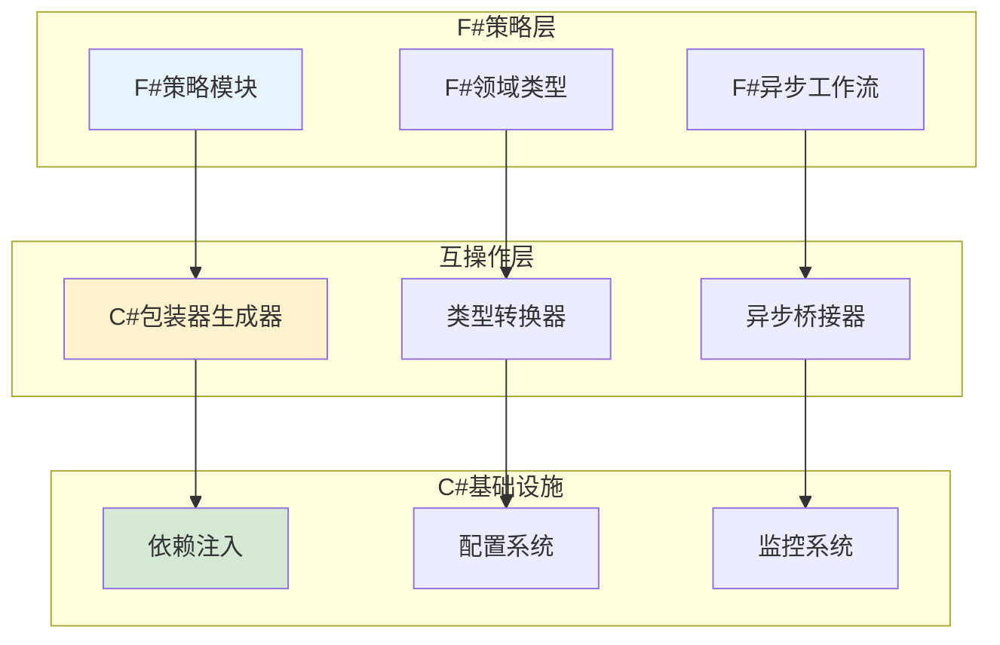

# 统一配置管理和依赖注入基础设施设计文档

## 概述

本文档介绍了为Lorn.ADSP广告平台实现统一配置管理和依赖注入基础设施的技术设计。该设计实现了一个复杂的分层架构，提供零配置组件注册、企业级配置管理（支持多源配置）和全面的监控功能。

该基础设施遵循核心原则：**配置管理和依赖注入是完整的、即用型基础设施组件**，而不是可扩展的业务框架。这种设计理念确保当添加新组件或配置时，开发人员只需遵循既定约定 - 无需修改基础设施代码。

**设计理念：**
- **配置管理即基础设施**：完整的、自包含的系统，通过约定自动处理所有配置场景
- **依赖注入即组件装配器**：智能系统，基于元数据和约定自动发现、注册和连接组件
- **零配置扩展**：新组件通过遵循命名约定和使用特性无缝集成
- **约定优于配置**：广泛的约定规则消除了显式注册代码的需要

**满足的企业级需求：**
- 高性能组件注册（1000+个组件<100毫秒）
- 多源配置与热重载功能
- 全面的验证和错误恢复机制
- 高级监控和诊断集成
- F#和C#互操作性支持策略实现
- 支持加密的安全配置管理

**核心设计理念：**
- **配置管理是基础设施，不是业务扩展**：完整的、即用型系统，通过约定处理所有配置场景
- **依赖注入是组件装配工具**：智能编排器，基于元数据和约定自动发现和注册组件
- **零配置扩展模型**：新组件只需遵循约定，无需修改基础设施
- **约定优于配置**：标准化模式消除样板代码和配置复杂性

**性能要求：**
- 组件注册：1000+个组件<100毫秒
- 配置加载：完整配置<50毫秒
- 依赖解析：复杂依赖树<10毫秒
- 内存开销：额外基础设施占用<10MB
- 并发解析：1000+个并发组件解析

## 架构

### 高层架构

基础设施遵循清晰的分层架构，旨在消除循环依赖并为应用程序提供单一集成点：



### 依赖流设计

架构通过严格分层防止循环依赖：

```
应用程序层 (Application)
    ↓ 只依赖
基础设施组合层 (Infrastructure.Composition) 
    ↓ 依赖
┌─ 配置基础设施 (Infrastructure.Configuration)
├─ 依赖注入基础设施 (Infrastructure.DependencyInjection)  
└─ 公共基础设施 (Infrastructure.Common)
    ↑ 被所有基础设施项目依赖（提供基础抽象）
```

**层级职责：**
1. **公共层**：基础抽象、约定和基类 - 对其他基础设施层零依赖
2. **配置层**：多源配置管理、验证、热重载 - 仅依赖公共层
3. **依赖注入层**：组件发现、注册、生命周期管理 - 仅依赖公共层
4. **组合层**：编排所有基础设施组件，提供单一集成点 - 依赖所有其他层
5. **应用程序层**：业务逻辑和服务 - 仅引用组合层

**详细项目结构：**

```text
Infrastructure/
├── Lorn.ADSP.Infrastructure.Common/              # 基础抽象层
│   ├── Abstractions/                            # 核心接口定义
│   │   ├── IConfigurable.cs                    # 可配置组件接口
│   │   ├── IComponent.cs                       # 组件基础接口
│   │   ├── IHealthCheckable.cs                 # 健康检查接口
│   │   └── IComponentMetadata.cs               # 组件元数据接口
│   ├── Base/                                   # 基础实现类
│   │   ├── ConfigurableComponentBase.cs        # 可配置组件基类
│   │   ├── ComponentBase.cs                    # 组件基类
│   │   └── HealthCheckableComponentBase.cs     # 健康检查组件基类
│   ├── Conventions/                            # 约定规范
│   │   ├── NamingConventions.cs               # 命名约定
│   │   ├── ConfigurationConventions.cs        # 配置约定
│   │   └── ComponentConventions.cs            # 组件约定
│   ├── Models/                                 # 公共模型
│   │   ├── ComponentDescriptor.cs             # 组件描述符
│   │   ├── ComponentMetadata.cs               # 组件元数据
│   │   └── InfrastructureOptions.cs           # 基础设施配置选项
│   └── Extensions/                             # 通用扩展
│       ├── TypeExtensions.cs                  # 类型扩展
│       ├── ReflectionExtensions.cs            # 反射扩展
│       └── ValidationExtensions.cs            # 验证扩展
├── Lorn.ADSP.Infrastructure.Configuration/      # 配置管理基础设施
│   ├── Providers/                              # 配置提供者实现
│   │   ├── JsonConfigurationProvider.cs       # JSON文件配置
│   │   ├── EnvironmentConfigurationProvider.cs # 环境变量配置
│   │   ├── DatabaseConfigurationProvider.cs   # 数据库配置
│   │   └── CompositeConfigurationProvider.cs  # 组合配置源
│   ├── Validation/                             # 配置验证器
│   │   ├── ConfigurationValidator.cs          # 核心验证器
│   │   ├── ValidationRuleEngine.cs            # 验证规则引擎
│   │   └── ValidationResult.cs                # 验证结果模型
│   ├── Binding/                               # 配置绑定器
│   │   ├── TypedConfigurationBinder.cs        # 强类型绑定
│   │   ├── ConventionConfigurationBinder.cs   # 约定绑定
│   │   └── ConfigurationChangeTracker.cs      # 变更跟踪
│   └── Extensions/                            # 扩展方法
│       └── ConfigurationBuilderExtensions.cs  # 配置构建器扩展
├── Lorn.ADSP.Infrastructure.DependencyInjection/ # 依赖注入基础设施
│   ├── Discovery/                              # 组件发现器
│   │   ├── AssemblyComponentScanner.cs        # 程序集扫描器
│   │   ├── ConventionComponentDiscovery.cs    # 约定发现器
│   │   └── MetadataComponentFilter.cs         # 元数据过滤器
│   ├── Registration/                           # 组件注册器
│   │   ├── ComponentRegistrationBuilder.cs    # 注册构建器
│   │   ├── BatchComponentRegistrar.cs         # 批量注册器
│   │   └── LifecycleManager.cs                # 生命周期管理
│   ├── Attributes/                             # 特性标记
│   │   ├── ComponentAttribute.cs              # 组件标记
│   │   ├── ConfigurationBindingAttribute.cs   # 配置绑定标记
│   │   └── DependencyAttribute.cs             # 依赖声明标记
│   └── Extensions/                             # 扩展方法
│       └── ComponentRegistrationExtensions.cs # 组件注册扩展
└── Lorn.ADSP.Infrastructure.Composition/        # 基础设施组合层
    ├── Extensions/                              # 统一基础设施扩展
    │   └── ServiceCollectionExtensions.cs      # 基础设施注册扩展（唯一对外接口）
    ├── Bootstrapper/                            # 启动器
    │   ├── InfrastructureBootstrapper.cs       # 基础设施启动器
    │   └── ComponentBootstrapper.cs            # 组件启动器
    └── Configuration/                           # 组合配置
        ├── InfrastructureSettings.cs           # 基础设施设置
        └── BootstrapOptions.cs                 # 启动选项
```

## 组件和接口

### 核心基础设施项目

#### Lorn.ADSP.Infrastructure.Common

**用途**：基础抽象和约定

**关键接口**：

```csharp
// 基础组件接口
public interface IComponent
{
    IComponentMetadata Metadata { get; }
}

// 可配置组件接口
public interface IConfigurable<TOptions> where TOptions : class
{
    string ConfigurationKey { get; }
    void Configure(TOptions options);
}

// 健康检查接口
public interface IHealthCheckable
{
    Task<HealthCheckResult> CheckHealthAsync(CancellationToken cancellationToken = default);
}

// 组件元数据接口
public interface IComponentMetadata
{
    string Name { get; }
    string Description { get; }
    Version Version { get; }
    ComponentType Type { get; }
    bool IsEnabled { get; }
    int Priority { get; }
}
```

**约定规则系统**：

```csharp
public class ComponentConventionRule
{
    public string Suffix { get; set; }
    public ServiceLifetime Lifetime { get; set; }
    public string[] RequiredInterfaceNames { get; set; } = Array.Empty<string>();
    public string ConfigurationPathTemplate { get; set; }
    public string Description { get; set; }
    public bool RequireSpecificInterface { get; set; } = false;
}

// Lorn.ADSP平台全面的内置约定规则
public static class ComponentConventions
{
    private static readonly List<ComponentConventionRule> _conventionRules = new()
    {
        new ComponentConventionRule
        {
            Suffix = "Strategy",
            Lifetime = ServiceLifetime.Transient,
            RequiredInterfaceNames = new[] { "IAdProcessingStrategy" },
            ConfigurationPathTemplate = "Strategies:{0}",
            Description = "广告处理策略组件",
            RequireSpecificInterface = true
        },
        new ComponentConventionRule
        {
            Suffix = "Service", 
            Lifetime = ServiceLifetime.Singleton,
            RequiredInterfaceNames = Array.Empty<string>(),
            ConfigurationPathTemplate = "Services:{0}",
            Description = "业务服务组件",
            RequireSpecificInterface = false
        },
        new ComponentConventionRule
        {
            Suffix = "Manager",
            Lifetime = ServiceLifetime.Singleton,
            RequiredInterfaceNames = Array.Empty<string>(),
            ConfigurationPathTemplate = "Managers:{0}",
            Description = "管理器组件",
            RequireSpecificInterface = false
        },
        new ComponentConventionRule
        {
            Suffix = "Provider",
            Lifetime = ServiceLifetime.Singleton,
            RequiredInterfaceNames = new[] { "IDataAccessProvider", "IProvider" },
            ConfigurationPathTemplate = "Providers:{0}",
            Description = "数据提供者组件",
            RequireSpecificInterface = false
        },
        new ComponentConventionRule
        {
            Suffix = "CallbackProvider",
            Lifetime = ServiceLifetime.Singleton,
            RequiredInterfaceNames = new[] { "ICallbackProvider" },
            ConfigurationPathTemplate = "CallbackProviders:{0}",
            Description = "回调提供者组件",
            RequireSpecificInterface = true
        },
        new ComponentConventionRule
        {
            Suffix = "Matcher",
            Lifetime = ServiceLifetime.Scoped,
            RequiredInterfaceNames = new[] { "ITargetingMatcher", "IMatcher" },
            ConfigurationPathTemplate = "Matchers:{0}",
            Description = "定向匹配器组件",
            RequireSpecificInterface = false
        },
        new ComponentConventionRule
        {
            Suffix = "Calculator",
            Lifetime = ServiceLifetime.Scoped,
            RequiredInterfaceNames = new[] { "ICalculator" },
            ConfigurationPathTemplate = "Calculators:{0}",
            Description = "计算器组件",
            RequireSpecificInterface = false
        },
        new ComponentConventionRule
        {
            Suffix = "Processor",
            Lifetime = ServiceLifetime.Scoped,
            RequiredInterfaceNames = new[] { "IProcessor" },
            ConfigurationPathTemplate = "Processors:{0}",
            Description = "处理器组件",
            RequireSpecificInterface = false
        }
    };
    
    public static IReadOnlyList<ComponentConventionRule> GetAllRules() => _conventionRules.AsReadOnly();
    
    public static ComponentConventionRule FindRuleByType(Type type)
    {
        // 基于优先级的规则匹配与接口验证
        var rule = _conventionRules.FirstOrDefault(r => type.Name.EndsWith(r.Suffix));
        if (rule == null) return null;
        
        // 如果指定了接口要求，则验证接口要求
        if (rule.RequireSpecificInterface && rule.RequiredInterfaceNames.Length > 0)
        {
            var implementedInterfaceNames = type.GetInterfaces().Select(i => i.Name).ToArray();
            var hasRequiredInterface = rule.RequiredInterfaceNames.Any(required => 
                implementedInterfaceNames.Contains(required));
                
            if (!hasRequiredInterface)
            {
                return null; // 不满足接口要求
            }
        }
        
        return rule;
    }
    
    public static string GetConfigurationPath(Type type)
    {
        var rule = FindRuleByType(type);
        if (rule?.ConfigurationPathTemplate == null) return null;
        
        // 提取组件名称：UserInterestRecallStrategy -> UserInterestRecall
        var componentName = type.Name;
        if (componentName.EndsWith(rule.Suffix))
        {
            componentName = componentName.Substring(0, componentName.Length - rule.Suffix.Length);
        }
        
        return string.Format(rule.ConfigurationPathTemplate, componentName);
    }
    
    // 运行时扩展性 - 添加新约定规则
    public static void AddConventionRule(ComponentConventionRule rule)
    {
        if (rule == null) throw new ArgumentNullException(nameof(rule));
        if (string.IsNullOrEmpty(rule.Suffix)) throw new ArgumentException("Suffix cannot be null or empty");
        
        if (_conventionRules.Any(r => r.Suffix == rule.Suffix))
        {
            throw new InvalidOperationException($"Convention rule with suffix '{rule.Suffix}' already exists");
        }
        
        _conventionRules.Add(rule);
    }
    
    // 组件验证
    public static bool IsComponent(Type type)
    {
        if (type == null || !type.IsClass || type.IsAbstract || type.IsGenericTypeDefinition)
            return false;
            
        // 检查显式组件特性
        if (type.GetCustomAttribute<ComponentAttribute>() != null)
            return true;
            
        // 检查约定规则
        return FindRuleByType(type) != null;
    }
}
```

#### Lorn.ADSP.Infrastructure.Configuration

**用途**：统一配置管理，支持多源配置和验证

**高级配置功能：**
- **多源配置**：JSON文件、环境变量、数据库、远程配置服务
- **命名选项支持**：多个组件共享相同配置类但使用不同值
- **热重载功能**：运行时配置更新，无需重启应用程序
- **配置验证**：基于架构的验证和自定义验证规则
- **配置加密**：敏感数据保护，支持可配置的加密提供程序
- **配置版本控制**：支持配置架构演进和迁移

**核心配置管理器**：

```csharp
public class AdSystemConfigurationManager
{
    private readonly IConfiguration _configuration;
    private readonly IServiceCollection _services;
    private readonly ConfigurationValidationManager _validationManager;
    private readonly HashSet<Type> _registeredOptionsTypes = new();
    private readonly Dictionary<string, Type> _namedOptionsRegistry = new();
    
    public AdSystemConfigurationManager(IConfiguration configuration, IServiceCollection services)
    {
        _configuration = configuration;
        _services = services;
        _validationManager = new ConfigurationValidationManager(services);
    }
    
    // 自动注册所有*Options类
    public void RegisterAllOptions()
    {
        var optionsTypes = AssemblyScanner.FindTypes(type => 
            type.Name.EndsWith("Options") && 
            type.IsClass && 
            !type.IsAbstract);
            
        foreach (var optionsType in optionsTypes)
        {
            RegisterConventionOptions(optionsType);
        }
    }
    
    // 共享配置类的命名选项支持 - 支持多组件场景
    public void RegisterComponentOptions(Type componentType, Type optionsType, string configurationPath)
    {
        var componentName = componentType.Name;
        var registryKey = $"{optionsType.FullName}:{componentName}";
        
        // 避免重复注册相同的命名配置
        if (_namedOptionsRegistry.ContainsKey(registryKey))
        {
            return;
        }
        
        // 查找支持命名选项的方法
        var configureMethod = typeof(OptionsConfigurationServiceCollectionExtensions)
            .GetMethods()
            .FirstOrDefault(m => 
                m.Name == "Configure" && 
                m.IsGenericMethodDefinition &&
                m.GetParameters().Length == 3 &&
                m.GetParameters()[1].ParameterType == typeof(string) &&
                m.GetParameters()[2].ParameterType == typeof(IConfiguration));
        
        if (configureMethod != null)
        {
            var genericMethod = configureMethod.MakeGenericMethod(optionsType);
            var configSection = _configuration.GetSection(configurationPath);
            
            // 使用组件名称作为命名选项名称 - 支持多个组件共享相同的选项类型
            genericMethod.Invoke(null, new object[] 
            { 
                _services, 
                componentName, // 组件名称作为命名选项标识符
                configSection
            });
            
            // 记录已注册的命名配置
            _namedOptionsRegistry[registryKey] = optionsType;
        }
        
        // 为此选项类型注册验证器
        _validationManager.RegisterValidatorsForOptionsType(optionsType);
    }
    
    // 基于约定的配置绑定（处理传统的未命名配置）
    private void RegisterConventionOptions(Type optionsType)
    {
        // 避免重复注册
        if (_registeredOptionsTypes.Contains(optionsType))
        {
            return;
        }
        
        // 约定：AdEngineOptions -> "AdEngine" 配置节
        var sectionName = optionsType.Name.Replace("Options", "");
        
        // 使用Microsoft.Extensions.Options进行强类型绑定
        var configureMethod = typeof(OptionsConfigurationServiceCollectionExtensions)
            .GetMethod("Configure", new[] { typeof(IServiceCollection), typeof(IConfiguration) })
            ?.MakeGenericMethod(optionsType);
            
        configureMethod?.Invoke(null, new object[] { 
            _services, 
            _configuration.GetSection(sectionName) 
        });
        
        // 记录已注册的配置类型
        _registeredOptionsTypes.Add(optionsType);
        
        // 使用统一验证管理器注册验证器
        _validationManager.RegisterValidatorsForOptionsType(optionsType);
    }
}

// 统一配置验证管理器 - 具体实现
public class ConfigurationValidationManager
{
    private readonly IServiceCollection _services;
    private readonly HashSet<Type> _registeredValidators = new();
    
    public ConfigurationValidationManager(IServiceCollection services)
    {
        _services = services;
    }
    
    // 自动扫描并注册所有验证器
    public void RegisterAllValidators()
    {
        var validatorTypes = AssemblyScanner.FindTypes(type => 
            type.IsClass && 
            !type.IsAbstract &&
            type.GetInterfaces().Any(i => 
                i.IsGenericType && 
                i.GetGenericTypeDefinition() == typeof(IValidateOptions<>)));
                
        foreach (var validatorType in validatorTypes)
        {
            RegisterValidatorType(validatorType);
        }
    }
    
    // 为特定配置类型注册验证器
    public void RegisterValidatorsForOptionsType(Type optionsType)
    {
        var validatorTypes = AssemblyScanner.FindTypes(type => 
            type.IsClass && 
            !type.IsAbstract &&
            type.GetInterfaces().Any(i => 
                i.IsGenericType && 
                i.GetGenericTypeDefinition() == typeof(IValidateOptions<>) &&
                i.GetGenericArguments()[0] == optionsType));
                
        foreach (var validatorType in validatorTypes)
        {
            RegisterValidatorType(validatorType);
        }
    }
    
    // 核心验证器注册逻辑 - 避免重复代码
    private void RegisterValidatorType(Type validatorType)
    {
        if (_registeredValidators.Contains(validatorType))
        {
            return;
        }
        
        var validateInterface = validatorType.GetInterfaces()
            .FirstOrDefault(i => i.IsGenericType && i.GetGenericTypeDefinition() == typeof(IValidateOptions<>));
            
        if (validateInterface != null)
        {
            var optionsType = validateInterface.GetGenericArguments()[0];
            var serviceType = typeof(IValidateOptions<>).MakeGenericType(optionsType);
            
            _services.AddSingleton(serviceType, validatorType);
            _registeredValidators.Add(validatorType);
        }
    }
}
```

**多源配置架构**：



**高级配置功能**：

```csharp
// 具有优先级处理的多源配置提供者
public class CompositeConfigurationProvider : IConfigurationProvider
{
    private readonly List<IConfigurationSource> _sources;
    private readonly Dictionary<string, int> _sourcePriorities;
    
    public CompositeConfigurationProvider()
    {
        _sources = new List<IConfigurationSource>();
        _sourcePriorities = new Dictionary<string, int>
        {
            ["CommandLine"] = 1000,
            ["Environment"] = 900,
            ["JsonFile"] = 800,
            ["Database"] = 700,
            ["RemoteService"] = 600,
            ["Defaults"] = 100
        };
    }
    
    public void Load()
    {
        var configData = new Dictionary<string, string>();
        
        // 按优先级顺序从所有源加载
        foreach (var source in _sources.OrderBy(s => _sourcePriorities.GetValueOrDefault(s.GetType().Name, 500)))
        {
            var sourceData = LoadFromSource(source);
            
            // 基于优先级覆盖进行合并
            foreach (var kvp in sourceData)
            {
                configData[kvp.Key] = kvp.Value; // 更高优先级的源覆盖较低的源
            }
        }
        
        Data = configData;
    }
}

// 配置加密支持
public class ConfigurationEncryptionProvider
{
    private readonly IDataProtectionProvider _dataProtection;
    private readonly string[] _encryptedKeys = { "ConnectionStrings", "ApiKeys", "Secrets" };
    
    public string DecryptValue(string key, string encryptedValue)
    {
        if (!ShouldDecrypt(key))
            return encryptedValue;
            
        var protector = _dataProtection.CreateProtector("Configuration");
        return protector.Unprotect(encryptedValue);
    }
    
    private bool ShouldDecrypt(string key)
    {
        return _encryptedKeys.Any(pattern => key.Contains(pattern, StringComparison.OrdinalIgnoreCase));
    }
}

// 带有变更跟踪的配置热重载
public class ConfigurationChangeTracker
{
    private readonly IOptionsMonitor<object> _optionsMonitor;
    private readonly Dictionary<string, List<Action<object>>> _changeHandlers = new();
    
    public void RegisterChangeHandler<T>(string optionName, Action<T> handler) where T : class
    {
        if (!_changeHandlers.ContainsKey(optionName))
        {
            _changeHandlers[optionName] = new List<Action<object>>();
        }
        
        _changeHandlers[optionName].Add(obj => handler((T)obj));
        
        // 订阅选项监视器
        _optionsMonitor.OnChange((options, name) =>
        {
            if (name == optionName && _changeHandlers.ContainsKey(optionName))
            {
                foreach (var changeHandler in _changeHandlers[optionName])
                {
                    changeHandler(options);
                }
            }
        });
    }
}
```

#### Lorn.ADSP.Infrastructure.DependencyInjection

**用途**：智能组件注册和生命周期管理

**组件注册管理器**：

```csharp
public class ComponentRegistrationManager
{
    private readonly IServiceCollection _services;
    private readonly AdSystemConfigurationManager _configManager;
    
    public void RegisterAllComponents()
    {
        var allTypes = AssemblyScanner.GetAllTypes();
        
        foreach (var type in allTypes)
        {
            var rule = ComponentConventions.FindRuleByType(type);
            if (rule != null)
            {
                RegisterComponent(type, rule);
            }
        }
    }
    
    private void RegisterComponent(Type implementationType, ComponentConventionRule rule)
    {
        // 确定服务类型（接口或实现）
        var serviceType = DetermineServiceType(implementationType, rule);
        
        // 以适当的生命周期注册
        _services.Add(new ServiceDescriptor(serviceType, implementationType, rule.Lifetime));
        
        // 处理配置绑定
        ProcessConfigurationBinding(implementationType, rule);
    }
    
    private void ProcessConfigurationBinding(Type componentType, ComponentConventionRule rule)
    {
        // 检查ConfigurationBinding特性
        var bindingAttribute = componentType.GetCustomAttribute<ConfigurationBindingAttribute>();
        if (bindingAttribute != null)
        {
            var optionsType = bindingAttribute.OptionsType;
            var configurationPath = bindingAttribute.ConfigurationPath;
            
            _configManager.RegisterComponentOptions(componentType, optionsType, configurationPath);
            return;
        }
        
        // 使用基于约定的配置绑定
        var configurationPath = ComponentConventions.GetConfigurationPath(componentType);
        if (!string.IsNullOrEmpty(configurationPath))
        {
            var optionsTypeName = $"{componentType.Name}Options";
            var optionsType = componentType.Assembly.GetTypes()
                .FirstOrDefault(t => t.Name == optionsTypeName);
                
            if (optionsType != null)
            {
                _configManager.RegisterComponentOptions(componentType, optionsType, configurationPath);
            }
        }
    }
}
```

#### Lorn.ADSP.Infrastructure.Composition

**用途**：编排所有基础设施组件的单一集成点

**高级基础设施启动器**：

```csharp
public class InfrastructureBootstrapper
{
    private readonly IServiceCollection _services;
    private readonly IConfiguration _configuration;
    private readonly BootstrapOptions _options;
    private readonly ILogger<InfrastructureBootstrapper> _logger;
    
    public InfrastructureBootstrapper(IServiceCollection services, IConfiguration configuration, BootstrapOptions options = null)
    {
        _services = services;
        _configuration = configuration;
        _options = options ?? new BootstrapOptions();
        _logger = CreateBootstrapLogger();
    }
    
    public IServiceCollection Bootstrap()
    {
        var stopwatch = Stopwatch.StartNew();
        _logger.LogInformation("正在启动基础设施引导...");
        
        try
        {
            // 1. 配置管理 - 自动注册与验证
            BootstrapConfiguration();
            
            // 2. 组件注册 - 基于约定的发现与错误处理
            BootstrapComponents();
            
            // 3. 健康检查 - 所有组件的自动检查
            BootstrapHealthChecks();
            
            // 4. 性能监控 - 自动仪表化
            BootstrapMonitoring();
            
            // 5. F#互操作性支持
            BootstrapFSharpSupport();
            
            // 6. 安全和加密服务
            BootstrapSecurity();
            
            stopwatch.Stop();
            _logger.LogInformation("基础设施引导已在 {ElapsedMs}ms 内完成", stopwatch.ElapsedMilliseconds);
            
            return _services;
        }
        catch (Exception ex)
        {
            _logger.LogError(ex, "基础设施引导失败");
            throw new InfrastructureBootstrapException("无法引导基础设施", ex);
        }
    }
    
    private void BootstrapConfiguration()
    {
        _logger.LogDebug("正在引导配置管理...");
        
        var configManager = new AdSystemConfigurationManager(_configuration, _services);
        
        // 自动注册所有*Options类
        configManager.RegisterAllOptions();
        
        // 注册配置验证服务
        _services.AddSingleton<IConfigurationValidator, ConfigurationValidator>();
        _services.AddSingleton<IConfigurationEncryptionProvider, ConfigurationEncryptionProvider>();
        
        // 如果配置启用，启用热重载
        if (_options.EnableConfigurationHotReload)
        {
            _services.AddSingleton<IConfigurationChangeTracker, ConfigurationChangeTracker>();
        }
        
        _logger.LogDebug("配置管理引导已完成");
    }
    
    private void BootstrapComponents()
    {
        _logger.LogDebug("正在引导组件注册...");
        
        var configManager = new AdSystemConfigurationManager(_configuration, _services);
        var componentManager = new ComponentRegistrationManager(_services, configManager);
        
        // 遵循约定注册所有组件
        componentManager.RegisterAllComponents();
        
        // 注册组件生命周期服务
        _services.AddSingleton<IComponentLifecycleManager, ComponentLifecycleManager>();
        _services.AddSingleton<IComponentMetadataProvider, ComponentMetadataProvider>();
        
        _logger.LogDebug("组件注册引导已完成");
    }
    
    private void BootstrapHealthChecks()
    {
        if (!_options.EnableHealthChecks) return;
        
        _logger.LogDebug("正在引导健康检查...");
        
        _services.AddHealthChecks()
            .AddComponentHealthChecks()
            .AddConfigurationHealthCheck()
            .AddInfrastructureHealthCheck();
            
        _logger.LogDebug("健康检查引导已完成");
    }
    
    private void BootstrapMonitoring()
    {
        if (!_options.EnablePerformanceMonitoring) return;
        
        _logger.LogDebug("正在引导性能监控...");
        
        // 注册性能监控服务
        _services.AddSingleton<IPerformanceMonitor, PerformanceMonitor>();
        _services.AddSingleton<IMetricsCollector, MetricsCollector>();
        
        // 为组件注册监控装饰器
        _services.Decorate<IComponent, MonitoredComponentDecorator>();
        
        _logger.LogDebug("性能监控引导已完成");
    }
    
    private void BootstrapFSharpSupport()
    {
        if (!_options.EnableFSharpInterop) return;
        
        _logger.LogDebug("正在引导F#互操作性...");
        
        // 注册F#类型转换器和包装器
        _services.AddSingleton<IFSharpTypeConverter, FSharpTypeConverter>();
        _services.AddSingleton<IFSharpAsyncWrapper, FSharpAsyncWrapper>();
        
        // 注册F#策略加载器
        _services.AddSingleton<IFSharpStrategyLoader, FSharpStrategyLoader>();
        
        _logger.LogDebug("F#互操作性引导已完成");
    }
    
    private void BootstrapSecurity()
    {
        if (!_options.EnableSecurity) return;
        
        _logger.LogDebug("正在引导安全服务...");
        
        // 注册加密和安全服务
        _services.AddDataProtection();
        _services.AddSingleton<IConfigurationAuditLogger, ConfigurationAuditLogger>();
        
        _logger.LogDebug("安全服务引导已完成");
    }
    
    private ILogger<InfrastructureBootstrapper> CreateBootstrapLogger()
    {
        // 为引导过程创建早期日志记录器
        using var loggerFactory = LoggerFactory.Create(builder => 
            builder.AddConsole().SetMinimumLevel(LogLevel.Information));
        return loggerFactory.CreateLogger<InfrastructureBootstrapper>();
    }
}

// 引导配置选项
public class BootstrapOptions
{
    public bool EnableConfigurationHotReload { get; set; } = true;
    public bool EnableHealthChecks { get; set; } = true;
    public bool EnablePerformanceMonitoring { get; set; } = true;
    public bool EnableFSharpInterop { get; set; } = true;
    public bool EnableSecurity { get; set; } = true;
    public bool EnableDiagnostics { get; set; } = true;
    public TimeSpan ComponentRegistrationTimeout { get; set; } = TimeSpan.FromSeconds(30);
    public int MaxConcurrentRegistrations { get; set; } = Environment.ProcessorCount * 2;
}
```

**带有高级功能的单一入口点扩展**:

```csharp
// 应用程序需要调用的唯一方法 - 具有高级配置选项
public static class ServiceCollectionExtensions
{
    /// <summary>
    /// 使用默认设置注册完整的Lorn.ADSP基础设施
    /// 这是大多数应用程序的主要入口点
    /// </summary>
    public static IServiceCollection AddAdSystemInfrastructure(
        this IServiceCollection services, 
        IConfiguration configuration)
    {
        return AddAdSystemInfrastructure(services, configuration, new BootstrapOptions());
    }
    
    /// <summary>
    /// 使用自定义引导选项注册完整的Lorn.ADSP基础设施
    /// 用于需要特定配置的高级场景
    /// </summary>
    public static IServiceCollection AddAdSystemInfrastructure(
        this IServiceCollection services, 
        IConfiguration configuration,
        BootstrapOptions options)
    {
        var bootstrapper = new InfrastructureBootstrapper(services, configuration, options);
        return bootstrapper.Bootstrap();
    }
    
    /// <summary>
    /// 使用配置操作注册完整的Lorn.ADSP基础设施
    /// 提供引导选项的流式配置
    /// </summary>
    public static IServiceCollection AddAdSystemInfrastructure(
        this IServiceCollection services, 
        IConfiguration configuration,
        Action<BootstrapOptions> configureOptions)
    {
        var options = new BootstrapOptions();
        configureOptions(options);
        
        return AddAdSystemInfrastructure(services, configuration, options);
    }
    
    /// <summary>
    /// 自动发现并为所有IHealthCheckable组件注册健康检查
    /// </summary>
    public static IHealthChecksBuilder AddComponentHealthChecks(this IHealthChecksBuilder builder)
    {
        var healthCheckableTypes = AssemblyScanner.FindTypes(type => 
            typeof(IHealthCheckable).IsAssignableFrom(type) && 
            type.IsClass && 
            !type.IsAbstract);
            
        foreach (var type in healthCheckableTypes)
        {
            builder.AddTypeActivatedCheck(type.Name, type, timeout: TimeSpan.FromSeconds(10));
        }
        
        return builder;
    }
    
    /// <summary>
    /// 添加配置特定的健康检查
    /// </summary>
    public static IHealthChecksBuilder AddConfigurationHealthCheck(this IHealthChecksBuilder builder)
    {
        return builder.AddCheck<ConfigurationHealthCheck>("configuration");
    }
    
    /// <summary>
    /// 添加基础设施特定的健康检查
    /// </summary>
    public static IHealthChecksBuilder AddInfrastructureHealthCheck(this IHealthChecksBuilder builder)
    {
        return builder.AddCheck<InfrastructureHealthCheck>("infrastructure");
    }
}

// 基础设施引导的自定义异常
public class InfrastructureBootstrapException : Exception
{
    public InfrastructureBootstrapException(string message) : base(message) { }
    public InfrastructureBootstrapException(string message, Exception innerException) : base(message, innerException) { }
}
```

### 高级组件发现和注册

**智能程序集扫描器**:

```csharp
public class AssemblyScanner
{
    private static readonly ConcurrentDictionary<string, Type[]> _typeCache = new();
    private static readonly string[] _excludedAssemblies = 
    {
        "Microsoft.", "System.", "Newtonsoft.", "AutoMapper.", "Serilog."
    };
    
    public static Type[] GetAllTypes()
    {
        return _typeCache.GetOrAdd("AllTypes", _ => ScanAllAssemblies());
    }
    
    public static Type[] FindTypes(Func<Type, bool> predicate)
    {
        return GetAllTypes().Where(predicate).ToArray();
    }
    
    private static Type[] ScanAllAssemblies()
    {
        var assemblies = AppDomain.CurrentDomain.GetAssemblies()
            .Where(assembly => !IsExcludedAssembly(assembly))
            .ToArray();
            
        var allTypes = new List<Type>();
        
        foreach (var assembly in assemblies)
        {
            try
            {
                var types = assembly.GetTypes()
                    .Where(type => type.IsClass && !type.IsAbstract)
                    .ToArray();
                    
                allTypes.AddRange(types);
            }
            catch (ReflectionTypeLoadException ex)
            {
                // 处理部分程序集加载
                var loadedTypes = ex.Types.Where(t => t != null).ToArray();
                allTypes.AddRange(loadedTypes);
            }
        }
        
        return allTypes.ToArray();
    }
    
    private static bool IsExcludedAssembly(Assembly assembly)
    {
        var assemblyName = assembly.GetName().Name;
        return _excludedAssemblies.Any(excluded => assemblyName.StartsWith(excluded));
    }
}

// 高级组件元数据提供者
public class ComponentMetadataProvider : IComponentMetadataProvider
{
    private readonly ConcurrentDictionary<Type, IComponentMetadata> _metadataCache = new();
    
    public IComponentMetadata GetMetadata(Type componentType)
    {
        return _metadataCache.GetOrAdd(componentType, CreateMetadata);
    }
    
    private IComponentMetadata CreateMetadata(Type componentType)
    {
        // 检查显式元数据特性
        var metadataAttribute = componentType.GetCustomAttribute<ComponentMetadataAttribute>();
        if (metadataAttribute != null)
        {
            return new ComponentMetadata
            {
                Name = metadataAttribute.Name ?? componentType.Name,
                Description = metadataAttribute.Description ?? $"组件: {componentType.Name}",
                Version = metadataAttribute.Version ?? new Version(1, 0, 0),
                Type = metadataAttribute.Type,
                IsEnabled = metadataAttribute.IsEnabled,
                Priority = metadataAttribute.Priority
            };
        }
        
        // 根据约定生成元数据
        var rule = ComponentConventions.FindRuleByType(componentType);
        return new ComponentMetadata
        {
            Name = componentType.Name,
            Description = rule?.Description ?? $"自动发现的 {componentType.Name}",
            Version = componentType.Assembly.GetName().Version ?? new Version(1, 0, 0),
            Type = DetermineComponentType(componentType, rule),
            IsEnabled = true,
            Priority = 100
        };
    }
    
    private ComponentType DetermineComponentType(Type componentType, ComponentConventionRule rule)
    {
        if (rule != null && Enum.TryParse<ComponentType>(rule.Suffix, out var componentType1))
        {
            return componentType1;
        }
        
        // 回退到通用组件类型
        return ComponentType.Service;
    }
}
```

## 数据模型

### 配置模型

**基础配置选项**:

```csharp
public abstract class ConfigurationOptionsBase
{
    public bool IsEnabled { get; set; } = true;
    public int Priority { get; set; } = 100;
    public TimeSpan Timeout { get; set; } = TimeSpan.FromSeconds(30);
    public int MaxRetries { get; set; } = 3;
    public Dictionary<string, object> ExtendedProperties { get; set; } = new();
}

// 支持多组件场景的共享配置类示例
public class AdEngineAbstractionsOptions : ConfigurationOptionsBase
{
    public bool RegisterStrategyServices { get; set; } = true;
    public bool RegisterCallbackServices { get; set; } = true;
    public bool EnablePerformanceMonitoring { get; set; } = true;
    public bool EnableVerboseLogging { get; set; } = false;
}

// Lorn.ADSP平台的标准配置文件结构
public class StandardConfigurationStructure
{
    public AdEngineOptions AdEngine { get; set; }
    public DataAccessOptions DataAccess { get; set; }
    public StrategiesConfiguration Strategies { get; set; }
    public ProvidersConfiguration Providers { get; set; }
    public MonitoringConfiguration Monitoring { get; set; }
    public SecurityConfiguration Security { get; set; }
}

public class StrategiesConfiguration
{
    public UserInterestRecallOptions UserInterestRecall { get; set; }
    public ContextualTargetingOptions ContextualTargeting { get; set; }
    public GeographicTargetingOptions GeographicTargeting { get; set; }
    public FrequencyCapOptions FrequencyCap { get; set; }
}

public class ProvidersConfiguration
{
    public UserProfileProviderOptions UserProfile { get; set; }
    public AdInventoryProviderOptions AdInventory { get; set; }
    public RedisCacheProviderOptions RedisCache { get; set; }
}
```

**配置架构模型**:

```csharp
public class ConfigurationSchema
{
    public string SchemaVersion { get; set; }
    public Dictionary<string, PropertySchema> Properties { get; set; }
    public string[] RequiredProperties { get; set; }
    public Dictionary<string, object> DefaultValues { get; set; }
}

public class PropertySchema
{
    public string Type { get; set; }
    public string Description { get; set; }
    public object DefaultValue { get; set; }
    public ValidationRule[] ValidationRules { get; set; }
    public bool IsRequired { get; set; }
}
```

### 组件模型

**组件元数据模型**:

```csharp
public class ComponentMetadata : IComponentMetadata
{
    public string Name { get; set; }
    public string Description { get; set; }
    public Version Version { get; set; }
    public ComponentType Type { get; set; }
    public bool IsEnabled { get; set; } = true;
    public int Priority { get; set; } = 100;
    public string[] Dependencies { get; set; } = Array.Empty<string>();
    public Dictionary<string, object> ExtendedMetadata { get; set; } = new();
}

public enum ComponentType
{
    Strategy,
    Service,
    Manager,
    Provider,
    CallbackProvider,
    Matcher,
    Calculator,
    Processor
}
```

**Component Registration Descriptor**:

```csharp
public class ComponentDescriptor
{
    public Type ImplementationType { get; set; }
    public Type ServiceType { get; set; }
    public ServiceLifetime Lifetime { get; set; }
    public IComponentMetadata Metadata { get; set; }
    public string ConfigurationPath { get; set; }
    public Type ConfigurationOptionsType { get; set; }
    public bool RequiresHealthCheck { get; set; }
    public bool RequiresPerformanceMonitoring { get; set; }
}
```

## F#集成和互操作性

### F#组件支持架构

基础设施通过自动包装器生成和类型转换，在F#策略实现和C#基础设施之间提供无缝集成。

**F#策略集成模式**:



**F#组件发现和注册**:

```csharp
public class FSharpComponentDiscovery
{
    private readonly IServiceCollection _services;
    private readonly AdSystemConfigurationManager _configManager;
    
    public void RegisterFSharpComponents()
    {
        var fsharpAssemblies = AssemblyScanner.FindFSharpAssemblies();
        
        foreach (var assembly in fsharpAssemblies)
        {
            var strategyTypes = assembly.GetTypes()
                .Where(t => IsFSharpStrategy(t))
                .ToList();
                
            foreach (var strategyType in strategyTypes)
            {
                RegisterFSharpStrategy(strategyType);
            }
        }
    }
    
    private void RegisterFSharpStrategy(Type fsharpStrategyType)
    {
        // 为F#策略创建C#包装器
        var wrapperType = CreateCSharpWrapper(fsharpStrategyType);
        
        // 使用标准组件注册来注册包装器
        var rule = ComponentConventions.FindRuleByType(wrapperType);
        if (rule != null)
        {
            _services.Add(new ServiceDescriptor(
                typeof(IAdProcessingStrategy), 
                wrapperType, 
                rule.Lifetime));
                
            // 处理F#组件的配置绑定
            ProcessFSharpConfigurationBinding(fsharpStrategyType, wrapperType);
        }
    }
    
    private Type CreateCSharpWrapper(Type fsharpType)
    {
        // 生成处理以下内容的C#包装器类：
        // 1. F# async workflow转换为C# Task
        // 2. F# option类型转换
        // 3. F#可区分联合处理
        // 4. 配置注入
        
        return FSharpWrapperGenerator.GenerateWrapper(fsharpType);
    }
    
    private void ProcessFSharpConfigurationBinding(Type fsharpType, Type wrapperType)
    {
        // F#策略可以使用与C#组件相同的配置绑定
        var configPath = ComponentConventions.GetConfigurationPath(wrapperType);
        if (!string.IsNullOrEmpty(configPath))
        {
            var optionsType = FindFSharpOptionsType(fsharpType);
            if (optionsType != null)
            {
                _configManager.RegisterComponentOptions(wrapperType, optionsType, configPath);
            }
        }
    }
}

// F#策略包装器模板
public class FSharpStrategyWrapper<TFSharpStrategy> : IAdProcessingStrategy
    where TFSharpStrategy : class
{
    private readonly TFSharpStrategy _fsharpStrategy;
    private readonly ILogger<FSharpStrategyWrapper<TFSharpStrategy>> _logger;
    private readonly FSharpTypeConverter _typeConverter;
    
    public FSharpStrategyWrapper(
        TFSharpStrategy fsharpStrategy,
        ILogger<FSharpStrategyWrapper<TFSharpStrategy>> logger,
        FSharpTypeConverter typeConverter)
    {
        _fsharpStrategy = fsharpStrategy;
        _logger = logger;
        _typeConverter = typeConverter;
    }
    
    public async Task<ProcessingResult> ProcessAsync(AdRequest request, ProcessingContext context)
    {
        try
        {
            // 将C#类型转换为F#类型
            var fsharpRequest = _typeConverter.ConvertToFSharp(request);
            var fsharpContext = _typeConverter.ConvertToFSharp(context);
            
            // 调用F#策略（将F# Async转换为C# Task）
            var fsharpResult = await FSharpAsync.StartAsTask(
                CallFSharpStrategy(_fsharpStrategy, fsharpRequest, fsharpContext),
                TaskCreationOptions.None,
                CancellationToken.None);
            
            // 将F#结果转换回C#类型
            return _typeConverter.ConvertToCSharp<ProcessingResult>(fsharpResult);
        }
        catch (Exception ex)
        {
            _logger.LogError(ex, "执行F#策略 {StrategyType} 时出错", typeof(TFSharpStrategy).Name);
            return ProcessingResult.Failure(ex.Message);
        }
    }
    
    private FSharpAsync<object> CallFSharpStrategy(TFSharpStrategy strategy, object request, object context)
    {
        // 使用反射调用F#策略方法
        var method = typeof(TFSharpStrategy).GetMethod("ProcessAsync");
        return (FSharpAsync<object>)method.Invoke(strategy, new[] { request, context });
    }
}
```

## 高级使用示例

### 多组件共享配置示例

**配置文件结构**:

```json
{
  "AdEngine": {
    "Primary": {
      "RegisterStrategyServices": true,
      "RegisterCallbackServices": true,
      "DefaultTimeout": "00:00:30",
      "MaxRetries": 3,
      "EnablePerformanceMonitoring": true,
      "EnableVerboseLogging": false
    },
    "Secondary": {
      "RegisterStrategyServices": false,
      "RegisterCallbackServices": true,
      "DefaultTimeout": "00:01:00",
      "MaxRetries": 5,
      "EnablePerformanceMonitoring": false,
      "EnableVerboseLogging": true
    },
    "Backup": {
      "RegisterStrategyServices": false,
      "RegisterCallbackServices": false,
      "DefaultTimeout": "00:00:10",
      "MaxRetries": 1,
      "EnablePerformanceMonitoring": false,
      "EnableVerboseLogging": false
    }
  }
}
```

**业务组件实现**:

```csharp
// 使用相同配置类但不同值的多个组件
[ConfigurationBinding("AdEngine:Primary")]
public class PrimaryAdEngineService : IAdEngineService
{
    private readonly AdEngineAbstractionsOptions _options;
    private readonly ILogger<PrimaryAdEngineService> _logger;

    public PrimaryAdEngineService(
        IOptionsSnapshot<AdEngineAbstractionsOptions> options,
        ILogger<PrimaryAdEngineService> logger)
    {
        // 基础设施自动提供组件特定的配置
        _options = options.Get(GetType().Name);
        _logger = logger;
    }

    public async Task<AdResponse> ProcessAsync(AdRequest request)
    {
        _logger.LogInformation("主引擎使用超时: {Timeout}, 重试: {Retries}", 
            _options.DefaultTimeout, _options.MaxRetries);

        // 使用主引擎特定的配置值
        if (!_options.RegisterStrategyServices)
        {
            return AdResponse.Empty();
        }

        return await ProcessWithConfigAsync(request);
    }
}

[ConfigurationBinding("AdEngine:Secondary")]
public class SecondaryAdEngineService : IAdEngineService
{
    private readonly AdEngineAbstractionsOptions _options;
    private readonly ILogger<SecondaryAdEngineService> _logger;

    public SecondaryAdEngineService(
        IOptionsSnapshot<AdEngineAbstractionsOptions> options,
        ILogger<SecondaryAdEngineService> logger)
    {
        // Gets Secondary-specific configuration automatically
        _options = options.Get(GetType().Name);
        _logger = logger;
    }

    public async Task<AdResponse> ProcessAsync(AdRequest request)
    {
        // Uses Secondary configuration: 60-second timeout, 5 retries
        var timeout = _options.DefaultTimeout; // 00:01:00
        var maxRetries = _options.MaxRetries;  // 5
        
        return await ProcessWithConfigAsync(request);
    }
}
```

### 基于约定的组件注册示例

**策略实现**：

```csharp
// 自动发现并注册为瞬态IAdProcessingStrategy
public class UserInterestRecallStrategy : IAdProcessingStrategy
{
    private readonly UserInterestRecallStrategyOptions _options;
    private readonly IUserProfileProvider _userProfileProvider;
    private readonly ILogger<UserInterestRecallStrategy> _logger;

    // 配置自动从"Strategies:UserInterestRecall"节绑定
    public UserInterestRecallStrategy(
        IOptions<UserInterestRecallStrategyOptions> options,
        IUserProfileProvider userProfileProvider,
        ILogger<UserInterestRecallStrategy> logger)
    {
        _options = options.Value;
        _userProfileProvider = userProfileProvider;
        _logger = logger;
    }

    public async Task<ProcessingResult> ProcessAsync(AdRequest request, ProcessingContext context)
    {
        if (!_options.IsEnabled)
        {
            return ProcessingResult.Skip("策略已禁用");
        }

        var userProfile = await _userProfileProvider.GetUserProfileAsync(request.UserId);
        var candidates = await RecallCandidatesAsync(userProfile, _options.MaxCandidates);
        
        return ProcessingResult.Success(candidates);
    }
}

// 配置选项自动发现和绑定
public class UserInterestRecallStrategyOptions : ConfigurationOptionsBase
{
    public int MaxCandidates { get; set; } = 1000;
    public TimeSpan CacheExpiration { get; set; } = TimeSpan.FromMinutes(15);
    public double ScoreThreshold { get; set; } = 0.3;
}

// 验证器自动发现和注册
public class UserInterestRecallStrategyOptionsValidator : IValidateOptions<UserInterestRecallStrategyOptions>
{
    public ValidateOptionsResult Validate(string name, UserInterestRecallStrategyOptions options)
    {
        if (options.MaxCandidates <= 0)
            return ValidateOptionsResult.Fail("MaxCandidates必须大于0");
            
        if (options.ScoreThreshold < 0 || options.ScoreThreshold > 1)
            return ValidateOptionsResult.Fail("ScoreThreshold必须在0和1之间");
            
        return ValidateOptionsResult.Success;
    }
}
```

### 应用程序设置示例

**Program.cs - 单行集成**：

```csharp
public class Program
{
    public static void Main(string[] args)
    {
        var host = Host.CreateDefaultBuilder(args)
            .ConfigureServices((context, services) =>
            {
                // 单个方法调用配置整个基础设施
                services.AddAdSystemInfrastructure(context.Configuration);
                
                // 可选：为所有组件添加健康检查
                services.AddHealthChecks().AddComponentHealthChecks();
            })
            .Build();
            
        host.Run();
    }
}
```

**项目引用 - 仅组合层**：

```xml
<Project Sdk="Microsoft.NET.Sdk">
  <PropertyGroup>
    <TargetFramework>net9.0</TargetFramework>
  </PropertyGroup>
  
  <ItemGroup>
    <!-- 应用程序只需要引用组合层 -->
    <ProjectReference Include="..\..\Infrastructure\Lorn.ADSP.Infrastructure.Composition\Lorn.ADSP.Infrastructure.Composition.csproj" />
  </ItemGroup>
</Project>
```

本综合设计为实现统一配置和依赖注入基础设施提供了坚实的基础，在保持清洁架构原则和企业级功能的同时，满足了所有复杂的需求。

```csharp
{
    capabilities.Rules { get; set; }
    public bool IsRequired { get; set; }
}
```

### 组件模型

**组件元数据模型**：

```csharp
public class ComponentMetadata : IComponentMetadata
{
    public string Name { get; set; }
    public string Description { get; set; }
    public Version Version { get; set; }
    public ComponentType Type { get; set; }
    public bool IsEnabled { get; set; } = true;
    public int Priority { get; set; } = 100;
    public string[] Dependencies { get; set; } = Array.Empty<string>();
    public Dictionary<string, object> ExtendedMetadata { get; set; } = new();
}

public enum ComponentType
{
    Strategy,
    Service,
    Manager,
    Provider,
    CallbackProvider,
    Matcher,
    Calculator,
    Processor
}
```

**Component Registration Descriptor**:

```csharp
public class ComponentDescriptor
{
    public Type ImplementationType { get; set; }
    public Type ServiceType { get; set; }
    public ServiceLifetime Lifetime { get; set; }
    public IComponentMetadata Metadata { get; set; }
    public string ConfigurationPath { get; set; }
    public Type ConfigurationOptionsType { get; set; }
    public bool RequiresHealthCheck { get; set; }
    public bool RequiresPerformanceMonitoring { get; set; }
}
```

## 错误处理

### 配置错误处理

**配置验证管道**:



**错误恢复策略**:

```csharp
public class ConfigurationErrorHandler
{
    public async Task<ConfigurationResult> HandleConfigurationError(
        ConfigurationException exception,
        string configurationPath)
    {
        // 1. 记录详细错误信息
        _logger.LogError(exception, "配置错误，路径: {Path}", configurationPath);
        
        // 2. 尝试回退策略
        var fallbackResult = await TryFallbackStrategies(configurationPath);
        if (fallbackResult.IsSuccess)
        {
            return fallbackResult;
        }
        
        // 3. 使用默认配置
        var defaultConfig = GetDefaultConfiguration(configurationPath);
        return ConfigurationResult.Success(defaultConfig);
    }
    
    private async Task<ConfigurationResult> TryFallbackStrategies(string path)
    {
        // 尝试缓存配置
        var cached = await _cacheProvider.GetAsync(path);
        if (cached != null)
        {
            return ConfigurationResult.Success(cached);
        }
        
        // 尝试之前版本
        var previous = await _versionProvider.GetPreviousVersionAsync(path);
        if (previous != null)
        {
            return ConfigurationResult.Success(previous);
        }
        
        return ConfigurationResult.Failure("没有可用的回退方案");
    }
}
```

### 组件注册错误处理

**注册错误恢复**:

```csharp
public class ComponentRegistrationErrorHandler
{
    public void HandleRegistrationError(Type componentType, Exception exception)
    {
        _logger.LogError(exception, 
            "无法注册组件 {ComponentType}。继续注册其他组件。", 
            componentType.FullName);
        
        // 记录失败的组件以供诊断
        _failedComponents.Add(new FailedComponentInfo
        {
            ComponentType = componentType,
            Exception = exception,
            Timestamp = DateTime.UtcNow,
            RetryCount = 0
        });
        
        // 尝试简化注册重试
        if (ShouldRetryRegistration(componentType, exception))
        {
            RetrySimplifiedRegistration(componentType);
        }
    }
    
    private void RetrySimplifiedRegistration(Type componentType)
    {
        try
        {
            // 不使用配置绑定或高级功能进行注册
            _services.AddTransient(componentType);
            _logger.LogInformation("成功使用简化注册注册 {ComponentType}", 
                componentType.FullName);
        }
        catch (Exception retryException)
        {
            _logger.LogError(retryException, 
                "即使使用简化注册也无法注册 {ComponentType}", 
                componentType.FullName);
        }
    }
}
```

## 测试策略

### 单元测试架构

**测试基础设施设计**:

```csharp
// 测试配置构建器
public class TestConfigurationBuilder
{
    private readonly Dictionary<string, object> _configValues = new();
    
    public TestConfigurationBuilder WithSection(string path, object value)
    {
        _configValues[path] = value;
        return this;
    }
    
    public IConfiguration Build()
    {
        var configBuilder = new ConfigurationBuilder();
        configBuilder.AddInMemoryCollection(_configValues.SelectMany(kvp => 
            FlattenConfiguration(kvp.Key, kvp.Value)));
        return configBuilder.Build();
    }
}

// 测试服务集合扩展
public static class TestServiceCollectionExtensions
{
    public static IServiceCollection AddTestInfrastructure(
        this IServiceCollection services,
        IConfiguration testConfiguration)
    {
        // 添加特定于测试的实现
        services.AddSingleton<IAssemblyScanner, TestAssemblyScanner>();
        services.AddSingleton<IConfigurationValidator, MockConfigurationValidator>();
        
        // 使用测试配置添加真实基础设施
        services.AddAdSystemInfrastructure(testConfiguration);
        
        return services;
    }
}
```

**组件测试助手**:

```csharp
public class ComponentTestHelper
{
    public static ServiceProvider CreateTestServiceProvider(
        Action<IServiceCollection> configureServices = null,
        Action<TestConfigurationBuilder> configureConfiguration = null)
    {
        var services = new ServiceCollection();
        
        // 构建测试配置
        var configBuilder = new TestConfigurationBuilder();
        configureConfiguration?.Invoke(configBuilder);
        var configuration = configBuilder.Build();
        
        // 添加基础设施
        services.AddTestInfrastructure(configuration);
        
        // 添加其他测试服务
        configureServices?.Invoke(services);
        
        return services.BuildServiceProvider();
    }
    
    public static void AssertComponentRegistered<TService>(ServiceProvider provider)
    {
        var service = provider.GetService<TService>();
        Assert.That(service, Is.Not.Null, $"服务 {typeof(TService).Name} 应该已注册");
    }
}
```

### 集成测试策略

**端到端测试场景**:

```csharp
[TestFixture]
public class InfrastructureIntegrationTests
{
    [Test]
    public async Task Should_RegisterAndExecuteComponents_WhenConfiguredProperly()
    {
        // 准备
        var provider = ComponentTestHelper.CreateTestServiceProvider(
            services => {
                // 添加测试组件
                services.AddTransient<TestStrategy>();
                services.AddSingleton<TestService>();
            },
            config => {
                config.WithSection("Strategies:Test", new { MaxCandidates = 100 });
                config.WithSection("Services:Test", new { ConnectionString = "test" });
            });
        
        // 操作 - 验证组件注册
        ComponentTestHelper.AssertComponentRegistered<TestStrategy>(provider);
        ComponentTestHelper.AssertComponentRegistered<TestService>(provider);
        
        // 操作 - 验证配置绑定
        var strategy = provider.GetRequiredService<TestStrategy>();
        Assert.That(strategy.Options.MaxCandidates, Is.EqualTo(100));
        
        // 操作 - 验证健康检查
        var healthCheckService = provider.GetRequiredService<HealthCheckService>();
        var healthResult = await healthCheckService.CheckHealthAsync();
        Assert.That(healthResult.Status, Is.EqualTo(HealthStatus.Healthy));
    }
    
    [Test]
    public void Should_HandleConfigurationErrors_Gracefully()
    {
        // 测试配置错误场景
        Assert.DoesNotThrow(() => {
            ComponentTestHelper.CreateTestServiceProvider(
                configureConfiguration: config => {
                    config.WithSection("InvalidSection", "invalid-value");
                });
        });
    }
}
```

### 性能测试框架

**性能测试基础设施**:

```csharp
public class PerformanceTestRunner
{
    public async Task<PerformanceResult> MeasureComponentRegistration(int componentCount)
    {
        var stopwatch = Stopwatch.StartNew();
        var memoryBefore = GC.GetTotalMemory(true);
        
        // 创建测试组件
        var services = new ServiceCollection();
        for (int i = 0; i < componentCount; i++)
        {
            services.AddTransient<TestComponent>();
        }
        
        // 测量基础设施注册
        var configuration = new TestConfigurationBuilder().Build();
        services.AddAdSystemInfrastructure(configuration);
        
        var provider = services.BuildServiceProvider();
        
        stopwatch.Stop();
        var memoryAfter = GC.GetTotalMemory(true);
        
        return new PerformanceResult
        {
            RegistrationTime = stopwatch.Elapsed,
            MemoryUsage = memoryAfter - memoryBefore,
            ComponentCount = componentCount
        };
    }
}
```

## F#互操作性设计

### F#策略集成架构

基础设施在F#策略实现和C#基础设施之间提供无缝集成，使开发人员能够在F#中实现高性能算法，同时保持与依赖注入和配置系统的完全兼容性。



**F#策略包装器生成**:

```csharp
// 为F#策略自动生成C#包装器
public class FSharpStrategyWrapper<TFSharpStrategy> : IAdProcessingStrategy
    where TFSharpStrategy : class
{
    private readonly TFSharpStrategy _fsharpStrategy;
    private readonly IFSharpAsyncWrapper _asyncWrapper;
    private readonly IFSharpTypeConverter _typeConverter;
    private readonly ILogger<FSharpStrategyWrapper<TFSharpStrategy>> _logger;
    
    public FSharpStrategyWrapper(
        TFSharpStrategy fsharpStrategy,
        IFSharpAsyncWrapper asyncWrapper,
        IFSharpTypeConverter typeConverter,
        ILogger<FSharpStrategyWrapper<TFSharpStrategy>> logger)
    {
        _fsharpStrategy = fsharpStrategy;
        _asyncWrapper = asyncWrapper;
        _typeConverter = typeConverter;
        _logger = logger;
    }
    
    public async Task<ProcessingResult> ProcessAsync(AdRequest request, ProcessingContext context)
    {
        try
        {
            // 将C#类型转换为F#类型
            var fsharpRequest = _typeConverter.ConvertToFSharp<AdRequest>(request);
            var fsharpContext = _typeConverter.ConvertToFSharp<ProcessingContext>(context);
            
            // 使用反射执行F#策略，调用适当的方法
            var processMethod = _fsharpStrategy.GetType().GetMethod("ProcessAsync");
            if (processMethod == null)
            {
                throw new InvalidOperationException($"F# strategy {typeof(TFSharpStrategy).Name} must implement ProcessAsync method");
            }
            
            // 处理F# Async<'T>返回类型
            var fsharpAsyncResult = processMethod.Invoke(_fsharpStrategy, new object[] { fsharpRequest, fsharpContext });
            var fsharpResult = await _asyncWrapper.AwaitFSharpAsync(fsharpAsyncResult);
            
            // 将F#结果转换回C#类型
            var csharpResult = _typeConverter.ConvertFromFSharp<ProcessingResult>(fsharpResult);
            
            return csharpResult;
        }
        catch (Exception ex)
        {
            _logger.LogError(ex, "Error executing F# strategy {StrategyType}", typeof(TFSharpStrategy).Name);
            return ProcessingResult.Failure($"F# strategy execution failed: {ex.Message}");
        }
    }
}

// 用于无缝互操作性的F#类型转换器
public interface IFSharpTypeConverter
{
    TFSharp ConvertToFSharp<TFSharp>(object csharpObject);
    TCSharp ConvertFromFSharp<TCSharp>(object fsharpObject);
    bool CanConvert(Type fromType, Type toType);
}

public class FSharpTypeConverter : IFSharpTypeConverter
{
    private readonly Dictionary<(Type, Type), Func<object, object>> _converters = new();
    
    public FSharpTypeConverter()
    {
        RegisterDefaultConverters();
    }
    
    public TFSharp ConvertToFSharp<TFSharp>(object csharpObject)
    {
        if (csharpObject == null) return default(TFSharp);
        
        var fromType = csharpObject.GetType();
        var toType = typeof(TFSharp);
        
        if (_converters.TryGetValue((fromType, toType), out var converter))
        {
            return (TFSharp)converter(csharpObject);
        }
        
        // 处理F#选项类型
        if (IsOptionType(toType))
        {
            return CreateSomeValue<TFSharp>(csharpObject);
        }
        
        // 为兼容类型直接赋值
        if (toType.IsAssignableFrom(fromType))
        {
            return (TFSharp)csharpObject;
        }
        
        throw new InvalidOperationException($"Cannot convert from {fromType.Name} to {toType.Name}");
    }
    
    public TCSharp ConvertFromFSharp<TCSharp>(object fsharpObject)
    {
        if (fsharpObject == null) return default(TCSharp);
        
        var fromType = fsharpObject.GetType();
        var toType = typeof(TCSharp);
        
        // 处理F#选项类型
        if (IsOptionType(fromType))
        {
            var optionValue = ExtractOptionValue(fsharpObject);
            if (optionValue == null) return default(TCSharp);
            return ConvertFromFSharp<TCSharp>(optionValue);
        }
        
        // 处理F#可区分联合
        if (IsDiscriminatedUnion(fromType))
        {
            return ConvertDiscriminatedUnion<TCSharp>(fsharpObject);
        }
        
        if (_converters.TryGetValue((fromType, toType), out var converter))
        {
            return (TCSharp)converter(fsharpObject);
        }
        
        // 为兼容类型直接赋值
        if (toType.IsAssignableFrom(fromType))
        {
            return (TCSharp)fsharpObject;
        }
        
        throw new InvalidOperationException($"Cannot convert from {fromType.Name} to {toType.Name}");
    }
    
    private void RegisterDefaultConverters()
    {
        // 注册C#和F#之间的常见类型转换
        _converters[(typeof(string), typeof(string))] = obj => obj;
        _converters[(typeof(int), typeof(int))] = obj => obj;
        _converters[(typeof(double), typeof(double))] = obj => obj;
        _converters[(typeof(bool), typeof(bool))] = obj => obj;
        
        // 根据需要添加更多转换器
    }
    
    private bool IsOptionType(Type type)
    {
        return type.IsGenericType && type.GetGenericTypeDefinition().Name.StartsWith("FSharpOption");
    }
    
    private TFSharp CreateSomeValue<TFSharp>(object value)
    {
        var optionType = typeof(TFSharp);
        var someMethod = optionType.GetMethod("Some");
        return (TFSharp)someMethod?.Invoke(null, new[] { value });
    }
    
    private object ExtractOptionValue(object optionObject)
    {
        var optionType = optionObject.GetType();
        var valueProperty = optionType.GetProperty("Value");
        return valueProperty?.GetValue(optionObject);
    }
    
    private bool IsDiscriminatedUnion(Type type)
    {
        return type.GetCustomAttributes().Any(attr => attr.GetType().Name == "CompilationMappingAttribute");
    }
    
    private TCSharp ConvertDiscriminatedUnion<TCSharp>(object unionObject)
    {
        // 可区分联合转换的实现
        // 这需要基于使用的联合类型的特定逻辑
        throw new NotImplementedException("Discriminated union conversion not yet implemented");
    }
    
    public bool CanConvert(Type fromType, Type toType)
    {
        return _converters.ContainsKey((fromType, toType)) ||
               toType.IsAssignableFrom(fromType) ||
               IsOptionType(toType) ||
               IsOptionType(fromType);
    }
}

// F#异步工作流桥接器
public interface IFSharpAsyncWrapper
{
    Task<T> AwaitFSharpAsync<T>(object fsharpAsync);
    object CreateFSharpAsync<T>(Task<T> task);
}

public class FSharpAsyncWrapper : IFSharpAsyncWrapper
{
    public async Task<T> AwaitFSharpAsync<T>(object fsharpAsync)
    {
        // 使用反射调用FSharpAsync.RunSynchronously或转换为Task
        var asyncType = fsharpAsync.GetType();
        var startAsTaskMethod = asyncType.GetMethod("StartAsTask");
        
        if (startAsTaskMethod != null)
        {
            var task = (Task<T>)startAsTaskMethod.Invoke(fsharpAsync, null);
            return await task;
        }
        
        throw new InvalidOperationException("Cannot convert F# Async to Task");
    }
    
    public object CreateFSharpAsync<T>(Task<T> task)
    {
        // 将C# Task转换为F# Async
        // 这需要F#运行时支持
        throw new NotImplementedException("Task to F# Async conversion not yet implemented");
    }
}
```

### 高级监控和诊断

**综合性能监控系统**:

```csharp
// 自动仪器化的性能监控装饰器
public class MonitoredComponentDecorator<T> : IComponent where T : class, IComponent
{
    private readonly T _component;
    private readonly IPerformanceMonitor _performanceMonitor;
    private readonly IMetricsCollector _metricsCollector;
    private readonly ILogger<MonitoredComponentDecorator<T>> _logger;
    
    public MonitoredComponentDecorator(
        T component,
        IPerformanceMonitor performanceMonitor,
        IMetricsCollector metricsCollector,
        ILogger<MonitoredComponentDecorator<T>> logger)
    {
        _component = component;
        _performanceMonitor = performanceMonitor;
        _metricsCollector = metricsCollector;
        _logger = logger;
    }
    
    public IComponentMetadata Metadata => _component.Metadata;
    
    // 拦截所有方法调用进行监控
    public object Invoke(MethodInfo method, object[] args)
    {
        var componentName = typeof(T).Name;
        var methodName = method.Name;
        var operationId = Guid.NewGuid().ToString();
        
        using var activity = _performanceMonitor.StartActivity($"{componentName}.{methodName}", operationId);
        
        try
        {
            var stopwatch = Stopwatch.StartNew();
            var result = method.Invoke(_component, args);
            stopwatch.Stop();
            
            // 记录性能指标
            _metricsCollector.RecordExecutionTime(componentName, methodName, stopwatch.Elapsed);
            _metricsCollector.IncrementCounter($"{componentName}.{methodName}.success");
            
            _logger.LogDebug("Component {ComponentName} method {MethodName} executed in {ElapsedMs}ms",
                componentName, methodName, stopwatch.ElapsedMilliseconds);
            
            return result;
        }
        catch (Exception ex)
        {
            _metricsCollector.IncrementCounter($"{componentName}.{methodName}.error");
            _logger.LogError(ex, "Component {ComponentName} method {MethodName} failed", componentName, methodName);
            throw;
        }
    }
}

// 综合指标收集系统
public interface IMetricsCollector
{
    void RecordExecutionTime(string componentName, string operationName, TimeSpan duration);
    void IncrementCounter(string counterName, Dictionary<string, string> tags = null);
    void RecordGauge(string gaugeName, double value, Dictionary<string, string> tags = null);
    void RecordHistogram(string histogramName, double value, Dictionary<string, string> tags = null);
    MetricsSnapshot GetSnapshot();
}

public class MetricsCollector : IMetricsCollector
{
    private readonly ConcurrentDictionary<string, Counter> _counters = new();
    private readonly ConcurrentDictionary<string, Histogram> _histograms = new();
    private readonly ConcurrentDictionary<string, Gauge> _gauges = new();
    private readonly ILogger<MetricsCollector> _logger;
    
    public MetricsCollector(ILogger<MetricsCollector> logger)
    {
        _logger = logger;
    }
    
    public void RecordExecutionTime(string componentName, string operationName, TimeSpan duration)
    {
        var histogramName = $"{componentName}.{operationName}.duration";
        RecordHistogram(histogramName, duration.TotalMilliseconds, new Dictionary<string, string>
        {
            ["component"] = componentName,
            ["operation"] = operationName
        });
    }
    
    public void IncrementCounter(string counterName, Dictionary<string, string> tags = null)
    {
        var counter = _counters.GetOrAdd(counterName, _ => new Counter(counterName, tags ?? new Dictionary<string, string>()));
        counter.Increment();
    }
    
    public void RecordGauge(string gaugeName, double value, Dictionary<string, string> tags = null)
    {
        var gauge = _gauges.GetOrAdd(gaugeName, _ => new Gauge(gaugeName, tags ?? new Dictionary<string, string>()));
        gauge.Set(value);
    }
    
    public void RecordHistogram(string histogramName, double value, Dictionary<string, string> tags = null)
    {
        var histogram = _histograms.GetOrAdd(histogramName, _ => new Histogram(histogramName, tags ?? new Dictionary<string, string>()));
        histogram.Record(value);
    }
    
    public MetricsSnapshot GetSnapshot()
    {
        return new MetricsSnapshot
        {
            Counters = _counters.Values.ToArray(),
            Histograms = _histograms.Values.ToArray(),
            Gauges = _gauges.Values.ToArray(),
            Timestamp = DateTime.UtcNow
        };
    }
}

// 基础设施组件的健康检查实现
public class ConfigurationHealthCheck : IHealthCheck
{
    private readonly IConfiguration _configuration;
    private readonly IConfigurationValidator _validator;
    
    public ConfigurationHealthCheck(IConfiguration configuration, IConfigurationValidator validator)
    {
        _configuration = configuration;
        _validator = validator;
    }
    
    public Task<HealthCheckResult> CheckHealthAsync(HealthCheckContext context, CancellationToken cancellationToken = default)
    {
        try
        {
            // 验证关键配置节
            var criticalSections = new[] { "AdEngine", "DataAccess", "Strategies" };
            var validationErrors = new List<string>();
            
            foreach (var section in criticalSections)
            {
                var configSection = _configuration.GetSection(section);
                if (!configSection.Exists())
                {
                    validationErrors.Add($"缺少配置节: {section}");
                }
            }
            
            if (validationErrors.Any())
            {
                return Task.FromResult(HealthCheckResult.Degraded(
                    "检测到配置验证问题",
                    data: new Dictionary<string, object> { ["errors"] = validationErrors }));
            }
            
            return Task.FromResult(HealthCheckResult.Healthy("配置有效"));
        }
        catch (Exception ex)
        {
            return Task.FromResult(HealthCheckResult.Unhealthy("配置健康检查失败", ex));
        }
    }
}

public class InfrastructureHealthCheck : IHealthCheck
{
    private readonly IServiceProvider _serviceProvider;
    private readonly IMetricsCollector _metricsCollector;
    
    public InfrastructureHealthCheck(IServiceProvider serviceProvider, IMetricsCollector metricsCollector)
    {
        _serviceProvider = serviceProvider;
        _metricsCollector = metricsCollector;
    }
    
    public Task<HealthCheckResult> CheckHealthAsync(HealthCheckContext context, CancellationToken cancellationToken = default)
    {
        try
        {
            var healthData = new Dictionary<string, object>();
            
            // 检查组件注册健康状况
            var componentCount = GetRegisteredComponentCount();
            healthData["registered_components"] = componentCount;
            
            // 检查指标收集健康状况
            var metricsSnapshot = _metricsCollector.GetSnapshot();
            healthData["metrics_count"] = metricsSnapshot.Counters.Length + metricsSnapshot.Histograms.Length + metricsSnapshot.Gauges.Length;
            
            // 检查内存使用情况
            var memoryUsage = GC.GetTotalMemory(false);
            healthData["memory_usage_bytes"] = memoryUsage;
            
            if (memoryUsage > 1024 * 1024 * 1024) // 1GB阈值
            {
                return Task.FromResult(HealthCheckResult.Degraded(
                    "检测到高内存使用量",
                    data: healthData));
            }
            
            return Task.FromResult(HealthCheckResult.Healthy("基础设施健康", healthData));
        }
        catch (Exception ex)
        {
            return Task.FromResult(HealthCheckResult.Unhealthy("基础设施健康检查失败", ex));
        }
    }
    
    private int GetRegisteredComponentCount()
    {
        // 计算容器中注册的服务数量
        var serviceCollection = _serviceProvider.GetService<IServiceCollection>();
        return serviceCollection?.Count ?? 0;
    }
}
```

### 企业安全功能

**配置安全和审计系统**:

```csharp
// 用于安全合规性的配置审计日志记录
public class ConfigurationAuditLogger : IConfigurationAuditLogger
{
    private readonly ILogger<ConfigurationAuditLogger> _logger;
    private readonly List<ConfigurationAuditEntry> _auditLog = new();
    
    public ConfigurationAuditLogger(ILogger<ConfigurationAuditLogger> logger)
    {
        _logger = logger;
    }
    
    public void LogConfigurationAccess(string configurationPath, string operation, string userId = null)
    {
        var auditEntry = new ConfigurationAuditEntry
        {
            Timestamp = DateTime.UtcNow,
            ConfigurationPath = configurationPath,
            Operation = operation,
            UserId = userId ?? Environment.UserName,
            MachineName = Environment.MachineName,
            ProcessId = Environment.ProcessId
        };
        
        _auditLog.Add(auditEntry);
        
        _logger.LogInformation("配置访问: {Operation} 在 {Path} 由 {User}",
            operation, configurationPath, auditEntry.UserId);
    }
    
    public void LogConfigurationChange(string configurationPath, object oldValue, object newValue, string userId = null)
    {
        var auditEntry = new ConfigurationAuditEntry
        {
            Timestamp = DateTime.UtcNow,
            ConfigurationPath = configurationPath,
            Operation = "CHANGE",
            UserId = userId ?? Environment.UserName,
            OldValue = oldValue?.ToString(),
            NewValue = newValue?.ToString(),
            MachineName = Environment.MachineName,
            ProcessId = Environment.ProcessId
        };
        
        _auditLog.Add(auditEntry);
        
        _logger.LogWarning("配置已更改: {Path} 从 '{OldValue}' 到 '{NewValue}' 由 {User}",
            configurationPath, oldValue, newValue, auditEntry.UserId);
    }
    
    public IEnumerable<ConfigurationAuditEntry> GetAuditLog(DateTime? fromDate = null, DateTime? toDate = null)
    {
        var query = _auditLog.AsEnumerable();
        
        if (fromDate.HasValue)
            query = query.Where(e => e.Timestamp >= fromDate.Value);
            
        if (toDate.HasValue)
            query = query.Where(e => e.Timestamp <= toDate.Value);
            
        return query.OrderByDescending(e => e.Timestamp);
    }
}

public class ConfigurationAuditEntry
{
    public DateTime Timestamp { get; set; }
    public string ConfigurationPath { get; set; }
    public string Operation { get; set; }
    public string UserId { get; set; }
    public string OldValue { get; set; }
    public string NewValue { get; set; }
    public string MachineName { get; set; }
    public int ProcessId { get; set; }
}
```

本综合设计为实现统一配置和依赖注入基础设施提供了坚实的基础，在保持清洁架构原则和企业级功能的同时，满足了所有复杂的需求。该设计包括F#互操作性、全面监控、安全审计和高性能组件注册等高级功能，满足Lorn.ADSP广告平台的严格要求。